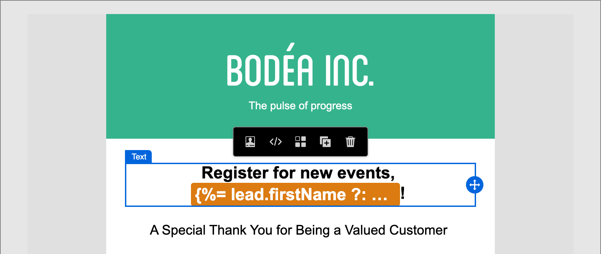

# Skapa innehåll - personalisering

Journey Optimizer B2B edition använder en infogad enkel syntax som gör att du kan skapa uttryck med anpassat innehåll omgivet av klammerparenteser `{{}}`. Du kan lägga till flera uttryck i samma innehåll eller fält utan begränsningar.

Du kan till exempel lägga till ett anpassningsuttryck som `Hello {{lead.firstName}} {{lead.lastName}}`. När du bearbetar innehållet ersätter Journey Optimizer B2B edition uttrycket med data som finns i Experience Platform-databasen. Det första exemplet blir _Hello John Doe_.

Mer information om hur du använder personaliseringsverktyg i Journey Optimizer B2B edition finns i [Innehållspersonalisering](../user/content/personalization.md).

>[!NOTE]
>
>Journey Optimizer B2B edition följer syntaxen _kamelcase_ för personaliseringstoken i e-postmeddelanden för att matcha övriga Adobe Experience Platform-program för en enhetlig upplevelse. Detta tokenformat är helt kompatibelt med [Handlebars-mallsspråket](https://handlebarsjs.com/guide/#what-is-handlebars){target="_blank"}. Alla tokens som lades till före den här ändringen uppdateras automatiskt.

I följande exempel beskrivs stegen för att anpassa innehåll med hjälp av person- och systemtokens. Det återspeglar de ändringar som är tillgängliga för Journey Optimizer B2B edition-miljöer som har etablerats i den [förenklade arkitekturen](../user/simplified-architecture.md).

1. Markera textkomponenten och klicka på ikonen _Lägg till anpassning_ (  ) i verktygsfältet.

   {width="600"}

   Den här åtgärden öppnar dialogrutan _Redigera Personalization_.

1. Lägg till en token genom att klicka på plustecknet ( **+** ) bredvid den.

   Om du vill lägga till en variabel med en reservtext (standardtext som visas när fältet inte är tillgängligt för en lead) klickar du på ikonen _Mer_ ( **..** ) och väljer **[!UICONTROL Insert with fallback text]**.

   {width="700" zoomable="yes"}

1. Lägg till eventuella ytterligare variabler eller annan statisk text som du vill ta med.

1. Klicka på **[!UICONTROL Save]**.

   Personaliseringsskriptet visas i den visuella designrymden. Du kan markera den för att göra ändringar vid behov.

   {width="600"}
