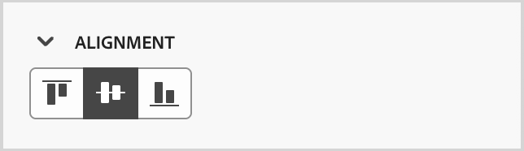

# Fragment

<!-- Content authoring steps for reuse -->

## Konfiguration av återgivningsdata {#intent-data-note}

>[!NOTE]
>
>Återgivningsdata inkluderas när de konfigureras för din Journey Optimizer B2B edition-instans. Det kräver också en eller flera publicerade resor som **eller** skapade inköpsgrupper. Mer information om återgivningsidentifieringsmodellen och hur du skickar nyckelord, produkter och kategorier finns i [Återgivningsdata](../user/admin/intent-data.md).

## AEM Assets licensanteckning {#aem-assets-licensing-note}

>[!NOTE]
>
>Licenser för AEM Assets as a Cloud Service och Dynamic Media är en förutsättning för integreringen. Kontrollera att [Dynamic Media med Open API](https://experienceleague.adobe.com/sv/docs/experience-manager-cloud-service/content/assets/dynamicmedia/dynamic-media-open-apis/dynamic-media-open-apis-overview){target="_blank"} är aktiverat. Integrationen är begränsad till databaser från _leveransnivån_. Om du använder _Författarnivån_ och vill konvertera den kontaktar du Adobe Experience Manager Support. 
>Beroende på ditt kontrakt och din konfiguration kan du komma åt Adobe Experience Manager Assets as a Cloud Service direkt från Adobe Journey Optimizer B2B edition när du utformar visuellt innehåll.

## Skapa innehåll - komponenter - struktursteg {#structures-step}

1. Om du vill starta innehållsdesignen drar du ett objekt från **[!UICONTROL Structures]** och släpper det på arbetsytan.

   Lägg till så många objekt från _[!UICONTROL Structures]_&#x200B;som du behöver och redigera inställningarna för varje objekt i rutan till höger.

   >[!TIP]
   >
   >Välj komponenten _[!UICONTROL n:nkolumn]_ för att definiera antalet kolumner som du väljer (mellan tre och 10). Du kan också definiera bredden på varje kolumn genom att flytta pilarna under kolumnen.

   {width="800" zoomable="yes"}

   Varje kolumnstorlek får inte vara mindre än 10 % av strukturkomponentens totala bredd. Endast tomma kolumner kan tas bort.

## Skapa innehåll - komponenter - innehållssteg {#contents-step}

1. Expandera avsnittet **[!UICONTROL Contents]** och lägg till så många element du behöver i en eller flera strukturkomponenter.

   {width="800" zoomable="yes"}
   <!--
   reference to the contents elements--->

## Skapa innehåll - komponenter - inställningssteg {#settings-step}

1. Om det behövs kan du göra ytterligare anpassningar för varje komponent på flikarna _[!UICONTROL Settings]_&#x200B;eller&#x200B;_[!UICONTROL Style]_.

   Du kan till exempel ändra textstil, utfyllnad eller marginal för varje komponent.

## Skapa innehåll - steg för resurser {#assets-step}

1. Från _Resursväljaren_ kan du välja resurser som lagras direkt i resursbiblioteket.

   Dubbelklicka på mappen som innehåller dina resurser. Dra och släpp objekten i en strukturkomponent.

   Mer information om hur du använder resurser från din källtyp finns i [Lägg till resurser i ditt innehåll](../user/content/assets-overview.md#use-assets-for-content-authoring).

   {width="800" zoomable="yes"}

## Skapa innehåll - personaliseringssteg {#personalization-step}

1. Infoga anpassningsfält för att anpassa innehållet utifrån profilattribut, målgruppsmedlemskap, kontextuella attribut med mera.

## Skapa innehåll - aktivera steg för villkorsinnehåll {#dynamic-content-step}

1. Klicka på **[!UICONTROL Enable condition content]** om du vill lägga till dynamiskt innehåll och anpassa innehållet till målprofilerna baserat på villkorliga regler.

## Framtagning av innehåll - steg för spårning av länkar {#links-tracking-step}

1. Välj fliken **[!UICONTROL Links]** i den vänstra rutan om du vill visa alla URL:er för ditt innehåll som spåras.

   Du kan ändra _spårningstypen_ eller _etiketten_ och lägga till taggar om det behövs.

## Innehållskomponenter - avancerade format {#styles-advanced}

Om du vill använda ytterligare CSS-kompatibla attribut med värden använder du formatinställningarna för **[!UICONTROL Advanced]**. Du kan ändra värdena för befintliga attribut eller lägga till nya. Formateringen tillämpas på komponenten med CSS-arvsmodellen för överordnade-underordnade komponenter (element).

De attribut som visas återspeglar de format som är definierade för komponenten. Du kan ändra värdena enligt [CSS-definitioner](https://www.w3schools.com/CSSref/index.php){target="_blank"}. Klicka på ikonen _Lägg till_ (**+**) om du vill lägga till ett nytt formatattribut för komponenten.

{width="250"}

## Innehållskomponenter - vågräta justeringsformat {#styles-alignment-h}

Expandera avsnittet **[!UICONTROL Alignment]** och välj den vågräta justering som du vill använda: vänster, mitten eller höger. Det här formatet översätts till ett standard-CSS-format för `text-align` och påverkar hur komponenten placeras i behållarkomponenten.

{width="250"}

## Innehållskomponenter - justeringsformat lodrätt {#styles-alignment-v}

Expandera avsnittet **[!UICONTROL Alignment]** och välj den lodräta justering som du vill använda: överkant, mitten eller nederkant. Det här formatet översätts till ett standard-CSS-format för `vertical-align` och påverkar placeringen i behållarkomponenten.

{width="250"}

## Innehållskomponenter - justera format vågrätt och lodrätt {#styles-alignment-h-v}

Expandera avsnittet **[!UICONTROL Alignment]** och välj den vågräta och lodräta justering som du vill använda. Justeringsstilarna påverkar hur HTML-komponenten placeras i behållarkomponenten (strukturell eller container).

Den vågräta justeringen översätts till ett standard `text-align`-CSS-format och du kan välja mellan vänster, mitten eller höger. Den lodräta justeringen översätts till standardformatet för CSS i `vertical-align` och du kan välja uppifrån, i mitten eller nedåt.

{width="300"}

## Innehållskomponenter - bakgrundsformat {#styles-background}

Med fliken _[!UICONTROL Styles]_&#x200B;markerad på den högra panelen använder du avsnittet **[!UICONTROL Background]**&#x200B;för att definiera komponentens bakgrundsfärg.

Markera kryssrutan och klicka på färgrutan för att välja en färg i väljaren. Du kan välja en färg genom att ange ett känt RGB-, NML-, NMI- eller hexadecimalt värde. Du kan också använda färgreglaget och färgfältet för att välja färgen.

{width="300"}

## Innehållskomponenter - kantlinjeformat {#styles-border}

1. Expandera avsnittet _[!UICONTROL Styles]_&#x200B;på den högra panelen med fliken **[!UICONTROL Border]**&#x200B;markerad och ange alternativen för att visa en kantlinje för komponenten:

1. Flytta reglaget åt höger om du vill aktivera visningsalternativen för kantlinjerna och ange dem enligt dina designvillkor:

   * Om du vill ange **[!UICONTROL Border color]** markerar du kryssrutan och klickar på färgrutan för att välja en färg i väljaren. Du kan välja en färg genom att ange ett känt RGB-, NML-, NMI- eller hexadecimalt värde. Du kan också använda färgreglaget och färgfältet för att välja färgen.

   {width="300"}

   * Om du vill ange **[!UICONTROL Border size]** (linjebredd) klickar du på upp- och nedpilarna för att öka eller minska antalet pixlar.

   * Om du vill ange **[!UICONTROL Border style]** väljer du ett värde i listan med standard-CSS `border-style`-värden.

   * Om du vill avgöra var kantlinjen visas markerar du varje **[!UICONTROL Border position]**-kryssruta.

   {width="250"}

1. För **[!UICONTROL Border radius]** anger du det numeriska värdet enligt kurvan som du vill använda för hörnen.

   Värdet 0 (standard) ger ett fyrkantigt hörn.

## Innehållskomponenter - marginalformat {#styles-margin}

Expandera avsnittet _[!UICONTROL Styles]_&#x200B;på den högra panelen med fliken **[!UICONTROL Margin]**&#x200B;markerad och ange alternativ för marginalavstånd i den strukturella komponenten. Det här formatet replikerar CSS-parametern `margin`, som styr till utrymmet utanför en komponentkant och separerar den från andra komponenter. Det skapar en lucka runt komponenten för att påverka dess placering och layouten för det omgivande innehållet.

Ange marginalvärdena i pixlar efter dina designbehov. Du kan ange marginalen för alla sidor, den översta, den vänstra eller högra sidan av komponenten oberoende av varandra:

* **Alla sidor** - Om du vill ange ett värde som ska gälla alla sidor avmarkerar du kryssrutan **[!UICONTROL Different margin for each side]** . Klicka på upp- och nedpilsikonerna för att öka eller minska antalet pixlar.

  {width="250"}

* **Övre och nedre** - Om du vill ange samma värde för de övre och nedre marginalerna anger du ikonen _Låst_ mellan inställningarna för över- och underkant. Klicka på upp- och nedpilsikonerna för att antingen öka eller minska antalet pixlar.

* **Vänster-höger** - Om du vill ange samma värde för vänster- och högermarginalerna anger du ikonen _Låst_ mellan vänster och höger inställningar. Klicka på upp- och nedpilsikonerna för att antingen öka eller minska antalet pixlar.

  {width="250"}

* **Oberoende** - Om du vill ställa in varje marginal på ett oberoende värde anger du ikonen _Olåst_ mellan inställningarna för över- och underkant och mellan vänster och höger. För varje inställning klickar du på upp- och nedpilsikonerna för att antingen öka eller minska antalet pixlar.

  {width="250"}

## Innehållskomponenter - utfyllnadsformat {#styles-padding}

Expandera avsnittet _[!UICONTROL Styles]_&#x200B;på den högra panelen med fliken **[!UICONTROL Padding]**&#x200B;markerad och ange alternativ för utfyllnad i den strukturella komponenten. Det här formatet replikerar CSS-parametern `padding`, som är mellanrummet mellan innehållet i en komponent och dess kantlinje. Utfyllnaden ger internt avstånd som du kan använda för att styra avståndet mellan innehållet och komponentens kant.

Ange utfyllnadsvärdena i pixlar enligt dina designbehov. Du kan ange utfyllnaden för alla sidor, den översta, den vänstra eller högra sidan av komponenten oberoende av varandra:

* **Alla sidor** - Om du vill ange ett värde som ska gälla alla sidor avmarkerar du kryssrutan **[!UICONTROL Different padding for each side]** . Klicka på upp- och nedpilsikonerna för att öka eller minska antalet pixlar.

  {width="250"}

* **Övre och nedre** - Om du vill ange samma värde för utfyllnaden uppifrån och ned anger du ikonen _Låst_ mellan inställningarna för över- och underkant. Klicka på upp- och nedpilsikonerna för att antingen öka eller minska antalet pixlar.

* **Vänster-höger** - Om du vill ange samma värde för vänster och höger utfyllnad anger du ikonen _Låst_ mellan vänster och höger inställning. Klicka på upp- och nedpilsikonerna för att antingen öka eller minska antalet pixlar.

  {width="250"}

* **Oberoende** - Om du vill ange ett oberoende värde för utfyllnad för varje sida anger du ikonen _Olåst_ mellan inställningarna för överkant och nederkant och mellan vänster och höger. För varje inställning klickar du på upp- och nedpilsikonerna för att antingen öka eller minska antalet pixlar.

  {width="250"}

## Innehållskomponenter - storleksformat {#styles-size}

Expandera avsnittet _[!UICONTROL Styles]_&#x200B;på den högra panelen med fliken **[!UICONTROL Size]**&#x200B;markerad och ange alternativen för komponentens höjd och bredd:

* **[!UICONTROL Height]** - Klicka på upp- och nedpilarna för att öka eller minska antalet pixlar. Ett tomt värde (Auto) är standardvärdet och ändrar höjden på elementet efter dess innehåll.

* **[!UICONTROL Width]** - Använd växlingsknappen för att ange bredden i pixlar eller procent.

   * Om du vill ange en procentbredd använder du skjutreglaget för att ange procentvärdet. Procentvärdet avgör elementstorleken baserat på innehållsrutan i behållarblocket, som inte inkluderar utfyllnad och kantlinjer. Ett värde på 50 anger till exempel elementbredden till 50 % av den innehållna blockinnehållsbredden.

     {width="250"}

   * Om du vill ha en pixelbaserad bredd klickar du på upp- och nedpilarna för att öka eller minska antalet pixlar. Ett tomt värde (Auto) är standardvärdet och ändrar bredden på elementet efter dess innehåll.

     {width="250"}

## Innehållskomponenter - textformat {#styles-text}

Expandera avsnittet _[!UICONTROL Styles]_&#x200B;på den högra panelen med fliken **[!UICONTROL Text]**&#x200B;markerad och ange alternativ för komponentens textformat:

* **[!UICONTROL Font family]** - Klicka på nedpilen för att välja en teckensnittsfamilj för text i komponenten.

* **[!UICONTROL Font size]** - Klicka på upp- och nedpilarna för att öka eller minska teckenstorleken eller ange ett värde. För angivna värden kan du använda decimaler.

* **[!UICONTROL Line height]** - Klicka på upp- och nedpilarna för att öka eller minska radhöjden eller ange ett värde. För angivna värden kan du använda decimaler.

  {width="250"}

* **[!UICONTROL Text styles]** - Välj ikonen för textformatet: _Fet_, _Kursiv_, _Understruken_ eller _Genomstruken_.

* **[!UICONTROL Text alignment]** - Välj ikonen för den vågräta textjusteringen: _Vänster_, _Centrerad_, _Höger_ eller _Justerad_.

* **[!UICONTROL Font color]** - Klicka på färgrutan för att välja en teckensnittsfärg i väljaren. Du kan välja en färg genom att ange ett känt RGB-, NML-, NMI- eller hexadecimalt värde. Du kan också använda färgreglaget och färgfältet för att välja färgen.

  {width="300"}

## Innehåll - bildmarkering - Marketo DAM {#me-dam}

Välj den här typen om du vill bläddra och välja en bildresurs i Journey Optimizer B2B edition-biblioteket eller från den anslutna Market Engage-instansen.

{width="700" zoomable="yes"}

I dialogrutan kan du välja en bild från den valda databasen. Klicka på **[!UICONTROL Select]** för att lägga till resursen.

Det finns verktyg som hjälper dig att hitta den resurs du behöver:

* Klicka på ikonen _Filter_ längst upp till vänster om du vill filtrera de visade objekten enligt dina kriterier.

* Ange text i fältet _Sök_ om du vill filtrera de visade objekten så att de matchar resursnamnet.

  {width="700" zoomable="yes"}

## Innehåll - markering av bilder - AEM Assets {#aem-assets-dam}

Välj den här typen om du vill bläddra och välja en bildresurs i en [konfigurerad Experience Manager Assets-databas](../user/admin/configure-aem-repositories.md).

I dialogrutan _[!UICONTROL Select Assets]_&#x200B;väljer du en bild med de tillgängliga verktygen för att hitta resursen som du behöver och klickar på&#x200B;**[!UICONTROL Select]**:

* Ändra **[!UICONTROL Repository]** överst till höger.

* Klicka på **[!UICONTROL Manage assets]** överst till höger för att öppna Assets-databasen på en annan webbläsarflik och använda AEM Assets hanteringsverktyg.

* Klicka på _vytypsväljaren_ längst upp till höger för att ändra visningen till **[!UICONTROL List View]**, **[!UICONTROL Grid View]**, **[!UICONTROL Gallery View]** eller **[!UICONTROL Waterfall View]**.

* Klicka på ikonen _Sorteringsordning_ om du vill ändra sorteringsordningen mellan stigande och fallande.

  {width="700" zoomable="yes"}

* Klicka på menypilen **[!UICONTROL Sort by]** om du vill ändra sorteringsvillkoren till **[!UICONTROL Name]**, **[!UICONTROL Size]** eller **[!UICONTROL Modified]**.

* Klicka på ikonen _Filter_ längst upp till vänster om du vill filtrera de visade objekten enligt dina kriterier.

* Ange text i fältet _Sök_ om du vill filtrera de visade objekten så att de matchar resursnamnet.

  {width="700" zoomable="yes"}

## Innehåll - bildöverföring {#image-upload}

Välj den här typen om du vill välja en fil från datorn och importera den till Journey Optimizer B2B edition resursbibliotek.

I dialogrutan _[!UICONTROL Upload image]_&#x200B;drar och släpper du en fil från systemet till filrutan. Den maximala filstorleken är 100 MB.

{width="450"}

De markerade bildernas filnamn visas i dialogrutan. Resursfilnamn måste vara unika (i olika mappar), och om det redan finns en fil med det namnet visas ett meddelande. Namn kan innehålla högst 100 tecken och får inte innehålla specialtecken (som `;`, `:`, `\` och `|`).

Klicka på **[!UICONTROL Import]**.

## Aktivitets- och poängaktiviteter {#engagement-activities}

| Aktivitetsnamn | Beskrivning | Typ av åtagande | Maximalt antal dagliga frekvenser | Standardaktivitetsvikt för modell |
| --- | --- | --- | --- | --- |
| [!UICONTROL Attend Event] | En medlem deltog i en händelse | Händelse | 20 | 60 |
| [!UICONTROL Email Clicked] | En medlem klickar på en länk i ett e-postmeddelande | E-post | 20 | 30 |
| [!UICONTROL Email Opened] | En medlem öppnar ett mejl | E-post | 20 | 30 |
| [!UICONTROL Form Filled Out] | En medlem fyller i och skickar ett formulär på en webbsida | Webb | 20 | 40 |
| [!UICONTROL Interesting Moment] | En medlem har en intressant stund | Kuraterad | 20 | 60 |
| [!UICONTROL Link Clicks] | En medlem klickar på en länk på en webbsida | Webb | 20 | 40 |
| [!UICONTROL Page Views] | En medlem visar en webbsida | Webb | 20 | 40 |
| [!UICONTROL Register for Event] | En medlem registrerad för en händelse | Händelse | 20 | 60 |
