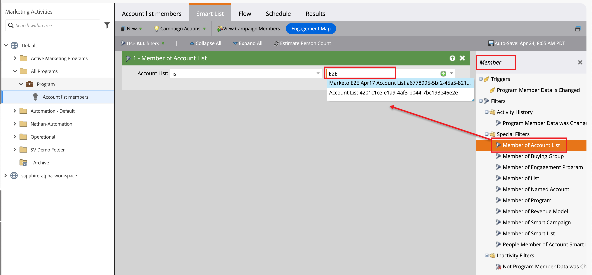

# Använd kontolistor under resor och program

Det finns flera sätt att lägga in Live-kontolistor (publicerade) på dina kontoresor.

## Målgruppsnod

Alla kontoresor börjar med en [_kontomålgrupp_ nod](../journeys/account-audience-nodes.md). När du anger att den här noden ska använda en kontolista, förflyttas medlemskontona genom resan när den blir aktiv (publicerad).

1. Välj alternativet **[!UICONTROL Account list]** för den inledande _målgruppsnoden_.

   {width="500"}

1. Klicka på **[!UICONTROL Add accounts list]**.

1. Markera kryssrutan för kontolistan och klicka på **[!UICONTROL Save]**.

   {width="600" zoomable="yes"}

## Vidta en åtgärdsnod - Lägg till i konto

**_Statiska konton listar bara_**

Lägg till konton i en statisk kontolista med [a _Ta en åtgärd_-nod](../journeys/action-nodes.md) inom en kontoresa.

Du kan till exempel ha en resa där du skickar ett e-postmeddelande och vissa konton utför olika åtgärder som svar på en åtgärd. Du ser den här aktiviteten som en kvalifikationspunkt under resan. Med kvalificeringen vill du lägga till dem i en kontolista som används som målgrupp för en annan resa med ett annat flöde för kvalificerade konton.

>[!NOTE]
>
>Om ett konto redan finns i listan när noden körs, ignoreras åtgärden.

1. Välj alternativet _[!UICONTROL Action on]_&#x200B;**[!UICONTROL Accounts]**.

1. Välj _[!UICONTROL Action on accounts]_&#x200B;för **[!UICONTROL Add to account list]**.

   {width="500"}

1. För **[!UICONTROL Select live static account list]** väljer du den kontolista där du vill lägga till konton.

   {width="500"}

## Vidta en åtgärdsnod - Ta bort från konto

**_Statiska konton listar bara_**

Inom en kontoresa tar du bort konton från en statisk kontolista med [a _Ta en åtgärd_-nod](../journeys/action-nodes.md).

Du kan till exempel ha en resa där du skickar ett e-postmeddelande och vissa konton utför olika åtgärder som svar på en åtgärd. Du ser den här aktiviteten som en kvalifikationspunkt under resan. Med den här kvalificeringen vill du ta bort dem från en kontolista som används som målgrupp för en annan resa som skickar ytterligare e-postmeddelanden så att du inte duplicerar din kvalificeringskommunikation.

>[!NOTE]
>
>Om ett konto inte finns i listan där det är schemalagt för borttagning, ignoreras åtgärden.

1. Välj alternativet _[!UICONTROL Action on]_&#x200B;**[!UICONTROL Accounts]**.

1. Välj _[!UICONTROL Action on accounts]_&#x200B;för **[!UICONTROL Remove from account list]**.

   {width="500"}

1. För **[!UICONTROL Select live static account list]** väljer du den kontolista där du vill ta bort konton.

   {width="500"}

## Marketo Engage-program - medlem i kontolistan

Som marknadsförare kanske du vill inaktivera program i Marketo Engage för personer som ingår i kontolistor i Journey Optimizer B2B edition.

I Marketo Engage-instansen som är ansluten till Journey Optimizer B2B edition kan du använda filtret _[!UICONTROL Member of Account List]_&#x200B;i dina smarta listor för att identifiera dessa leads enligt din kampanjstrategi. Mer information om smarta listor finns i [Marketo Engage-dokumentationen](https://experienceleague.adobe.com/en/docs/marketo/using/product-docs/core-marketo-concepts/smart-lists-and-static-lists/understanding-smart-lists){target="_blank"}.

### Lägga till filtret i en smart lista

1. I Marketo Engage väljer du en kampanj och klickar på fliken **[!UICONTROL Smart List]**.

1. I filterlistan till höger anger du `Member` och letar upp filtret **[!UICONTROL Member of Account List]**.

1. Dra filtret till arbetsytan för smarta listor.

1. Ange listvärdet **[!UICONTROL Member of account]** på arbetsytan för smart lista.

   Klicka på nedåtpilen om du vill visa alla kontolistor eller ange en del av kontolistans namn för att hitta den kontolista du behöver.

   {width="800" zoomable="yes"}

1. Lägg till steget **[!UICONTROL Add to List]** i kampanjflödet och välj den lista där du vill fylla i personerna från kontolistan för Journey Optimizer B2B edition.

   Mer information om hur du lägger till steg i ett flöde finns i _[Lägg till ett flödessteg i en smart kampanj](https://experienceleague.adobe.com/en/docs/marketo/using/product-docs/core-marketo-concepts/smart-campaigns/flow-actions/add-a-flow-step-to-a-smart-campaign){target="_blank"}_ i Marketo Engage-dokumentationen.

### Granska medlemmarna

När flödet har körts kan du visa listan med personer som finns i listan. Öppna listan och välj fliken Personer.

{width="800" zoomable="yes"}
