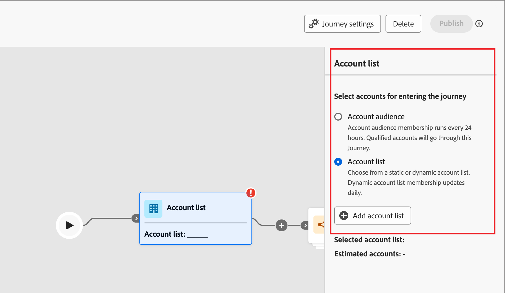

# Kontolistor

En kontolista är en samling namngivna konton som marknadsförare kan använda för riktad resesamordning. En kontolista kan ha namngivna konton som mål enligt dina definierade kriterier, t.ex. bransch, plats eller företagets storlek. Det finns två typer av kontolistor:

* **Statisk** - Med en statisk kontolista ändras listan bara när du lägger till kontona. Du kan lägga till konton manuellt genom att använda en filteruppsättning för att fylla i listan baserat på aktuella kontodata eller lägga till och ta bort konton under en kontoresa.
* **Dynamisk** - Med en dynamisk kontolista definierar du en filteruppsättning som automatiskt väljer listan. Systemet använder den här filteruppsättningen för att lägga till och ta bort konton efter ändringar i kontoinformationen. Den här listhanteringen liknar [målgruppssegmentering i kunddataplattformen ](https://experienceleague.adobe.com/en/docs/experience-platform/rtcdp/segmentation/b2b) i realtid.

När en kontolista är i läget _Live_ (publicerad) är den tillgänglig för användning i kontoresor.

## Få åtkomst till och bläddra bland kontolistor

Expandera **[!UICONTROL Accounts]** till vänster och klicka på **[!UICONTROL Account lists]**.

{width="800" zoomable="yes"}

Sidan _[!UICONTROL Account lists]_som visas innehåller följande kolumner:

* [!UICONTROL Name] (klicka på namnet på kontolistan för att visa information)
* [!UICONTROL Status]
* [!UICONTROL Type]
* [!UICONTROL Last updated on]
* [!UICONTROL Last updated by]
* [!UICONTROL Creation date]
* [!UICONTROL Created by]

Tabellen innehåller möjligheten att söka efter namn. Sorteringsfunktionen är inte tillgänglig just nu.

Du kan anpassa den visade tabellen genom att klicka på ikonen _Kolumninställningar_ (  ) i det övre högra hörnet och markera eller avmarkera kryssrutorna.

{width="300"}

Om du vill visa beskrivningen för en kontolista klickar du på ikonen _Information_ (  ) bredvid namnet.

## Skapa en kontolista

När du skapar en kontolista definierar du en uppsättning filter för att generera listan. Du kan till exempel använda den för att skapa en lista över konton där hälso- och sjukvården är och där intäkterna är över 100 miljoner dollar.

1. Klicka på **[!UICONTROL Create account list]** längst upp till höger på sidan _[!UICONTROL Account lists]_.

   {width="700" zoomable="yes"}

1. I dialogrutan _[!UICONTROL Create account list]_anger du en unik **[!UICONTROL Name]**(obligatoriskt) och en **[!UICONTROL Description]**(valfritt).

1. Välj _[!UICONTROL Type]_för kontolistan,**[!UICONTROL Static]**eller **[!UICONTROL Dynamic]**.

   {width="380"}

1. Klicka på **[!UICONTROL Create]**.

   En ny statisk kontolista öppnas med en tom lista över konton. En ny dynamisk kontolista öppnas med panelen _[!UICONTROL Add accounts by filter]_på sidan.

## Lägg till konton i kontolistan

För en statisk lista kan du fortsätta att publicera den tomma kontolistan och lägga till konton genom en kontoresa. Du kan också lägga till konton manuellt genom att tillämpa en filteruppsättning innan du publicerar den.

För en dynamisk kontolista måste du lägga till den filteruppsättning som du vill använda för att hantera listan automatiskt innan du publicerar den.

>[!BEGINTABS]

>[!TAB Statisk kontolista]

När du har skapat den statiska kontolistan kan du fylla i listan genom att använda en filteruppsättning. Du kan också använda en filteruppsättning för att lägga till konton i en statisk kontolista efter att den har publicerats (_Live_).

>[!NOTE]
>
>Om du vill att kontolistan ska börja som tom väljer du inga filter och publicerar bara kontolistan. Det är användbart att börja med en tom lista när du tänker lägga till medlemmar via en kontoresa (se [Ta en åtgärdsnod - Lägg till i konto](#take-an-action-node---add-to-account)).

1. CLick **[!UICONTROL Add accounts]**.

   {width="700" zoomable="yes"}

   Du kan öppna den här funktionen på den tomma listsidan eller i det övre högra hörnet.

1. I dialogrutan _[!UICONTROL Add accounts by filter]_använder du menyn **[!UICONTROL Account Filters]**för att lägga till de attribut och aktiviteter som du vill använda för att skapa filteruppsättningen:

   Filtren kapslas in i kategorimappar. Du kan expandera varje mapp och bläddra igenom listan med tillgängliga filter. Du kan också använda _sökverktyget_ längst upp för att hitta det filter du behöver.

   * Dra och släpp filtret från den vänstra menyn till filterdefinitionsrymden.
   * Slutför definitionen av matchningsutvärderingen.
   * Upprepa dessa åtgärder för varje filter som du vill inkludera.

     {width="700" zoomable="yes"}

   * Du kan finjustera dina villkor genom att använda **[!UICONTROL Filter logic]** högst upp. Du kan välja att matcha alla attributvillkor eller alla villkor.

     {width="450"}

1. När filteruppsättningen och logiken är klara klickar du på **[!UICONTROL Populate accounts]**.

   Ifyllningsprocessen kan ta en stund, beroende på antalet konton som ska utvärderas och fyllas i (storleken på databasen och filtervillkoren som du har valt). Det kan ta upp till två timmar för konton att fylla i din lista.

Du kan fortsätta att publicera listan så att den blir tillgänglig för att lägga till och ta bort åtgärder i en kontoresa.

>[!TAB Dynamisk kontolista]

När du har skapat en dynamisk kontolista definierar du den filteruppsättning som används för att hantera listan (lägga till/ta bort konton) när den är _Live_ (publicerad). Du kan inte lägga till/ta bort konton via kontoresor, men en publicerad dynamisk kontolista är tillgänglig för målnoden för det inledande kontot.

1. Klicka på **[!UICONTROL Select filters]**.

   {width="700" zoomable="yes"}

1. I dialogrutan _[!UICONTROL Add accounts by filter]_använder du menyn **[!UICONTROL Account Filters]**för att lägga till de attribut och specialfilter som du vill använda för att skapa filteruppsättningen:

   Filtren kapslas in i kategorimappar. Du kan expandera varje mapp och bläddra igenom listan med tillgängliga filter. Du kan också använda _sökverktyget_ längst upp för att hitta det filter du behöver.

   * Dra och släpp filtret från den vänstra menyn till filterdefinitionsrymden.
   * Slutför definitionen av matchningsutvärderingen.
   * Upprepa dessa åtgärder för varje filter som du vill inkludera.

     {width="700" zoomable="yes"}

   * Du kan finjustera dina villkor genom att använda **[!UICONTROL Filter logic]** högst upp. Du kan välja att matcha alla attributvillkor eller alla villkor.

     {width="450"}

1. När filteruppsättningen och logiken är klara klickar du på **[!UICONTROL Done]**.

   Om du är nöjd med filteruppsättningen kan du fortsätta att [publicera listan](#publish-an-account-list) så att den blir tillgänglig för den inledande [målgruppsnoden](#account-audience-node) i en kontoresa.

   >[!NOTE]
   >
   >Du kan inte uppdatera filtren för en dynamisk kontolista efter att listan har publicerats.

   Ifyllningsprocessen kan ta en stund, beroende på antalet konton som ska utvärderas och fyllas i (storleken på databasen och filtervillkoren som du har valt). Det kan ta upp till två timmar för konton att fylla i din lista.

>[!ENDTABS]

## Publicera en kontolista

Du kan publicera en kontolista så snart filteruppsättningen är klar.

>[!BEGINTABS]

>[!TAB Statisk kontolista]

1. Klicka på **[!UICONTROL Publish]** överst till höger.

   {width="700" zoomable="yes"}

1. Bekräfta genom att klicka på **[!UICONTROL Publish]** i dialogrutan _[!UICONTROL Publish static account list]_.

   {width="400"}

Statusen för den statiska kontolistan ändras till _[!UICONTROL Live]_och är tillgänglig för [användning i en kontoresa](#account-list-usage-in-account-journeys).

>[!TAB Dynamisk kontolista]

Du kan publicera en dynamisk kontolista så snart filteruppsättningen är klar. När kontolistan har statusen Live kan du välja den i en kundkundkundresa.

1. Klicka på **[!UICONTROL Publish]** överst till höger.

   {width="700" zoomable="yes"}

1. Bekräfta genom att klicka på **[!UICONTROL Publish]** i dialogrutan _[!UICONTROL Publish dynamic account list]_.

   {width="400"}

Status för den dynamiska kontolistan ändras till _[!UICONTROL Live]_och är tillgänglig för [användning i en kontoresa](#account-list-usage-in-account-journeys).

>[!ENDTABS]

## Kontolisteanvändning i kontoresor

Det finns tre sätt att lägga in Live-kontolistor (publicerade) på dina kontoresor:

### Målgruppsnod

1. Välj **[!UICONTROL Account list]** för den inledande _målgruppsnoden_.

   {width="500"}

1. Klicka på **[!UICONTROL Add accounts list]**.

1. Markera kryssrutan för kontolistan och klicka på **[!UICONTROL Save]**.

   {width="600" zoomable="yes"}

Kontona i listan rör sig genom resan när den blir aktiv (publicerad).

### Vidta en åtgärdsnod - Lägg till i konto

**_Statiska konton listar bara_**

Lägg till konton i en statisk kontolista med [a _Ta en åtgärd_-nod](../journeys/action-nodes.md).

Du kan till exempel ha en resa där du skickar ett e-postmeddelande och vissa konton utför olika åtgärder som svar på en åtgärd. Du ser den här aktiviteten som en kvalifikationspunkt under resan och vill lägga till dem i en kontolista som används som målgrupp för en annan resa med ett annat flöde för kvalificerade konton.

>[!NOTE]
>
>Om ett konto redan finns i listan när noden körs, ignoreras åtgärden.

1. Välj alternativet _[!UICONTROL Action on]_**[!UICONTROL Accounts]**.

1. Välj **[!UICONTROL Add to account list]** för _[!UICONTROL Action on accounts]_.

   {width="500"}

1. För **[!UICONTROL Select live static account list]** väljer du den kontolista där du vill lägga till konton.

   {width="500"}

### Vidta en åtgärdsnod - Ta bort från konto

**_Statiska konton listar bara_**

Ta bort konton från en statisk kontolista med [a _Ta en åtgärd_-nod](../journeys/action-nodes.md).

Du kan till exempel ha en resa där du skickar ett e-postmeddelande och vissa konton utför olika åtgärder som svar på en åtgärd. Du ser den här aktiviteten som en kvalifikationspunkt under resan och vill ta bort dem från en kontolista som används som målgrupp för en annan resa som skickar ytterligare e-postmeddelanden så att du inte duplicerar din kvalificeringskommunikation.

>[!NOTE]
>
>Om ett konto inte finns i listan där det är schemalagt för borttagning, ignoreras åtgärden.

1. Välj alternativet _[!UICONTROL Action on]_**[!UICONTROL Accounts]**.

1. Välj **[!UICONTROL Remove from account list]** för _[!UICONTROL Action on accounts]_.

   {width="500"}

1. För **[!UICONTROL Select live static account list]** väljer du den kontolista där du vill ta bort konton.

   {width="500"}
