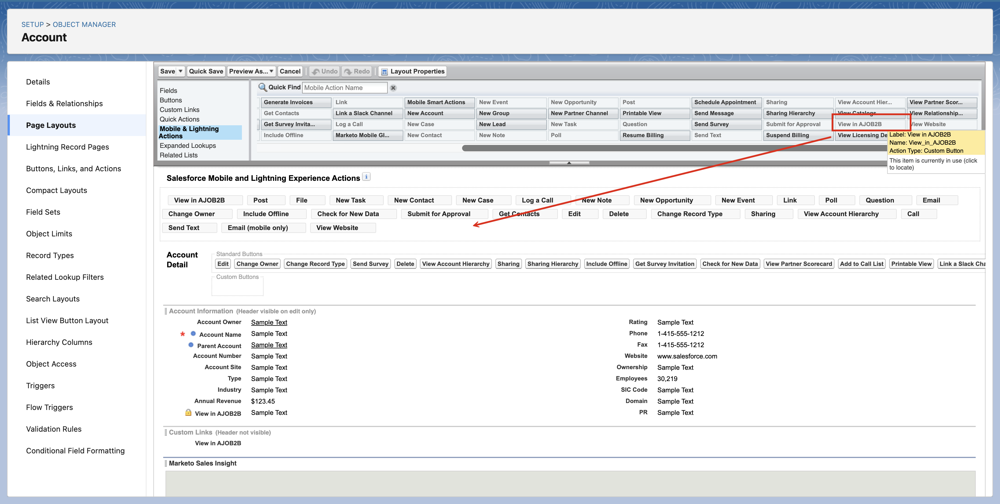
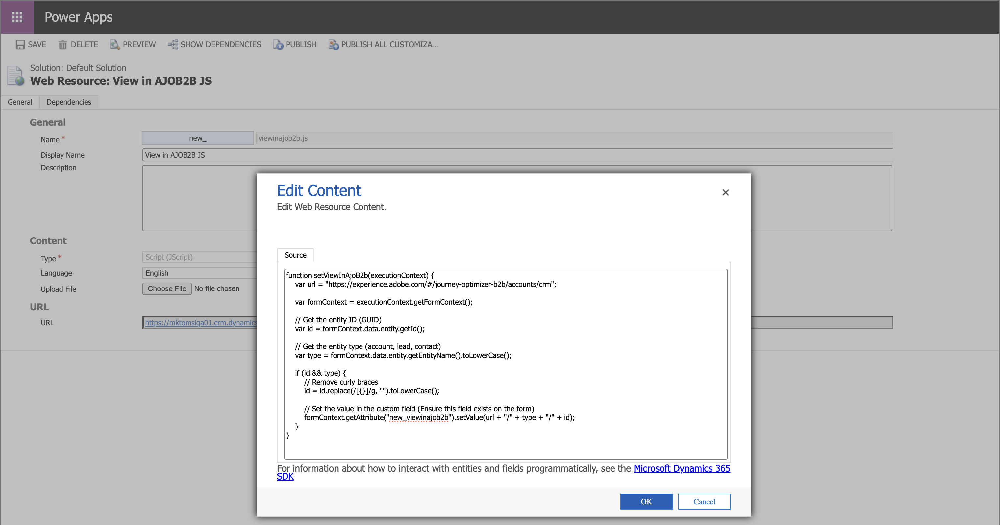

# Åtkomst till detaljsidor i CRM

Med Adobe Journey Optimizer B2B edition kan säljteammedlemmar och kontoansvariga få tillgång till detaljerade sidor för konto- och köpgruppsinformation direkt från sina CRM-verktyg, som Salesforce och Microsoft Dynamics. Med den här integreringen kan säljarna snabbt få åtkomst till realtidskonton och inköpen i grupper, som engagemangshistorik, avsiktssignaler och AI-genererade rekommendationer. Detta ger säljteamet möjlighet till snabbare utåtriktad marknadsföring, smartare prioritering och bättre anpassning till marknadsföring.

Salesforce- eller Dynamics-administratören kan lägga till en Journey Optimizer B2B edition-länk från konto-, kontakt- eller lead-vyn om du vill att säljteamets medlemmar ska kunna visa [kontoinformation](account-details.md) och [personinformation](person-details.md) i Journey Optimizer B2B edition från CRM.

När en medlem i ett säljteam använder länken från CRM-instansen ska sandlådan vara _Prod_ och IMS-organisationen bestäms enligt följande ordnade logik:

1. Den senaste organisationen som användaren använde
1. Den första i listan med alfabetisk sortering
1. Organisationen har valt i sina inställningar

## Salesforce-länkar

En Salesforce-administratör med behörigheten _Anpassa program_ kan konfigurera länken i layouten Konto, Kontakt eller Lead. Med konfigurerade länkar kan säljare komma åt motsvarande kontoinformation eller personinformationssida i Adobe Journey Optimizer B2B edition.

I Salesforce lägger du till den anpassade länken som en knapp, hyperlänk eller länkad ikon och anpassar den efter teamets önskemål.

{width="800" zoomable="yes"}

Mer information om hur du lägger till en anpassad länk i Salesforce finns i [Definiera anpassade knappar och länkar](https://help.salesforce.com/s/articleView?id=platform.defining_custom_links.htm&type=5) i Salesforce-dokumentationen.

När du definierar mål-URL:en för länken kan du använda konto-, kontakt- eller lead-layouten och länka den till motsvarande informationssida i Journey Optimizer B2B edition:

* **Konto** - `https://experience.adobe.com/#/journey-optimizer-b2b/accounts/crm/account/[18-character ID of account]`

* **Kontakt** - `https://experience.adobe.com/#/journey-optimizer-b2b/accounts/crm/contact/[18-character ID of contact]`

* **Lead** - `https://experience.adobe.com/#/journey-optimizer-b2b/accounts/crm/lead/[18-character ID of lead]`

Använd objektet `Account` för att hämta kontots 18-tecken-ID, till exempel `CASESAFEID(Account.Id)` eller `CASESAFEID(Id)`.

**_Examples:_**

+++Fältlänk

1. I Salesforce går du till **[!UICONTROL Setup]** > **[!UICONTROL Object Manager]** > **[!UICONTROL Account]**/**[!UICONTROL Contact]**/**[!UICONTROL Lead]** > **[!UICONTROL Fields & Relationships]**.
1. Klicka på **[!UICONTROL New]** om du vill skapa ett formelfält (text) och lägga till det i layouten _Konto_, _Kontakt_ eller _Lead_.

   Använd följande exempel som vägledning för formeln.

   **_Texthyperlänk:_**

   * Konto - `HYPERLINK("https://experience.adobe.com/#/journey-optimizer-b2b/accounts/crm/account/" & CASESAFEID(Id), "View in AJO B2B")`
   * Kontakt - `HYPERLINK("https://experience.adobe.com/#/journey-optimizer-b2b/accounts/crm/contact/" & CASESAFEID(Id), "View in AJO B2B")`
   * Lead - `HYPERLINK("https://experience.adobe.com/#/journey-optimizer-b2b/accounts/crm/lead/" & CASESAFEID(Id), "View in AJO B2B")`

   **_Ikonhyperlänk:_**

   * Konto - `HYPERLINK("https://experience.adobe.com/#/journey-optimizer-b2b/accounts/crm/account/" & CASESAFEID(Id), IMAGE("https://cdn.experience.adobe.net/assets/HeroIcons.6620f5dc.svg#AdobeExperienceSubCloud", "View in AJO B2B", 24, 24))`
   * Kontakt - `HYPERLINK("https://experience.adobe.com/#/journey-optimizer-b2b/accounts/crm/contact/" & CASESAFEID(Id), IMAGE("https://cdn.experience.adobe.net/assets/HeroIcons.6620f5dc.svg#AdobeExperienceSubCloud", "View in AJO B2B", 24, 24))`
   * Kontakt - `HYPERLINK("https://experience.adobe.com/#/journey-optimizer-b2b/accounts/crm/lead/" & CASESAFEID(Id), IMAGE("https://cdn.experience.adobe.net/assets/HeroIcons.6620f5dc.svg#AdobeExperienceSubCloud", "View in AJO B2B", 24, 24))`

   {width="800" zoomable="yes"}

1. Uppdatera sidan så att layoutändringarna visas. Gå till **[!UICONTROL Profile]** och välj ett annat alternativ under **[!UICONTROL DISPLAY DENSITY]**.

   {width="450" zoomable="yes"}

+++

+++länk till detaljsida

1. I Salesforce går du till **[!UICONTROL Setup]** > **[!UICONTROL Object Manager]** > **[!UICONTROL Account]**/**[!UICONTROL Contact]**/**[!UICONTROL Lead]** > **[!UICONTROL Buttons, Links, and Actions]**.
1. Klicka på **[!UICONTROL New Button or Link]** i det övre högra hörnet och skapa länken för detaljsidan.

   Använd följande exempel som vägledning för formeln.

   * Konto - `{!URLFOR("https://experience.adobe.com/#/journey-optimizer-b2b/accounts/crm/account/" & CASESAFEID(Account.Id), null)}`
   * Kontakt - `{!URLFOR("https://experience.adobe.com/#/journey-optimizer-b2b/accounts/crm/contact/" & CASESAFEID(Contact.Id), null)}`
   * Lead - `{!URLFOR("https://experience.adobe.com/#/journey-optimizer-b2b/accounts/crm/lead/" & CASESAFEID(Lead.Id), null)}`

   {width="800" zoomable="yes"}

1. Gå till **[!UICONTROL Page Layouts]** i den vänstra navigeringen.

1. Dra länken från **[!UICONTROL Custom Links]** och släpp den i avsnittet _Anpassade länkar_ i layouten.

+++

+++Detaljsidknapp

1. I Salesforce går du till **[!UICONTROL Setup]** > **[!UICONTROL Object Manager]** > **[!UICONTROL Account]**/**[!UICONTROL Contact]**/**[!UICONTROL Lead]** > **[!UICONTROL Buttons, Links, and Actions]**.
1. Klicka på **[!UICONTROL New Button or Link]** i det övre högra hörnet och skapa knappen för detaljsidan.

   Välj **[!UICONTROL Display Type]** för **[!UICONTROL Detail Page Link]**.

   Använd följande exempel som vägledning för formeln.

   * Konto - `{!URLFOR("https://experience.adobe.com/#/journey-optimizer-b2b/accounts/crm/account/" & CASESAFEID(Account.Id), null)}`
   * Kontakt - `{!URLFOR("https://experience.adobe.com/#/journey-optimizer-b2b/accounts/crm/contact/" & CASESAFEID(Contact.Id), null)}`
   * Lead - `{!URLFOR("https://experience.adobe.com/#/journey-optimizer-b2b/accounts/crm/lead/" & CASESAFEID(Lead.Id), null)}`

   {width="800" zoomable="yes"}

1. Gå till **[!UICONTROL Page Layouts]** i den vänstra navigeringen.

1. Dra knappen från **[!UICONTROL Mobile & Lightning Actions]** och släpp den i avsnittet **[!UICONTROL Salesforce Mobile and Lightning Experience Actions]** i layouten.

   {width="800" zoomable="yes"}

+++

## Microsoft Dynamics-länkar

En Dynamics-utvecklare kan utöka konto-, kontakt- eller lead-entiteten för att lägga till ett länkfält. Med konfigurerade länkar kan säljare komma åt motsvarande kontoinformation eller personinformationssida i Adobe Journey Optimizer B2B edition.

Lägg till den anpassade länken som en knapp, en hyperlänk eller en länkad ikonlänk och anpassa den efter teamets önskemål.

{width="800" zoomable="yes"}

Använd Power Apps för att anpassa Microsoft-modellstyrda program, som Dynamics-komponenter. Mer information om hur du använder Power Apps för att lägga till en anpassad länk i Dynamics finns i [PowerApps-dokumentationen](https://learn.microsoft.com/en-us/power-apps/maker/model-driven-apps/create-edit-web-resources).

När du definierar mål-URL:en för länken kan du använda konto-, kontakt- eller lead-vyn och länka den till motsvarande informationssida i Journey Optimizer B2B edition:

* **Konto** - `https://experience.adobe.com/#/journey-optimizer-b2b/accounts/crm/account/[Account ID]`

* **Kontakt** - `https://experience.adobe.com/#/journey-optimizer-b2b/accounts/crm/contact/[Contact ID]`

* **Lead** - `https://experience.adobe.com/#/journey-optimizer-b2b/accounts/crm/lead/[Lead ID]`

**_Examples:_**

+++URL-fält

Följ den här åtgärdssekvensen för att lägga till den anpassade länken som ett URL-fält:

**1 - Konfigurera lösningsfältet**

1. Gå till **[!UICONTROL Advanced Settings]** > **[!UICONTROL Customize the system]** och välj fliken **[!UICONTROL Solution]**.
1. Välj **[!UICONTROL Entities]** > **[!UICONTROL Account]**/**[!UICONTROL Contact]**/**[!UICONTROL Lead]** > **[!UICONTROL Fields]**.
1. Klicka på **[!UICONTROL New]** och konfigurera det nya fältet.

   {width="800" zoomable="yes"}

1. Spara fältkonfigurationen.
1. Välj _[!UICONTROL Solution]_&#x200B;på fliken **[!UICONTROL Web Resources]**.
1. Klicka på **[!UICONTROL New]** och konfigurera följande skriptwebbresurs (JScript):

   ```js
   function setViewInAjoB2b(executionContext) {
    var url = "https://experience.adobe.com/#/journey-optimizer-b2b/accounts/crm";
   
    var formContext = executionContext.getFormContext();
   
    // Get the entity ID (GUID)
    var id = formContext.data.entity.getId();
   
    // Get the entity type (account, lead, contact)
    var type = formContext.data.entity.getEntityName().toLowerCase();
   
    if (id && type) {
        // Remove curly braces
        id = id.replace(/[{}]/g, "").toLowerCase();
   
        // Set the value in the custom field (Ensure this field exists on the form)
        formContext.getAttribute("new_viewinajob2b").setValue(url + "/" + type + "/" + id);
       }
   }
   ```

   {width="800" zoomable="yes"}

1. Klicka på **[!UICONTROL SAVE]** överst på sidan och sedan på **[!UICONTROL PUBLISH]**.

**2 - Konfigurera formuläret**

1. På fliken _Lösning_ väljer du **[!UICONTROL Entities]** > **[!UICONTROL Account]**/**[!UICONTROL Contact]**/**[!UICONTROL Lead]** > **[!UICONTROL Forms]** > **[!UICONTROL Account]**/**[!UICONTROL Contact]**/**[!UICONTROL Lead]**.
1. Dra det nya fältet som du skapade i den första uppgiften från **[!UICONTROL Field Explorer]** till avsnittet **[!UICONTROL Summary]**.

   {width="800" zoomable="yes"}

1. Dubbelklicka på fältet i avsnittet _Sammanfattning_ och konfigurera dess egenskaper.

   {width="800" zoomable="yes"}

   När egenskapskonfigurationen är klar klickar du på **[!UICONTROL OK]**.

1. Klicka på **[!UICONTROL Save]** och sedan på **[!UICONTROL Publish]** i menyfliksområdet överst på sidan.

**3 - Lägg till JS-webbresursen i formulärbiblioteken**

1. Klicka på _[!UICONTROL Home]_&#x200B;på fliken **[!UICONTROL Form Properties]**&#x200B;överst.
1. Klicka på **[!UICONTROL Add]**.

   {width="500" zoomable="yes"}

1. Leta reda på resursen, markera den och klicka på **[!UICONTROL Add]**.

   {width="500" zoomable="yes"}

1. Klicka **[!UICONTROL Add]** under _[!UICONTROL Event Handlers]_&#x200B;med den tillagda resursen markerad.
1. Lägg till funktionen `setViewInAjoB2b` i **[!UICONTROL Event Handlers]**.
1. Med funktionen markerad i listan _[!UICONTROL Event Handlers]_&#x200B;anger du **[!UICONTROL Control]**&#x200B;till `Form` och **[!UICONTROL Event]**&#x200B;till `OnLoad`.

   {width="500" zoomable="yes"}

1. Klicka på **[!UICONTROL OK]**.

1. Klicka på _[!UICONTROL Home]_&#x200B;och sedan **[!UICONTROL Save]**&#x200B;på fliken **[!UICONTROL Publish]**&#x200B;överst.

**4 - Verifiera länken**

Kontrollera konto-, kontakt- eller lead-vyn i Dynamics om du vill verifiera länken.

{width="500" zoomable="yes"}

Om länken inte visas provar du att gå till Konton, Kontakter eller Leads under **[!UICONTROL Customers]** på startsidan för Dynamics. Gå sedan tillbaka till den specifika konto-, kontakt- eller lead-vyn. Du kan också försöka logga ut och logga in igen.

+++

+++HTML webbresurs

Följ den här åtgärdssekvensen för att lägga till den anpassade länken som en HTML-webbresurs:

>[!NOTE]
>
>Det här exemplet beror på hur Dynamics använder webbsidesresurser.

**1 - Konfigurera lösningens webbresurser**

1. Gå till **[!UICONTROL Advanced Settings]** > **[!UICONTROL Customize the system]** och välj fliken **[!UICONTROL Solution]**.

1. Välj _[!UICONTROL Solution]_&#x200B;på fliken **[!UICONTROL Web Resources]**.

1. Klicka på **[!UICONTROL New]** och konfigurera följande skriptwebbresurs (JScript) med följande funktion:

   ```js
   function getFormContext(executionContext) {
       window.top["formContext"] = executionContext.getFormContext();
   }
   ```

   {width="800" zoomable="yes"}

1. Klicka på **[!UICONTROL New]** om du vill skapa en annan webbresurs och konfigurera en webbsideresurs (HTML) med följande HTML:

   ```html
   <html>
   <head>
       <script>
       function onLoad(){
           // Adobe URL
           var url = "https://experience.adobe.com/#/journey-optimizer-b2b/accounts/crm";
   
           // Get the entity ID (GUID)
           var id = window.top.formContext.data.entity.getId();
   
           // Get the entity type (account, lead, contact)
           var type = window.top.formContext.data.entity.getEntityName().toLowerCase();
   
           if (id && type) {
               // Remove curly braces
               id = id.replace(/[{}]/g, "").toLowerCase();
               var url = url + "/" + type + "/" + id;
   
               // Find the hyperlink and set the href value
               var link = document.getElementById("link");
               link.href = url;
           }
       }
       </script>
   </head>
   <body onload="onLoad()" style="margin-left: 0;">
       <a id="link" style="text-decoration: none; font-family: sans-serif; font-size: 13px;" target="_blank">
           
           <span style="vertical-align: middle;">View in AJOB2B</span>
       </a>
   </body>
   </html>
   ```

1. Klicka på **[!UICONTROL SAVE]** överst på sidan och sedan på **[!UICONTROL PUBLISH]**.

**2 - Lägg till JS-webbresurserna i formulärbiblioteken**

1. På fliken _Lösning_ väljer du **[!UICONTROL Entities]** > **[!UICONTROL Account]**/**[!UICONTROL Contact]**/**[!UICONTROL Lead]** > **[!UICONTROL Forms]** > **[!UICONTROL Account]**/**[!UICONTROL Contact]**/**[!UICONTROL Lead]**.

1. Klicka på _på fliken_ Hem **[!UICONTROL Form Properties]** överst.

1. Klicka på **[!UICONTROL Add]**.

1. Leta reda på JScript-webbresursen (`new_getFormContext`) som du skapade, markera den och klicka på **[!UICONTROL Add]**.

   {width="500" zoomable="yes"}

1. Klicka **[!UICONTROL Add]** under _[!UICONTROL Event Handlers]_&#x200B;med den tillagda resursen markerad.
1. Lägg till funktionen `getFormContext` i **[!UICONTROL Event Handlers]**.
1. Med funktionen markerad i listan _[!UICONTROL Event Handlers]_&#x200B;anger du **[!UICONTROL Control]**&#x200B;till `Form` och **[!UICONTROL Event]**&#x200B;till `OnLoad`.

   {width="500" zoomable="yes"}

1. Klicka på **[!UICONTROL OK]**.

1. Klicka på _[!UICONTROL Home]_&#x200B;och sedan **[!UICONTROL Save]**&#x200B;på fliken **[!UICONTROL Publish]**&#x200B;överst.

**3 - Konfigurera formuläret**

1. På fliken **[!UICONTROL HOME]** för formuläret Konto, Kontakt eller Lead väljer du **[!UICONTROL Body]** (för att skapa den länkade resursen i avsnittet _Sammanfattning_) eller **[!UICONTROL Header]** (för att skapa den i rubrikmenyn).

   {width="500" zoomable="yes"}

1. Välj fliken **[!UICONTROL INSERT]** överst och klicka på **[!UICONTROL Web Resource]**.

1. Infoga webbresursen som du skapade och konfigurera egenskaperna.

   {width="500" zoomable="yes"}

   Mer information om egenskaper och formatering för webbresurser finns i [Power Apps-dokumentationen](https://learn.microsoft.com/en-us/power-apps/maker/model-driven-apps/web-resource-properties-legacy).

1. Klicka på **[!UICONTROL OK]**.

   Om du väljer en innehålls-/sammanfattningsplacering för webbresursen visas den i formulärlayouten.

   {width="800" zoomable="yes"}

1. Klicka på _[!UICONTROL Home]_&#x200B;och sedan **[!UICONTROL Save]**&#x200B;på fliken **[!UICONTROL Publish]**&#x200B;överst.

**4 - Verifiera länken**

Kontrollera konto-, kontakt- eller lead-vyn i Dynamics om du vill verifiera länken.

{width="500" zoomable="yes"}

Om länken inte visas provar du att gå till Konton, Kontakter eller Leads under **[!UICONTROL Customers]** på startsidan för Dynamics. Gå sedan tillbaka till den specifika konto-, kontakt- eller lead-vyn. Du kan också försöka logga ut och logga in igen.

+++
