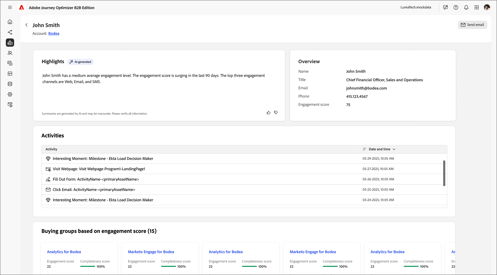

# Personinformation

När du klickar på ett personnamn var som helst i Journey Optimizer B2B edition visas sidan med personinformation. Den här sidan innehåller användbar information om den person som är associerad med ett konto eller en köpgrupp, inklusive en generativ AI-sammanfattning av högdager- och intent-data (om dessa är konfigurerade). <!-- There are also [actions](#person-actions) that you can execute for the person. -->

{width="800" zoomable="yes"}

Du kommer åt den här sidan genom att klicka på ett namn som visas på [Intelligent Dashboard](../dashboards/intelligent-dashboard.md), [sidan Information om inköpsgrupp](../buying-groups/buying-group-details.md) eller [sidan Kontoinformation](./account-details.md).

Personinformationssidan består av följande fyra avsnitt:

## Personöversikt

{zoomable="yes"}

Personöversiktsavsnittet högst upp på sidan innehåller följande information:

* Namn
* Titel
* E-post
* Telefonnummer
* Engagement score
* Sammanfattning

## Aktiviteter

I det här avsnittet finns en lista med de senaste e-postmeddelandena, webben, formulärifyllningarna och intressanta stunderna som är kopplade till personen (upp till 20). Objekten är listor som aktivitetstyp med datum och tid.

{width="700" zoomable="yes"}

## Köpa grupper baserat på engagemangsmusik

I det här avsnittet finns inköpsgrupper där personen är medlem och där sorteras enligt engagemangspoäng. Varje kort innehåller följande information om inköpsgrupper:

* Namn - Klicka på namnet för att öppna [köpgruppsinformationen](../buying-groups/buying-group-details.md).
* Engagement score
* Slutförandepoäng
* Scen
* Medlemmar

{width="700" zoomable="yes"}

## Återgivningsdata

I Journey Optimizer B2B edition kan man med metoden Intent Detection förutsäga en lösning/produkt av intresse med tillräckligt stor tillförsikt utifrån en persons aktivitet. Den utnyttjar även andra kontomedarbetares aktiviteter, tillsammans med taggat innehåll. En persons avsikt kan tolkas som sannolikheten att ha intresse för en produkt.

{{intent-data-note}}

{width="700" zoomable="yes"}

* Avsiktsnivåer
* Typer av avsiktssignal - Nyckelord, produkt och lösning

<!-- ## Person actions -->
