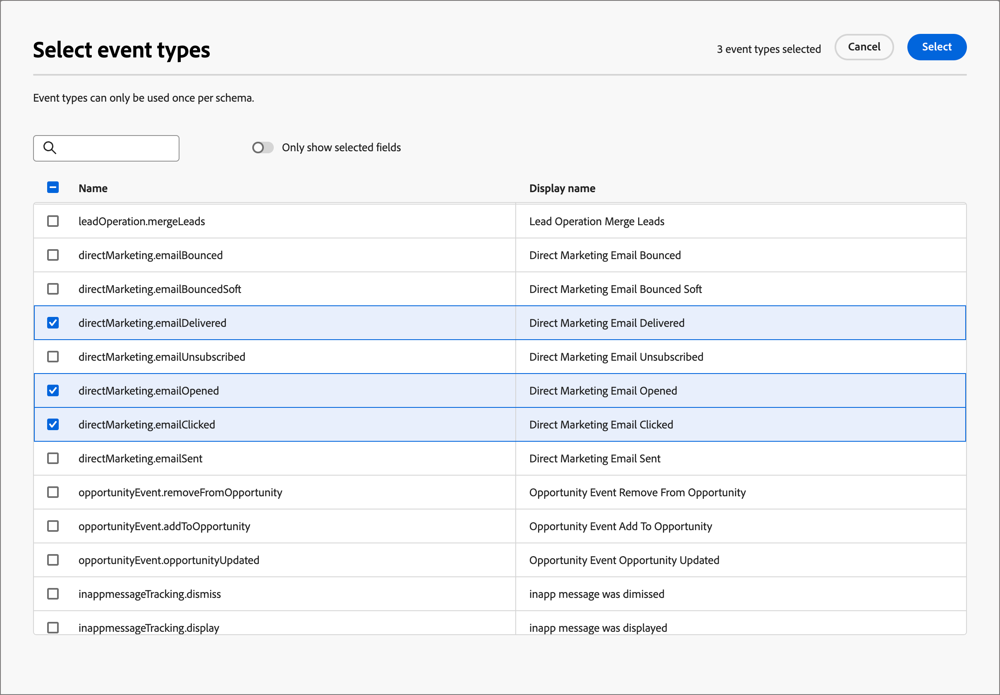

# Konfigurera händelsedefinitioner för Experience Platform

Administratörer kan konfigurera Adobe Experience Platform (AEP)-baserade händelsedefinitioner, som gör att marknadsförare kan skapa kontoresor som reagerar på [AEP Experience Events](https://experienceleague.adobe.com/sv/docs/experience-platform/xdm/classes/experienceevent){target="_blank"}.

{width="30"} [Se videoöversikten](#overview-video)

Att använda AEP Experience Events i kundresor är en tvåstegsprocess:

1. Skapa och publicera en händelsdefinition för AEP.

2. Lägg till en _Lyssna efter en händelse_-nod i en kontoresa och [välj en AEP-händelsedefinition som en personhändelse](../journeys/listen-for-event-nodes.md#listen-for-an-experience-event).

För varje händelsedefinition krävs följande indata från Experience Platform:

* **_Schema_** - XDM-schema som definierar Experience Event-datastrukturen. Den måste baseras på en Experience Event och måste vara profilaktiverad.

  >[!NOTE]
  >
  >För att säkerställa att nödvändiga scheman är definierade måste ni samordna med ert konstruktörsteam. [Att skapa XDM-scheman](https://experienceleague.adobe.com/sv/docs/experience-platform/xdm/schema/composition){target="_blank"} är en komplex process som utförs av datatekniker baserat på ärendekrav i hela organisationen.

* **_Händelsetyper_** - XDM ExperienceEvent-händelsetyp (högst 20 per händelsetyp).

* **_Fält_** - XDM-fält som finns i schemat (högst 20 per händelsdefinition)

* **_Namn_** - Ett unikt namn för händelsedefinitionen.

* **_Beskrivning_** - En beskrivning av händelsedefinitionen.

## Begränsningar och skyddsräcken

Tänk på följande när du skapar och hanterar händelsedefinitioner för att uppfylla dina organisationsmål:

* Journey Optimizer B2B edition stöder maximalt 50 händelsedefinitioner.

* Kontoresor kan lyssna efter AEP Experience Events som importerats med hjälp av AEP direktuppspelningsfunktioner, som Web SDK eller HTTP API.

* Endast en AEP-händelsedefinition kan använda ett kombinerat schema och en uppsättning händelsetyper. När du skapar en händelsedefinition med ett schema (till exempel `My Schema`) och en händelsetyp (till exempel `Web Webpagedetails Page Views`) kan ingen annan händelsedefinition använda kombinationen `My Schema` och `Web Webpagedetails Page Views`.

* En händelsedefinition kan användas i mer än en kontoresa.

* AEP Experience Events kan användas för att fatta beslut inom en kontoresa, men bevaras inte. Därför går det inte att utnyttja tidigare erfarenheter av AEP Experience Events inom Journey Optimizer B2B edition.

* Begränsningarna för _aktivitetsdatum_ och _minsta antal gånger_ stöds inte.

* När en händelsedefinition har publicerats kan schemat och namnet inte ändras. Du kan dock lägga till händelsetyper och fält genom att skapa ett utkast och publicera igen.

* Händelsedefinitioner som används i publicerade resor kan inte tas bort.

## Få åtkomst till och hantera händelsedefinitioner

1. Välj **[!UICONTROL Administration]** > **[!UICONTROL Configurations]** i den vänstra navigeringen.

1. Klicka på **[!UICONTROL Events]** på den mellanliggande panelen för att visa listan över händelsedefinitioner.

   Från den här sidan kan du [skapa](#create-an-event-definition), [publicera](#publish-an-event-defintion), [redigera](#edit-an-event-definition) och [ta bort](#delete-an-event-definition) händelsedefinitioner.

   {width="800" zoomable="yes"}

   Tabellen sorteras efter kolumnen _[!UICONTROL Modified]_, med de senast uppdaterade definitionerna överst som standard.<!-- Click the column title to change between ascending and descending.-->

1. Klicka på namnet för att få tillgång till informationen om en händelsedefinition.

### Händelsedefinitionsstatus och livscykel

I listan _[!UICONTROL Event definitions]_&#x200B;anger kolumnen **[!UICONTROL Status]**&#x200B;aktuell status för varje definition. Statusen avgör om den är tillgänglig för användning på kontoresor och vilka ändringar du kan göra i den.

| Status | Beskrivning |
| -------------------- | ----------- |
| Utkast | När du skapar en händelsedefinition är den i utkaststatus. Den behåller denna status tills du publicerar den för användning på kontoresor. Tillgängliga åtgärder:  <li>Redigera all information<li>Publicera<li>Ta bort |
| Publicerad | När du publicerar en händelsedefinition blir den tillgänglig för användning på kontoresor. Det går inte att ändra informationen. Tillgängliga åtgärder:  <li>Tillgänglig för _Lyssna efter en händelse_-kundens nod<li>Skapa utkastversion<li>Radera (om den inte används) |
| Publicerat (med utkast) | När du skapar ett utkast från en publicerad händelsedefinition är den publicerade versionen fortfarande tillgänglig för användning på kontoresor, och utkastversionen kan ändras. Om du publicerar utkastet ersätts den aktuella publicerade versionen och händelsedefinitionen uppdateras för kontoresor där den ännu inte har körts. Tillgängliga åtgärder:  <li>Redigera all information<li>Publicera utkast<li>Ignorera utkastversion<li>Radera (om den inte används) |

{zoomable="yes"}

### Filtrera händelsedefinitionslistan

Om du vill söka efter en händelsedefinition utifrån namn anger du en textsträng i sökfältet för en matchning.

{width="700" zoomable="yes"}

## Skapa en händelsedefinition

1. Välj **[!UICONTROL Administration]** > **[!UICONTROL Configuration]** i den vänstra navigeringen.

1. Klicka på **[!UICONTROL Events]** på den mellanliggande panelen för att visa listan över händelsedefinitioner.

1. Klicka på **[!UICONTROL Create event]** överst till höger.

1. Ange **[!UICONTROL Name]** (obligatoriskt) och **[!UICONTROL Description]** (valfritt).

   {width="600" zoomable="yes"}

1. Ange att **[!UICONTROL Schema]** ska användas för händelsedefinitionen.

   Det schema du väljer avgör vilka fält som är tillgängliga för att läggas till i definitionen. Fälten som du lägger till är sedan tillgängliga som begränsningar för en _Lyssna efter en händelse_-nod i en kontoresa.

   * Klicka på **[!UICONTROL Select schema]**.
   * I dialogrutan väljer du ett schema i listan över Experience Event-baserade scheman.
   * Klicka på **[!UICONTROL Select]**.

   {width="600" zoomable="yes"}

1. Välj **[!UICONTROL Event types]** som ska användas för händelsedefinitionen.

   De [händelsetyper](https://experienceleague.adobe.com/sv/docs/experience-platform/xdm/classes/experienceevent#eventType){target="_blank"} som du väljer avgör vilka händelser som är tillgängliga som begränsningar för en _Lyssna efter en händelse_-nod i en kontoresa.

   * Klicka på **[!UICONTROL Select event types]**.
   * I dialogrutan väljer du en eller flera händelsetyper i listan (högst 20).
   * Klicka på **[!UICONTROL Select]**.

   {width="600" zoomable="yes"}

1. Välj **[!UICONTROL Fields]** som ska användas för händelsedefinitionen.

   Fälten som du väljer avgör vilka begränsningar som är tillgängliga när händelsen används för en _Lyssna efter en händelse_-nod i en kontoresa.

   >[!NOTE]
   >
   >Fältet `eventType` är obligatoriskt och automatiskt markerat.

   * Klicka på **[!UICONTROL Select fields]**.
   * I dialogrutan väljer du ett eller flera fält i listan (högst 20).
   * Klicka på **[!UICONTROL Select]**.

   {width="600" zoomable="yes"}

1. När schemat, händelsetyperna och fälten är klara klickar du på **[!UICONTROL Create]**.

   När listsidan skapas visas den och den nya händelsen visas högst upp i listan med statusen _Utkast_.

   {width="700" zoomable="yes"}

## Publicera en händelsedefinition

När du är säker på att definitionen av en utkasthändelse är fullständig och korrekt kan du publicera den. Den publicerade händelsedefinitionen är sedan tillgänglig för användning vid kontoresor. När händelsedefinitionen har publicerats kan du skapa ett utkast om du behöver göra ändringar i den. Du kan dock inte ändra schemat, och du kan bara lägga till händelsetyper och fält (du kan inte ta bort dem).

1. Välj **[!UICONTROL Administration]** > **[!UICONTROL Configuration]** i den vänstra navigeringen.

1. Klicka på **[!UICONTROL Events]** på den mellanliggande panelen för att visa listan över händelsedefinitioner.

1. I listan _[!UICONTROL Event definitions]_&#x200B;klickar du på namnet på definitionen av utkasthändelsen för att öppna informationssidan.

   {width="600" zoomable="yes"}

   Granska inställningarna innan du publicerar om det behövs. Du kan [redigera utkastet](#edit-an-event-definition) om det inte uppfyller dina krav.

1. Klicka på **[!UICONTROL Publish]** överst till höger.

1. Klicka på **[!UICONTROL Publish]** i bekräftelsedialogrutan.

   {width="300"}

   Statusen för händelsedefinitionen ändras till _Publicerad_ och är nu [tillgänglig för användning i kontoresor](../journeys/listen-for-event-nodes.md#listen-for-an-experience-event).

   {width="700" zoomable="yes"}

## Redigera en händelsedefinition

1. Välj **[!UICONTROL Administration]** > **[!UICONTROL Configuration]** i den vänstra navigeringen.

1. Klicka på **[!UICONTROL Events]** på den mellanliggande panelen för att visa listan över händelsedefinitioner.

   Redigeringar av en händelsedefinition beror på dess aktuella status:

   * När en händelsedefinition har statusen _Utkast_ kan du redigera all information om den.
   * Du kan inte redigera en händelsedefinition när den har statusen _Publicerad_. Du kan skapa ett utkast som är redigerbart och sedan ersätta den publicerade versionen.
   * När en händelsedefinition är i _Publicerad (med utkast)_ kan du ändra utkastversionen (redigera beskrivningen och lägga till händelsetyper och fält).

   {width="700" zoomable="yes"}

1. Öppna händelsedefinitionsnamnet från listsidan _[!UICONTROL Event definitions]_&#x200B;genom att klicka på det.

Följ stegen enligt status:

>[!BEGINTABS]

>[!TAB Utkast]

1. Ändra alla händelsedefinitionsdetaljer efter behov.

   {width="600" zoomable="yes"}

   Följ samma riktlinjer som används för att [skapa en händelsedefinition](#create-an-event-definition).

   Ändringarna sparas automatiskt i utkastet.

1. När händelsedefinitionen uppfyller dina villkor och du vill göra den tillgänglig för kontoresor klickar du på **[!UICONTROL Publish]**.

1. Klicka på **[!UICONTROL Publish]** i bekräftelsedialogrutan.

   Statusen för händelsedefinitionen ändras till _Publicerad_ och är nu tillgänglig för användning på kontoresor.

>[!TAB Publicerad]

1. Om du vill uppdatera händelsedefinitionen klickar du på **[!UICONTROL Create draft version]** överst till höger.

   {width="600" zoomable="yes"}

1. Klicka på **[!UICONTROL Create draft]** i bekräftelsedialogrutan för att öppna utkastet.

   {width="300"}

   Den här åtgärden skapar utkastet till version och återgår till listsidan, där händelsedefinitionen nu har statusen _Publicerad (med utkast)_.

1. Klicka på händelsens definitionsnamn för att öppna den.

   För en _publicerad (med utkast)_-händelsedefinition har _[!UICONTROL Published]_-versionsfliken valts som standard.

1. Välj fliken för version av **[!UICONTROL Draft]**.

   {width="600" zoomable="yes"}

1. Ändra den redigerbara informationen (**[!UICONTROL Description]**, **[!UICONTROL Event types]** och **[!UICONTROL Fields]**) efter behov.

   Följ samma riktlinjer som används för att [skapa en händelsedefinition](#create-an-event-definition).

   Ändringarna sparas automatiskt i utkastet.

1. När utkasthändelsedefinitionen uppfyller dina villkor och du vill ersätta den aktuella publicerade versionen för användning på kontoresor klickar du på **[!UICONTROL Publish Draft]**.

1. Klicka på **[!UICONTROL Publish]** i bekräftelsedialogrutan.

   {width="300"}

   När du publicerar utkastet ersätts den aktuella publicerade versionen och händelsedefinitionen uppdateras för kontoresor där den redan används men ännu inte körs.

>[!TAB Publicerad (med utkast)]

När du öppnar en _publicerad (med utkast)_ -händelsedefinition väljs _[!UICONTROL Published]_-fliken som standard.

1. Välj fliken för version av **[!UICONTROL Draft]**.

   {width="600" zoomable="yes"}

1. Ändra den redigerbara informationen (**[!UICONTROL Description]**, **[!UICONTROL Event types]** och **[!UICONTROL Fields]**) efter behov.

   Följ samma riktlinjer som används för att [skapa en händelsedefinition](#create-an-event-definition).

   Ändringarna sparas automatiskt i utkastet.

1. När utkasthändelsedefinitionen uppfyller dina villkor och du vill ersätta den aktuella publicerade versionen för användning på kontoresor klickar du på **[!UICONTROL Publish Draft]**.

1. Klicka på **[!UICONTROL Publish]** i bekräftelsedialogrutan.

   {width="300"}

   När du publicerar utkastet ersätts den aktuella publicerade versionen och händelsedefinitionen uppdateras för kontoresor där den redan används men ännu inte körs.

>[!ENDTABS]

## Ta bort en händelsedefinition

Du kan ta bort en händelsedefinition om den inte används av en publicerad kontoresa.

>[!CAUTION]
>
>Använd den här åtgärden med försiktighet. Borttagning av en händelsedefinition kan inte ångras.

1. Välj **[!UICONTROL Administration]** > **[!UICONTROL Configuration]** i den vänstra navigeringen.

1. Klicka på **[!UICONTROL Events]** på den mellanliggande panelen för att visa listan över händelsedefinitioner.

1. Leta reda på händelsedefinitionen i listan och klicka på ikonen _Ta bort_ (  ) till höger om namnet.

1. Klicka på **[!UICONTROL Delete]** i bekräftelsedialogrutan.

   {width="300"}

## Videoöversikt

>[!VIDEO](https://video.tv.adobe.com/v/3448687/?learn=on&captions=swe)