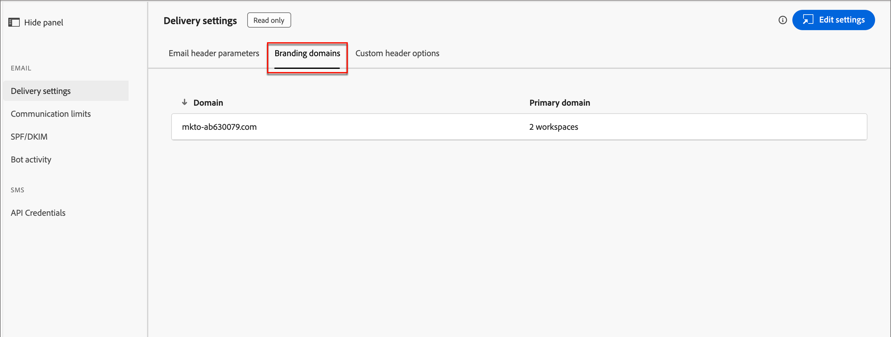
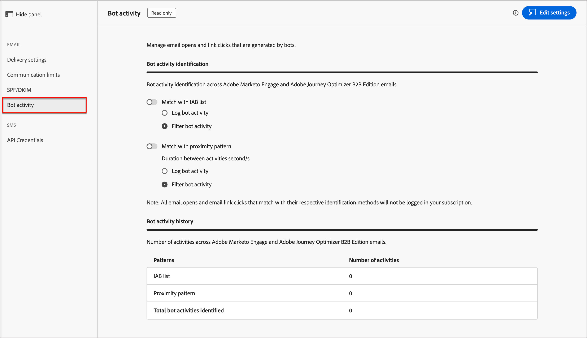

# Konfigurationer av e-postkanaler

Adobe Journey Optimizer B2B edition utnyttjar kanalfunktionerna och händelsespårningen i Marketo Engage. Administratörer bör se till att konfigurationerna för leverans och spårning finns på plats för att möjliggöra kanalleverans för marknadsförare. Information om de protokoll som behövs för e-postleverans och -spårning via Marketo Engage finns i [Protokoll för spårning och e-postleverans](../start/email-protocols.md).

## Leveransinställningar

Standardinställningarna för e-post används när marknadsförare skapar ett e-postmeddelande i en kontoresa. Gå till **[!UICONTROL Administration]** > **[!UICONTROL Channels]** om du vill granska inställningarna för e-postleverans. Välj _[!UICONTROL Email]_&#x200B;under **[!UICONTROL Delivery Settings]**&#x200B;i navigeringspanelen.

{width="800" zoomable="yes"}

Inställningarna är skrivskyddade i Journey Optimizer B2B edition. Klicka på **[!UICONTROL Edit settings]** överst till höger för att komma åt konfigurationsalternativen i den anslutna Marketo Engage-instansen.

>[!NOTE]
>
>Om du vill komma åt och redigera de här inställningarna i Adobe Marketo Engage måste du ha behörighet som produktadministratör.

Välj var och en av följande flikar för att granska de aktuella inställningarna.

### [!UICONTROL Email header parameters] {#email-header}

E-postrubrikens parametrar definierar standardvärdena för följande:

* **[!UICONTROL From Email]** - E-postadressen som visas i fältet _Från_ i e-posthuvudet.

* **[!UICONTROL From Label]** - Det namn som visas för e-postavsändaradressen.

* **[!UICONTROL Unsubscribe HTML]** - Den HTML (för e-postklienter som stöds) som visas i icke-operativa e-postmeddelanden för att förklara avbrutna prenumerationer för mottagaren. Den här texten och länkarna läggs till längst ned.

* **[!UICONTROL Unsubscribe Text]** - Den oformaterade text som visas i icke-operativa e-postmeddelanden för att förklara att mottagaren avbrutit prenumerationen. Den här texten och länkarna läggs till längst ned.

* **[!UICONTROL View as web page HTML]** - HTML (för e-postklienter som stöds) som används för _Visa som webbsida_, som innehåller en länk för att visa ett e-postmeddelande i en webbläsare.

* **[!UICONTROL View as web page text]** - Den oformaterade text som används för _Visa som webbsida_, som innehåller en länk för att visa ett e-postmeddelande i en webbläsare.

### [!UICONTROL Branding domains] {#branding-domains}

Klicka på fliken **[!UICONTROL Branding domains]** om du vill granska profileringsdomänerna.

{width="700" zoomable="yes"}

Den här inställningen definierar din primära domän för en eller flera arbetsytor i den anslutna Marketo Engage-instansen. Nya e-postmeddelanden använder den här domänen som standard, men marknadsförarna kan [åsidosätta den per e-post](../content/add-email.md#define-the-email-settings). Mer information om hur du definierar standardprofileringsdomänen finns i [Marketo Engage-dokumentationen](https://experienceleague.adobe.com/sv/docs/marketo/using/product-docs/administration/email-setup/add-multiple-branding-domains/edit-your-default-branding-domain){target="_blank"}.

>[!NOTE]
>
>Om ni marknadsför flera varumärken och vill att var och en ska ha sina egna varumärkesspårningslänkar kan ni lägga till ytterligare en varumärkesdomän. Mer information om hur du lägger till flera profileringsdomäner finns i [Marketo Engage-dokumentationen](https://experienceleague.adobe.com/sv/docs/marketo/using/product-docs/administration/email-setup/add-multiple-branding-domains/add-an-additional-branding-domain){target="_blank"}.

### [!UICONTROL Custom header options] {#custom-header-options}

Klicka på fliken **[!UICONTROL Custom header options]** om du vill granska de anpassade rubrikalternativen.

{width="700" zoomable="yes"}

När _[!UICONTROL Strict Transport Security]_&#x200B;är aktiverat garanterar det att spårningslänkar överförs via HTTPS (endast för prenumerationer med spårningslänkar som skyddas av SSL).

## Kommunikationsbegränsningar

Kommunikationsbegränsningar styr hur mycket e-post organisationen skickar. Det är bäst att sätta gränser så att ni inte överbelastar mottagarna med för många e-postmeddelanden från organisationen.

Gå till **[!UICONTROL Administration]** > **[!UICONTROL Channels]** om du vill granska de aktuella inställningarna. Välj _[!UICONTROL Email]_&#x200B;under **[!UICONTROL Communication limits]**&#x200B;i navigeringspanelen.

{width="700" zoomable="yes"}

Klicka på **[!UICONTROL Edit settings]** överst till höger för att komma åt konfigurationsalternativen i den anslutna Marketo Engage-instansen.

>[!NOTE]
>
>Om du vill komma åt och redigera de här inställningarna i Adobe Marketo Engage måste du ha behörighet som produktadministratör.

Mer information om hur du konfigurerar kommunikationsgränserna finns i [Marketo Engage-dokumentationen](https://experienceleague.adobe.com/sv/docs/marketo/using/product-docs/administration/email-setup/enable-communication-limits){target="_blank"}.

## SPF/DKIM

Förbättra e-postleveransen genom att införliva SPF (Sender Policy Framework) och DKIM (Domain Keys Identified Mail) i dina DNS-inställningar. Dessa tekniker säkerställer att dina e-postmeddelanden inte är skräppost. För att förhindra att mottagarnas skräppostfilter avvisar e-postmeddelanden måste du se till att SPF och DKIM har konfigurerats för dina domäner.

Gå till **[!UICONTROL Administration]** > **[!UICONTROL Channels]** om du vill granska de aktuella inställningarna. Välj _[!UICONTROL Email]_&#x200B;under **[!UICONTROL SPF/DKIM]**&#x200B;i navigeringspanelen.

{width="700" zoomable="yes"}

Inställningarna är skrivskyddade i Journey Optimizer B2B edition. Klicka på **[!UICONTROL Edit settings]** överst till höger för att komma åt konfigurationsalternativen i den anslutna Marketo Engage-instansen.

>[!NOTE]
>
>Om du vill komma åt och redigera de här inställningarna i Adobe Marketo Engage måste du ha behörighet som produktadministratör.

### SPF-inställningar

Nätverksadministratören bör lägga till följande rad i dina DNS-poster:

`[domain] IN TXT v=spf1 mx ip4:[corpIP] include:mktomail.com ~all`

I den här posten ersätter du `[domain]` med webbplatsens primära domän (till exempel `company.com`) och `[corpIP]` med IP-adressen för företagets e-postserver (till exempel `255.255.255.255`). Om du skickar e-post från flera domäner via Marketo Engage lägger du till posten för varje domän på en rad.

Om du redan har en SPF-post i DNS-posten lägger du till följande i den:

`include:mktomail.com`

### DKIM

DKIM är ett autentiseringsprotokoll som används av e-postmottagare för att validera e-postmeddelandets avsändare. Det förbättrar ofta leveransen av e-postmeddelanden till inkorgen eftersom mottagaren kan vara säker på att meddelandet inte är en förfalskning.

När du har den offentliga nyckeln i din DNS-post och den sändande domänen aktiverad i den anslutna Marketo Engage-instansen, används anpassad DKIM-signering för dina utgående meddelanden. Den anpassade DKIM-signeringen innehåller en krypterad digital signatur med varje e-postmeddelande som skickas. Mottagarna kan sedan dekryptera den digitala signaturen genom att leta upp den _offentliga nyckeln_ i den sändande domänens DNS. Om nyckeln i e-postmeddelandet motsvarar nyckeln i DNS-posten är det troligare att den mottagande e-postservern accepterar e-postmeddelandet som skickas via Marketo Engage.

Mer information om hur du konfigurerar en anpassad DKIM-signatur för e-postleverans finns i [Marketo Engage-dokumentationen](https://experienceleague.adobe.com/sv/docs/marketo/using/product-docs/email-marketing/deliverability/set-up-a-custom-dkim-signature){target="_blank"}.

## Rotaktivitet

E-postrobotaktiviteten kan felaktigt aktivera e-postöppningen och klicka på data.

Marketo Engage använder två metoder för att bekräfta robotaktivitet:

* **Matcha med IAB-listan (Interactive Advertising Bureau)** - Aktiviteter som matchar något i IAB UA/IP-listan (User Agent/IP address) markeras som bots.

* **Matcha med närhetsmönster** - När två eller flera aktiviteter inträffar samtidigt (inom en sekund) identifieras de som bottar. Den här metoden använder följande attribut för jämförelse:

   * Lead-ID (ska vara samma)
   * E-postresurs (ska vara samma)
   * Klicka eller mejla
   * Tidsskillnad (bör vara mindre än en sekund)

För e-postlänkens klicknings- och e-postöppningsaktiviteter fylls nya attribut i med följande värden:

* Aktiviteter som identifieras som bottar har _punktaktivitet_ som `True` och _punktaktivitetsmönster_ som det identifierade mönstret/metoden.
* Aktiviteter som inte identifieras som bots har _Bot Activity_ som `False` och _Bot Activity Pattern_ som `N/A`.
* Aktiviteter som inträffar innan attributen introducerades har _punktaktivitet_ som tom (null) och _punktaktivitetsmönster_ som tom (null)

Gå till **[!UICONTROL Administration]** > **[!UICONTROL Channels]** om du vill granska de aktuella inställningarna. Välj _[!UICONTROL Email]_&#x200B;under **[!UICONTROL Bot activity]**&#x200B;i navigeringspanelen.

{width="700" zoomable="yes"}

Inställningarna är skrivskyddade i Journey Optimizer B2B edition. Klicka på **[!UICONTROL Edit settings]** överst till höger för att komma åt konfigurationsalternativen i den anslutna Marketo Engage-instansen.

>[!NOTE]
>
>Om du vill komma åt och redigera de här inställningarna i Adobe Marketo Engage måste du ha behörighet som produktadministratör.

Mer information om hur du konfigurerar alternativen för robotaktivitet finns i [Marketo Engage-dokumentationen](https://experienceleague.adobe.com/sv/docs/marketo/using/product-docs/administration/email-setup/filtering-email-bot-activity#select-filter-type){target="_blank"}.
