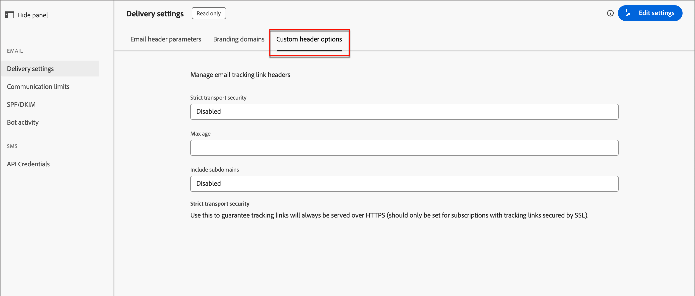

# Konfigurationer av e-postkanaler

Adobe Journey Optimizer B2B edition utnyttjar kanalfunktionerna och händelsespårningen i Marketo Engage. Administratörer bör se till att konfigurationerna för leverans och spårning finns på plats för att möjliggöra kanalleverans för marknadsförare. Information om de protokoll som behövs för e-postleverans och -spårning via Marketo Engage finns i [Protokoll för spårning och e-postleverans](../start/email-protocols.md).

## Leveransinställningar

Standardinställningarna för e-post används när marknadsförare skapar ett e-postmeddelande i en kontoresa. Gå till **[!UICONTROL Administration]** > **[!UICONTROL Channels]** om du vill granska inställningarna för e-postleverans. Välj _[!UICONTROL Email]_&#x200B;under **[!UICONTROL Delivery Settings]**&#x200B;i navigeringspanelen.

{width="800" zoomable="yes"}

Inställningarna är skrivskyddade i Journey Optimizer B2B edition. Klicka på **[!UICONTROL Edit settings]** överst till höger för att komma åt konfigurationsalternativen i den anslutna Marketo Engage-instansen.

>[!NOTE]
>
>Om du vill komma åt och redigera de här inställningarna i Adobe Marketo Engage måste du ha behörighet som produktadministratör.

Välj var och en av följande flikar för att granska de aktuella inställningarna.

### [!UICONTROL Email header parameters] {#email-header}

E-postrubrikens parametrar definierar standardvärdena för följande:

* **[!UICONTROL From Email]** - E-postadressen som visas i fältet _Från_ i e-posthuvudet.

* **[!UICONTROL From Label]** - Det namn som visas för e-postavsändaradressen.

* **[!UICONTROL Unsubscribe HTML]** - Den HTML (för e-postklienter som stöds) som visas i icke-operativa e-postmeddelanden för att förklara avbrutna prenumerationer för mottagaren. Den här texten och länkarna läggs till längst ned.

* **[!UICONTROL Unsubscribe Text]** - Den oformaterade text som visas i icke-operativa e-postmeddelanden för att förklara att mottagaren avbrutit prenumerationen. Den här texten och länkarna läggs till längst ned.

* **[!UICONTROL View as web page HTML]** - HTML (för e-postklienter som stöds) som används för _Visa som webbsida_, som innehåller en länk för att visa ett e-postmeddelande i en webbläsare.

* **[!UICONTROL View as web page text]** - Den oformaterade text som används för _Visa som webbsida_, som innehåller en länk för att visa ett e-postmeddelande i en webbläsare.

### [!UICONTROL Branding domains] {#branding-domains}

Klicka på fliken **[!UICONTROL Branding domains]** om du vill granska profileringsdomänerna.

{width="700" zoomable="yes"}

Den här inställningen definierar din primära domän för en eller flera arbetsytor i den anslutna Marketo Engage-instansen. Nya e-postmeddelanden använder den här domänen som standard, men marknadsförarna kan [åsidosätta den per e-post](../content/add-email.md#define-the-email-settings). Mer information om hur du definierar standardprofileringsdomänen finns i [Marketo Engage-dokumentationen](https://experienceleague.adobe.com/en/docs/marketo/using/product-docs/administration/email-setup/add-multiple-branding-domains/edit-your-default-branding-domain){target="_blank"}.

>[!NOTE]
>
>Om ni marknadsför flera varumärken och vill att var och en ska ha sina egna varumärkesspårningslänkar kan ni lägga till ytterligare en varumärkesdomän. Mer information om hur du lägger till flera profileringsdomäner finns i [Marketo Engage-dokumentationen](https://experienceleague.adobe.com/en/docs/marketo/using/product-docs/administration/email-setup/add-multiple-branding-domains/add-an-additional-branding-domain){target="_blank"}.

### [!UICONTROL Custom header options] {#custom-header-options}

Klicka på fliken **[!UICONTROL Custom header options]** om du vill granska de anpassade rubrikalternativen.

{width="700" zoomable="yes"}

När _[!UICONTROL Strict Transport Security]_&#x200B;är aktiverat garanterar det att spårningslänkar överförs via HTTPS (endast för prenumerationer med spårningslänkar som skyddas av SSL).

## Kommunikationsbegränsningar

Kommunikationsbegränsningar styr antalet e-postmeddelanden som en kontakt tar emot från din organisation. De gränser du anger delas mellan Journey Optimizer B2B edition och den anslutna Marketo Engage-instansen. Genom att ange dessa gränser säkerställs att ett lead inte får mer än ett maximalt antal e-postmeddelanden under en given tidsperiod.

>[!AVAILABILITY]
>
>Kommunikationsgränserna är tillgängliga för Journey Optimizer B2B edition-miljöer som har etablerats på den [förenklade arkitekturen](../simplified-architecture.md). Kontakta Adobe Support eller öppna ett supportärende för att aktivera delning av kommunikationsbegränsningar mellan Journey Optimizer B2B edition och en eller flera Marketo Engage-instanser.

Med en definierad gräns på fem e-postmeddelanden per dag ser systemet till att en kontakt inte får ett sjätte e-postmeddelande inom en dag genom att inaktivera det sjätte e-postmeddelandet. Med gemensamma kommunikationsbegränsningar mellan Journey Optimizer B2B edition och Marketo Engage definieras kommunikationsbegränsningsreglerna på en plats. Det sjätte e-postmeddelandet ignoreras, oavsett sändningsåtgärden som kommer från Journey Optimizer B2B edition eller Marketo Engage.

Alla Marketo Engage-produktionsinstanser har kommunikationsgränser definierade som standard (mer information finns i [Marketo Engage-dokumentationen](https://experienceleague.adobe.com/en/docs/marketo/using/product-docs/administration/email-setup/enable-communication-limits){target="_blank"}). Om du vill använda begränsningar för delad kommunikation definierar du reglerna i Journey Optimizer B2B edition och utökar delningen av dessa begränsningar till Marketo Munchkin-koderna.

>[!IMPORTANT]
>
>Om du vill utöka kommunikationsreglerna för Marketo Munchkin-koder kontaktar du kontohanteringsgruppen på Adobe. Den här konfigurationen är vanligtvis en del av introduktionsprocessen.

Gå till **[!UICONTROL Administration]** > **[!UICONTROL Channels]** om du vill granska eller ange regler för kommunikationsbegränsning. Under _[!UICONTROL Email]_&#x200B;i navigeringspanelen och välj **[!UICONTROL Communication limits]**.

{width="700" zoomable="yes"}

Som standard finns det en global regeluppsättning där du kan definiera, aktivera och inaktivera flera regler efter behov. Klicka på regeluppsättningens namn för att visa regellistan.

### Skapa en regel

1. Klicka på **[!UICONTROL Create rule]** överst till höger.

   {width="600" zoomable="yes"}

1. Ange **[!UICONTROL Rule name]**.

1. Ange **[!UICONTROL Capping amount]**.

   Ange värdet eller klicka på pilen _Upp_ eller _Ned_ till höger om du vill öka eller minska värdet.

1. Välj värdet **[!UICONTROL Reset capping frequency]** enligt hur du vill definiera tidsperioden för gränsen.

   Du kan välja _[!UICONTROL Hourly]_,_[!UICONTROL Daily]_, _[!UICONTROL Weekly]_&#x200B;eller&#x200B;_[!UICONTROL Monthly]_.

   {width="600" zoomable="yes"}

1. Ange värdet **[!UICONTROL Every]** enligt hur många frekvensenheter som ska inkluderas i perioden.

   Om du till exempel använder _Daglig_ som frekvens och anger det här värdet som `3` definieras perioden som tre dagar.

1. Klicka på **[!UICONTROL Create rule]** överst till höger.

Den nya regeln är i läget _Utkast_ och tillämpas inte på kommunikationsgränserna förrän du väljer att aktivera den.

### Hantera regler

Så länge en regel är i läget _Utkast_ kan du redigera definitionen eller ta bort regeln. När du vill att regeln ska tillämpas kan du aktivera den. Klicka på ikonen _Mer meny_ (**..**) bredvid regelnamnet för utkastet i listan och välj **[!UICONTROL Activate]**.

{width="400" zoomable="yes"}

Klicka sedan på **[!UICONTROL Activate]** i bekräftelsedialogrutan.

Det går inte att redigera eller ta bort en aktiv regel, den kan bara inaktiveras. Klicka på ikonen _Inaktivera_ (  ) bredvid det aktiva regelnamnet för en aktiv regel som du vill ta bort från de tillämpade kommunikationsgränserna.

{width="400" zoomable="yes"}

Klicka sedan på **[!UICONTROL Deactivate]** i bekräftelsedialogrutan.

Regeln visas med statusen _Inaktiv_. Det liknar en utkastregel och du kan redigera, ta bort eller aktivera den vid behov.

## SPF/DKIM

Förbättra e-postleveransen genom att införliva SPF (Sender Policy Framework) och DKIM (Domain Keys Identified Mail) i dina DNS-inställningar. Dessa tekniker säkerställer att dina e-postmeddelanden inte är skräppost. För att förhindra att mottagarnas skräppostfilter avvisar e-postmeddelanden måste du se till att SPF och DKIM har konfigurerats för dina domäner.

Gå till **[!UICONTROL Administration]** > **[!UICONTROL Channels]** om du vill granska de aktuella inställningarna. Välj _[!UICONTROL Email]_&#x200B;under **[!UICONTROL SPF/DKIM]**&#x200B;i navigeringspanelen.

{width="700" zoomable="yes"}

Inställningarna är skrivskyddade i Journey Optimizer B2B edition. Klicka på **[!UICONTROL Edit settings]** överst till höger för att komma åt konfigurationsalternativen i den anslutna Marketo Engage-instansen.

>[!NOTE]
>
>Om du vill komma åt och redigera de här inställningarna i Adobe Marketo Engage måste du ha behörighet som produktadministratör.

### SPF-inställningar

Nätverksadministratören bör lägga till följande rad i dina DNS-poster:

`[domain] IN TXT v=spf1 mx ip4:[corpIP] include:mktomail.com ~all`

I den här posten ersätter du `[domain]` med webbplatsens primära domän (till exempel `company.com`) och `[corpIP]` med IP-adressen för företagets e-postserver (till exempel `255.255.255.255`). Om du skickar e-post från flera domäner via Marketo Engage lägger du till posten för varje domän på en rad.

Om du redan har en SPF-post i DNS-posten lägger du till följande i den:

`include:mktomail.com`

### DKIM

DKIM är ett autentiseringsprotokoll som används av e-postmottagare för att validera e-postmeddelandets avsändare. Det förbättrar ofta leveransen av e-postmeddelanden till inkorgen eftersom mottagaren kan vara säker på att meddelandet inte är en förfalskning.

När du har den offentliga nyckeln i din DNS-post och den sändande domänen aktiverad i den anslutna Marketo Engage-instansen, används anpassad DKIM-signering för dina utgående meddelanden. Den anpassade DKIM-signeringen innehåller en krypterad digital signatur med varje e-postmeddelande som skickas. Mottagarna kan sedan dekryptera den digitala signaturen genom att leta upp den _offentliga nyckeln_ i den sändande domänens DNS. Om nyckeln i e-postmeddelandet motsvarar nyckeln i DNS-posten är det troligare att den mottagande e-postservern accepterar e-postmeddelandet som skickas via Marketo Engage.

Mer information om hur du konfigurerar en anpassad DKIM-signatur för e-postleverans finns i [Marketo Engage-dokumentationen](https://experienceleague.adobe.com/en/docs/marketo/using/product-docs/email-marketing/deliverability/set-up-a-custom-dkim-signature){target="_blank"}.

## Rotaktivitet

E-postrobotaktiviteten kan felaktigt aktivera e-postöppningen och klicka på data.

Marketo Engage använder två metoder för att bekräfta robotaktivitet:

* **Matcha med IAB-listan (Interactive Advertising Bureau)** - Aktiviteter som matchar något i IAB UA/IP-listan (User Agent/IP address) markeras som bots.

* **Matcha med närhetsmönster** - När två eller flera aktiviteter inträffar samtidigt (inom en sekund) identifieras de som bottar. Den här metoden använder följande attribut för jämförelse:

   * Lead-ID (ska vara samma)
   * E-postresurs (ska vara samma)
   * Klicka eller mejla
   * Tidsskillnad (bör vara mindre än en sekund)

För e-postlänkens klicknings- och e-postöppningsaktiviteter fylls nya attribut i med följande värden:

* Aktiviteter som identifieras som bottar har _punktaktivitet_ som `True` och _punktaktivitetsmönster_ som det identifierade mönstret/metoden.
* Aktiviteter som inte identifieras som bots har _Bot Activity_ som `False` och _Bot Activity Pattern_ som `N/A`.
* Aktiviteter som inträffar innan attributen introducerades har _punktaktivitet_ som tom (null) och _punktaktivitetsmönster_ som tom (null)

Gå till **[!UICONTROL Administration]** > **[!UICONTROL Channels]** om du vill granska de aktuella inställningarna. Välj _[!UICONTROL Email]_&#x200B;under **[!UICONTROL Bot activity]**&#x200B;i navigeringspanelen.

{width="700" zoomable="yes"}

Inställningarna är skrivskyddade i Journey Optimizer B2B edition. Klicka på **[!UICONTROL Edit settings]** överst till höger för att komma åt konfigurationsalternativen i den anslutna Marketo Engage-instansen.

>[!NOTE]
>
>Om du vill komma åt och redigera de här inställningarna i Adobe Marketo Engage måste du ha behörighet som produktadministratör.

Mer information om hur du konfigurerar alternativen för robotaktivitet finns i [Marketo Engage-dokumentationen](https://experienceleague.adobe.com/en/docs/marketo/using/product-docs/administration/email-setup/filtering-email-bot-activity#select-filter-type){target="_blank"}.
