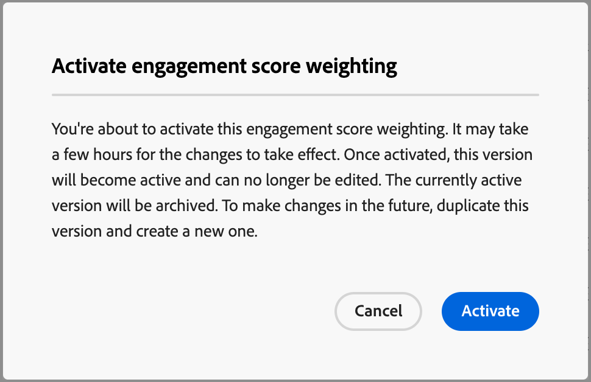

# Konfigurera anpassad poängviktning för engagemang

En poäng för köpgruppsengagemang återspeglar engagemanget genom att utvärdera olika aktiviteter som registrerats för medlemmar i inköpsgruppen. Med anpassad poängviktning kan marknadsföringsteamen definiera sina egna modeller för att väga aktiviteter som är mest meningsfulla för engagemang. En anpassad poängsättningsmodell ger en mer exakt återgivning av ert tillvägagångssätt genom att prioritera beteenden som ger en mer korrekt signal till inköpsavsikten i er försäljningsprocess.

Som administratör kan ni definiera flera poängmodeller för engagemang för organisationen, men bara en modell kan vara aktiv åt gången. Du definierar en poängmodell utifrån den vikt som används för varje engagemangsbedömning.

## Få åtkomst till vägningsmodeller för engagemangsmusik

1. Välj **[!UICONTROL Administration]** > **[!UICONTROL Configurations]** i den vänstra navigeringen.

1. Klicka på **[!UICONTROL Engagement score weighting]** på den mellanliggande panelen för att visa listan över bedömningsmodeller.

   Från den här sidan kan du [skapa (duplicera)](#create-an-engagement-score-model), [aktivera](#activate-a-score-model) och [redigera](#change-the-engagement-weighting-settings) interaktionspoängmodeller.

   {width="800" zoomable="yes"}

   Tabellen visar de senast uppdaterade modellerna högst upp (sorterade efter _[!UICONTROL Last updated]_) och innehåller möjligheten att söka efter&#x200B;_[!UICONTROL Name]_. Du kan anpassa den visade tabellen genom att klicka på ikonen _Kolumninställningar_ (  ) i det övre högra hörnet och markera eller avmarkera kryssrutorna för kolumner.

{width="300"}

1. Klicka på namnet för att få tillgång till information om en modell för poängsättning för engagemang.

### Standardpoängmodell

Systemet skapar en inledande engagemangspoängmodell med namnet _Aktivitetsviktningsmodell_, som är den aktiva modellen tills du skapar en egen anpassad modell och aktiverar den. När du aktiverar din anpassade modell ändras standardmodellen till statusen _Arkiverad_ . Du kan duplicera den om du återgår till standardpoängmodellen för engagemang, eller om du vill använda den som utgångspunkt för en annan anpassad modell.

{width="600" zoomable="yes"}

### Ta bort en utkastmodell

Du kan ta bort ett utkast till en poängmodell om du beslutar att du inte vill aktivera den i framtiden. Klicka på ikonen _Mer meny_ (**..**) bredvid modellnamnet för utkast i listan och välj **[!UICONTROL Delete]**.

{width="350"}

Klicka på **[!UICONTROL Delete]** i bekräftelsedialogrutan.

## Skapa en anpassad poängmodell för engagemang

Om du vill skapa en anpassad poängmodell för engagemang duplicerar du standardmodellen eller en annan anpassad modell som redan har skapats. Du kan duplicera den aktuella _aktiva_-modellen, en _utkastmodell_ eller en _arkiverad_-modell. Redigera sedan den duplicerade modellen efter dina behov.

1. Klicka på modellnamnet för att öppna sidan med modellinformation och klicka på **[!UICONTROL Duplicate]** överst till höger.

   {width="600" zoomable="yes"}

   Du kan också klicka på ikonen _Mer meny_ (**..**) bredvid namnet på poängmodellen i listan och välja **[!UICONTROL Duplicate]**.

   {width="325"}

1. Ange ett unikt namn för den duplicerade modellen i dialogrutan _Duplicera_ och klicka på **[!UICONTROL Duplicate]**.

   {width="500"}

   Den duplicerade modellen visas i listan med statusen _Utkast_. Klicka på namnet för att öppna informationen om poängmodellen och göra ändringarna.

### Ändra inställningar för interaktionsviktning

Viktinställningarna definierar de band som du kan tilldela varje aktivitet i modellen. Ni kan ändra banden så att de återspeglar organisationens strategier för utvärdering av engagemanget. Du kan till exempel justera viktningsbandet _Normal_ till 65 om du vill tilldela ett högre värde till normala aktiviteter. Du kan också lägga till ett viktningsband som är utformat för att fånga aktiviteter som ligger mellan _Normal_ och _Viktigt_. I det här fallet kan du lägga till ett band och märka det som _Significant_ och tilldela viktbandvärdet 75.

1. Klicka på **[!UICONTROL Engagement weight settings]** överst på informationssidan för poängmodellen.

   {width="600" zoomable="yes"}

1. För varje viktband justerar du namnet eller värdena efter behov:

   * Ändra namnet i fältet _[!UICONTROL Weighting band]_.
   * Ange ett nytt värde. Du kan även klicka på **&plus;** eller **-** för att öka eller minska värdet.

   {width="500"}

1. Lägg till ytterligare ett viktningsband om det behövs:

   Klicka på **[!UICONTROL + Add weighting band]** längst ned i listan. Den här åtgärden infogar ett tomt viktningsband längst ned i listan.

   Ange namnet och ange värdet för bandet. Se till att använda ett unikt namn och värde.

1. Om det behövs tar du bort ett viktningsband och klickar på ikonen _Ta bort_ (  ) för viktningsbandraden.

1. När ändringarna är klara klickar du på **[!UICONTROL Save]**.

### Ändra aktivitetsvikt

Varje poängmodell innehåller en fullständig lista över vilka aktiviteter som stöds:

{{engagement-activities}}

För varje aktivitet i listan anger du det värde som du vill tilldela varje aktivitetsförekomst. Klicka på den nedåtriktade pilen i fältet **[!UICONTROL Weighting]** och välj viktningsbandet enligt inställningarna för interaktionsviktning.

{width="500"}

Om du inte vill att poängberäkningen för engagemang ska använda en aktivitet anger du viktningen till noll (0).

Ändringarna sparas automatiskt.

## Aktivera en poängmodell

När du aktiverar en modell för utkast ersätts den modell som är aktiv. Den aktiva modellen arkiveras automatiskt.

1. Öppna ett utkast till poängmodell för att visa informationssidan.

1. Klicka på **[!UICONTROL Activate]**.

1. Klicka på **[!UICONTROL Activate]** i bekräftelsedialogrutan.

   {width="400"}
