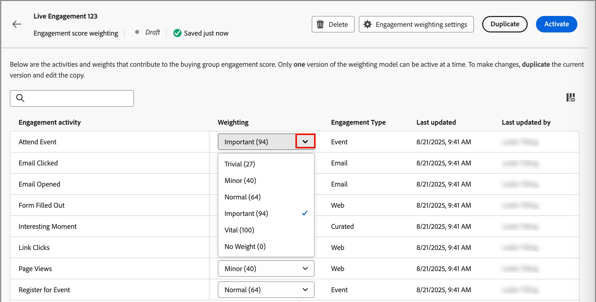

# Konfigurera anpassad poängviktning för engagemang

Ett [poängvärde för köpgruppsengagemang](../buying-groups/engagement-scores.md) reflekterar nivån på engagemanget genom att utvärdera olika aktiviteter som registrerats för medlemmar i inköpsgruppen. Med anpassad poängviktning kan marknadsföringsteamen definiera sina egna modeller för att väga aktiviteterna. En anpassad poängsättningsmodell ger en mer exakt återgivning av ert tillvägagångssätt genom att prioritera beteenden som ger en mer korrekt signal till inköpsavsikten i er försäljningsprocess.

Som administratör kan ni definiera flera poängmodeller för engagemang för organisationen, men bara en modell kan vara aktiv åt gången. Du definierar en poängmodell utifrån den vikt som används för varje engagemangsbedömning.

>[!PREREQUISITES]
>
>Om du vill definiera och aktivera en viktningsmodell för engagemangspoäng måste du ha _[!UICONTROL Manage B2B Admin Configurations]_[produktbehörighet](./user-management.md#b2b-product-permissions).

## Få åtkomst till vägningsmodeller för engagemangsmusik

Öppna listan _[!UICONTROL Engagement score weighting]_om du vill visa aktiva, utkast och arkiverade modeller:

1. Välj **[!UICONTROL Administration]** > **[!UICONTROL Configurations]** i den vänstra navigeringen.

1. Klicka på **[!UICONTROL Engagement score weighting]** på den mellanliggande panelen för att visa listan över bedömningsmodeller.

   Från den här sidan kan du [skapa (duplicera)](#create-an-engagement-score-model), [aktivera](#activate-a-score-model) och [redigera](#change-the-engagement-weighting-settings) interaktionspoängmodeller.

   {width="800" zoomable="yes"}

   I listan visas de senast uppdaterade modellerna högst upp (sorterade efter _[!UICONTROL Last updated]_) och där finns möjlighet att söka efter_[!UICONTROL Name]_.

   Du kan anpassa den visade tabellen genom att klicka på ikonen _Kolumninställningar_ (  ) i det övre högra hörnet och markera eller avmarkera kryssrutorna för kolumner.

   {width="300"}

1. Klicka på namnet för att få tillgång till information om en modell för poängsättning för engagemang.

### Standardpoängmodell

Systemet skapar en inledande engagemangspoängmodell med namnet _Aktivitetsviktningsmodell_. Modellstatus och engagemangsaktiviteter är beroende av dataarkitekturen för din [!DNL Journey Optimizer B2B Edition]-miljö:

* **Förenklad arkitektur** (Beta) - Om din miljö använder den [förenklade arkitekturen](../simplified-architecture.md) är engagemangsaktiviteterna baserade på Experience Platform-standardhändelser och anpassade händelser. Vikten för alla aktiviteter är 0 som standard.

  {width="600" zoomable="yes"}

* **Standardarkitektur** - Om miljön använder standardarkitekturen är den anslutna [!DNL Marketo Engage]-instansen källan för engagemangsaktivitetsdata. Standardmodellen är aktiv tills du skapar en anpassad version och aktiverar den.

  {width="600" zoomable="yes"}

När du aktiverar en anpassad modell ändras den aktiva modellen till statusen _Arkiverad_. Om du återgår till standardmodellen för förlovningspoäng kan du duplicera den ursprungliga standardmodellen och sedan aktivera den eller använda den som utgångspunkt för en annan anpassad modell.

### Ta bort en utkastmodell

Du kan ta bort ett utkast till en poängmodell om du beslutar att du inte vill aktivera den i framtiden. Klicka på ikonen _Mer meny_ (**..**) bredvid modellnamnet för utkast i listan och välj **[!UICONTROL Delete]**.

{width="350"}

Klicka på **[!UICONTROL Delete]** i bekräftelsedialogrutan.

## Skapa en anpassad poängmodell för engagemang

Om du vill skapa en anpassad poängmodell för engagemang duplicerar du standardmodellen eller en annan anpassad modell som redan har skapats. Du kan duplicera den aktuella _aktiva_-modellen, en _utkastmodell_ eller en _arkiverad_-modell. Redigera sedan den duplicerade modellen efter dina behov.

1. Klicka på modellnamnet för att öppna sidan med modellinformation och klicka på **[!UICONTROL Duplicate]** överst till höger.

   {width="600" zoomable="yes"}

   Du kan också klicka på ikonen _Mer meny_ (**..**) bredvid namnet på poängmodellen i listan och välja **[!UICONTROL Duplicate]**.

   {width="325"}

1. Ange ett unikt namn för den duplicerade modellen i dialogrutan _Duplicera_ och klicka på **[!UICONTROL Duplicate]**.

   {width="500"}

   Den duplicerade modellen visas i listan med statusen _Utkast_. Klicka på namnet för att öppna informationen om poängmodellen och göra ändringarna.

### Ändra inställningar för interaktionsviktning

Viktinställningarna definierar de band som du kan tilldela varje aktivitet i modellen. Ni kan ändra banden så att de återspeglar organisationens strategier för utvärdering av engagemanget. Du kan till exempel justera viktningsbandet _Normal_ till 65 om du vill tilldela ett högre värde till normala aktiviteter. Du kan också lägga till ett viktningsband som är utformat för att fånga aktiviteter som ligger mellan _Normal_ och _Viktigt_. I det här fallet kan du lägga till ett band och märka det som _Significant_ och tilldela viktbandvärdet 75.

1. Klicka på **[!UICONTROL Engagement weight settings]** överst på informationssidan för poängmodellen.

   {width="600" zoomable="yes"}

1. För varje viktband justerar du namnet eller värdena efter behov:

   * Ändra namnet i fältet _[!UICONTROL Weighting band]_.
   * Ange ett nytt värde. Du kan även klicka på **&amp;plus;** eller **-** för att öka eller minska värdet.

   {width="500"}

1. Lägg till ytterligare ett viktningsband om det behövs:

   Klicka på **[!UICONTROL + Add weighting band]** längst ned i listan. Den här åtgärden infogar ett tomt viktningsband längst ned i listan.

   Ange namnet och ange värdet för bandet. Se till att använda ett unikt namn och värde.

1. Om du vill ta bort ett viktningsband klickar du på ikonen _Ta bort_ (  ) för viktningsbandraden.

1. När ändringarna är klara klickar du på **[!UICONTROL Save]**.

### Ändra aktivitetsvikt

Varje poängmodell innehåller en fullständig lista över vilka aktiviteter som stöds.

+++Verksamheter för förenklad arkitektur

Standardmodellen för den förenklade arkitekturen inkluderar de Experience Platform spårade aktiviteterna. Varje aktivitet har en nollvikt (0) (används inte) tills du tilldelar den en vikt. Alla aktiviteter har också en maximal daglig frekvens på 20, vilket du inte kan ändra.

<table style="table-layout: fixed; width: 100%; border: 0;">
<tbody>
<tr style="border: 0;">
<td>
<ul><li>Advertising Clicks </li><li>Advertising Complete </li><li>Advertising Conversion </li><li>Advertising Federated </li><li>Advertising First Quartiles </li><li>Advertising Impressions </li><li>Advertising Midpoints </li><li>Advertising Starts </li><li>Advertising Third Quartiles </li><li>Advertising Time Play </li><li>Stäng program </li><li>Programstart </li><li>Ändra kampanjslut för engagemang </li><li>Commerce Backoffice CreditMemo Issued </li><li>Commerce Backoffice-beställning avbruten </li><li>Commerce Backoffice-beställning placerad </li><li>Commerce Backoffice OrderItems har levererats </li><li>Commerce Backoffice-leverans slutförd </li><li>Commerce Checkouts </li><li>Commerce Product List (Cart) Adds </li><li>Commerce produktlista (kundvagn) öppnas </li><li>Borttagningar av Commerce produktlista (kundvagn) </li><li>Commerce produktlista (kundvagn) - återöppnas </li><li>Vyer för Commerce produktlista (kundvagn) </li><li>Commerce produktvyer </li><li>Commerce Inköp </li><li>Commerce Save for Laters </li><li>Avstängning av beslutsförslag </li><li>Visning av beslutsutkast </li><li>Interaktion för beslutsutkast </li></ul>
</td>
<td>
<ul><li>Beslutsutkast - skicka </li><li>Avlösare för beslutsutkast </li><li>Leveransfeedback </li><li>E-post för direktmarknadsföring studsade </li><li>E-postbaserad direktmarknadsföring, mjuk </li><li>E-postadress för direktmarknadsföring klickad </li><li>E-post för direktmarknadsföring levererad </li><li>E-post för direktmarknadsföring öppnad </li><li>E-post för direktmarknadsföring har skickats </li><li>Avbeställ e-post för direktmarknadsföring </li><li>Inappningsmeddelandet har avvisats </li><li>Meddelandet om appen visades </li><li>Inapp-meddelandet interagerades med </li><li>Lead-åtgärd - lägg till i kampanj </li><li>Anropa webkrok för lead-operation </li><li>Lead Operation Change Campaign Stream </li><li>Lead-åtgärd - konvertera lead </li><li>Intressant stund för lead-åtgärd </li><li>Lead-åtgärdssammanfogningsleads </li><li>Lead-åtgärd Ny lead </li><li>Lead Operation Revenue Stage har ändrats </li><li>Score för lead-operation har ändrats </li><li>Status för Lead-åtgärd i Campaign Progression har ändrats </li></ul>
</td>
<td>
<ul><li>Lead-åtgärd Lägg till i lista </li><li>Lead-åtgärd Ta bort från lista </li><li>Platsavslutning </li><li>Media adBreakComplete </li><li>Media adBreakStart </li><li>Media adComplete </li><li>Media adSkip </li><li>Media adStart </li><li>Bithastighetsändring för media </li><li>Media bufferStart </li><li>MediekapitalComplete </li><li>MediekapitalHoppa över </li><li>MediekapitalStart </li><li>Anpassad mediespårning </li><li>Mediehämtat innehåll </li><li>Mediefel </li><li>Media pauseStart </li><li>Medieping </li><li>Media play </li><li>Media sessionComplete </li><li>Media sessionEnd </li><li>Media sessionStart </li><li>MedietillståndUppdatera </li><li>Feedback </li><li>Data för meddelandeåtergivning </li><li>Meddelandespårning </li><li>Affärsmöjlighetshändelse har lagts till i affärsmöjlighet </li><li>Affärsmöjlighet har uppdaterats </li><li>Affärsmöjlighet - händelse borttagen från affärsmöjlighet </li><li>Push Tracking Application Opened </li><li>Anpassad åtgärd för push-spårning </li><li>Webbformulär ifyllt </li><li>Webbinteraktionslänkklickningar </li><li>Webbsidor, information, sidvyer</li></ul>
</td>
</tbody>
</table>

+++

+++Verksamheter för standardarkitektur

Standardmodellen för standardarkitekturen innehåller de [!DNL Marketo Engage] spårade aktiviteterna med en associerad standardvikt. När du duplicerar den här modellen kan du ändra viktningen efter behov. Du kan inte ändra den maximala dagliga frekvensen.

{{engagement-activities-me}}

+++

För varje aktivitet i listan anger du det värde som du vill tilldela varje aktivitetsförekomst. Klicka på den nedåtriktade pilen i fältet **[!UICONTROL Weighting]** och välj viktningsbandet enligt inställningarna för interaktionsviktning.

{width="600" zoomable="yes"}

Om du inte vill att poängberäkningen för engagemang ska använda en aktivitet anger du viktningen till noll (0).

Ändringarna sparas automatiskt.

## Aktivera en poängmodell

När du aktiverar en modell för utkast ersätts den modell som är aktiv. Den aktiva modellen arkiveras automatiskt.

1. Öppna ett utkast till poängmodell för att visa informationssidan.

1. Klicka på **[!UICONTROL Activate]**.

1. Klicka på **[!UICONTROL Activate]** i bekräftelsedialogrutan.

   {width="400"}
