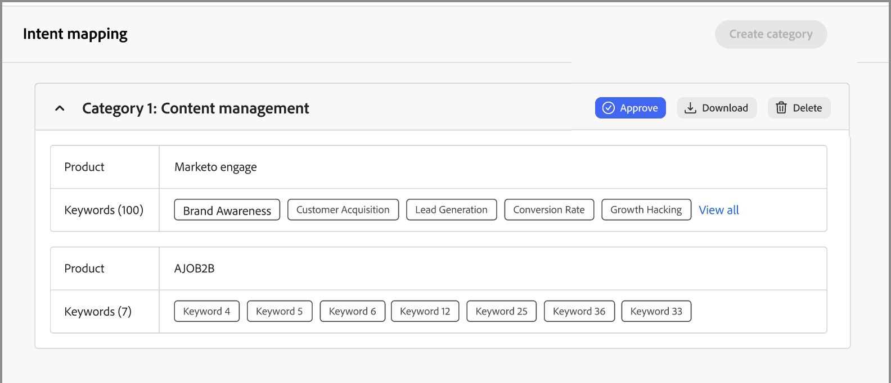

# Återgivningsdata

I Journey Optimizer B2B edition förutser Intent Detection-modellen en lösning/produkt av intresse med tillräckligt stor tillförsikt utifrån en leads aktivitet. Den utnyttjar även andra kontomedarbetares aktiviteter, tillsammans med taggat innehåll. En persons avsikt kan tolkas som sannolikheten att ha intresse för en produkt.

* Avsiktsnivåer - Tillgängligt på kända leads-, konto- och inköpsgruppsnivåer.
* Typer av avsiktssignal - Nyckelord, produkt och lösning

Ingående data används i [_Intelligent Dashboard_](../dashboards/intelligent-dashboard.md), [_Kontoinformation_, ](../accounts/account-details.md), [_Information om inköpsgrupp_, ](../buying-groups/buying-group-details.md) och [_Personinformation_, sida](../accounts/person-details.md).

{width="700" zoomable="yes"}

## Förbered återgivningsdata

Om du vill aktivera den här funktionen skapar du ett kalkylblad, t.ex. en Microsoft Excel-fil, med hjälp av flikar för att definiera den avsedda taxonomin. Hela kalkylbladet överförs som en kategori som kan ha flera produkter, och varje produkt kan ha flera nyckelord. Använd följande definitioner för ditt intent mapping-kalkylblad för varje kategori som du vill definiera:

* Kalkylbladets namn = _Kategorinamn_
* Varje flik = ditt produktnamn
* Varje flik innehåller en kolumn = produktnyckelord (max 150)

Du kan hämta en Excel-fil som du kan använda som mall för att förbereda mappningsdata. Så här hämtar du mallen:

1. Välj **[!UICONTROL Administration]** > **[!UICONTROL Configuration]** i den vänstra navigeringen.

1. Klicka på **[!UICONTROL Intent Mapping]** i panelen Mellan.

1. Klicka på **[!UICONTROL Create category]**.

1. Klicka på länken **[!UICONTROL Download file template]** i dialogrutan.

   {width="500"}

1. Klicka på **[!UICONTROL Cancel]**.

   Du kan gå tillbaka och överföra den förberedda filen när den är klar.

1. Använd mallen för att definiera dina återgivningsmappningsdata:

   * Byt namn på filen så att den återspeglar ditt kategorinamn, till exempel _Personalization vid skalförändring_.
   * Byt namn på alla flikar efter produktnamn, till exempel _Journey Optimizer B2B_, _Marketo Engage_ och _Experience Manager_.
   * Lägg till produktnyckelord för varje flik, till exempel _B2B-marknadsföring_, _Varumärkesigenkänning_ och _Leadengagemang_.

   {width="600" zoomable="yes"}

## Överför en kategorifil

När kalkylbladet är klart går du tillbaka till konfigurationssidan _[!UICONTROL Intent Mapping]_&#x200B;och överför filen.

1. Klicka på **[!UICONTROL Create category]**.

1. Dra och släpp filen i dialogrutan _[!UICONTROL Upload files]_&#x200B;eller klicka på&#x200B;**[!UICONTROL Select a file]**&#x200B;för att leta reda på och markera filen på datorn.

1. Klicka på **[!UICONTROL Next]**.

   Förbearbetningen körs på kluster med liknande nyckelord, vilket förbättrar återgivningsidentifieringen och förhindrar att nyckelord späds. Ett pulsmeddelande visas så snart förbearbetningen är klar (upp till 15 minuter, beroende på data).

   {width="500"}

   Resultatet visas på sidan _Återgivningsmappning_.

   {width="600" zoomable="yes"}

## Godkänn eller avvisa kategorin

Granska kategorilistan och klicka på **[!UICONTROL Approve]** för att aktivera nyckelorden för användning på Intelligent Dashboard, sidan med kontoinformation, sidan med information om inköpsgrupper och sidan med information om person. Klicka på **[!UICONTROL View all]** om du vill visa den fullständiga listan för varje produkt eller klicka på **[!UICONTROL Download]** om du vill granska den fullständiga listan som en Excel-fil.

Om du inte är nöjd med listan kan du ta bort kategorin genom att klicka på **[!UICONTROL Delete]**. Du kan sedan göra ändringar i kalkylbladsfilen innan du påbörjar överföringen igen för att definiera den kategorin.

>[!IMPORTANT]
>
>Du måste godkänna eller ignorera (ta bort) den nya kategorin innan du kan lägga till en annan kategori eller redigera en kategori.

Om du lägger till en annan kategori och dess taxonomi skulle påverka en befintlig kategori visas en varning. Tänk på den här effekten när du bestämmer dig för att godkänna eller avvisa kategorin. Produkt-till-nyckelordsmappningen ska vara densamma i alla kategorier om produkten används i mer än en kategori.

{width="600" zoomable="yes"}
