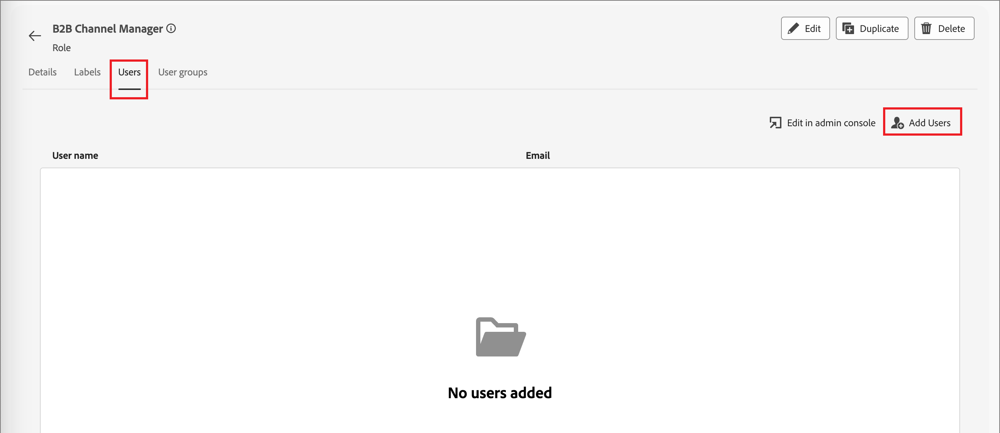

# Användarhantering

När etableringen är klar och sandlådorna är bundna utför du följande steg för att ge ditt team och dina användare tillgång till Adobe Journey Optimizer B2B edition.

1. [Skapa en Marketo Engage-produktprofil](#marketo-engage-profile) i Admin Console (endast ny Marketo Engage-instans).
1. [Skapa en användargrupp](#create-user-group) i Admin Console.
1. [Redigera inbyggda roller](#edit-roles) eller [skapa en anpassad roll](#create-a-custom-role) med Journey Optimizer B2B edition-behörigheter.
1. [Lägg till användare](#add-users) eller [grupper](#add-user-groups-to-a-role) i roller.

Som administratör kan du utföra dessa uppgifter i Adobe Admin Console, som är en central plats för att administrera och hantera dina Adobe produktlicenser och användare. I Admin Console kan du skapa och hantera användare på en och samma plats i stället för i de olika individuella lösningarna. På sidan [Admin Console - översikt](https://helpx.adobe.com/se/enterprise/using/admin-console.html) finns mer information om funktioner och funktioner.

## Öppna Admin Console

Innan du kan använda Admin Console för att administrera användare i ditt team måste du se till att du har tillgång till Admin Console och rätt behörigheter.

1. Som systemadministratör bör du få flera e-postmeddelanden från Adobe som en del av introduktionsprocessen.

   Leta efter det välkomstmeddelande som innehåller information om organisationens namn som du har beviljats åtkomst till.

1. Klicka på länken **[!UICONTROL Get started]** i ditt välkomstmeddelande för att navigera till Admin Console.

   Om du inte hittar e-postmeddelandet kan du öppna en webbläsare direkt till Admin Console på [https://adminconsole.adobe.com](https://adminconsole.adobe.com).

1. Logga in med din Adobe ID.

   När inloggningen är klar visas sidan _Översikt_ i Adobe Admin Console.

1. Om du har tillgång till flera organisationer måste du se till att du har loggat in i rätt organisation.

   Om du vill ändra din organisation klickar du på organisationens namn i det övre högra hörnet och väljer den organisation som du behöver åtkomst till.

1. Välj **[!UICONTROL Administrators]** från _[!UICONTROL Users]_-kortet för att verifiera att du är systemadministratör.

   {width="700" zoomable="yes"}

1. Sök genom att ange Adobe ID e-postadress, användarnamn, för- eller efternamn.

   * Om din åtkomst är korrekt konfigurerad returnerar sökningen din post.

   * Om värdet i kolumnen **[!UICONTROL ADMIN ROLE]** visar `System` vet du att du (eller den användare som visas) är systemadministratör.

## Skapa Marketo Engage produktprofil {#marketo-engage-profile}

När du ger användare tillgång till en Adobe-lösning behöver du inte nödvändigtvis ge dem fullständig åtkomst. Med produktprofiler kan varje lösning ha en egen uppsättning användarbehörigheter. Använd Admin Console för att tilldela produktprofiler.

Mer information om hur du använder produktprofiler för användarrättigheter finns i [Hantera produktprofiler för företagsanvändare](https://helpx.adobe.com/se/enterprise/using/manage-product-profiles.html){target="_blank"} i Admin Console-dokumentationen.
<!--
>[!BEGINSHADEBOX]

When you add a user to the Marketo Engage product profile, they are subsequently added to the _Standard User_ role within the Default workspace of the Marketo Engage subscription. This role grants them all _Standard User_ permissions for Marketo Engage in that workspace. Currently, all Journey Optimizer B2B Edition users are required to be Marketo Engage users. A Marketo Engage administrator can restrict access by updating the permissions for the _Standard User_ role or by moving the user to a different Marketo Engage user role with more restrictive permissions.

For more information about managing these permissions within Marketo Engage, see [Managing User Roles and Permissions](https://experienceleague.adobe.com/sv/docs/marketo/using/product-docs/administration/users-and-roles/managing-user-roles-and-permissions){target="_blank"} in the Marketo Engage documentation.

>[!ENDSHADEBOX]-->

{width="30"} En systemadministratör eller Marketo Engage produktadministratör kan utföra följande steg.

1. Logga in på [https://adminconsole.adobe.com](https://adminconsole.adobe.com).

1. Välj fliken **[!UICONTROL Products]**.

1. Öppna Marketo Engage-instansen där du vill lägga till profilen och klicka på **[!UICONTROL New profile]**.

   {width="700" zoomable="yes"}

1. Ange ett produktprofilnamn, till exempel _Standardanvändare_.

1. Klicka på **Nästa** och sedan på **Spara**.

## Skapa en användargrupp {#create-user-group}

En användargrupp är en samling användare som tilldelas en delad uppsättning behörigheter. Du kan lägga till eller ta bort användare i din användargrupp. Gruppbehörigheterna förblir desamma medan användarna i gruppen ändras.

Mer information om hur användargrupper används för att hantera behörigheter finns i [Hantera användargrupper](https://helpx.adobe.com/se/enterprise/using/user-groups.html){target="_blank"} i Admin Console-dokumentationen.

{width="30"} En systemadministratör kan utföra följande steg.

1. Logga in på [https://adminconsole.adobe.com](https://adminconsole.adobe.com).

1. Välj fliken **[!UICONTROL Users]**.

1. Välj **[!UICONTROL User Groups]** i den vänstra navigeringen.

1. Klicka på **[!UICONTROL New user group]** överst till höger.

1. Ange ett namn för användargruppen, till exempel _Standardanvändare_, och klicka på **[!UICONTROL Save]**.

1. Klicka på användargruppen som du nyss skapade.

1. Välj fliken **[!UICONTROL Assigned product profiles]** och klicka på **[!UICONTROL Assign profile]**.

1. Klicka på **+** och lägg till varje instans av följande produkter:

   * [!UICONTROL Marketo Engage]
   * [!UICONTROL Adobe Experience Platform - AEP-Default-All-Users]
   * [!UICONTROL Adobe Experience Platform Data Collection]
   * [!UICONTROL Data Collection All Access]

   {width="700" zoomable="yes"}

1. Klicka på **[!UICONTROL Save]**.

## Lägga till användare i en grupp

Mer information om användarhantering finns i [Admin Console-användare](https://helpx.adobe.com/se/enterprise/using/user-groups.html) i Admin Console-dokumentationen.

{width="30"} En systemadministratör eller produktadministratör kan utföra följande steg. En produktadministratör kan bara lägga till användare som redan finns i organisationen.

1. Gå till [https://adminconsole.adobe.com](https://adminconsole.adobe.com).

1. Klicka på **[!UICONTROL Add users]** under _[!UICONTROL Quick links]_.

1. Lägg till varje användare:

   * Ange användarens e-postadress, förnamn och efternamn.

     {width="600" zoomable="yes"}

   * För **[!UICONTROL User groups]** klickar du på **+**.

   * Markera användargruppen som du skapade tidigare.

   * Klicka på **[!UICONTROL Apply]**.

1. Klicka på **[!UICONTROL Save]**.

## Redigera roller för produktbehörigheter {#edit-roles}

Behörigheter är enhetsbehörigheter som gör att du kan definiera de behörigheter som tilldelats en produktprofil. Varje tillstånd samlas in med en funktion, till exempel resor eller köpgrupper, som representerar olika funktioner eller objekt i Journey Optimizer B2B edition.

Under _Behörigheter_ i Adobe Experience Platform kan administratörer definiera användarroller och åtkomstprinciper för att hantera åtkomstbehörigheter för funktioner och objekt i ett produktprogram. I det här programmet kan du skapa och hantera roller samt tilldela önskade resursbehörigheter för rollerna. Med behörigheter kan du också hantera sandlådor och användare som är associerade med en viss roll.

Mer information om rollbehörigheter i Experience Platform finns i [Hantera behörigheter för en roll](https://experienceleague.adobe.com/sv/docs/experience-platform/access-control/abac/permissions-ui/permissions){target="_blank"} i Experience Platform-dokumentationen.

### B2B-produktbehörigheter

Följande behörigheter styr åtkomsten till funktionerna i Journey Optimizer B2B edition:

| Kategori | Beskrivning | Behörigheter |
| -------- | ----------- | ---------- |
| B2B-kontolistor | Konfigurera, hantera, visa och publicera behörigheter för B2B-kontolistor. Dessa behörigheter omfattar åtgärder som att lägga till, ta bort, importera och ta bort konton från kontolistor. | <li>Hantera B2B-kontolistor |
| Administratörskonfigurationer för B2B | Konfigurera, hantera och visa behörigheter för B2B-administrativa konfigurationer. Dessa behörigheter omfattar anslutningar för hantering av digitala resurser, tillgångsarkiv och händelser. | <li>Hantera B2B-administratörskonfigurationer |
| B2B Assets | Konfigurera, hantera och visa behörigheter för B2B-resurser. Dessa behörigheter omfattar e-post, SMS, landningssidor, fragment, mallar och bilder. | <li>Hantera B2B Assets <li>Hantera B2B-mallar <li>Hantera B2B-fragment |
| B2B Buying Groups | Konfigurera, hantera och visa behörigheter för B2B-inköpsgrupper. Dessa behörigheter omfattar lösningsintressen, rollmallar och status för inköpsgrupper. | <li>Hantera B2B-inköpsgrupper |
| B2B-kanalkonfigurationer | Konfigurera, hantera och visa behörigheter för B2B-kanalskonfigurationer. Dessa behörigheter omfattar inställningar för kommunikationsbegränsningar, API-autentiseringsuppgifter och säkerhetsinställningar. | <li>Hantera B2B-kanalskonfigurationer |
| B2B-instrumentpaneler | Konfigurera och visa behörigheter för B2B-instrumentpaneler. Dessa behörigheter omfattar kontointeraktion, inköpsgruppfaser, surging-konton och kontakttäckning. | <li>Hantera B2B-instrumentpaneler |
| B2B-resor | Konfigurera hanterings-, vy- och publiceringsbehörigheter för B2B-resor. Dessa behörigheter omfattar konto- och personåtgärder, händelseavlyssnare och delade sökvägar | <li>Hantera B2B-resor |

### Inbyggda B2B-roller

När din organisation har etablerat Journey Optimizer B2B edition innehåller Experience Platform en uppsättning inbyggda (standard) roller som du kan använda för att hantera åtkomst till produktfunktionerna:

| Roll | Behörigheter |
| ---- | ----------- |
| B2B-resechef | <li>Hantera B2B-resor <li>Hantera B2B-inköpsgrupper <li>Hantera B2B-kontolistor <li>Visa kontrollpanelen för B2B-engagemang <li>Visa kontrollpanelen för B2B-insikter |
| Kanalhanteraren B2B | <li>Hantera B2B Assets <li>Hantera B2B-mallar <li>Hantera B2B-fragment |
| Systemadministratör för B2B | <li>Hantera B2B-kanalskonfigurationer <li>Hantera B2B-administratörskonfigurationer |
| B2B-säljare | <li>Visa kontrollpanelen för B2B-engagemang |

### Redigera rollbehörigheter

För inbyggda eller anpassade roller kan du när som helst bestämma om du vill lägga till eller ta bort behörigheter. Om du ändrar en standardroll eller anpassad roll påverkas alla användare som tilldelats rollen.

I följande exempel vill du lägga till behörigheter som är relaterade till B2B-resursen för användare som har tilldelats rollen B2B-kanalhanterare. Den här ändringen gör att användare med den rollen även kan hantera kontoresor.

>[!NOTE]
>
>En Admin Console-systemadministratör kan utföra dessa steg.

_Så här ändrar du behörigheter för en roll:_

1. Gå till [experience.adobe.com](https://experience.adobe.com/).

1. Välj **[!UICONTROL Permissions]** på panelen _[!UICONTROL Quick access]_.

   >[!NOTE]
   >
   >Om du inte ser _[!UICONTROL Permissions]_&#x200B;kan du behöva klicka på&#x200B;**[!UICONTROL View all]**&#x200B;och välja det bland de tillgängliga programmen.

   {width="700" zoomable="yes"}

1. Välj **[!UICONTROL Roles]** i den vänstra navigeringen.

1. Klicka på rollnamnet för **_B2B-kanalhanteraren_**.

1. Klicka på **[!UICONTROL Edit]** överst till höger på informationssidan.

   {width="700" zoomable="yes"}

   I rollredigeraren visar menyn _[!UICONTROL Resources]_&#x200B;en lista över de resurser som gäller för Experience Cloud - plattformsbaserade programprodukter.

   Du kan ange _B2B_ i sökverktyget för att filtrera listan över B2B-produktbehörigheter.

1. Klicka på ikonen _Lägg till_ (**+**) för B2B-resursen.

   {width="700" zoomable="yes"}

1. Välj **[!UICONTROL Manage B2B Account Journeys]** på behörighetskortet _[!UICONTROL B2B Journeys]_.

1. Klicka på **[!UICONTROL Save]**.

   {width="700" zoomable="yes"}

1. Klicka på **[!UICONTROL Close]** för att återgå till informationssidan.

### Lägga till användare i en roll

{width="30"} En systemadministratör eller AEP produktadministratör kan utföra följande steg.

1. Öppna rollinformationen och välj fliken **[!UICONTROL Users]**.

   På den här fliken visas en lista med alla användare som tilldelats rollen.

1. Klicka på **[!UICONTROL Add users]**.

   {width="700" zoomable="yes"}

1. I dialogrutan _[!UICONTROL Add users]_&#x200B;letar du reda på och väljer de användare som du vill lägga till i rollen.

   * Du kan använda sökverktyget för att filtrera listan med användare.

   * Markera kryssrutan för varje användare.

   {width="600" zoomable="yes"}

1. Klicka på **[!UICONTROL Save]** när du har markerat alla användare som du vill lägga till.

### Lägga till användargrupper i en roll

Mer information om användarhantering finns i [Admin Console-användare](https://helpx.adobe.com/se/enterprise/using/user-groups.html) i Admin Console-dokumentationen.

{width="30"} En systemadministratör eller AEP produktadministratör kan utföra följande steg.

1. Öppna rollinformationen och välj fliken **[!UICONTROL User groups]**.

   På den här fliken visas en lista med alla användargrupper som tilldelats rollen.

1. Klicka på **[!UICONTROL Add Groups]**.

   {width="700" zoomable="yes"}

1. I dialogrutan _[!UICONTROL Add groups]_&#x200B;letar du reda på och markerar de grupper som du vill lägga till i rollen.

   * Du kan använda sökverktyget för att filtrera listan med användargrupper.

   * Markera kryssrutan för varje användargrupp.

   {width="600" zoomable="yes"}

1. Klicka på **[!UICONTROL Save]** när du har markerat alla användare som du vill lägga till.

## Skapa en anpassad roll

{width="30"} En systemadministratör eller AEP produktadministratör kan utföra följande steg.

1. Välj **[!UICONTROL Roles]** i den vänstra navigeringen och välj **[!UICONTROL Create role]**.

1. I dialogrutan _[!UICONTROL Create new role]_&#x200B;anger du ett namn för rollen, till exempel_ B2B-marknadsförare _, och en beskrivning (valfritt).

1. Klicka på **[!UICONTROL Confirm]**.

1. Markera dina sandlådor.

   {width="700" zoomable="yes"}

1. Lägg till profilbehörigheter:

   * Leta reda på objektet **[!UICONTROL Profile Management]** i listan _[!UICONTROL Resources]_&#x200B;till vänster och klicka på ikonen_ Lägg till _(**+**) för att lägga till attributet.

   * Lägg till följande behörigheter för attributet:
      * [!UICONTROL View segments]
      * [!UICONTROL Manage segments]
      * [!UICONTROL View profiles]
      * [!UICONTROL Manage profiles]
      * [!UICONTROL View B2B profile]
      * [!UICONTROL Manage B2B profile]

   {width="700" zoomable="yes"}

1. Lägg till produktbehörigheter för B2B:

   Se listan över [B2B-produktbehörigheter](#b2b-product-permissions) för att ta reda på vilka produktfunktioner du vill använda för rollen.

   Leta reda på **[!UICONTROL B2B]**-objekten i listan _[!UICONTROL Resources]_&#x200B;till vänster och klicka på ikonen_ Lägg till _(**+**) för att lägga till varje attribut som du vill aktivera för rollen.

   Du kan ange _B2B_ i sökverktyget för att filtrera listan över B2B-produktbehörigheter.

1. Klicka på **[!UICONTROL Save]** överst till höger.

1. Gå till rollinformationen och välj fliken **[!UICONTROL User groups]**.

1. Klicka på **[!UICONTROL Add Groups]**.

   {width="700" zoomable="yes"}

1. Markera kryssrutan bredvid användargruppen som du skapade tidigare i Admin Console.

1. Klicka på **[!UICONTROL Save]**.
