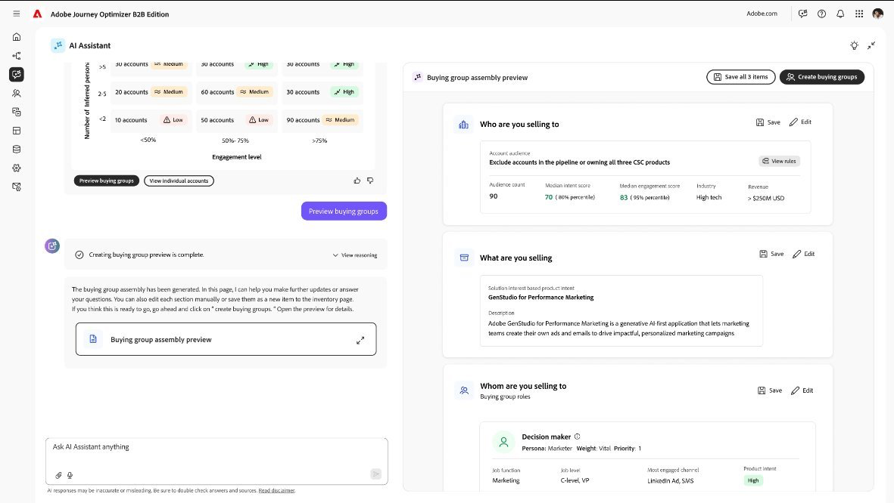

# Audience Agent B2B

Audience Agent B2B är tillgänglig i Journey Optimizer B2B edition med [Adobe Experience Platform Agent Orchestrator](https://experienceleague.adobe.com/sv/docs/experience-cloud-ai/experience-cloud-ai/agents/agent-orchestrator). Med denna agent blir det effektivare och effektivare att utforska och skala målgrupper, vilket snabbar upp framtagningen av inköpsgrupper och smidiga arbetsflöden för aktivering av kundresan:

* **_Prioritera målgrupper utifrån avsikt_** - Använd personifierade bilder baserat på produktavsikt för olika målgrupper och effektivisera kampanjplaneringen, minska den tid som läggs på målgruppsvalidering.

* **_Använd AI för att identifiera inköpsgrupper_** - Använd AI, strukturerade, ostrukturerade data och enhetliga förstahandsdata för att effektivisera identifiering och skapande av inköpsgrupper.

{width="700" zoomable="yes"}

## Audience Agent

| Område | Vad det gör | Affärsvärde |
| ---- | ------------ | -------------- |
| Intresseanalys | <li> Mät kontonametodens styrka (till exempel låg, medel och hög) för specifika produkter. <li>Jämför produktintressetrender över tid (t.ex. de viktigaste produkterna under de senaste _n_ dagarna). <li>Identifiera konton som aktivt visar intresse för specifika produkter. <li>Surface Engagement patterns som kombinerar kontoaktivitet med personlig täckning. | <li>Hjälper team att fokusera på rätt konton vid rätt tidpunkt. <li>Förbättrar kvaliteten på pipeline genom att prioritera konton med äkta inköpssignaler. <li>Möjliggör proaktivt engagemang innan konkurrenterna agerar. |
| Personmappning | <li>Identifiera och rangordna de främsta personerna efter produktmetod. <li>Identifiera personer som deltar i köp av en eller flera produkter. <li>Kartlägg roller för funktionella roller (Champion, Decision Maker, Influencer osv.) med motivering. <li>Validera varför en viss person anses vara segrare. | <li>Garanterar att försäljningen engagerar de verkliga beslutsfattarna och påverkarna. <li>Minskar slöseriet med kontakter som har liten effekt. <li>Ökar vinsterna genom att anpassa utåtkomsten till köpdynamiken. |
| Utvärdering av inköpsgrupp | <li>Utvärdera inköpsgruppens storlek (t.ex. grupper med fler än n medlemmar). <li>Mät personlig täckning mellan konton (t.ex. under x %). <li>Spåra skillnader i rolldistribution och täckning inom inköpsgrupper. <li>Markera konton med kampanjer som identifierats i de senaste avtalen. | <li>Visar luckor i täckningen som kan stoppa avtal. <li>Förstärk flertrådsstrategier genom att säkerställa en fullständig representation. <li>Förbättrar spårningen av avtal genom interaktionsinsikter på gruppnivå. |

## Exempel på fråga

De här promptexemplen visar några sätt att använda agenten:

* Visa trendfönstret: tidigast och senast uppdaterat för kontoproduktavsikt per produkt.
* För `<product>` anger du inköpsgrupper med produktavsikt och poäng.
* För `<product>` anger du personligheter och roller med deras affärsmöjlighetsstatistik (vinstfrekvens, medlemskapsnivå, antal).
* För konton i `<industry>`, vad är det genomsnittliga antalet kontoprofiler för `<product>`?
* Vilka konton har låg återgivning för någon produkt men har fortfarande öppna möjligheter (värd att vårda)?
* Vilka konton har lagt till nya intent-signaler för `<account_name>` den här veckan?
