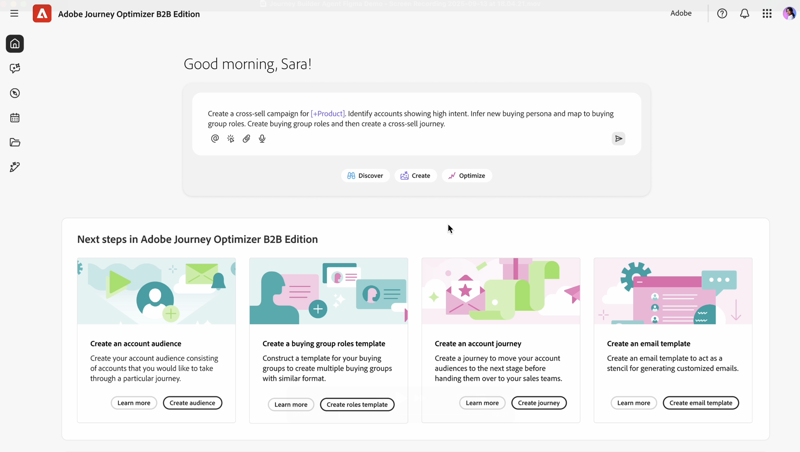

# Journey Agent B2B

Journey Agent B2B är en AI-baserad assistent i Adobe Journey Optimizer B2B edition som hjälper dig att designa, genomföra, optimera och övervaka B2B-resor via naturligt språk. Det minskar den tid och komplexitet som krävs för att skapa och hantera kundresor genom att kombinera automatisering, datadrivna rekommendationer och realtidskommunikation.

Journey Agent B2B har en uppsättning AI-kunskaper som var och en fokuserar på en annan aspekt av B2B-resans livscykel. Tillgängliga kunskaper är:

* **[Resebyggs kompetens](#journey-build-skill)** - Skapa, uppdatera och optimera resor från naturliga språkuppmaningar
* **[Färdighet för reseövervakning](#journey-observability-skill)** - Ställ frågor om hur konton och personer rör sig genom aktiva resor

## Resebyggarskicklighet

Färdigheterna hos Journey Build översätter era marknadsföringsmål, er engagemangsstrategi och nyckeltal till fullständiga kundresor inom B2B. Det tar upp tre viktiga utmaningar som B2B-marknadsförare står inför idag:

* Hantera allt mer komplexa kundresor (komplexitet vad gäller målgrupp, innehåll och meddelanden samt flerkanalsmarknadsföring)
* Ökad effektivitet i ljuset av hårdare budgetar
* Ta reda på hur den optimala kundresan ska struktureras

Som marknadsförare kan du använda den här kompetensen för att:

* **Skapa** - Översätt era marknadsföringsmål, produkter, engagemangsstrategier och nyckeltal till en personaliserad kundresa med automatisering och villkor
* **Rekommendera** - Utnyttja tidigare marknadsföringsengagemang och andra historiska data för att optimera skapandet av resan
* **Optimera** - Analysera, justera och optimera aktiva resor baserat på prognoser eller faktiska prestanda
* **Hantera** - Prioritera, hantera och ordna överlappande resor och meddelandeleverans

### Grundläggande användning

Om du vill använda Journey Agent Build-kompetensen skriver du in det du vill skapa i fönstret med det naturliga språket:

&quot;Skapa en B2B-resa för att bjuda in beslutsfattare till en utställning i engagerade konton som troligen öppnar nya kanaler.&quot;

Ju mer detaljerad information du kan ge, desto bättre blir svaret. Om du har befintligt marknadsföringsmaterial som beskriver händelsen, eller produkten osv., klistrar du in det i prompten så att agenten får en bättre uppfattning om målet.

&quot;Agera som B2B-resestrateg och skapa en kundkontoresa i flera steg som vårdar och engagerar beslutsfattare och marknadsföringspersonaler i den tidiga utforskningsfasen av `<Solution Name>`. Målet är att konvertera anonyma besökare till kända kontakter, fördjupa engagemanget med relevant innehåll på `<domain>`.com och få kvalificerade leads för `<Product Name>`-försäljning. Använd kanaler som e-post och betalda medier för att utnyttja befintliga målgruppssegment och befintligt innehåll. Strukturera resan över alla stadier av medvetenhet, bedömning och utvärdering under 4-6 veckor, med tydliga triggers, åtgärder och mål för varje steg. Inkludera nyckeltal som konverteringsgrader, engagemangsmusik och demonstrationsförfrågningar och returnera resultatet som ett strukturerat reseflöde.&quot;

Här följer en detaljerad beskrivning:

* **Rensa metod**: Vad vill du att AI ska göra? Var specifik när det gäller uppgiften eller resultatet.
* **Sammanhangsberoende**: Ange relevant bakgrund eller begränsningar. Inkludera exempel eller referenser om det är möjligt.
* **Strukturerat format**: Använd punkter, numrerade steg eller mallar.
* **Rolltilldelning**: Ange AI-rollen - Agera som dataanalytiker...

Använd agenten för att upprepa förfiningen: Börja enkelt och förfina sedan prompten baserat på resultatet. Feedback-slingor förbättrar resultaten över tid.

### Heltäckande B2B-reseskapande

Färdigheten hos Journey Build kan generera ett komplett reseflöde (konto- eller personresa) från textprompter och metadata i naturligt språk, via en konversationsupplevelse i stället för ett traditionellt användargränssnitt.

Exemplen på hela resan:

* Skapa en flerkanalsresa för att vårda konton som inte har engagerat mig i mitt innehåll de senaste 30 dagarna.
* Skapa en resa för korsförsäljning av en lösning till konton som visar hög återgivning utan någon öppen pipeline genom att tillhandahålla personaliserat innehåll för de viktigaste inköpsgruppsrollerna.
* Skapa en B2B-resa för att bjuda in beslutsfattare till en utställning i engagerade konton som troligtvis öppnar nya kanaler.
* Skapa en resa för konton med tomt utrymme med avsikt för min lösning, med fokus på personer som är engagerade med innehåll på webbplatsen.

### Flerstegsresor

Ni kan agera som B2B-designer för att skapa en kundkontoresa i flera faser som informerar beslutsfattare och marknadsförare redan i början av utforskandefasen.
Målet är att konvertera anonyma besökare till kända kontakter, fördjupa engagemanget med relevant innehåll och få kvalificerade leads för utåtriktad försäljning.

* Använd kanaler som `Email`, `Paid media`, `Personalized web experiences` för att utnyttja befintliga målgruppssegment och befintligt innehåll.
* Strukturera resan över `awareness`, `consideration` och `evaluation` steg över 4-6 veckor, med tydliga utlösare, åtgärder och mål för varje fas.
* Inkludera KPI:er, till exempel `conversion rates`, `engagement scores` och `demo requests`, och returnera utdata som ett strukturerat reseflöde.

## Färdighet i reseobservation

Med kompetensen för att observera resan kan ni ställa naturliga språkfrågor om hur konton och personer rör sig genom era B2B-resor - utan att behöva gräva igenom färdkartor, loggar eller instrumentpaneler. Det omfattar två huvudområden: resans utveckling och synlighet för datasynkronisering.

Du kan nå den på två platser i Journey Optimizer B2B edition:

* **Assistenten för höger järnväg på färdkartan** - Ställ resespecifika frågor direkt från färdkartan. Resans namn läggs automatiskt in i sitt sammanhang.

* **Helskärmsassistentsida** - En större konversationsvy som passar för komplexa frågor eller kontoöverskridande frågor och som utforskar flera resor.

### Reseinsikter på kontonivå

Följ upp hur ett visst konto flödade genom att ställa frågor som:

* &quot;Ge mig grundläggande information om ACME Industries.&quot;
* &quot;Berätta för mig hur kontot Northstar Services gick igenom ABM Nurture Strategy.&quot;
* &quot;När började Contoso LLC den här resan?&quot;

### Rankning och antal för delade noder

Förstå varför en gren togs och hur många personer eller konton som följde varje väg:

* &quot;Varför gick kontot QiDemoAccount24 till tekniksökvägen i USA:s lilla Kalifornien vid delad nod c764a9?&quot;
* &quot;Ge mig antalet personer för varje sökväg i delad nod-459c7c.&quot;
* &quot;Visa mig personer i San Jose-sökvägen för konto8.&quot;

Medarbetaren undersöker delningslogik, kontoattribut och aktiviteter för att förklara routningsbeslut och returnera antal per sökväg eller personlistor.

### Resultat av kundresan

Analysera enskilda resultat inom ett konto eller under en hel resa - särskilt användbart för att köpa in gruppanalys och spåra beslutsfattare jämfört med påverkarbeteende:

* &quot;Ge mig antal personer i varje sökväg för den här delade noden för Account123.&quot;
* &quot;Visa personer i den dolda hoppsökvägen.&quot;
* &quot;Visa mig personer i San Diegos platssökväg för det här kontot.&quot;

### Resans livscykel och timing

Hämta viktiga tidsstämplar för en resa eller specifika konton:

* &quot;När levde den här resan?&quot;
* &quot;När kom det första kontot in på den här resan?&quot;
* &quot;När startade QiDemoAccount50 den här resan?&quot;

### Extern målgrupp och aktiveringssynlighet

För resor som skickas till externa kanaler som LinkedIn kan du kontrollera aktiveringsstatus:

* &quot;Finns det bsmith@acme.com i den externa målgruppen?&quot;
* &quot;Lista alla personer som har aktiverats för LinkedIn via ObservabilityExtAudience01.&quot;

### Synkronisering av data och spårbarhet för pipeline

Observationsförmågan kan även visa hälsoinformation om datasynkronisering för att hjälpa till att felsöka varför ett konto eller lead inte har tagits med på en resa:

* Extern målgrupps exportjobbstatistik och status
* Scheman för gruppsegmentering och slutförandetider
* Schemaläggning av inköpsgruppunderhåll
* Jobbhanterarens status (slutförd/misslyckades)