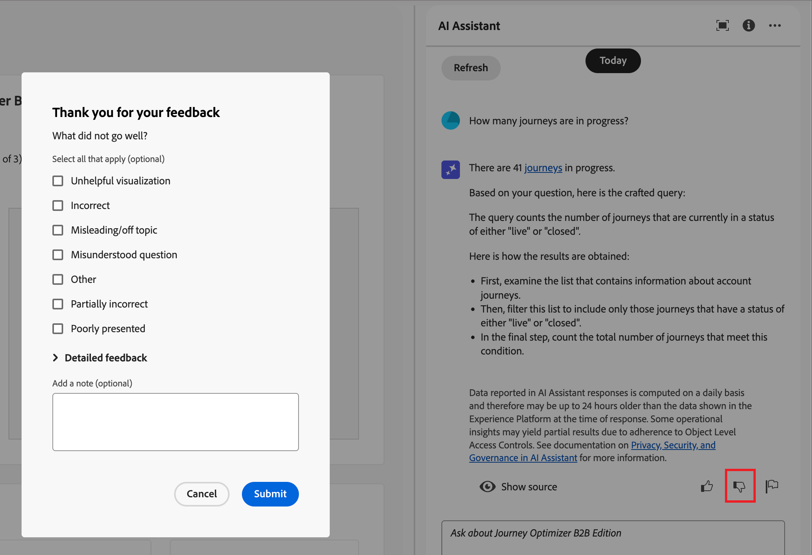

# Använd AI-assistenten i Journey Optimizer B2B edition

I Journey Optimizer B2B edition är AI Assistant en funktion i användargränssnittet som du kan använda för att förstå produktkoncept, snabbt navigera och lära dig mer om produktfunktionerna samt få driftsinsikter om din miljö. Det finns också i flera Adobe Experience Cloud-produkter.

>[!IMPORTANT]
>
>Du måste ha ett avtal för Adobe Experience Cloud Generative AI User Guidelines innan du kan använda AI Assistant. Mer information om det här avtalet och riktlinjer för användning finns i [Adobe Experience Cloud Generative AI User Guidelines](https://www.adobe.com/legal/licenses-terms/adobe-dx-gen-ai-user-guidelines.html).

Du öppnar AI Assistant genom att klicka på ikonen i sidhuvudet. AI-assistenten öppnas i en panel till höger.

{width="420"}

Gränssnittet för AI Assistant visas och du får information om hur du kommer igång direkt. Du kan använda alternativen under _Ideas för att komma igång_ för att svara på frågor och kommandon, som:

* Vilka resor publicerades?
* Vilka lösningsintressen skapades?
* Berätta om huvudfördelarna med Journey Optimizer B2B edition.

I Adobe Journey Optimizer B2B edition har AI Assistant stöd för följande användningsområden:

## Ställ frågor om produktkunskap

Produktkunskapsfrågor handlar om Journey Optimizer B2B edition koncept och instruktionsinformation. Några exempel på frågor om produktkunskap är:

* Hur konfigurerar jag SMS-leverantörskonton?
* Hur skickar jag ett e-postmeddelande under en resa?
* Hur kan jag personalisera mitt e-postinnehåll?

Om du vill ställa en produktfråga anger du den i fältet längst ned på panelen och trycker på Retur. Om du till exempel behöver lära dig hur du använder en inköpsgrupp på en resa. I det här fallet anger du _Hur använder jag en inköpsgrupp under en resa?_ När du har skickat frågan frågar AI Assistant efter sin kunskapsbas och sammanställer ett svar på några sekunder.

{width="420"}

+++Visa ett exempelsvar

{width="420"}

+++

## Ställ frågor om driftsinsikter

Frågor om driftsinsikter handlar om reseobjekten i organisationens sandlåda. Du kan ställa frågor om driftfelaktigheter, som kontomepublik, kontoresa, lösningsintresse och inköpsgruppmall. Några exempel på frågor eller frågor om driftsinsikter är:

* Hur många direktresor har jag i Adobe Journey Optimizer B2B edition?
* Ge mig en lista över alla schemalagda resor
* Hur många resor har skapats de senaste 7 dagarna?

Du måste vara i en aktiv sandlåda för att AI Assistant ska kunna svara tillräckligt på en fråga om dina operativa insikter.

>[!NOTE]
>
>De enda Adobe Journey Optimizer B2B edition-objekt som stöds av AI Assistant-frågor om driftsinsikter listas i domäntabellen [driftsinsikter](./ai-assistant-overview.md#operational-insights). Den kan bara komma åt data för den sandlåda som du för närvarande befinner dig i.

Om du vill ställa en fråga om användbara insikter anger du den i fältet längst ned på panelen och trycker på Retur. Om du till exempel vill veta mer om målgrupperna för din sandlåda. I det här fallet anger du _Hur många målgrupper finns det?_.  AI Assistant ger ett antal målgrupper i din sandlåda och en förklaring av hur svaret har beräknats. I följande exempelsvar tillhandahåller AI Assistant en länk för att få tillgång till målgrupperna i användargränssnittet och sammanfattar de åtgärder som vidtagits för att identifiera antalet målgrupper.

{width="420"}

Du kan följa din första fråga genom att be om en lista med artefakter, som _Visa de fem översta efter storlek_. AI Assistant returnerar en tabell med de fem främsta objekten i frågan och deras motsvarande ID:n. Klicka på ikonen _Hämta_ (  ) för att hämta tabellen som en CSV-fil.

{width="420"}

Om du vill visa hela tabellen i AI-assistenten klickar du på ikonen _Maximera_ (  ). I den utökade tabellvyn klickar du på **[!UICONTROL Download CSV]** för att spara informationen som en CSV-fil.

{width="600" zoomable="yes"}

## Verifiera svar

AI Assistant innehåller verktyg som du kan använda för att verifiera och validera svar.

### Kunskapskällor

När du har fått ett svar på en produktfråga väljer du **[!UICONTROL Show source]** om du vill visa de produktkunskapsbaserade källcitat som används för att generera AI Assistant-svaret.

AI Assistant tillhandahåller länkar till den dokumentation som bekräftar det inledande svaret. Dessutom läggs fotnoter till i svaret för att ange de specifika delar av svaret som refererar till de länkade dokumentationskällorna.

{width="420"}

### Källor till driftsinsikter

När du har fått ett svar på en fråga om driftsinsikter klickar du på **[!UICONTROL Show source]** och väljer sedan **[!UICONTROL View source query]**.

Du kan verifiera varje svar som rör frågor om driftsinsikter med hjälp av en SQL-fråga som AI Assistant tillhandahåller. När AI Assistant får en fråga om driftsinsikter kan du använda den för att verifiera processen som tog att beräkna svaret. Den här källfrågan är endast avsedd för verifiering och stöds inte av frågetjänsten.

{width="550" zoomable="yes"}

## Ge feedback

Använd ikonerna _Tumma upp_ (  ) eller _Tumma ned_ (  ) för att gradera svarets användbarhet och kvalitet. Fyll i det korta enkätformuläret enligt din erfarenhet och klicka på **[!UICONTROL Submit]**. Informationen du anger används för att förbättra AI Assistant.

Om du märker att något i svaret är problematiskt klickar du på ikonen _Flagga_ (  ). Använd formuläret för att beskriva problemet och klicka på **[!UICONTROL Submit]** för att rapportera problemet.

{width="420"}

+++Visa formulär

>[!BEGINTABS]

>[!TAB Tumma upp]

{width="600" zoomable="yes"}

>[!TAB Tumma ned]

{width="600" zoomable="yes"}

>[!TAB Flagga]

{width="600" zoomable="yes"}

>[!ENDTABS]

+++
