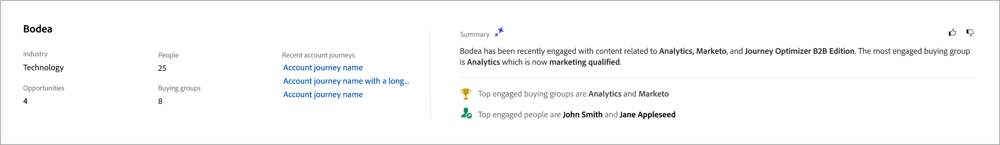
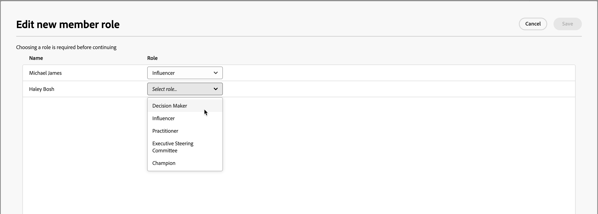

# Information om inköpsgrupp

När du klickar på ett köpgruppsnamn var som helst i Journey Optimizer B2B edition visas information om inköpsgruppen. Den här översikten innehåller användbar information om inköpsgruppen, inklusive generativa AI-sammanfattningar. Det finns också [åtgärder](#buying-group-actions) som du kan utföra för kontakter som är kopplade till kontot.

{width="800" zoomable="yes"}

Använd fliken **[!UICONTROL Overview]** om du vill granska information om kontot och fliken **[!UICONTROL Members]** om du vill visa en lista över medlemmarna i inköpsgruppen.

## Fliken Översikt

Fliken Översikt består av tre primära avsnitt:

### Sammanfattning av inköpsgrupper

{zoomable="yes"}

I avsnittet Sammanfattning av inköpsgrupper finns följande information om inköpsgrupper:

* Köpgruppens namn
* Kontonamn (klicka på namnet för att öppna [kontoinformationen](../accounts/account-details.md))
* Antal medlemmar i inköpsgruppen
* Engagement score
* Slutförandepoäng
* Aktuell inköpsgruppfas
* Rollmall (klicka på namnet för att öppna [rollmallen](buying-groups-role-templates.md#access-and-browse-role-templates))
* Senast ändrat/uppdaterat
* Generativ AI-sammanfattning för inköpsgruppen

### Kontoöversikt

{zoomable="yes"}

Avsnittet för kontoöversikt innehåller följande kontoinformation:

* Kontonamn (klicka på namnet för att öppna kontoinformationen)
* Antal personer i kontot
* Bransch
* Öppna affärsmöjligheter
* Senaste tre kontoresor där kontot används (klicka på namnet för att öppna information om resan)
* Generativ AI-sammanfattning för kontot

### Återgivningsdata

I Journey Optimizer B2B edition kan man med metoden Intent Detection förutsäga en lösning/produkt av intresse med tillräckligt stor tillförsikt utifrån hur man köper gruppmedlemmarnas aktivitet. Avsikten med att köpa gruppmedlemmar kan tolkas som sannolikheten att ha intresse för en produkt.

{{intent-data-note}}

{width="700" zoomable="yes"}

* Avsiktsnivåer
* Typer av avsiktssignal - Nyckelord, produkt och lösning

### Köpa gruppmedlemmar

{width="800" zoomable="yes"}

Avsnittet _[!UICONTROL Buying group members]_visar två rader som markerar medlemmar i inköpsgruppen:

* **[!UICONTROL Decision maker]** - De tre viktigaste beslutsfattarna baserat på personengagemangspoäng
* **[!UICONTROL Top engaged members]** - Andra toppengagerade medlemmar baserat på personengagemangspoäng

Varje medlemskort innehåller följande information:

* Namn
* Titel
* Roll
* Ledningsnivå för engagemang

Klicka på **[!UICONTROL View details]** för att komma åt följande medlemsinformation:

* Generativ AI-sammanfattning
* Senaste intressanta stund
* De senaste aktiviteterna (två)
* Andra inköpsgrupper där leadet är medlem (begränsat till tre inköpsgrupper baserat på den senast tillagda).
* E-postadress
* Telefonnummer

{width="600" zoomable="yes"}

## Fliken Medlemmar

Välj fliken **[!UICONTROL Members]** om du vill visa en lista över alla köpgruppsmedlemmar. Varje medlemslista innehåller namn, roll, befattning, e-postadress, telefonnummer och källa.

{width="700" zoomable="yes"}

Det finns flera åtgärder som du kan utföra från fliken _Medlemmar_:

### Tilldela en ny medlem

Ett konto kan ha en eller flera inköpsgrupper kopplade till sig, och köpgruppsmedlemmar är vanligtvis en deluppsättning av kontakter från kontot. Du kan lägga till alla kontakter från det associerade kontot manuellt till inköpsgruppen.

1. Klicka på **[!UICONTROL Assign new member]** överst till höger.

1. I dialogrutan _[!UICONTROL Assign member]_väljer du det konto som du vill lägga till i inköpsgruppen och klickar på&#x200B;**[!UICONTROL Next]**.

   {width="700" zoomable="yes"}

1. I dialogrutan _[!UICONTROL Edit new member role]_väljer du den roll som ska tilldelas var och en av de nya medlemmarna.

   {width="700" zoomable="yes"}

1. Klicka på **[!UICONTROL Save]**.

### Ta bort en medlem

Du kan ta bort en eller flera valda medlemmar (upp till 50 i taget) från inköpsgruppen.

1. Markera kryssrutorna för de medlemmar som du vill ta bort.

1. Klicka på **[!UICONTROL Remove members]** i markeringsfältet längst ned.

   {width="700" zoomable="yes"}

1. Klicka på **[!UICONTROL Remove]** i bekräftelsedialogrutan.

### Redigera roll

Du kan ändra roll för en eller flera valda medlemmar (upp till 50 i taget) i inköpsgruppen.

1. Markera kryssrutorna för de medlemmar som du vill ändra roller för.

1. Klicka på **[!UICONTROL Edit roles]** i markeringsfältet längst ned.

   {width="700" zoomable="yes"}

1. I dialogrutan _[!UICONTROL Edit member role]_väljer du den roll som ska tilldelas var och en av medlemmarna.

   {width="700" zoomable="yes"}

1. Klicka på **[!UICONTROL Save]**.

### Skicka e-post

Du kan skicka ett marknadsföringsgodkänt e-postmeddelande till en eller flera utvalda medlemmar (upp till 50 i taget) i en inköpsgrupp. Listan över tillgängliga e-postmeddelanden är begränsad till godkända e-postmeddelanden från den anslutna Marketo Engage-instansen.

1. Markera kryssrutorna för de medlemmar som du vill ska få e-postmeddelandet.

1. Klicka på **[!UICONTROL Send email]** längst upp till höger eller i markeringsfältet längst ned.

   {width="700" zoomable="yes"}

1. I dialogrutan _[!UICONTROL Send email]_markerar du arbetsytan i Marketo Engage och markerar sedan kryssrutan för det e-postmeddelande som du vill skicka.

   {width="700" zoomable="yes"}

1. Klicka på **[!UICONTROL Send]**.
