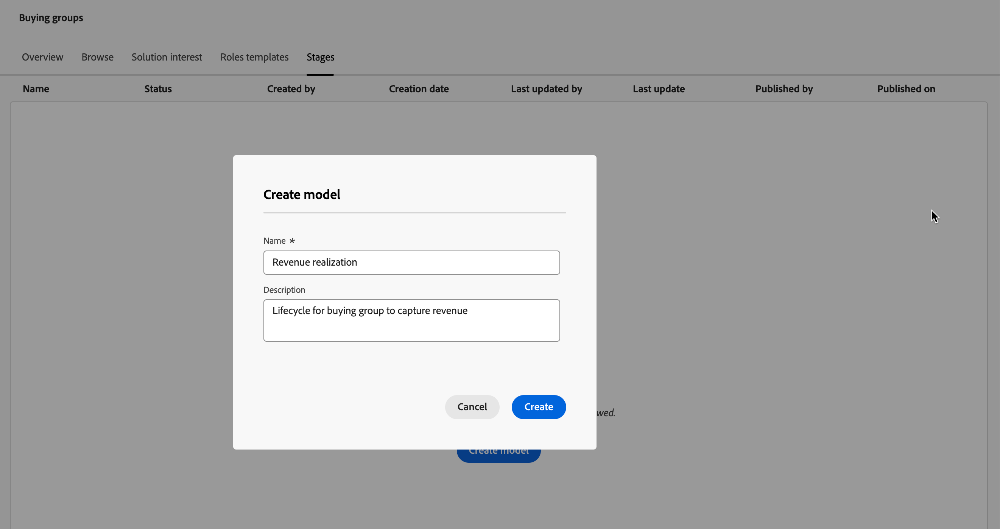
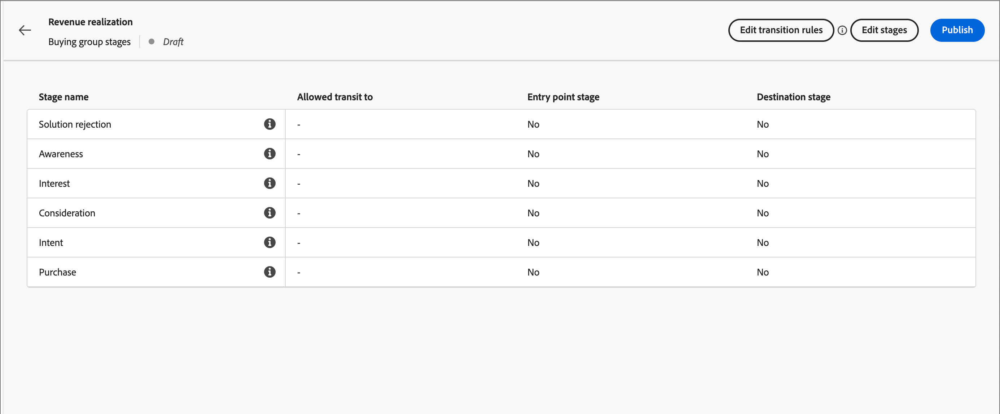
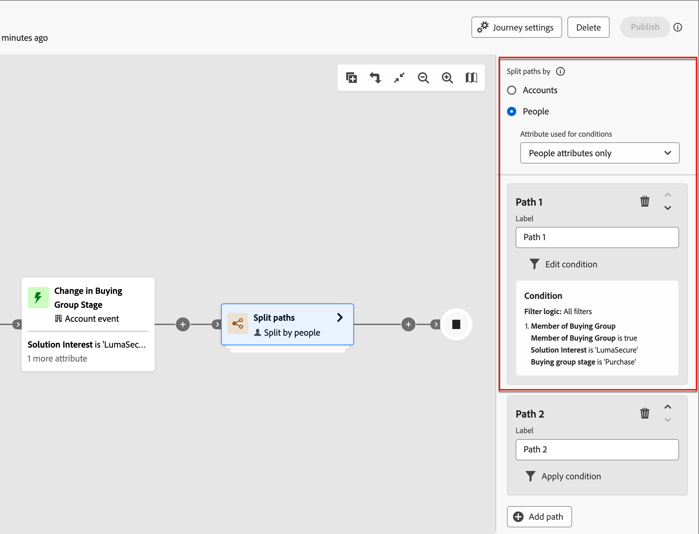

# Köpgruppsfaser

De olika inköpsgruppfaserna är utformade för att följa hur köpgrupperna utvecklas genom att konvertera möjligheter till kunder. Använd den här funktionen för att spåra köpgruppsutvecklingen och identifiera nästa bästa åtgärd för medlemmar i inköpsgrupper.

Definiera faserna i en enda mellanlagringsmodell, definiera flera steg och övergångsflödet mellan dem. En eller flera stadier är avsedda att ingå i livscykeln. Modellen tillåter även icke-linjär progression, där du kan ange övergångar från en scen till en annan, till exempel från fas A till fas B, C eller D. Det krävs att en fas utses till lyckad fas, t.ex. ett inköp eller ett signerat kontrakt. Det är valfritt att ange en annan fas som en misslyckad fas, t.ex. ett avvisat kontrakt eller köp av en konkurrerande lösning från en annan leverantör. Övervaka de här stegen via [intelligenta instrumentpaneler](../dashboards/intelligent-dashboard.md) som visar hur köpgrupper utvecklas när det gäller att slutföra en säljmöjlighet eller konvertera en affärsmöjlighet till en kund.

{width="800" zoomable="yes"}

{width="30"} [Se videoöversikten](#overview-video)

## Definiera din inköpsgruppsmodell

Du skapar och konfigurerar en inköpsgruppfasmodell genom att:

* Lägga till livscykelfaser
* Definiera övergångsflöden
* Ange införsel- och destinationsfaser

Det finns bara stöd för en modell, så det är viktigt att du arbetar i alla marknadsförings- och säljteam för att planera den optimala modellen för din organisation innan du skapar och publicerar den i Journey Optimizer B2B edition.<!-- Initially, only one stage model can be created, but future releases will support multiple stage models, allowing users to select which model to use in a journey. -->

När du skapar en inköpsgruppsscenmodell får den automatiskt statusen _Utkast_ och kan inte tas bort eller namnändras. Den behåller den här statusen när du definierar faserna och konfigurerar övergångsflödet mellan faserna. När modellen har publicerats (_Live_) kan den inte ändras.

### Skapa modellen

1. Gå till **[!UICONTROL Accounts]** > **[!UICONTROL Buying Groups]** i den vänstra navigeringen.

1. Välj fliken **[!UICONTROL Stages]** på sidan Köpgrupper.

   {width="800" zoomable="yes"}

   Fliken _[!UICONTROL Stages]_&#x200B;är i läget_ tom _tills du skapar modellen.

1. Klicka på **[!UICONTROL Create model]** mitt på sidan.

1. Ange **[!UICONTROL Name]** (obligatoriskt) och **[!UICONTROL Description]** (valfritt) för modellen i dialogrutan.

   {width="700" zoomable="yes"}

   Om du klickar på _[!UICONTROL Cancel]_&#x200B;i den här dialogrutan återgår du till fliken&#x200B;_[!UICONTROL Stages]_ i läget _tom_.

1. Klicka på **[!UICONTROL Create]**.

### Definiera faserna

När du har skapat modellen öppnas den på arbetsytan och du uppmanas att skapa faserna för modellen.

1. Klicka på **[!UICONTROL Edit stages]**.

   {width="700" zoomable="yes"}

1. Definiera den första fasen genom att ange **[!UICONTROL Name]** (obligatoriskt) och **[!UICONTROL Description]** (valfritt).

   {width="700" zoomable="yes"}

   Stegen behöver inte läggas till i en viss ordning, men det avgör hur de listas på sidan med modellinformation. Du anger startfasen och flödet mellan faserna när du definierar övergångsreglerna.

1. Klicka på **[!UICONTROL Add stage]** och upprepa steg 2 för att definiera en annan fas.

   Upprepa det här steget tills du har de faser som behövs för modellen.

   {width="700" zoomable="yes"}

1. När du är nöjd med de stadier som du har definierat klickar du på **[!UICONTROL Save]**.

   >[!IMPORTANT]
   >
   >**När inköpsgruppsfaserna har sparats kan de inte tas bort.** Du kan dock ändra namn och beskrivning för alla faser så länge modellen inte har statusen _Utkast_.

### Konfigurera arbetsflödes- och övergångsregler

När du har sparat faserna återgår de till modellarbetsytan. Kolumnen _[!UICONTROL Allowed transit to]_&#x200B;är tom, vilket anger att övergångsreglerna för modellfaserna ännu inte har definierats.

{width="700" zoomable="yes"}

Övergångsreglerna bestämmer hur en inköpsgrupp kan flyttas från en fas till en annan. Den kan till exempel flyttas från en startfas till en mellanstadiefas och från en mellanstadiefas till olika andra stadier. En tävlingsfas är en inledande fas som en inköpsgrupp kan gå in från ett tomt läge och målfaserna klassificeras som lyckade eller misslyckade.

1. Klicka på **[!UICONTROL Edit transition rules]** överst till höger.

   Den här åtgärden öppnar dialogrutan _[!UICONTROL Edit stage rules]_&#x200B;där du definierar logiken för flödet.

   När du anger alternativen finns det några inbyggda skyddsräcken och meddelanden som hjälper dig att undvika logiska fel i flödet. Du kan klicka på _[!UICONTROL Cancel]_&#x200B;om du vill stänga dialogrutan och återgå till fliksidan&#x200B;_[!UICONTROL Stages]_ utan ändringar.

1. I avsnittet _[!UICONTROL Select stage]_&#x200B;anger du start- och slutfaser för flödet:

   * **[!UICONTROL Entry point stage]** (obligatoriskt) - Ange en eller flera anmälningsfaser för inköpsgruppens affärsmöjlighet.

   * **[!UICONTROL Success stage]** (obligatoriskt) - Ange det stadium som anger att köpgruppsaffärsmöjligheten har lyckats (mål).

   * **[!UICONTROL Failure stage]** (valfritt) - Ange ett eller flera steg som anger att köpgruppsaffärsmöjligheten har nått en felpunkt (mål).

   {width="700" zoomable="yes"}

1. För varje icke-målstadium definierar du ett eller flera steg som kommer efter i flödet (övergång).

   Alla icke-målstadier måste ha minst en **[!UICONTROL Allowed transit to]**-fas markerad. Annars är modelllogiken inte giltig och konton kan få _fastna_ i det stadiet utan möjlighet att framskrida till ett lyckat eller misslyckat resultat.

   {width="700" zoomable="yes"}

   Du kan också ange en övergång från en felfas. Du kan till exempel ange att scenen _Inget svar_ ska vara en felfas. Men ange också en scen med namnet _Resursens_ som en möjlig övergång för att identifiera fall där ett vilande konto återaktiveras.

1. Klicka på **[!UICONTROL Save]**.

   När du återgår till sidan med modellinformation visas stegen i en tabell med de tillåtna övergångarna samt mål- och postegenskaperna.

| Kolumn | Beskrivning |
| ------ | ---------- |
| **[!UICONTROL Stage name]** | Scenens namn. Klicka på informationsikonen för att visa beskrivningen för scenen. |
| **[!UICONTROL Allowed transit to]** | Visar de stadier som är giltiga för en _move to_-åtgärd i modellen. |
| **[!UICONTROL Entry point stage]** | Anger om scenen är giltig som en startpunkt ([!UICONTROL Yes] eller [!UICONTROL No]). |
| **[!UICONTROL Destination]** | Anger om scenen har angetts som målscen ([!UICONTROL Success] eller [!UICONTROL Failure]). |

{width="700" zoomable="yes"}

## Redigera en utkastmodell

Så länge som inköpsgruppens fasmodell är i ett _utkastläge_ kan du redigera faserna och övergångsreglerna.

_Om du vill visa utkastmodellen :_

1. Gå till **[!UICONTROL Accounts]** > **[!UICONTROL Buying Groups]** i den vänstra navigeringen.

1. Välj fliken _på sidan_ Köpgrupper **[!UICONTROL Stages]**.

1. Klicka på modellnamnet för att öppna modellinformationen.

### Ändra faserna i modellen

1. Klicka på **[!UICONTROL Edit stages]**.

   I dialogrutan _[!UICONTROL Edit stages]_&#x200B;kan du lägga till nya faser eller ändra namn och beskrivning för befintliga faser.

   * Ändra **[!UICONTROL Name]** eller **[!UICONTROL Description]** för alla scener efter behov.

   * Rulla längst ned och klicka på **[!UICONTROL Add stage]** för att definiera en ny fas för modellen om det behövs.

1. När du är nöjd med de stadier som du har definierat klickar du på **[!UICONTROL Save]**.

   Du kan också klicka på _[!UICONTROL Cancel]_&#x200B;för att stänga dialogrutan och återgå till sidan med modellinformation utan ändringar.

### Redigera övergångsreglerna för modellen

1. Klicka på **[!UICONTROL Edit transition rules]**.

1. Ändra flödesalternativen efter behov i dialogrutan _Redigera scenregler_.

   Mer information om de här alternativen och hur de påverkar modellflödet finns i [Konfigurera arbetsflödes- och övergångsreglerna](#configure-the-workflow-and-transition-rules).

1. När du är nöjd med övergångsreglerna som har definierats klickar du på **[!UICONTROL Save]**.

   Du kan också klicka på _[!UICONTROL Cancel]_&#x200B;för att stänga dialogrutan och återgå till sidan med modellinformation utan ändringar.

## Publicera inköpsgruppens fasmodell

Om det inte finns några valideringsfel kan modellen publiceras. När den publiceras ändras den till ett _Live_ -tillstånd och kan användas för att fördriva inköpsgruppfaser på kontoresor.

>[!IMPORTANT]
>
>**När modellen har publicerats kan den inte uppdateras eller tas bort.** Kontrollera att det du har är korrekt innan du publicerar modellen.

1. Granska de definierade faserna och övergångarna noggrant.

   Redigera modellfaserna om det behövs ändringar.

1. Klicka på **[!UICONTROL Publish]**.

1. Klicka på **[!UICONTROL Publish]** i bekräftelsedialogrutan.

   När modellen återgår till sidan med modellinformation anges den som _[!UICONTROL Live]_. Klicka på pilen_ Bakåt _längst upp till vänster för att återgå till fliksidan&#x200B;_[!UICONTROL Stages]_.

{width="700" zoomable="yes"}
<!-- list these later when the Published columns are working correctly

Columns - Name, Status, Created by, Created date, Last updated by, Last update, Published by, Published on.
Name - Name of the stage model, hyperlinked. Clicking on it will navigate to the stage inventory page. 
Info icon beside the name - display the description on click.
Status - Live, Draft. If a draft stage model is Published, then its status is updated to Live. -->

## Ta bort inköpsgruppfasmodellen

Du kan ta bort inköpsgruppens fasmodell när den är i ett utkast eller publicerat tillstånd. Om den publiceras (live) kan du bara ta bort den när den inte är kopplad till ett lösningsintresse.

1. Gå till **[!UICONTROL Accounts]** > **[!UICONTROL Buying Groups]** i den vänstra navigeringen.

1. Välj fliken _på sidan_ Köpgrupper **[!UICONTROL Stages]**.

1. Klicka på menyikonen _Mer_ (**..**) bredvid namnet på scenmodellen och välj **[!UICONTROL Delete]**.

   {width="700"}

1. Bekräfta genom att klicka på **[!UICONTROL Delete]** i dialogrutan.

## Använd modellen i kontoresor

När inköpsfasmodellen har statusen _Live_ (publicerad) lägger du till modellen i lösningsintressena där du vill använda den för att spåra köpgruppens förlopp. På kontoresorna kan du inkludera åtgärder för att övergå till ett visst stadium och lägga till scenövergångar som händelser som bestämmer hur kontona rör sig genom resan.

### Intresseorganisation för lösning

För varje befintligt lösningsintresse där du vill koppla inköpsgruppsmodellen öppnar du informationen om lösningsintresset och lägger till modellen. Du kan också lägga till modellen i egenskaperna när du [skapar ett lösningsintresse](./solution-interests.md#create-a-solution-interest).

1. Klicka på fliken _[!UICONTROL Solution interest]_.  

1. Öppna lösningsintresset med någon av följande metoder för att öppna egenskaperna för det lösningsintresse som du vill redigera:

   * Klicka på lösningsintressenamnet.
   * Klicka på ellipsen (**..**) bredvid den och välj **[!UICONTROL Edit]**.

   {width="500" zoomable="no"}

1. Välj **[!UICONTROL Buying group stage model]** om du vill använda förloppet för inköpsgruppfasen (valfritt).

   {width="700" zoomable="yes"}

1. Ändra inställningen för **[!UICONTROL Update existing buying groups]** om det behövs.

   När det här alternativet är aktiverat uppdateras alla befintliga inköpsgrupper i kombination med lösningsräntan via 24-timmars synkroniseringscykeln.

1. Klicka på **[!UICONTROL Save]**.

### Dela banor

Med en [delad sökvägsnod](../journeys/journey-nodes.md#split-paths) kan du filtrera på kontonivå eller personnivå utifrån inköpsgruppfaser. Du kan till exempel lägga till en inköpsgruppfas som ett sökvägsvillkor när du delar upp banor genom att köpa en gruppmedlem.

>[!BEGINTABS]

>[!TAB Kontonivå]

1. Öppna kontoresan i redigeraren.

1. Klicka på plusikonen ( **+** ) på en bana och välj **[!UICONTROL Split paths]**.

   {width="300"}

1. I nodegenskaperna till höger väljer du **[!UICONTROL Accounts]** för delningen.

1. Om du vill definiera ett villkor som gäller för _[!UICONTROL Path 1]_&#x200B;klickar du på&#x200B;**[!UICONTROL Apply condition]**.

   {width="500"}

1. Lägg till inköpsgruppsfiltret i villkorsredigeraren för att definiera den delade sökvägen.

   * Utöka **[!UICONTROL Special filters]** längst ned till vänster och dra attributet **[!UICONTROL Has Buying Group]** till filterarbetsytan.

   * Ange **[!UICONTROL Solution Interest]** till en som är associerad med inköpsgruppens fasmodell.

   * Klicka på **[!UICONTROL Add constraint]** och välj **[!UICONTROL Buying group stage]**.

     {width="700" zoomable="yes"}

   * Klicka på **[!UICONTROL Done]**.

   Delningssökvägen definieras i nodegenskaperna till höger.

   {width="600" zoomable="yes"}

1. Fortsätt att definiera andra sökvägar för den delade noden och spara resan.

>[!TAB Personnivå]

1. Öppna kontoresan i redigeraren.

1. Klicka på plusikonen ( **+** ) på en bana och välj **[!UICONTROL Split paths]**.

   {width="300"}

1. I nodegenskaperna till höger väljer du **[!UICONTROL People]** för delningen.

   Lämna standardvärdet för _[!UICONTROL Attribute used for conditions]_&#x200B;som **[!UICONTROL People attributes only]**.

1. Om du vill definiera ett villkor som gäller för _[!UICONTROL Path 1]_&#x200B;klickar du på&#x200B;**[!UICONTROL Apply condition]**.

   {width="500"}

1. Lägg till inköpsgruppsfiltret i villkorsredigeraren för att definiera den delade sökvägen.

   * Utöka **[!UICONTROL Special filters]** längst ned till vänster och dra attributet **[!UICONTROL Member of Buying Group]** till filterarbetsytan.

   * Ange **[!UICONTROL Solution Interest]** till en som är associerad med inköpsgruppens fasmodell.

   * Klicka på **[!UICONTROL Add constraint]** och välj **[!UICONTROL Buying group stage]**.

     {width="700" zoomable="yes"}

   * Klicka på **[!UICONTROL Done]**.

   Delningssökvägen definieras i nodegenskaperna till höger.

   {width="600" zoomable="yes"}

1. Fortsätt att definiera andra sökvägar för den delade noden och spara resan.

>[!ENDTABS]

### Uppdatera kontoåtgärd för inköpsgruppsfas

Med en [kontoåtgärdsnod](../journeys/journey-nodes.md#add-an-account-action) kan du uppdatera inköpsgruppfasen. När du definierar den här noden måste du välja lösningsintresse och definiera den nya fasen för inköpsgruppen.

>[!NOTE]
>
>Om den nya fasen inte är en giltig övergång (enligt definitionen i modellen), används inte åtgärden för kontot.

1. Öppna kontoresan i redigeraren.

1. Klicka på plusikonen ( **+** ) på en bana och välj **[!UICONTROL Take an action]**.

   {width="400"}

1. Välj **[!UICONTROL Accounts]** för åtgärden i nodegenskaperna till höger.

1. Definiera åtgärden för att uppdatera inköpsgruppfasen.

   * För **[!UICONTROL Action on accounts]** väljer du **[!UICONTROL Update Buying Group Stage]**.

   * För **[!UICONTROL Select solution interest]** väljer du en som är associerad med inköpsgruppens fasmodell.

   * För **[!UICONTROL New stage]** väljer du den scen som kontot ska övergå till.

   Åtgärden definieras i nodegenskaperna till höger.

   {width="600" zoomable="yes"}

1. Fortsätt att göra andra ändringar och spara resan.

### Kontohändelse

Använd förekomsten av en ändring av inköpsgruppfas för att flytta kontot framåt till nästa steg i resan. När du definierar den här noden måste du välja lösningens intresse och ytterligare begränsningar för att tillgodose händelseutlösaren.

1. Öppna kontoresan i redigeraren.

1. Klicka på plusikonen ( **+** ) på en bana och välj **[!UICONTROL Listen for an event]**.

   {width="400"}

1. Välj **[!UICONTROL Accounts]** som händelsetyp i nodegenskaperna till höger.

1. Välj **[!UICONTROL Select accounts event]** för **[!UICONTROL Change in Buying Group Stage]**.

1. Klicka på **[!UICONTROL Edit event]** och definiera information för händelsen.

   * För **[!UICONTROL Solution Interest]** matchar du villkoret för ett lösningsintresse som är associerat med inköpsgruppens fasmodell.

   * Klicka på **[!UICONTROL Add constraint]** och välj den ändring av inköpsgruppfasen som du vill använda för att utlösa händelsen.

     {width="700" zoomable="yes"}

   * Klicka på **[!UICONTROL Done]**.

   Händelsen definieras i nodegenskaperna till höger.

   {width="700" zoomable="yes"}

1. Fortsätt att göra andra ändringar och spara resan.

## Videoöversikt

>[!VIDEO](https://video.tv.adobe.com/v/3448698/?learn=on&captions=swe)
