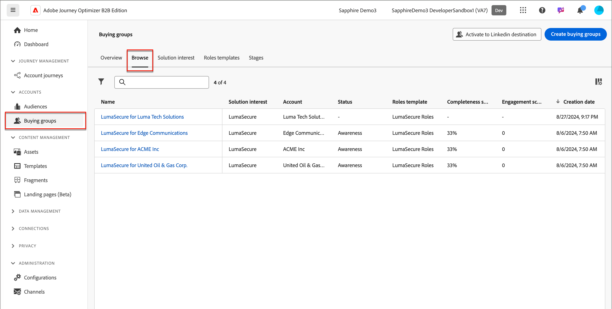

# Skapa inköpsgrupper

När inköpsgruppen har skapats är den tillgänglig för användning i en kontoresa via [lösningsintresset](./solution-interests.md).

1. Klicka på **[!UICONTROL Buying groups]** i den vänstra navigeringen.

1. Klicka på **[!UICONTROL Create buying groups]** längst upp till höger på sidan _[!UICONTROL Buying groups]_.

   {width="700" zoomable="yes"}

1. Följ instruktionerna på varje sida och klicka på **[!UICONTROL Next]** för att fortsätta.

{width="30"} [Se videon ](#how-to-video)

## Vägledningssida

Den första sidan ger vägledning om de förutsättningar/komponenter som krävs för att skapa inköpsgrupper. Om du vet att du har de nödvändiga komponenterna på plats klickar du på **[!UICONTROL Next]**.

## Komponenter

1. Markera varje komponent som du vill använda:

   * **[!UICONTROL Solution interest]** - Välj lösningsintresse i listan.

   * **[!UICONTROL Account audience]** - Klicka på # och välj en målgrupp i listan.

   Under _[!UICONTROL Properties]_&#x200B;genereras namnet på inköpsgrupperna automatiskt (skrivskyddat) som &lt; Solution Interest name > för &lt; account name >.

   {width="700" zoomable="yes"}

1. När du har valt lösningsintresse och målgrupp klickar du på **[!UICONTROL Create]**.

## Bekräftelse

Bekräftelsedialogrutan innehåller en sammanfattning av inköpsgruppsprocessen och en beräknad sluttid. Klicka på **[!UICONTROL Create]** om du vill bekräfta och starta processen.

{width="400" zoomable="yes"}

Du kan navigera användaren till fliken Lösningens intresse och visa antalet jobb som skapats för lösningsintresset.

{width="700" zoomable="yes"}

<!-- Other buying group activities:

Member of buying group.
Assign a member of the buying group.
Remove a member of the buying group. -->

## Instruktionsvideo

>[!VIDEO](https://video.tv.adobe.com/v/3451765/?learn=on&captions=swe)
