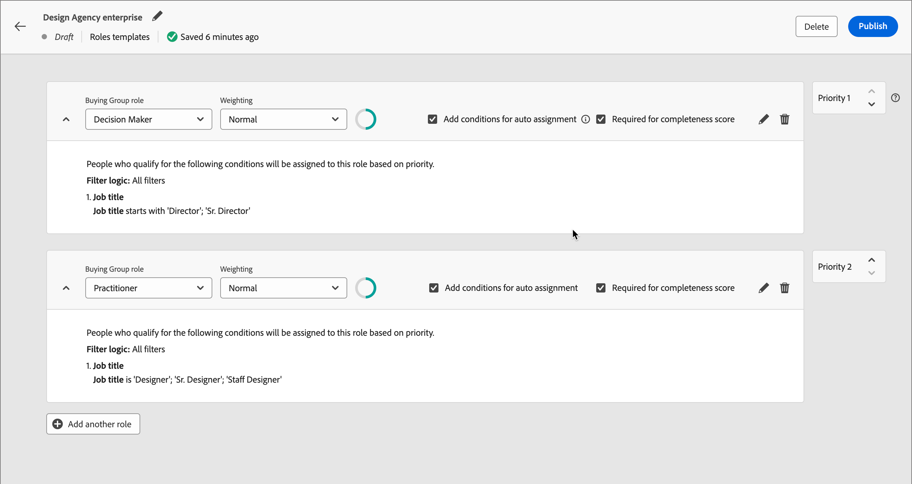
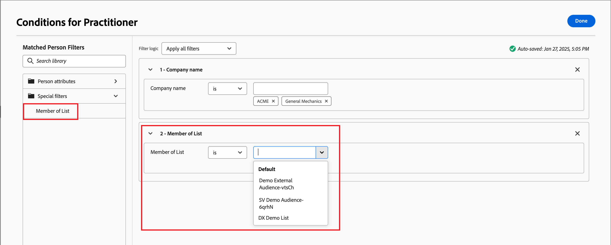

# Köpa grupprollsmallar

På en B2B-marknad är det oftast flera individer som fattar inköpsbeslut. Dessa personer deltar i beslutsprocessen i enlighet med deras roll i organisationen. Skapa mallar för inköpsgruppsroller som innehåller en grupp rolldefinitioner utifrån varje produkterbjudandetyp eller kontoanvändningsfall.

{width="30"} [Se översiktsvideon](#overview-video)

## Få åtkomst till och bläddra bland rollmallar

1. Klicka på **[!UICONTROL Buying groups]** i den vänstra navigeringen.

1. Välj fliken _[!UICONTROL Buying groups]_&#x200B;på sidan **[!UICONTROL Roles Templates]**.

   {width="800" zoomable="yes"}

   På fliken finns en inventeringslista över alla befintliga rollmallar och följande information visas i kolumnformat:

   * [!UICONTROL Name]
   * [!UICONTROL Status]
   * [!UICONTROL Creation date]
   * [!UICONTROL Created by]
   * [!UICONTROL Last update]
   * [!UICONTROL Last updated by]
   * [!UICONTROL Published on]
   * [!UICONTROL Published by]

   Listan sorteras som standard av _[!UICONTROL Last update]_. Alla rollmallar har statusen `Draft` eller `Live`.

1. Om du vill filtrera listan efter namn använder du sökfältet högst upp i listan.

   Ange de första tecknen i namnet för att begränsa den visade listan till matchande objekt.

   {width="700" zoomable="yes"}

## Skapa en rollmall

1. Klicka på _[!UICONTROL Roles Templates]_&#x200B;i det övre högra hörnet på fliken **[!UICONTROL Create template]**.

1. Ange ett unikt **[!UICONTROL Name]** (obligatoriskt) och **[!UICONTROL Description]** (valfritt) för mallen i dialogrutan.

   {width="400"}

1. Klicka på **[!UICONTROL Create]**.

### Lägg till mallroller

När du har skapat mallen öppnas den på arbetsytan och du uppmanas att lägga till rollerna. Det första rollkortet visas som standard.

Varje roll som du definierar för mallen använder en uppsättning filter, eller _villkor_, för att avgöra vilka medlemmar som tilldelats rollen. Använd följande filtertyper för att definiera villkoren för en roll:

| Typ | Villkor |
| ---- | --------- |
| Personattribut | <li>E-postadress <li>Ogiltig e-postadress <li>E-postmeddelandet har pausats <li>Faxnummer <li>Förnamn <li>Ingångsregion <li>Befattning <li>Efternamn <li>Mellannamn <li>Mobiltelefonnummer <li>Personengagemangspoäng <li>Telefonnummer <li>Postnummer <li>Stat <li>Avprenumererad <li>Orsak till avbeställning |
| Specialfilter | <li>Listmedlem <li>Medlem i program |
| Återgivningsdata | Kategoriåtergivning <li>Produktåtergivning <li>Nyckelordsmetod [Lär dig mer om återgivningsdata](../admin/intent-data.md). |

1. Ange rollegenskaperna för det första rollkortet.

   * Välj **[!UICONTROL Buying group role]** i listan.

     Det finns sex standardroller: `Decision Maker`, `Influencer`, `Practitioner`, `Executive Steering Committee`, `Champion` och `Other`. Listan innehåller även alla [anpassade roller som har definierats i listan _Roller_](./default-custom-roles.md#custom-roles).

     {width="700" zoomable="yes"}

   * Ange **[!UICONTROL Weighting]** för rollen, som används för att beräkna engagemangspoängen.

     Värdet för varje alternativ översätts till en procentandel för poängberäkningen: [!UICONTROL Trivial] = 20, [!UICONTROL Minor] = 40, [!UICONTROL Normal] = 60, [!UICONTROL Important] = 80 och [!UICONTROL Vital] = 100.

     En rollmall med roller som använder Vital, Viktigt och Normal konverteras sedan till 100/240, 80/240, 60/240.

   * **[!UICONTROL Add conditions for auto-assignment]** - Markera den här kryssrutan om du vill lägga till villkor för automatisk tilldelning av medlemmar till inköpsgruppen som matchar villkoret. Om kryssrutan inte är markerad är det INTE nödvändigt att lägga till villkor.

   * **[!UICONTROL Required for completeness score]** - Markera den här kryssrutan för rollen om du vill att den ska vara ett krav för att beräkna ett slutresultat.

1. Klicka på **[!UICONTROL Add Condition]** och definiera den villkorliga regeln för rollen.

   * Expandera listan med _[!UICONTROL Condition]_&#x200B;i dialogrutan **[!UICONTROL Person attributes]**&#x200B;och leta upp ett attribut som du vill använda för att matcha rollen. Dra den åt höger och släpp den i filterområdet.

     {width="700" zoomable="yes"}

     >[!NOTE]
     >
     >Om du har definierat anpassade personfält i kontots målgruppsschema i Experience Platform är dessa fält även tillgängliga som personattribut under villkor.

   * Använd attributet för att skapa ett matchande filter med ett eller flera värden.

     I följande exempel används attributet Job title för att identifiera en matchning för Decision Maker. Alla värden för rubrik som börjar med `Director` eller `Sr Director` utvärderas som sanna för villkoret.

     {width="700" zoomable="yes"}

   * Om det behövs lägger du till ett annat attribut och villkor som ytterligare förfinar villkoren för en matchning till rollen.

   * Klicka på **[!UICONTROL Done]**.

1. För varje ytterligare roll som du vill ta med för mallen klickar du på **[!UICONTROL Add another role]** och upprepar steg 1 och 2 för att definiera rollen.

   {width="700" zoomable="yes"}

>[!BEGINSHADEBOX &quot;Marketo Engage listmedlemskap&quot;]

I Marketo Engage kontrollerar _smarta kampanjer_ medlemskap i program för att se till att leads inte får dubbla e-postmeddelanden och inte är medlemmar i flera e-postströmmar samtidigt. I Journey Optimizer B2B kan du kontrollera om Marketo Engage listmedlemskap är ett villkor för din rollmall för att undvika dubbelarbete vid köp av gruppmedlemskap och reseaktiviteter.

Om du vill använda listmedlemskap som rollvillkor expanderar du **[!UICONTROL Special Filters]** och drar villkoret **[!UICONTROL Member of List]** till filterområdet. Fyll sedan i filterdefinitionen för att utvärdera medlemskapet i en eller flera Marketo Engage-listor.

{width="700" zoomable="yes"}

>[!ENDSHADEBOX]

Dina ändringar sparas automatiskt i statusen _Utkast_. Om du inte är redo att publicera rollmallen klickar du på den vänstra (bakåtriktade) pilen längst upp på sidan och återgår till listan _[!UICONTROL Roles templates]_.

### Ändra inställningar för slutförandepoäng

Som standard definieras fullständighet för en roll som en medlem som tilldelats rollen. När du vill använda slutförande av inköpsgrupp som en indikator på försäljningsberedskap eller slutförande <!-- journey decisioning coming later--> kan du använda de här inställningarna för att justera poängen med det antal medlemmar per roll som krävs för att stänga en affärsmöjlighet.

Om du till exempel avslutar ett avtal för din lösning _X_ måste flera beslutsfattare inom marknadsföring identifieras och engageras eftersom flera marknadsföringsteam i en organisation skulle använda lösningen. I det här fallet vill du öka tröskelvärdet för att beräkna en _fullständig_-inköpsgrupp genom att kräva minst två beslutsfattare inom marknadsföring.

Se [Resultat för fullständighet](./completeness-scores.md) för detaljerad information om poängsättning och beräkningar för fullständighet.

1. Klicka på **[!UICONTROL Completeness score settings]** längst upp till höger på rollmallsidan.

   {width="700" zoomable="yes"}

1. I dialogrutan ändrar du värdet **[!UICONTROL Members required]** för varje definierad roll efter behov.

   Du kan ange värdet eller klicka på **&plus;** eller **-** för att öka eller minska värdet.

   {width="450"}

1. Klicka på **[!UICONTROL Save]**.

### Publicera rollmallen

Om mallen är klar att användas klickar du på **[!UICONTROL Publish]** längst upp till höger.

När du publicerar mallen anges statusen till _Live_ och den blir tillgänglig för association med ett lösningsintresse. Det måste finnas minst en definierad roll för att kunna publicera rollmallen.

## Redigera en mall för utkastroller

När en rollmall är i läget _Utkast_ kan du fortsätta redigera de definierade rollerna. Alla ändringar du gör sparas automatiskt.

Ändra inställningarna i rollkortets huvud, inklusive inköpsgruppsroll, viktning, automatisk tilldelning och krav på fullständighetsbedömning.

{width="600"}

### Ändra villkoren för en roll

Om du vill ändra villkor/filtreringslogik för någon av rollerna klickar du på ikonen _Redigera_ (  ) längst upp till höger på rollkortet. Den här åtgärden öppnar arbetsytan _[!UICONTROL Conditions]_&#x200B;där du kan ändra ett befintligt filter, lägga till eller ta bort ett filter eller ändra filterlogiken.

### Ta bort ett rollkort

Om du vill ta bort en roll från mallen klickar du på ikonen _Ta bort_ (  ) på rollkortet.

### Ange prioritet för roller

Du kan ändra ordningen på rollerna i mallen, vilket avgör prioriteten för tilldelning av leads till en roll. En **[!UICONTROL Priority]**-kontrollenhet visas till höger om varje rollkort. Klicka på pilen _Upp_ eller _Ned_ till höger om du vill flytta rollkortet uppåt eller nedåt i prioritetsordning.

{width="700"}

## Ta bort en rollmall

Du kan ta bort en rollmall om den har statusen _Utkast_.

1. Välj rollmallen i listan för att öppna den.

1. Klicka på **[!UICONTROL Delete]** överst till höger.

   {width="700"}

1. Bekräfta genom att klicka på **[!UICONTROL Delete]** i dialogrutan.

## Videoöversikt

>[!VIDEO](https://video.tv.adobe.com/v/3433079/?learn=on)
