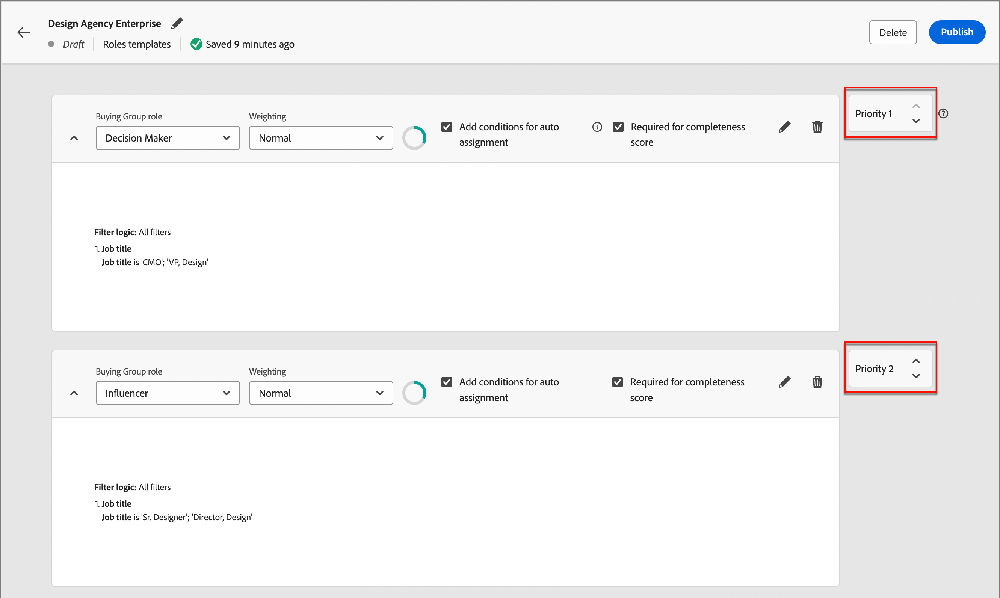

# Köpa grupprollsmallar

På en B2B-marknad är det oftast flera individer som fattar inköpsbeslut. Dessa personer deltar i beslutsprocessen i enlighet med deras roll i organisationen. Skapa mallar för inköpsgruppsroller som innehåller dessa rolldefinitioner beroende på varje produkterbjudandetyp eller användningsfall för konto.

## Få åtkomst till och bläddra bland rollmallar

1. Klicka på Adobe Journey Optimizer B2B Edition på startsidan för Adobe Experience Platform.

1. Klicka på **[!UICONTROL Buying groups]** i den vänstra navigeringen.

1. Välj fliken **[!UICONTROL Roles Templates]** på sidan _[!UICONTROL Buying groups]_.

   {width="700" zoomable="yes"}

   Fliken innehåller en inventeringslista över alla befintliga rollmallar med följande kolumner:

   * [!UICONTROL Name]
   * [!UICONTROL Status]
   * [!UICONTROL Creation date]
   * [!UICONTROL Created by]
   * [!UICONTROL Last update]
   * [!UICONTROL Last updated by]
   * [!UICONTROL Published on]
   * [!UICONTROL Published by]

   Listan sorteras som standard efter kolumnen _[!UICONTROL Last update]_.

   Antalet _aktiva_ (publicerade) rollmallar visas längst upp till höger på sidan. Alla rollmallar har statusen `Draft` eller `Live`.

1. Om du vill filtrera listan efter namn använder du sökfältet högst upp i listan.

   Ange de första tecknen i namnet för att begränsa den visade listan till matchande objekt.

   {width="700" zoomable="yes"}

## Skapa en rollmall

1. Klicka på **[!UICONTROL Create template]** i det övre högra hörnet på fliken _[!UICONTROL Roles Templates]_.

1. Ange ett unikt **[!UICONTROL Name]** (obligatoriskt) och **[!UICONTROL Description]** (valfritt) för mallen i dialogrutan.

   {width="400"}

1. Lägg till en regel för varje roll som du vill definiera för mallen.

   * Välj **[!UICONTROL Buying group role]** i listan.

     För den aktuella versionen finns det sex roller: `Decision Maker`, `Influencer`, `Practitioner`, `Executive Steering Committee`, `Champion` och `Other`.

     {width="700" zoomable="yes"}

   * Ange **[!UICONTROL Weighting]** för rollen, som används för att beräkna engagemangspoängen.

     Värdet för varje alternativ översätts till en procentandel för poängberäkningen: [!UICONTROL Trivial] = 20, [!UICONTROL Minor] = 40, [!UICONTROL Normal] = 60, [!UICONTROL Important] = 80 och [!UICONTROL Vital] = 100.

     En rollmall med roller som använder Vital, Viktigt och Normal konverteras sedan till 100/240, 80/240, 60/240.

   * **[!UICONTROL Add conditions for auto-assignment]** - Markera den här kryssrutan om du vill lägga till villkor för automatisk tilldelning av medlemmar till inköpsgruppen som matchar villkoret. Om kryssrutan inte är markerad är det INTE nödvändigt att lägga till villkor.

   * **[!UICONTROL Required for completeness score]** - Markera den här kryssrutan för rollen om du vill att den ska vara ett krav för att beräkna ett slutresultat. —>

   * Klicka på **[!UICONTROL Add Condition]**.

      * Expandera listan med **[!UICONTROL Person attributes]** i villkorsdialogrutan och leta upp ett attribut som du vill använda för att matcha rollen. Dra den åt höger och släpp den i filterområdet.

        {width="700" zoomable="yes"}

      * Använd attributet för att skapa ett matchande filter med ett eller flera värden.

        I följande exempel används attributet Job title för att identifiera en matchning för Decision Maker. Alla värden för rubrik som börjar med `Director` eller `Sr Director` utvärderas som sanna för villkoret.

        {width="700" zoomable="yes"}

      * Om det behövs lägger du till ett annat attribut och villkor som ytterligare förfinar villkoren för en matchning till rollen.

      * Klicka på **[!UICONTROL Done]**.

   För varje ytterligare roll som du vill ta med för mallen klickar du på **[!UICONTROL Add another role]** och definierar ett eller flera villkor som matchar rollen.

   {width="700" zoomable="yes"}

1. Om mallen är klar att användas klickar du på **[!UICONTROL Publish]** längst upp till höger.

   När du publicerar mallen anges den som _Live_ -status och den blir tillgänglig för att associeras med ett lösningsintresse. Det måste finnas minst en definierad roll för att kunna publicera rollmallen.

   Dina ändringar sparas automatiskt i statusen _Utkast_. Om du inte är redo att publicera rollmallen klickar du på den vänstra (bakåtpilen) längst upp på sidan och återgår till listan Rollmallar.

## Redigera en mall för utkastroller

När en rollmall är i läget _Utkast_ kan du fortsätta redigera de definierade rollerna. Alla ändringar du gör sparas automatiskt.

Ändra inställningarna i rollkortets huvud, inklusive inköpsgruppsroll, viktning, automatisk tilldelning och krav på fullständighetsbedömning.

{width="600"}

### Ändra filter för en roll

Om du vill ändra filtreringslogiken för någon av rollerna klickar du på ikonen _Redigera_ (penna) längst upp till höger på rollkortet. Den här åtgärden öppnar arbetsytan _[!UICONTROL Conditions]_där du kan ändra ett befintligt filter, lägga till ett annat filter, ta bort ett filter eller ändra filterlogiken.

### Ta bort ett rollkort

Om du vill ta bort en roll från mallen klickar du på ikonen _Ta bort_ (kontrollpanelen) på rollkortet.

### Ange prioritet för roller

Du kan ändra ordningen på rollerna i mallen, vilket avgör prioriteten för tilldelning av leads till en roll. En **[!UICONTROL Priority]**-kontrollenhet visas till höger om varje rollkort. Klicka på pilen _Upp_ eller _Ned_ till höger om du vill flytta rollkortet uppåt eller nedåt i prioritetsordning.

{width="700"}

## Ta bort en rollmall

Du kan ta bort en rollmall om den har statusen _Utkast_.

1. Välj rollmallen i listan för att öppna den.

1. Klicka på **[!UICONTROL Delete]** överst till höger.

   {width="700"}

1. Bekräfta genom att klicka på **[!UICONTROL Delete]** i dialogrutan.
