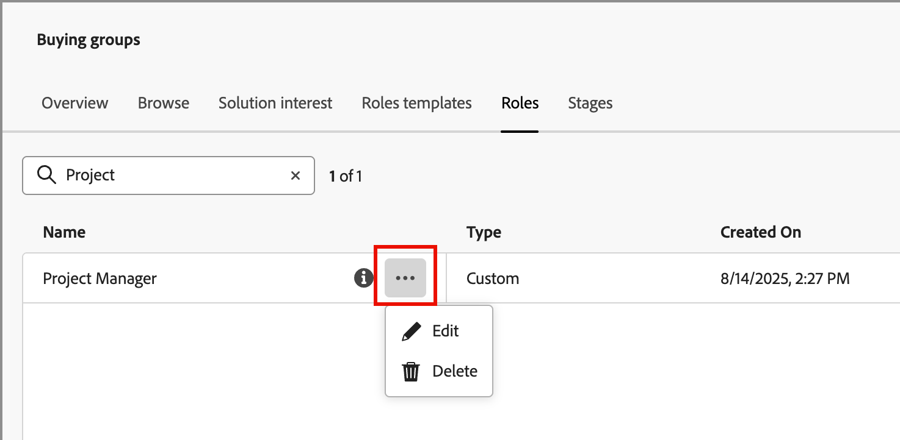

# Standardroller och anpassade roller

Journey Optimizer B2B edition innehåller en uppsättning standardroller som används i rollmallar för inköpsgrupper. Men många organisationer kräver anpassade roller som de kan definiera utifrån sina affärsmål och strategier. Du kan använda listan _[!UICONTROL Roles]_&#x200B;för att skapa egna rolldefinitioner som stöder dina inköpsgrupper.

## Åtkomstroller

1. Klicka på **[!UICONTROL Buying groups]** i den vänstra navigeringen.

1. Välj fliken _[!UICONTROL Buying groups]_&#x200B;på sidan **[!UICONTROL Roles]**.

   {width="700" zoomable="yes"}

   På fliken finns en inventeringslista över alla befintliga roller och följande information visas i kolumnformat:

   * [!UICONTROL Name] - Rollnamnet.
   * [!UICONTROL Type] - Alla roller har typen `Default` eller `Custom`.
   * [!UICONTROL Created on] - För en anpassad roll, datumet och tiden då rollen skapades.
   * [!UICONTROL Created by] - För en anpassad roll är det användaren som skapade rollen.
   * [!UICONTROL Last updated on] - För en anpassad roll, datum och tid då rollen senast uppdaterades.
   * [!UICONTROL Updated by] - För en anpassad roll är det användaren som senast uppdaterade rollen.

   I listan visas standardrollerna högst upp:

   * Beslutsfattare
   * Påverkande
   * Yrkesverksamma
   * Verkställande kommitté
   * Champion
   * Övrigt

   >[!NOTE]
   >
   >Du kan inte ändra eller ta bort standardrollerna. Det finns en maxgräns på 20 roller, inklusive standardroller och anpassade roller.

## Skapa en anpassad roll

1. Klicka på _[!UICONTROL Roles]_&#x200B;i det övre högra hörnet på fliken **[!UICONTROL Create Role]**.

1. Ange en unik **[!UICONTROL Name]** (obligatoriskt) och **[!UICONTROL Description]** (valfritt) för rollen i dialogrutan.

   {width="400"}

1. Klicka på **[!UICONTROL Create]**.

## Hantera anpassade roller

Du kan hantera dina anpassade roller på fliken _[!UICONTROL Roles]_, där du bland annat redigerar rollnamnet och beskrivningen och tar bort en roll från rolllistan. Klicka på menyikonen_ Mer _(**..**) bredvid namnet på scenmodellen och välj **[!UICONTROL Edit]**&#x200B;eller **[!UICONTROL Delete]**.

{width="600"}
