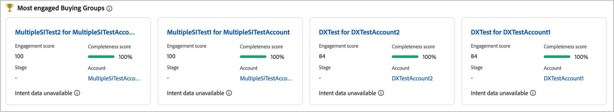
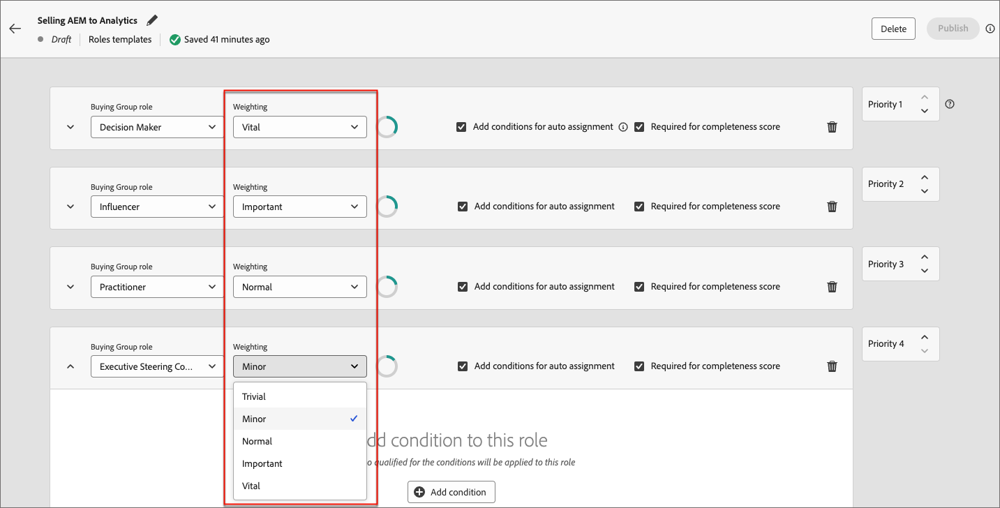

# Engagemangsmoment {#engagement-scores}

>[!CONTEXTUALHELP]
>id="ajo-b2b_buying_group_engagement_score"
>title="Engagement score"
>abstract="Inköpsmusik avgör nivån på engagemanget för att köpa gruppmedlemmar."

Ett poängtal är ett tal som anger engagemangsnivån för medlemmarna i en inköpsgrupp. Poängen baseras på inköpsgruppens medlemsaktiviteter, viktade åtgärder och viktade roller. Resultatpoängen normaliseras inom en klientorganisation (instans) för att möjliggöra en konsekvent jämförelse och möjliggöra åtgärdbara insikter. Beräkningen av poäng börjar så snart du skapar inköpsgruppen. Journey Optimizer B2B edition datahubb beräknar poängen dagligen och överför dem till MySQL-systemet (Multi-Level Marketing, MLM) med hjälp av ingetjänsten.

Det finns två typer av engagemangspoäng:

* **Buying group engagement score** - Poängen för köpgruppsengagemang är en normaliserad poäng mellan 0 och 100 och baseras på engagemangspoängen som beräknas på personnivå.

  Poängen för köpgruppsengagemang visas på sidan [Information om inköpsgrupp](./buying-group-details.md). Du kan även se de mest engagerade inköpsgrupperna på den intelligenta kontrollpanelen.

  {width="700" zoomable="yes"}

* **Personengagemangspoäng** - Personinteraktionspoängen baseras på aktiviteter för en enskild inköpsgruppsmedlem.

  Personinteraktionspoängen för varje köpgruppsmedlem visas på sidan med information om inköpsgrupper [_[!UICONTROL Members]_&#x200B;på fliken ](./buying-group-details.md#buying-group-members). Dessa bakgrundsmusik visas även på sidor och på kontrollpaneler som innehåller information om toppengagerade medlemmar och överlappande kontakter.

  {width="550" zoomable="yes"}

>[!BEGINSHADEBOX]

Personinteraktionspoängen är ett attribut som är tillgängligt för filtrering i [rollmallar](./buying-groups-role-templates.md#add-the-template-roles) och [kundresan, platt-path-by-people-noder](../journeys/split-merge-paths-nodes.md#people-path-conditions).

{width="550" zoomable="yes"}

>[!ENDSHADEBOX]

Alla interaktionsviktade aktiviteter som utförts av medlemmarna i inköpsgruppen under de senaste 30 dagarna används för att beräkna poängen. I 30-dagarsfönstret förfaller aktivitetsförekomster och poängen kan förminskas (bakgrundsmusik). Visade bakgrundsmusik rundas av (till exempel visas poängen 75,89999 som 76).

## Aktiviteter som används för poängsättning av engagemang

Det går inte att köpa grupppoäng _som utlösts av_. Det är en daglig process som utvärderar aktiviteten för alla medlemmar i köpgruppen och beräknar om poängen. Aktiviteter använder _vikter_ för att informera om poängsättning för inköpsgrupper enligt den aktiva viktningsmodellen, som bestämmer hur varje aktivitet viktas.

Det finns ett dagligt frekvenstak på 20 för varje aktivitet. Om en medlem i en inköpsgrupp utför samma aktivitet mer än 20 gånger under en och samma dag, begränsas antalet för aktiviteten till 20.

| Aktivitetsnamn | Beskrivning | Typ av åtagande | Maximalt antal dagliga frekvenser | Standardaktivitetsvikt för modell |
|---------------|-------------|-----------------|---------------------------|-------------------------------|
| Delta händelse | En medlem deltog i en händelse | Händelse | 20 | 60 |
| E-post klickad | En medlem klickar på en länk i ett e-postmeddelande | E-post | 20 | 30 |
| E-post öppnad | En medlem öppnar ett mejl | E-post | 20 | 30 |
| Formulär ifyllt | En medlem fyller i och skickar ett formulär på en webbsida | Webb | 20 | 40 |
| Intressant stund | En medlem har en intressant stund | Kuraterad | 20 | 60 |
| Länkklickningar | En medlem klickar på en länk på en webbsida | Webb | 20 | 40 |
| Sidvyer | En medlem visar en webbsida | Webb | 20 | 40 |
| Registrera dig för event | En medlem registrerad för en händelse | Händelse | 20 | 60 |

<!-- old list

| Activity name | Description | Engagement type | Max daily frequency count | Activity weight |
| --- | --- | --- | --- | --- |
| [!UICONTROL Visit Webpage]| A member visits a web page | Web | 20 | 40 |
| [!UICONTROL Fill Out Form]| A member fills and submits a form on a web page | Web | 20 | 40 |
| [!UICONTROL Click Link] | A member clicks a link on a web page | Web | 20 | 40 |
| [!UICONTROL Open Email] | A member opens an email | Email | 20 | 30 |
| [!UICONTROL Click Email] | A member clicks a link in an email | Email | 20 | 30 |
| [!UICONTROL Open Sales Email] | A member opens a sales email | Email | 20 | 30 |
| [!UICONTROL Click Sales Email] | A member clicks a link in a sales email | Email | 20 | 30 |
| [!UICONTROL Interesting Moment] | A member has an interesting moment | Curated | 20 | 60 |
| [!UICONTROL Tap Push Notification] | A member receives a push notification | Mobile | 20 | 30 |
| [!UICONTROL Mobile App Activity] | A member performs an activity on a mobile app | Mobile | 20 | 30 |
| [!UICONTROL Mobile App Session] | A member is active on a mobile app session | Mobile | 20 | 30 |
| [!UICONTROL Fill Out Facebook Lead Ads Form] | A member fills and submits a Lead Ads form on a Facebook page | Social | 20 | 30 |
| [!UICONTROL Click RTP Call to Action] | A member clicks a personalized call to action | Web | 20 | 60 |
| [!UICONTROL View In-App Message] | A member views an in-app message | Mobile | 20 | 30 |
| [!UICONTROL Tap In-App Message] | A member taps an in-app message | Mobile | 20 | 30 |
| [!UICONTROL Subscribe SMS] | A member subscribes to SMS communications | SMS | 20 | 90 |
| [!UICONTROL Reply to Sales Email] | A member replies to a sales email | Email | 20 | 30 |
| [!UICONTROL Engaged with a Dialogue] | A member engages with a Dynamic Chat dialogue | Chat | 20 | 90 |
| [!UICONTROL Interacted with Document in Dialogue] | A member interacts with a document in a Dynamic Chat dialogue | Chat | 20 | 90 |
| [!UICONTROL Scheduled Meeting in Dialogue] | A member schedules an appointment in a Dynamic Chat dialogue | Chat | 20 | 90 |
| [!UICONTROL Reached Dialogue Goal] | A member reaches a goal in a Dynamic Chat dialogue |  |20 | 90 |
| [!UICONTROL Responded to a poll in webinar] | A member responds to a poll in a webinar event | Chat | 20 | 90 |
| [!UICONTROL Call to action clicked in webinar] | A member clicks a call-to-action link in a webinar event | Call | 20 | 30 |
| [!UICONTROL Asset downloads in webinar] | A member downloads a file/asset in a webinar event | Event | 20 | 60 |
| [!UICONTROL Asks questions in webinar] | A member asks questions in a webinar event | Event | 20 | 60 |
| [!UICONTROL Has attended event] | A member attended an event | Event | 20 | 60 |
| [!UICONTROL Engaged with an Agent in Dialogue] | A member engages with an agent in a Dynamic Chat dialogue | Chat | 20 | 90 |
| [!UICONTROL Clicked Link in Chat in Dialogue] | A member clicks a link in a Dynamic Chat dialogue | Chat | 20 | 90 |
| [!UICONTROL Engaged with a Conversational Flow] | A member engages with a Dynamic Chat conversational flow | Chat | 20 | 90 |
| [!UICONTROL Scheduled Meeting in Conversational Flow] | A member schedules an appointment in a Dynamic Chat conversational flow | Chat | 20 | 90 |
| [!UICONTROL Reached Conversational Flow Goal] | A member reaches a goal in a Dynamic Chat conversational flow | Chat | 20 | 90 |
| [!UICONTROL Interacted with Document in Conversational Flow] | A member interacts with a document in a Dynamic Chat conversational flow | Chat | 20 | 90 |
| [!UICONTROL Engaged with an Agent in Conversational Flow] | A member engages with an Agent in a Dynamic Chat conversational flow | Chat | 20 | 90 |
| [!UICONTROL Clicked Link in Chat in Conversational Flow] | A member clicks a link in a Dynamic Chat conversational flow | Chat | 20 | 90 |
| [!UICONTROL Click Link in SMS V2] | A member clicks a link in an SMS message | SMS | 20 | 90 | -->

>[!NOTE]
>
>Aktiviteter för engagemangsmusik registreras i Marketo Engage aktivitetslogg för en person. Du kommer åt den här loggen i den anslutna Marketo Engage-instansen. Mer information finns i [Leta reda på aktivitetsloggen för en person](https://experienceleague.adobe.com/en/docs/marketo/using/product-docs/core-marketo-concepts/smart-lists-and-static-lists/managing-people-in-smart-lists/locate-the-activity-log-for-a-person){target="_blank"} i Marketo Engage-dokumentationen.

## Viktning av rollmall {#engagement-score-weighting}

>[!CONTEXTUALHELP]
>id="ajo-b2b_buying_group_engagement_score_weighting"
>title="Rollvikt för engagemangspoäng"
>abstract="Använd rollviktning för att anpassa beräkningen av engagemangspoäng."

Användare kan tilldela _viktning_ till varje roll i [rollmallen](./buying-groups-role-templates.md) för att tilldela olika vikter för en roll.

{width="700" zoomable="yes"}

Varje viktningsnivå motsvarar ett värde som används för att beräkna engagemangspoängen:

* [!UICONTROL Trivial] = 20
* [!UICONTROL Minor] = 40
* [!UICONTROL Normal] = 60
* [!UICONTROL Important] = 80
* [!UICONTROL Vital] = 100

En rollmall med tre roller viktade som _[!UICONTROL Vital]_,_[!UICONTROL Important]_ och _[!UICONTROL Normal]_&#x200B;konverteras till följande viktade procentandelar:

| Roll | Viktning | Systemvärde | Värdeberäkning | Procent |
|-------------- |--------- |------------- |------------------ |---------- |
|               |          |              |                   |           |
| Beslutsfattare | Vital | 100 | 100/240 | 41,67 % |
| Påverkande | Viktigt | 80 | 80/240 | 33,33 % |
| Yrkesverksamma | Normal | 60 | 60/240 | 25 % |
|               | Totalt | 240 |                   |           |

## Exempel på beräkning av poäng

I följande exempel visas beräkningen av poängen för engagemang. Det använder den angivna rollviktprocenten, antalet inkommande aktiviteter för varje köpgruppsmedlem och ett dagligt tak på 20 för varje händelseförekomst.

| Roll | medlem | Typ av aktivitet | Gårdagens antal | Antal i dag | Beräkning | Totalt antal poäng |
|-------------- |--------- |-------------|-----------------|-------------|------|-----------|
|               |          |             |                 |             |      |           |
| Beslutsfattare | Adam | Besökt webbplats | 37 | 15 | 20 + 15 | 35 |
|               |          | E-post som klickats | 1 | 1 | 1 + 1 | 2 |
|               |          |             |                 |             |      |           |
|               | Märk | Besökt webbplats | 5 | 3 | 5 + 3 | 8 |
|               |          | E-post som klickats | 1 | 1 | 1 + 1 | 2 |
|               |          | Nedladdad pub | 3 | 2 | 3 + 2 | 5 |
| **Totalpoäng för beslutsfattare** |         |             |                 |             |      | **52** |
|               |          |             |                 |             |      |           |
| Påverkande | John | Besökt webbplats | 19 | 9 | 19 + 9 | 28 |
| **Påverkar totalpoäng** |         |             |                 |             |      | **28** |
|               |          |             |                 |             |      |           |
| Yrkesverksamma | Bob | E-post som klickats | 1 | 1 | 1 + 1 | 2 |
|               |          |             |                 |             |      |           |
|               | Paul | E-post som klickats | 1 | 1 | 1 + 1 | 2 |
|               |          |             |                 |             |      |           |
|               | Calvin | E-post som klickats | 1 | 1 | 1 + 1 | 2 |
|               |          | Besökt webbplats | 1 | 7 | 1 + 7 | 8 |
|               |          | Nedladdad pub | 1 | 2 | 1 + 2 | 3 |
| **Totalt antal praktikanter** |         |             |                 |             |      | **17** |

Det slutliga poängtalet för engagemang beräknas genom att viktningen tillämpas för varje rollpoäng:

| Roll | Rolltotalpoäng | Rollvikt i % | Poäng X vikt % |
|-------------- |---------------- |------------- |---------------- |
| Beslutsfattare | 52 | 41,67 % | 21,67 |
| Påverkande | 28 | 33,33 % | 9,33 |
| Yrkesverksamma | 17 | 25 % | 4,25 |
| **Slutgiltigt engagemangsmoment** |                |             | **35.25** |

## Poänglogik

Förutom beräkningslogiken som beskrivs i beräkningsexemplet finns det en avsevärt komplex normalisering av poängen som inträffar i systemet, för alla personer, inköpsgrupper och konton i instansen. Poängen för köpgruppsengagemang är beroende av personinteraktionspoängen enligt följande ordnade logik:

### Beräkningslogik för personengagemangspoäng

1. Identifiera alla _engagemangsviktade_ aktivitetstyper som har en associerad vikt och daglig kvot, till exempel webbplatsbesök, e-postklick och webbinarier.

1. Identifiera alla _engagemangsviktade_-åtgärder som utförs i aktivitetsfönstret, som för närvarande är hårdkodat till 30 dagar.

1. Normalisera aktivitetstypsvikterna för alla _engagemangsviktade_ aktivitetstypsvikter som identifieras i steg 1, och ignorera de som inte fanns i summeringsfönstret.

   Det här steget utnyttjar _Min-Max-normalisering_ och minskar den artificiella utspädningen av aktivitetstypsvikten avsevärt för en klientorganisation som inte utnyttjar de flesta av dem.

1. Använd daglig kvotfiltrering per person och aktivitetstyp.

   Detta steg minskar förekomsten av mycket stora avvikelser genom att man undviker aktiviteter med lägre värde/stora volymer som skevar poängen.

1. Beräkna poängen för engagemang för råa-person genom att summera den dagliga aktiviteten per aktivitetstyp, multiplicera den med den associerade vikten och sedan summera resultaten för alla dagar i summeringsfönstret.

1. Använd en _Power Transformation_ (Square Root)-omformning för att stabilisera variansen genom att minska eventuella avvikelser.

   Den här omvandlingen hjälper till att minska skevheten och göra mönster i data mer linjära.

1. Använd ytterligare en omformning av _Skalad normalisering_ för att säkerställa att poängen utnyttjar hela intervallet från 0 till 100.

### Beräkningslogik för gruppengagemang

1. Använd en normaliserad vikt för varje inköpsgruppmedlem efter roll, enligt den vikt som konfigurerats i rollmallen.

1. Normalisera rollvikten för inköpsgrupp för varje inköpsgrupp.

   Denna normalisering undviker onödig viktutspädning för roller om en inköpsgrupp inte använder alla roller.

1. Samla alla poäng för köp av gruppmedlemsengagemang genom att multiplicera poängen för personengagemang med personens rollnormaliserade rollvikt och lägga ihop dem.

1. Använd en _Power Transformation_ (Square Root)-omformning för att stabilisera variansen genom att minska eventuella avvikelser, särskilt för mycket stora inköpsgrupper.

1. Använd ytterligare en omformning av _Skalad normalisering_ för att säkerställa att poängen utnyttjar hela intervallet från 0 till 100.
