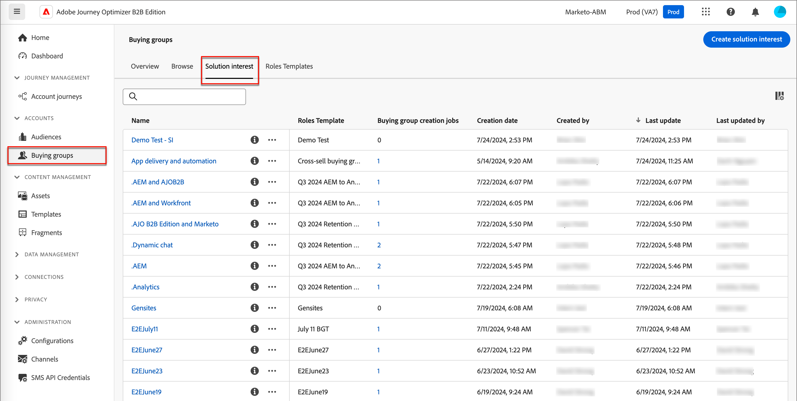

# Lösningsintressen

Innan du skapar inköpsgrupper bör du veta vad du säljer och vilka du vill ha som målgrupp. Er marknadsförings- och försäljningsstrategi bör anpassas så att ni kan lägga till lösningsintresset för inköpsgrupperna.

{width="30"} [Se översiktsvideon](#overview-video)

## Få tillgång till och bläddra bland lösningsintressen

1. Klicka på **[!UICONTROL Buying Groups]** i den vänstra navigeringen.

1. Välj fliken **[!UICONTROL Solution interest]** på sidan _[!UICONTROL Buying Groups]_.

   {width="700" zoomable="yes"}

   Fliken innehåller en inventeringslista över alla befintliga lösningsintressen. Följande information visas i kolumnformat: _[!UICONTROL Name]_,_[!UICONTROL Roles template]_, _[!UICONTROL Buying group creation jobs]_,_[!UICONTROL Last updated on]_, _[!UICONTROL Updated by]_,_[!UICONTROL Created on]_ och _[!UICONTROL Created by]_

   Listan sorteras som standard efter kolumnen _[!UICONTROL Last updated on]_. Klicka på kolumnrubriken i rubriken för att växla sortering mellan fallande och stigande.

## Visa och ta bort inköpsgruppjobb

På fliken _[!UICONTROL Solution interest]_&#x200B;visar kolumnen **[!UICONTROL Buying group creation jobs]**&#x200B;antalet jobb som skapats för varje lösningsintresse. Klicka på numret för att öppna en dialogruta som visar listan över jobb som skapats för lösningsintresset.

{width="700" zoomable="yes"}

Du kan ta bort ett köpgruppsjobb genom att klicka på ellipsen (...) bredvid jobbnamnet och välja **[!UICONTROL Delete]**.

## Skapa ett lösningsintresse

Innan du kan skapa ett intresse för en lösning måste du ha en aktiv (publicerad) rollmall som definierar de roller som du vill ha som mål. Mer information om hur du skapar en rollmall och publicerar en rollmall finns i [Köpa grupprollsmallar](./buying-groups-role-templates.md).

1. Klicka på **[!UICONTROL Create solution interest]** överst till höger på fliken _[!UICONTROL Solution Interest]_.

1. Ange en unik **[!UICONTROL Name]** (obligatoriskt) och en **[!UICONTROL Description]** (valfritt).

1. Välj en **[!UICONTROL Roles Template]** (obligatoriskt).

   Klicka på **[!UICONTROL Select roles template]** och välj en aktiv rollmall i listan i dialogrutan. Du kan bara associera en live-rollmall med en lösningsintresse. Klicka på **[!UICONTROL Save]** om du vill återgå till sidan _[!UICONTROL Create solution interest]_&#x200B;där den valda rollmallen visas.

   {width="700" zoomable="yes"}

1. Välj **[!UICONTROL Buying group stage model]** om du vill använda förloppet för inköpsgruppfasen (valfritt).

   Mer information om hur du använder inköpsgruppfaser för att spåra kontoförloppet finns i [Köpa gruppstadier](./buying-group-stages.md).

1. Aktivera inställningen **[!UICONTROL Update existing buying groups]** (valfritt).

   När det här alternativet är aktiverat uppdateras alla befintliga inköpsgrupper i kombination med lösningsräntan genom 7-dagars synkroniseringscykeln.

1. Klicka på **[!UICONTROL Create]** längst upp till höger.

   Intresset för den nya lösningen visas i listan _[!UICONTROL Solution Interests]_.

## Redigera ett lösningsintresse

Du kan när som helst ändra namn och beskrivning för att höja lösningsintresset. Rollmallen kan inte ändras på grund av beroendet av inköpsgrupper baserat på lösningsintresse och rollmallskoppling. I det här fallet måste du skapa ett nytt lösningsintresse med hjälp av en annan rollmall.

1. Använd någon av följande metoder på fliken _[!UICONTROL Solution interest]_&#x200B;för att öppna egenskaperna för det lösningsintresse som du vill redigera:

   * Klicka på lösningsintressenamnet.
   * Klicka på ellipsen (**..**) bredvid den och välj **[!UICONTROL Edit]**.

   {width="500" zoomable="no"}

1. Gör eventuella uppdateringar av inställningarna för lösningsintresse:

   * Uppdatera **[!UICONTROL Name]** och **[!UICONTROL Description]**.

   * Välj den **[!UICONTROL Buying group stage model]** som används för att spåra förloppet för inköpsgruppsfasen.

     Mer information om hur du använder inköpsgruppfaser för att spåra resans förlopp mot försäljning finns i [Buying group steps](./buying-group-stages.md).

   * Ändra inställningen för **[!UICONTROL Update existing buying groups]**.

     När det här alternativet är aktiverat uppdateras alla befintliga inköpsgrupper i kombination med lösningsräntan genom 7-dagars synkroniseringscykeln.

1. Klicka på **[!UICONTROL Save]**.

## Ta bort en lösningsintresse

Eventuella lösningsintressen som för närvarande används av ett inköpsgruppsjobb eller en kontoresa kan inte tas bort. Det går inte heller att hämta en borttagen lösningsränta.

1. Klicka på ellipsen (**..**) bredvid lösningsintresset på fliken _[!UICONTROL Solution interest]_&#x200B;och välj **[!UICONTROL Delete]**.

   Åtgärden öppnar en bekräftelsedialogruta.

   Om lösningsintresset för närvarande används av en kontoresa eller ett inköpsgruppsjobb resulterar åtgärden i en varning om att den inte kan tas bort. Klicka på **[!UICONTROL OK]** som avbryter borttagningen.

1. Klicka på **[!UICONTROL Delete]** för att bekräfta borttagningen eller så kan du avbryta processen genom att klicka på _[!UICONTROL Cancel]_.

## Videoöversikt

>[!VIDEO](https://video.tv.adobe.com/v/3433080/?learn=on)
