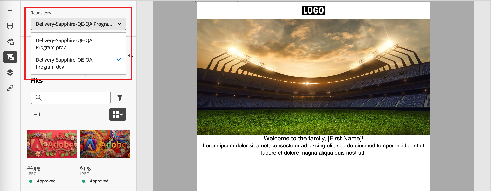

# Arbeta med resurser i Experience Manager

När Adobe Experience Manager Assets as a Cloud Service är integrerat med Adobe Journey Optimizer B2B Edition blir det enkelt att upptäcka och få tillgång till digitala resurser som du kan använda i marknadsföringsmaterialet. När du redigerar ditt innehåll är resurserna tillgängliga från objektet _[!UICONTROL Assets]_i den vänstra navigeringen och när du redigerar e-postinnehåll för en kontoresa. Du kan också överföra resurser till en ansluten AEM Assets as a Cloud Service-databas direkt från Adobe Journey Optimizer B2B Edition.

>[!NOTE]
>
>För närvarande stöds endast bildresurser från Adobe Experience Manager Assets i Adobe Journey Optimizer B2B Edition. Ändringar av mediefilerna måste göras från Adobe Experience Manager Assets centrala arkiv. [Läs mer](https://experienceleague.adobe.com/en/docs/experience-manager-cloud-service/content/assets/manage/manage-digital-assets)

När du använder dessa digitala resurser sprids de senaste förändringarna i Assets as a Cloud Service automatiskt till aktiva e-postkampanjer via länkade referenser. Om bilder tas bort i Adobe Experience Manager Assets as a Cloud Service visas bilderna med en bruten referens i e-postmeddelandena. När resurser som för närvarande används på kontoresor ändras eller tas bort, meddelas författarna av resan om bildändringarna och listan över resor som använder bilden. Alla ändringar av materialet måste göras i Adobe Experience Manager Assets centrala arkiv.

## Använd AEM Assets som bildkälla

Om din miljö har en eller flera [Assets-databasanslutningar](../admin/configure-aem-repositories.md) kan du ange AEM Assets som källa för resurser när du skapar eller visar information för ett e-postmeddelande, en e-postmall eller ett visuellt fragment.

* När du skapar ett nytt innehåll väljer du `AEM Assets` som **[!UICONTROL Image Source]**-objekt i dialogrutan.

  {width="400"}

* När du öppnar en befintlig innehållsresurs väljer du `AEM Assets` på panelen _[!UICONTROL Body]_till höger.

  {width="700" zoomable="yes"}

## Få åtkomst till resurser för redigering

>[!IMPORTANT]
>
>En administratör måste lägga till användare som behöver tillgång till Assets i produktprofilerna Assets Consumer Users eller/och Assets Users. [Läs mer](https://experienceleague.adobe.com/en/docs/experience-manager-cloud-service/content/security/ims-support#managing-products-and-user-access-in-admin-console)

Klicka på ikonen _Resursväljare_ i den vänstra sidofältet i den visuella innehållsredigeraren. Detta ändrar verktygspanelen till en lista med tillgängliga resurser i den valda databasen.

{width="700" zoomable="yes"}

Om du har fler än en ansluten AEM databaser klickar du på menypilen för **[!UICONTROL Repository]** för att välja den databas som du vill använda.

{width="700" zoomable="yes"}

Det finns flera metoder för att lägga till en bildresurs på den visuella arbetsytan:

* Dra och släpp en miniatyrbild från den vänstra navigeringen.

  {width="700" zoomable="yes"}

* Lägg till en bildkomponent på arbetsytan och klicka på **[!UICONTROL Browse]** för att öppna dialogrutan _[!UICONTROL Select Assets]_.

  I dialogrutan kan du välja en bild från den valda databasen.

  Det finns flera verktyg som hjälper dig att hitta den resurs du behöver.

  {width="700" zoomable="yes"}

   * Ändra **[!UICONTROL Repository]** överst till höger.

   * Klicka på **[!UICONTROL Manage assets]** överst till höger för att öppna Assets-databasen på en annan webbläsarflik och använda AEM Assets hanteringsverktyg.

   * Klicka på _vytypsväljaren_ längst upp till höger för att ändra visningen till **[!UICONTROL List View]**, **[!UICONTROL Grid View]**, **[!UICONTROL Gallery View]** eller **[!UICONTROL Waterfall View]**.

   * Klicka på ikonen _Sorteringsordning_ om du vill ändra sorteringsordningen mellan stigande och fallande.

   * Klicka på menypilen **[!UICONTROL Sort by]** om du vill ändra sorteringsvillkoren till **[!UICONTROL Name]**, **[!UICONTROL Size]** eller **[!UICONTROL Modified]**.

   * Klicka på ikonen _Filter_ längst upp till vänster om du vill filtrera de visade objekten enligt dina kriterier.

   * Ange text i sökfältet för att filtrera de visade objekten så att de matchar resursnamnet.

  {width="700" zoomable="yes"}

<!-- 
## Upload assets

To import files to Assets as a Cloud Service, you first need to browse or create the folder to be used for storage. You can then import an asset and add it to your email content. After assets are uploaded, you can [use the image assets as you author content](./assets-overview.md#add-assets-to-your-content).

1. While authoring your content in the email designer, drag an image element into the canvas. 

   The properties on the right reflect the image element selection. 

1. Click **[!UICONTROL Import media]** to open the _[!UICONTROL Upload image]_ dialog.

1. If your file system is open to your image file, drag and drop the file on the box in the dialog.

   {width="700" zoomable="yes"}

   You can also click the **[!UICONTROL Select a file from your computer]** link and use your file system to locate and select the image file. Click Open and the image file is displayed in the box.

1. Click **[!UICONTROL Import]**.

-->
