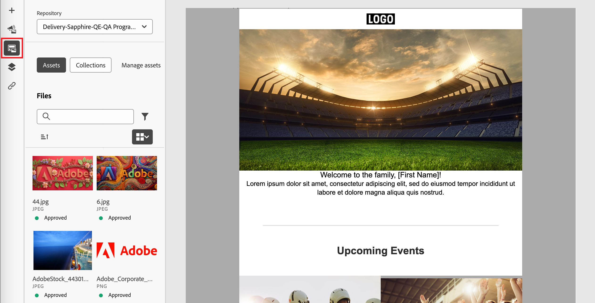

# Arbeta med Experience Manager resurser

När Adobe Experience Manager Assets as a Cloud Service är integrerat med Adobe Journey Optimizer B2B edition blir det enkelt att upptäcka och få tillgång till digitala resurser som kan användas i ert marknadsföringsmaterial. När du redigerar ditt innehåll är resurserna tillgängliga från _Experience Manager Assets_ -objektet i den vänstra navigeringen och när du redigerar e-postinnehåll för en kontoresa.

{{aem-assets-licensing-note}}

När du använder dessa digitala resurser sprids de senaste förändringarna i Assets as a Cloud Service automatiskt till e-postkampanjer via länkade referenser. Om bilder tas bort i Adobe Experience Manager Assets as a Cloud Service visas bilderna med en bruten referens i e-postmeddelandena. När resurser som för närvarande används på kontoresor ändras eller tas bort, meddelas författarna av resan om bildändringarna och listan över resor som använder bilden. Alla ändringar av materialet måste göras i Adobe Experience Manager Assets centrala arkiv.

När din miljö har en eller flera [Assets-databasanslutningar](../admin/configure-aem-repositories.md) kan innehållsförfattare använda AEM Assets som källa för resurser när de skapar e-post, e-postmallar eller visuellt fragment.

>[!IMPORTANT]
>
>En administratör måste lägga till användare som behöver tillgång till Assets i produktprofilerna Assets Consumer Users eller/och Assets Users. [Läs mer](https://experienceleague.adobe.com/en/docs/experience-manager-cloud-service/content/security/ims-support#managing-products-and-user-access-in-admin-console){target="_blank"}

## Öppna AEM Assets-bilder

Klicka på ikonen _Experience Manager Assets_ (  ) i den vänstra sidofältet i den visuella redigeraren. Detta ändrar verktygspanelen till en lista med tillgängliga resurser i den valda databasen.

{width="700" zoomable="yes"}

>[!NOTE]
>
>För närvarande stöds endast bildresurser från Adobe Experience Manager Assets i Adobe Journey Optimizer B2B edition. Ändringar av mediefilerna måste göras från Adobe Experience Manager Assets centrala arkiv. [Läs mer](https://experienceleague.adobe.com/en/docs/experience-manager-cloud-service/content/assets/manage/manage-digital-assets){target="_blank"}

### Ändra den databas som visas

Om du har fler än en ansluten AEM-databas klickar du på menypilen för **[!UICONTROL Repository]** för att välja den databas som du vill visa i den vänstra panelen.

{width="700" zoomable="yes"}

Det finns flera metoder för att lägga till en bildresurs på arbetsytan.

### Dra och släpp en bild

1. Bläddra bland miniatyrbilderna som visas i den vänstra panelen.

1. Dra bildminiatyrbilden och släpp den på arbetsytan där du vill lägga till den nya bildkomponenten.

   {width="700" zoomable="yes"}

## Söka efter och markera en bild

1. Lägg till en bildkomponent på arbetsytan och klicka på **[!UICONTROL Experience Manager Assets]** för att öppna dialogrutan _[!UICONTROL Select Assets]_.

   {width="600" zoomable="yes"}

1. I dialogrutan väljer du en bild med de tillgängliga verktygen för att hitta den resurs du behöver:

   * Ändra **[!UICONTROL Repository]** överst till höger.

   * Klicka på **[!UICONTROL Manage assets]** överst till höger för att öppna Assets-databasen på en annan webbläsarflik och använda AEM Assets hanteringsverktyg.

   * Klicka på _vytypsväljaren_ längst upp till höger för att ändra visningen till **[!UICONTROL List View]**, **[!UICONTROL Grid View]**, **[!UICONTROL Gallery View]** eller **[!UICONTROL Waterfall View]**.

   * Klicka på ikonen _Sorteringsordning_ om du vill ändra sorteringsordningen mellan stigande och fallande.

     {width="700" zoomable="yes"}

   * Klicka på menypilen **[!UICONTROL Sort by]** om du vill ändra sorteringsvillkoren till **[!UICONTROL Name]**, **[!UICONTROL Size]** eller **[!UICONTROL Modified]**.

   * Klicka på ikonen _Filter_ längst upp till vänster om du vill filtrera de visade objekten enligt dina kriterier.

   * Ange text i sökfältet för att filtrera de visade objekten så att de matchar resursnamnet.

   {width="700" zoomable="yes"}

1. Klicka på **[!UICONTROL Select]**.
<!-- 

## Upload assets

To import files to Assets as a Cloud Service, you first need to browse or create the folder to be used for storage. You can then import an asset and add it to your email content. After assets are uploaded, you can [use the image assets as you author content](./assets-overview.md#add-assets-to-your-content).

1. While authoring your content in the email designer, drag an image element into the canvas. 

   The properties on the right reflect the image element selection. 

1. Click **[!UICONTROL Import media]** to open the _[!UICONTROL Upload image]_ dialog.

1. If your file system is open to your image file, drag and drop the file on the box in the dialog.

   {width="700" zoomable="yes"}

   You can also click the **[!UICONTROL Select a file from your computer]** link and use your file system to locate and select the image file. Click Open and the image file is displayed in the box.

1. Click **[!UICONTROL Import]**.
-->
