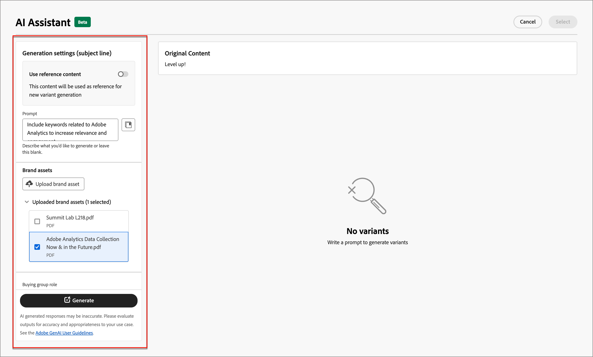

# AI-assistenten för att skapa e-post

I takt med att marknadsföringsbranschen blir mer konkurrenskraftig söker varumärkena effektiva sätt att snabbt och effektivt generera slagkraftigt innehåll. AI Assistant för framtagning av e-post i Adobe Journey Optimizer B2B edition är Adobe AI-baserade funktioner för innehållsgenerering som revolutionerar det sätt på vilket marknadsförare skapar professionellt och varumärkesenhetligt e-postinnehåll. Med avancerade GenAI-modeller och god förståelse för varumärkesriktlinjerna genererar AI Assistant automatiskt personaliserat, engagerande och effektivt innehåll baserat på marknadsföringsmålet med innehåll som är optimerat för varumärkeskonturerade format, layouter, färgtoner och mycket annat. AI Assistant gör det enkelt att skapa och genomföra e-postkampanjer intuitivt, utan krångel. Genom att lägga till den här funktionen i arbetsflödena kan du spara tid, förbättra effektiviteten och få bättre resultat.

Den nya funktionen ger snabb textgenerering, full e-postgenerering och innehållsgenerering inom e-poststrukturer. Bilder genereras inte, men rekommenderas i katalogen med bilder i resursen för indata-varumärket till modellen. Du kan också använda den här funktionen för att generera optimala ämnesrader och preheaders för att påverka öppningsfrekvensen.

>[!NOTE]
>
>Funktionen finns i Beta-versionen och kan ändras utan föregående meddelande.

## Riktlinjer och begränsningar

Läs följande riktlinjer innan du börjar med AI Assistant i Adobe Journey Optimizer B2B edition för att generera e-postinnehåll:

* Marknadsföringsmålet/uppmaningen som du definierar är en avgörande faktor för kvaliteten på det genererade innehållet. Använd en väldefinierad uppmaning för GenAI-modellen att tolka korrekt.
* Överför varumärkesresurser för att få korrekt varumärkesinnehåll. Utan dessa resurser baseras innehållet på offentligt tillgänglig information.
   * De överförda resurserna kan ha följande format: PDF-, JPEG-, PNG- eller ZIP-filer (som innehåller filformat som stöds).
   * Den maximala storleken för en överförd varumärkesresurs är 50 MB. Större filer eller stora mängder bilder kan fungera, men bearbetningstiden ökar.
* Använd e-postmallar skapade i Adobe Journey Optimizer B2B edition, helst de inbyggda mallarna eller exempelmallarna, en varumärkesspecifik mall eller en anpassad mall för att skapa e-postinnehåll. E-postmallar med upp till åtta till tio bilder rekommenderas.
* Var noga med att rapportera problematiska utdata med ikonerna för reglage nedåt eller flagga mot en genererad variant.
* Din användning av AI Assistant regleras av [Adobe Generative AI User Guidelines](https://www.adobe.com/legal/licenses-terms/adobe-gen-ai-user-guidelines.html).

Följande begränsningar gäller för AI Assistant i Adobe Journey Optimizer B2B edition för generering av e-postinnehåll:

* Engelska är det enda språk som stöds.
* Det är bara tillgängligt för e-postkanalen.
* GenAI-innehåll kanske inte är korrekt - dela med dig av dina synpunkter så att Adobe tekniker kan förfina modellerna.
* Ni kan överföra flera varumärkesresurser, men ni kan bara utnyttja en för en viss generation.

>[!BEGINSHADEBOX]

## Fråga bibliotek

Ett effektivt tips är nödvändigt för att skapa så bra innehåll som möjligt. Om du behöver hjälp med att skapa din fråga går du till _promptbiblioteket_. Biblioteket innehåller en mängd olika tips för att förbättra innehållsgenereringen.

{width="500" zoomable="no"}

Välj den ledtext som bäst återspeglar era avsedda mål och lägg till de värden som behövs för att specificera ert varumärke, erbjudande, kampanj och användningsfall.

>[!ENDSHADEBOX]

## Köpa grupproller

Adobe Journey Optimizer B2B edition har fem standardroller för B2B-köpgrupper direkt. Varje inköpsgruppsroll har ett tydligt meddelandefokus:

| Roll | Meddelandefokus |
| ---- | --------------- |
| Verkställande kommitté | Produktinformation  Priser  Information om teknisk integration  Funktioner och funktioner |
| Påverkande | Kvalitetsbevis  Enkel implementering  Ämnesexpertis  Konkurrensfördelar |
| Beslutsfattare | Avkastning på investering  Ekonomiskt värde (RoI)  Nöjda kunder |
| Yrkesverksamma | Enkel användning  Produktfunktioner och -funktionalitet  Produktkompatibilitet  Enkel produktintegrering |
| Champion | Utbildningsinnehåll  Tankledarinnehåll  Nöjda kunder |

Om du väljer en av dessa inköpsgruppsroller anpassas automatiskt resultatet baserat på de egenskaper och ämnen som är av intresse för var och en av dessa roller.

## Generera e-postegenskaper med AI Assistant

När du [lägger till en e-poståtgärd](./add-email.md#add-an-email-action-node-in-a-journey) till en kontoresa, definierar du en uppsättning e-postegenskaper som används för att skicka e-postmeddelandet. AI Assistant kan hjälpa till att få bättre e-postengagemang genom att generera rekommenderat innehåll för e-postens **ämnesrad** och **preheader**.

1. Skapa ett e-postmeddelande från en kontoresa eller öppna ett befintligt e-postmeddelande från en kundnod.

   E-postförhandsgranskningssidan visas med _[!UICONTROL Email properties]_&#x200B;till höger.

1. Välj någon av följande flikar för att lära dig hur du använder AI Assistant när du skapar e-postegenskaper.

>[!BEGINTABS]

>[!TAB Ämnesradgenerering]

I följande steg beskrivs aktivitetssekvensen för hur du använder AI Assistant för att generera en optimerad ämnesrad för e-postmeddelandet:

1. I _[!UICONTROL Email Properties]_&#x200B;klickar du på AI Assistant-ikonen ( {width="30" zoomable="no"} ) till höger om fältet **[!UICONTROL Subject line]**.

   {width="600" zoomable="yes"}

   Popup-fönstret AI-assistenten öppnas med genereringsinställningarna för e-postens ämnesrad.

   Beroende på vilket e-postinnehåll som är kopplat till e-postmeddelandet eller hur du vill använda ämnesraden för att passa ditt syfte, finns det ett par alternativ för att generera text på ämnesraden:

   * Du kan omedelbart klicka på **[!UICONTROL Generate]** utan en fråga eller en varumärkesresurs om du vill använda den befintliga e-postbrödtexten som kontext för ämnesradgenerering.

   * (Rekommenderas) Du kan ange en snabbinställning, en varumärkesresurs och andra inställningsvärden för att skapa den mest optimala ämnesradstexten efter dina behov. (Steg 2 till 7)

1. I fältet **[!UICONTROL Prompt]** anger du en beskrivning av vad du vill generera.

   Använd [promptbiblioteket](#prompt-library) om du behöver hjälp med att skapa en effektiv fråga.

1. Ange en varumärkesresurs som innehåller innehåll som ska fungera som källa för textgenereringen.

   * Välj resursen från katalogen.

   * Klicka på **[!UICONTROL Upload brand asset]** för att lägga till varumärkesresursfilen.

   {width="600" zoomable="yes"}

1. Bläddra vid behov och markera **[!UICONTROL Buying group role]** som ska användas som målgrupp för den genererade texten.

1. Använd vid behov meddelandealternativen för att anpassa innehållet:

   * **[!UICONTROL Communication strategy]** - Välj det format som passar bäst för den genererade texten.
   * **[!UICONTROL Language]** - Välj vilket språk du vill att ditt innehåll ska genereras på.
   * **[!UICONTROL Tone]** - Välj en ton som ska tolkas av din publik. Om du anger att du vill ljuda informativt, lekfullt eller övertygande kan AI Assistant anpassa meddelandet därefter.

1. Om det behövs kan du använda skjutreglaget för att ange hur lång text som ska genereras.

1. Ändra alternativet **[!UICONTROL Use emojis]** (på eller av) enligt dina önskemål.

1. Klicka på **[!UICONTROL Generate]** när din fråga och dina inställningar är klara.

1. Rulla på AI Assistant-panelen och bläddra igenom de genererade variationerna för att se vilken som passar bäst.

   * Klicka på **[!UICONTROL Preview]** om du vill visa en fullskärmsversion av en vald variant.

   * Ge feedback för de genererade varianterna genom att klicka på ikonen _Tummen uppåt_, _Tummen nedåt_ eller _Flagga_ och välj den orsak som bäst sammanfattar dina synpunkter.

1. Gå till alternativen för _Förfina_ i förhandsgranskningsfönstret för att få tillgång till ytterligare anpassningsfunktioner:

   * **[!UICONTROL Use as reference content]** - Välj det här alternativet om du vill använda varianten som referensinnehåll för att generera andra resultat.

   * **[!UICONTROL Rephrase]** - AI Assistant kan omformulera ditt meddelande på olika sätt, vilket håller skrivandet aktuellt och engagerande för olika målgrupper.

   * **[!UICONTROL Use simpler language]** - Utnyttja AI Assistant för att förenkla ditt språk och säkerställa tydlighet och tillgänglighet för en större publik.

   {width="600" zoomable="yes"}

1. Klicka på **[!UICONTROL Select]** om du vill ersätta ämnesraden med den valda varianten och återgå till e-postegenskaperna.

>[!TAB Förhuvudgenerering]

En e-postförrubrik är den korta sammanfattningstexten som följer efter ämnesraden när ett e-postmeddelande visas i inkorgen. Det är ett valfritt element för ett e-postmeddelande, men en utmärkt möjlighet att förbättra engagemanget. I följande steg beskrivs aktivitetssekvensen för hur du använder AI Assistant för att generera en optimerad förrubrik för e-postmeddelandet:

1. Markera kryssrutan **[!UICONTROL Preheader]** i E-postegenskaperna och klicka på AI Assistant-ikonen ( {width="30" zoomable="no"} ) till höger.

   {width="600" zoomable="yes"}

   Popup-fönstret AI-assistenten öppnas med genereringsinställningarna för e-postens förrubrik.

   Beroende på vilket e-postinnehåll som är associerat med e-postmeddelandet eller hur du vill ange e-postmeddelandet som mål finns det ett par alternativ för att generera sidhuvudet:

   * Du kan omedelbart klicka på **[!UICONTROL Generate]** utan en fråga eller en varumärkesresurs om du vill använda den befintliga e-postbrödtexten som kontext för generering av förhuvuden.

   * (Rekommenderas) Du kan ange en snabbinställning, en varumärkesresurs och andra inställningsvärden för att skapa den mest optimala förrubriken för dina behov. (Steg 2 till 7)

1. I fältet **[!UICONTROL Prompt]** anger du en beskrivning av vad du vill generera.

   Använd [promptbiblioteket](#prompt-library) om du behöver hjälp med att skapa en effektiv fråga.

1. Ange en varumärkesresurs som innehåller innehåll som ska fungera som källa för textgenereringen.

   * Välj resursen från katalogen.

   * Klicka på **[!UICONTROL Upload brand asset]** för att lägga till varumärkesresursfilen.

   {width="600" zoomable="yes"}

1. Bläddra vid behov och markera **[!UICONTROL Buying group role]** som ska användas som målgrupp för den genererade texten.

1. Använd vid behov meddelandealternativen för att anpassa innehållet:

   * **[!UICONTROL Communication strategy]** - Välj det format som passar bäst för den genererade texten.
   * **[!UICONTROL Language]** - Välj vilket språk du vill att ditt innehåll ska genereras på.
   * **[!UICONTROL Tone]** - Välj en ton som ska tolkas av din publik. Om du anger att du vill ljuda informativt, lekfullt eller övertygande kan AI Assistant anpassa meddelandet därefter.

1. Om det behövs kan du använda skjutreglaget för att ange hur lång text som ska genereras.

1. Ändra alternativet **[!UICONTROL Use emojis]** (på eller av) enligt dina önskemål.

1. Klicka på **[!UICONTROL Generate]** när din fråga och dina inställningar är klara.

1. Rulla på AI Assistant-panelen och bläddra igenom de genererade variationerna för att se vilken som passar bäst.

   * Klicka på **[!UICONTROL Preview]** om du vill visa en fullskärmsversion av en vald variant.

   * Ge feedback för de genererade varianterna genom att klicka på ikonen _Tummen uppåt_, _Tummen nedåt_ eller _Flagga_ och välj den orsak som bäst sammanfattar dina synpunkter.

1. Gå till alternativen för _Förfina_ i förhandsgranskningsfönstret för att få tillgång till ytterligare anpassningsfunktioner:

   * **[!UICONTROL Use as reference content]** - Välj det här alternativet om du vill använda varianten som referensinnehåll för att generera andra resultat.

   * **[!UICONTROL Rephrase]** - AI Assistant kan omformulera ditt meddelande på olika sätt, vilket håller skrivandet aktuellt och engagerande för olika målgrupper.

   * **[!UICONTROL Use simpler language]** - Utnyttja AI Assistant för att förenkla ditt språk och säkerställa tydlighet och tillgänglighet för en större publik.

   {width="600" zoomable="yes"}

1. Klicka på **[!UICONTROL Select]** om du vill ersätta förrubriken med den valda varianten och återgå till e-postegenskaperna.

>[!ENDTABS]

## Generera e-postinnehåll med AI Assistant

När du har [skapat och anpassat din e-post](./email-authoring.md) använder du AI Assistant i Adobe Journey Optimizer B2B edition, som drivs av generativ AI för att lyfta ditt innehåll i e-postbrödtexten till nästa nivå.

I e-postdesignern kan AI Assistant hjälpa dig att optimera effekten av dina leveranser genom att generera hela e-postbrödtexten, riktat textinnehåll och rekommendationer för bilder som får genklang hos din målgrupp. Den här optimeringen av era e-postkampanjer är utformad för att ge ett bättre engagemang.

1. Skapa ett e-postmeddelande från en kontoresa och klicka på **[!UICONTROL Open Email Designer]** eller **[!UICONTROL Add Email Content]**.

1. Markera och öppna en e-postmall i den visuella e-postdesignern.

1. Anpassa e-postmeddelandet efter behov för kundresan.

1. Välj någon av följande flikar för att lära dig hur du använder AI Assistant när du skapar innehåll i e-postbrödtext.

>[!BEGINTABS]

>[!TAB Fullständig e-postgenerering]

I följande steg beskrivs aktivitetssekvensen för hur du använder AI Assistant för att förfina en befintlig e-postmall:

1. I e-postdesignern öppnar du AI Assistant-menyn genom att klicka på ikonen ( {width="30" zoomable="no"} ) till höger.

   {width="600" zoomable="yes"}

   Inställningarna för AI Assistant till höger återspeglar _Genereringsinställningar (fullständig e-post)_.

1. I fältet **[!UICONTROL Prompt]** anger du en beskrivning av vad du vill generera.

   Använd [promptbiblioteket](#prompt-library) om du behöver hjälp med att skapa en effektiv fråga.

   {width="600" zoomable="yes"}

1. Ange en varumärkesresurs som innehåller innehåll som kan ge ytterligare kontext för AI Assistant.

   * Välj resursen från katalogen.

   * Klicka på **[!UICONTROL Upload brand asset]** för att lägga till varumärkesresursfilen.

   Den här indataresursen fungerar som källa för innehållsgenerering och bildrekommendationer i e-postmeddelandet.

1. Välj **[!UICONTROL Buying group role]** som ska användas som målgrupp för e-postkommunikationen.

1. Använd vid behov meddelandealternativen för att anpassa innehållet:

   * **[!UICONTROL Communication strategy]** - Välj det format som passar bäst för den genererade texten.
   * **[!UICONTROL Language]** - Välj vilket språk du vill att ditt innehåll ska genereras på.
   * **[!UICONTROL Tone]** - Välj en ton som ska tolkas av din publik. Om du anger att du vill ljuda informativt, lekfullt eller övertygande kan AI Assistant anpassa meddelandet därefter.
   * **Innehållstyp** - Välj ett alternativ som återspeglar de visuella elementens karaktär. Den här inställningen skiljer mellan olika former av visuell representation, t.ex. foton, grafik eller grafik.

1. När din fråga är klar klickar du på **[!UICONTROL Generate]**.

1. Rulla på AI Assistant-panelen och bläddra igenom de genererade variationerna för att se vilken som passar bäst.

   * Klicka på **[!UICONTROL Preview]** om du vill visa en fullskärmsversion av en vald variant.

   * Ge feedback för de genererade varianterna genom att klicka på ikonen _Tummen uppåt_, _Tummen nedåt_ eller _Flagga_ och välj den orsak som bäst sammanfattar dina synpunkter.

     {width="600" zoomable="yes"}

1. Klicka på **[!UICONTROL Select]** om du vill ersätta mallinnehållet med den valda varianten och återgå till e-postdesignern.

   I e-postdesignern kan du använda redigerings- och formateringsverktygen på arbetsytan för att ändra innehållet samt alternativen _[!UICONTROL Settings]_&#x200B;och&#x200B;_[!UICONTROL Style]_ till höger.

>[!TAB Textgenerering]

I följande steg beskrivs aktivitetssekvensen för hur du använder AI Assistant för att förfina eller förbättra textinnehållet i ett befintligt e-postmeddelande:

1. I e-postdesignern öppnar du AI Assistant-menyn genom att klicka på ikonen ( {width="30" zoomable="no"} ) till höger.

   {width="600" zoomable="yes"}

1. Välj en _Text_ -komponent som ska ha det specifika innehållet som mål.

   AI Assistant-inställningarna till höger återspeglar _Genereringsinställningar (text)_.

1. I fältet **[!UICONTROL Prompt]** anger du en beskrivning av vad du vill generera.

   {width="600" zoomable="yes"}

   Använd [promptbiblioteket](#prompt-library) om du behöver hjälp med att skapa en effektiv fråga.

1. Ange en varumärkesresurs som innehåller innehåll som ska fungera som källa för textgenereringen.

   * Välj resursen från katalogen.

   * Klicka på **[!UICONTROL Upload brand asset]** för att lägga till varumärkesresursfilen.

1. Välj **[!UICONTROL Buying group role]** som ska användas som målgrupp för den genererade texten.

1. Använd vid behov språk- och meddelandealternativen för att anpassa innehållet:

   * **[!UICONTROL Communication strategy]** - Välj det format som passar bäst för den genererade texten.
   * **[!UICONTROL Language]** - Välj vilket språk du vill att ditt innehåll ska genereras på.
   * **[!UICONTROL Tone]** - Välj en ton som ska tolkas av din publik. Om du anger att du vill ljuda informativt, lekfullt eller övertygande kan AI Assistant anpassa meddelandet därefter.

1. Om det behövs kan du använda skjutreglaget för att ange hur lång text som ska genereras.

1. När din fråga är klar klickar du på **[!UICONTROL Generate]**.

1. Bläddra igenom de genererade _varianterna_ och klicka på **[!UICONTROL Preview]** för att visa en fullskärmsversion av den valda varianten.

1. Gå till alternativen för _Förfina_ i förhandsgranskningsfönstret för att få tillgång till ytterligare anpassningsfunktioner:

   * **[!UICONTROL Use as reference content]** - Välj det här alternativet om du vill använda varianten som referensinnehåll för att generera andra resultat.

   * **[!UICONTROL Elaborate]** - AI Assistant kan hjälpa dig att expandera specifika ämnen och ge dig ytterligare information för bättre förståelse och engagemang.

   * **[!UICONTROL Summarize]** - Lång information kan överlagra e-postmottagare. Använd AI Assistant för att komprimera viktiga punkter till tydliga, kortfattade sammanfattningar som får dem att lyssna och uppmuntrar dem att läsa vidare.

   * **[!UICONTROL Rephrase]** - AI Assistant kan omformulera ditt meddelande på olika sätt, vilket håller skrivandet aktuellt och engagerande för olika målgrupper.

   * **[!UICONTROL Use simpler language]** - Utnyttja AI Assistant för att förenkla ditt språk och säkerställa tydlighet och tillgänglighet för en större publik.

   {width="700" zoomable="yes"}

1. När du har önskat innehåll klickar du på **[!UICONTROL Select]** för att ersätta texten med den valda varianten och återgå till e-postdesignern.

   I e-postdesignern kan du använda redigerings- och formateringsverktygen på arbetsytan för att ändra texten, samt alternativen _[!UICONTROL Settings]_&#x200B;och&#x200B;_[!UICONTROL Style]_ till höger.

>[!TAB Bildrekommendationer]

Du kan använda AI Assistant för att optimera och förbättra dina resurser och säkerställa en mer användarvänlig upplevelse. I följande steg beskrivs aktivitetssekvensen för hur du använder AI Assistant för att förbättra bildinnehållet i e-postmeddelandet:

1. Gå till AI Assistant-menyn genom att klicka på ikonen ( {width="30" zoomable="no"}

   {width="600" zoomable="yes"}

1. Välj en _Image_-komponent som du vill använda som mål för det specifika innehållet och öppna AI Assistant-menyn.

   Inställningarna till höger återspeglar _[!UICONTROL Generation settings (image)]_.

1. Om du vill finjustera resursen anger du en beskrivning av vad du vill ha i fältet **[!UICONTROL Prompt]**.

   {width="600" zoomable="yes"}

   Använd [promptbiblioteket](#prompt-library) om du behöver hjälp med att skapa en effektiv fråga.

1. Klicka på **[!UICONTROL Upload brand asset]** om du vill lägga till en varumärkesresurs som innehåller innehåll som kan ge ytterligare kontext för AI Assistant.

   Om den nödvändiga resursen redan är tillgänglig expanderar du **[!UICONTROL Uploaded brand assets]** och väljer resursen.

   Din fråga måste alltid vara knuten till en befintlig resurs.

1. Använd bildinställningarna för att förfina uppmaningen:

   * **[!UICONTROL Aspect ratio]** - Den här inställningen avgör objektets bredd och höjd. Du kan välja mellan vanliga proportioner som 16:9, 4:3, 3:2 eller 1:1, eller ange en anpassad storlek.
   * **[!UICONTROL Color & tone]** - Den här inställningen påverkar det övergripande utseendet på färgerna i en bild och stämningen eller atmosfären som bilden förmedlar.
   * **[!UICONTROL Content type]** - Den här inställningen kategoriserar det visuella elementets karaktär och skiljer mellan olika former av visuell representation, till exempel foton, grafik eller grafik.
   * **[!UICONTROL Lighting]** - Den här inställningen justerar blixten i en bild, som formar atmosfären och markerar specifika element.
   * **[!UICONTROL Composition]** - Den här inställningen avgör elementens placering i bildrutan i en bild.

1. När du är nöjd med promptkonfigurationen klickar du på **[!UICONTROL Generate]**.

   AI Assistant bearbetar begäran och rekommenderar de bilder som passar bäst inifrån varumärkesresursen utifrån uppmaningen och andra indata.

   >[!IMPORTANT]
   >
   >Om det inte finns några bilder i varumärkesresursen för indata eller om det inte finns några bilder som är relevanta för indatarameddelandet, är utdata tomma.

1. Bläddra igenom _[!UICONTROL Variations]_&#x200B;och välj den som passar bäst för e-postmeddelandet.

   Om du vill visa en fullskärmsversion av den valda varianten klickar du på **[!UICONTROL Preview]**.

1. Markera bilden som du vill använda och klicka på **[!UICONTROL Select]** för att ersätta bilden eller platshållaren med det valda objektet och återgå till e-postdesignern.

   I e-postdesignern kan du använda redigerings- och formateringsverktygen på arbetsytan för att ändra innehållet samt alternativen _[!UICONTROL Settings]_&#x200B;och&#x200B;_[!UICONTROL Style]_ till höger.

>[!ENDTABS]
