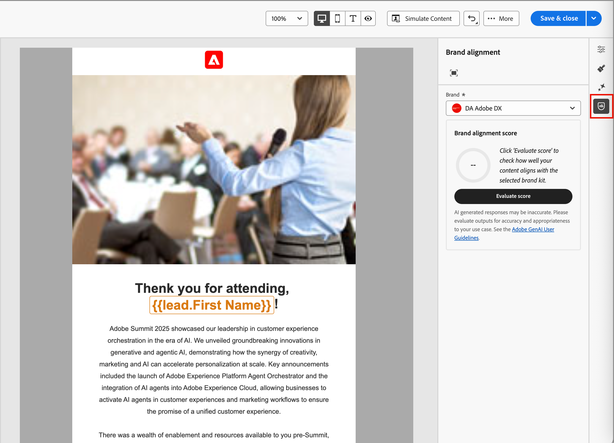

# Poäng för varumärkesjustering {#brand-score}

>[!CONTEXTUALHELP]
>id="ajo-b2b_brand_score_overview"
>title="Märkesmarkering"
>abstract="Välj ert varumärke för att säkerställa att ert innehåll utformas i enlighet med dess specifika riktlinjer, standarder och identitet, samtidigt som ni upprätthåller enhetlighet och varumärkesintegritet."

>[!CONTEXTUALHELP]
>id="ajo-b2b_brand_score"
>title="Poäng för varumärkesjustering"
>abstract="Poängen för varumärkesanpassning mäter hur väl ert innehåll följer varumärkesriktlinjerna och säkerställer enhetlighet när det gäller färger, teckensnitt, logotyp, bilder och stil."

>[!CONTEXTUALHELP]
>id="ajo-b2b_brand_colors"
>title="Färgskala"
>abstract="Färgskala"

>[!CONTEXTUALHELP]
>id="ajo-b2b_brand_fonts"
>title="Teckensnittsmusik"
>abstract="Teckensnittsmusik"

>[!CONTEXTUALHELP]
>id="ajo-b2b_brand_logos"
>title="Logos score"
>abstract="Logos score"

Tack vare utvärderingen och poängen för varumärkesjustering kan du skapa, granska och hantera innehåll som följer riktlinjerna [som definierats i det valda varumärket](./brands-manage-create.md#brand-definitions). Det garanterar enhetlighet i fråga om ton, meddelanden och visuell identitet i alla e-postkampanjer, samtidigt som det fungerar som en kvalitetskontroll innan innehållet publiceras.

>[!AVAILABILITY]
>
>Den här funktionen är för närvarande tillgänglig som en privat betaversion, med progressiv tillgänglighet planerad för alla kunder i framtida releaser.
>
>Ett [användaravtal](https://www.adobe.com/legal/licenses-terms/adobe-dx-gen-ai-user-guidelines.html){target="_blank"} krävs innan du kan använda AI-baserade funktioner i Adobe Journey Optimizer B2B edition. Kontakta Adobe om du vill ha mer information.
>
>Mer information om hur produktadministratörer kan aktivera de här funktionerna finns i [varumärkesrelaterade behörigheter](./brands-overview.md#brand-related-permissions).

## Validera varumärkesjusteringen

När ert varumärke är väldefinierat och publicerat kan ni bedöma ert varumärkeskoncentrationsmoment direkt i e-postdesignområdet för att säkerställa att innehållet följer varumärkesriktlinjerna:

1. När du har skapat e-postinnehållet klickar du på ikonen _Varumärkesjustering_ (  ) till höger för att öppna den högra panelen för _Varumärkesjustering_ i e-postdesignområdet.

   [Standardvarumärket](./brands-manage-create.md#default-brand) markeras automatiskt.

   {width="600" zoomable="yes"}

   Du kan klicka på ikonen _Helskärm_ (  ) längst upp på panelen om du vill visa varumärkesjusteringsverktygen i helskärmsläge.

1. Om det behövs klickar du på **[!UICONTROL Brand]**-menypilen (  ) för att välja ett annat publicerat varumärke.

1. Klicka på **[!UICONTROL Evaluate score]** om du vill få innehållets justering med det valda varumärket.

   Systemet utvärderar innehållet mot riktlinjerna för det valda varumärket och visar resultatet.

   {width="600" zoomable="yes"}

## Granska utvärderingen

Poängen beräknas enligt identifierade fel i det utvärderade e-postinnehållet:

* 100 = Perfekt - Inga överträdelser hittades
* 80-99 = Bra - Endast mindre överträdelser
* 60-79 = Rättvis - vissa allvarliga överträdelser
* Under 60 = Dålig - allvarliga överträdelser måste åtgärdas

Du kan granska utvärderingsresultaten i detalj för att hjälpa dig att identifiera överträdelser och förbättra dina poängvärden för kategorijustering (_Hög_, _Medium_ och _Låg_) och granska informationen. För **[!UICONTROL Writing style]** eller **[!UICONTROL Visual content]** klickar du på pilen _Expandera_ (  ) för att visa information för utvärderingen.

{width="600" zoomable="yes"}

Välj en flaggad stödlinje om du vill visa specifik feedback och förslag.

Du kan ändra innehållet och klicka på **[!UICONTROL Re-evaluate score]** för att köra en annan utvärdering och kontrollera om resultatet har förbättrats.
