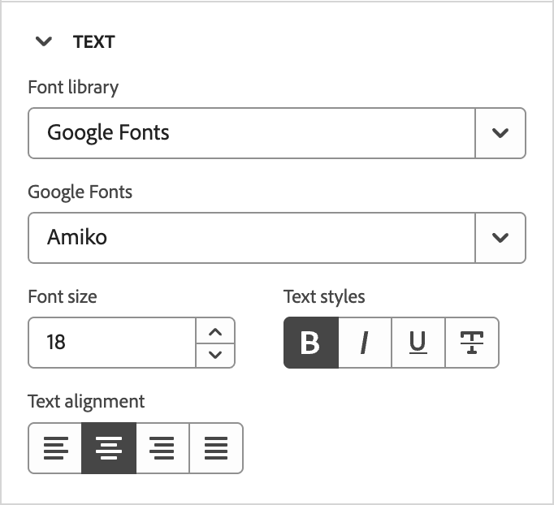

# Använd varumärkesteman för e-postinnehåll {#email-brand-themes}

>[!CONTEXTUALHELP]
>id="ajo-b2b_email_brand_theme"
>title="Använd ett varumärkestema i e-post- eller e-postmallen"
>abstract="Välj ett tema för din e-post- eller e-postmall om du vill använda en viss stil som passar ert varumärke och er design."

Med teman kan icke-tekniska designers skapa återanvändbara riktlinjer för design av e-postinnehåll som passar ett visst varumärke och en viss stil. Teman ger marknadsförarna möjlighet att snabbare och enklare dra nytta av visuellt tilltalande, varumärkesenhetliga e-postmeddelanden och tillhandahålla avancerade anpassningsalternativ för unika designbehov.

## Riktlinjer och begränsningar för teman {#themes-guidelines}

När du arbetar med teman bör du tänka på följande riktlinjer och begränsningar:

* När du skapar en e-postmall eller en e-postmall från en tom arbetsyta (_designa från grunden_) kan du välja _Temalläge_ för att börja bygga innehåll med ett tema och tillämpa en specifik formatering som passar ditt varumärke och din design. Om du väljer _Manuellt läge_ kan du inte använda ett tema om du inte återställer designen för e-post- eller e-postmallen.

* [Fragment](./fragments.md) är inte korskompatibla mellan _temaläge_ och _manuellt läge_ i e-postinnehållet. Om du vill använda ett fragment i e-postinnehåll där ett tema används måste fragmentet också skapas i _temaläge_.

* Ändringar av ett anpassat tema överlappar inte automatiskt alla e-postmeddelanden eller e-postmallar som redan använder det. Redigera innehållet för var och en för att uppdatera temat.

* Om du tar bort ett tema påverkar det inte e-post eller e-postmallar där det redan användes.
<!-- 
* If using a content created in HTML, you will be in [compatibility mode](existing-content.md) and you cannot apply themes to this content.
-->

## Skapa ett varumärkestema {#create-theme}

Definiera ditt eget varumärkestema som du kan använda för e-post och e-postmallar i ditt framtida e-postinnehåll.

1. Du kommer åt temaverktygen på något av följande sätt:

   * [Skapa en ny e-postmall](./email-templates.md#create-an-email-template) och klicka på **[!UICONTROL Edit email template]** för att starta sidan _[!UICONTROL Design your template]_.

   * Klicka på **[!UICONTROL ... More]** överst till höger i designområdet för e-postinnehåll och välj **[!UICONTROL Change your design]**.

     {width="700" zoomable="yes"}

     Klicka på **[!UICONTROL Change template]** i bekräftelsedialogrutan för att öppna designsidan.

1. Välj **[!UICONTROL Create or edit themes]** på designsidan.

   {width="800" zoomable="yes"}

1. Välj standardtemat eller använd något av Adobe-teman som utgångspunkt.

   >[!NOTE]
   >
   >Om du vill använda ett av dina anpassade teman (_[!UICONTROL My themes]_) som utgångspunkt kan du [duplicera det](#delete-or-duplicate-a-theme) och ändra temanamnet när du [redigerar temat](#edit-a-theme).

1. Klicka på **[!UICONTROL Create]**.

   {width="750" zoomable="yes"}

   Sidan _[!UICONTROL Create a theme]_innehåller en arbetsyta med befintliga element av alla typer av text, knappar och behållare från starttemat.

1. Använd rätt navigering för att komma åt de olika tematiska formatflikarna och ändra temainställningarna:

   * [Allmänna inställningar](#general-settings)
   * [Färger](#colors)
   * [Textinställningar](#text-settings)
   * [Mellanrum och kantlinje](#spacing-and-border)
   * [Knapp](#button)
   * [Delare](#divider)
   * [Stödraster](#grid)

   De visuella elementen ändras på arbetsytan när du definierar de nya temainställningarna. Om resultatet inte blir det du vill ha kan du klicka på ikonen _Ångra_ ( {width="16"} ) längst ned på den högra panelen. Klicka på ikonen _Gör om_ ( {width="16"} ) för att tillämpa ändringen igen.

1. När temadefinitionen är klar klickar du på **[!UICONTROL Save]**.

1. Klicka på **[!UICONTROL Close]** om du vill gå tillbaka till sidan _[!UICONTROL Create a theme]_och sedan **[!UICONTROL Cancel]**om du vill gå tillbaka till designsidan.

   Du kan sedan välja **[!UICONTROL Design from scratch]** för att öppna det visuella designområdet och [använda temat](#use-your-theme-for-email-content-authoring) för e-postmeddelandet eller mallen.

### Allmänna inställningar

Definiera de grundläggande parametrarna för ditt tema på fliken **[!UICONTROL General settings]**:

* Ange en unik **[!UICONTROL Theme name]**.

* Justera **[!UICONTROL Viewport width]** för e-postinnehållet (brödtexten). Använd upp- och nedpilarna för att öka eller minska bredden eller ange värdet (i pixlar).

{width="450"}
<!--  and also export the current theme to [share it across sandboxes](../configuration/copy-objects-to-sandbox.md).-->

### Färger

Välj fliken **[!UICONTROL Colors]** och använd inställningarna för att definiera temafärgpaletten.

{width="450"}

* Klicka på **[!UICONTROL Edit]** om du vill visa den färgpalett som innehåller färgerna för ditt tema.

  Välj en **[!UICONTROL Preset]** om du vill använda ett färgschema för temat eller justera varje färg i uppsättningen. Du kan också använda en kombination av båda.

  {width="350"}

  För den markerade färgrutan högst upp kan du ange färgen genom att ange ett känt RGB-, NML-, NMI- eller hexadecimalt värde. Du kan också använda färgreglaget och färgfältet för att välja färgen.

  Klicka på pilen _Bakåt_ för att stänga färgpalettverktygen.

* Klicka på **[!UICONTROL Add variant]** om du vill skapa flera färgvarianter, till exempel ett _ljust_- och _mörkt_-läge, där varje variant har sin egen färgpalett och nya kontroller. Du kan ha upp till sex varianter.

  Klicka på ikonen _Redigera_ (  ) för varje variant. Du kan använda standardpaletten eller andra anpassade färger.

  {width="450"}

  För varje färg som du vill ändra för varianten flyttar du reglaget åt vänster eller höger för att inaktivera eller aktivera den. Om du vill ange en aktiverad färginställning klickar du på färgrutan för att välja färgen.

  {width="450"}

  +++Variantfärginställningar

  Inställningarna grupperas efter typ:

  | Typ | Inställningar | Beskrivning |
  | ---- | -------- | ----------- |
  | [!UICONTROL General] | {width="300"} | Med de här inställningarna kan du ange färger för brödtext, strukturer, behållare, bakgrunder, länkar, stödraster och kanter. |
  | [!UICONTROL Headings] | {width="300"} | De här inställningarna gäller för `Heading`-element, där du kan ange text- och kantfärger för var och en av de sex rubriknivåerna. Expandera varje rubriknivå som du vill ange färg för varianten. |
  | [!UICONTROL Paragraphs] | {width="300"} | De här inställningarna gäller för `Paragraph`-element, där du kan ange text- och kantfärger för var och en av tre stycketyper. Expandera varje stycketext som du vill ange variantens färg. |
  | [!UICONTROL Buttons] | {width="300"} | Inställningarna gäller för knappelement, där du kan ange fyllningsfärg, kantfärg och textfärg för var och en av de tre knappförinställningarna: _Primär_, _Sekundär_ och _Tertiär_. |

  +++

### Textinställningar

På fliken **[!UICONTROL Text settings]** kan du ange globala teckensnittstyper, format och storlekar som du vill använda för temat. Om du vill ha mer detaljerad kontroll kan du även redigera de här parametrarna för rubriker och stycketyper.

{width="450"}

+++Textinställningar per typ

| Typ | Inställningar | Beskrivning |
| ---- | -------- | ----------- |
| [!UICONTROL Global] | {width="300"} | Ange **[!UICONTROL Font library]** till _[!UICONTROL Standard]_eller_[!UICONTROL Google Fonts]_. Välj sedan den teckensnittsfamilj som du vill använda. Dessa globala textinställningar används genomgående, såvida du inte anger olika textformat för rubriknivåer och stycketyper. |
| [!UICONTROL Headings] | {width="300"} | För rubriknivån som du vill ange väljer du **[!UICONTROL H1]**, **[!UICONTROL H2]** och så vidare. Ange **[!UICONTROL Font library]** till _[!UICONTROL Standard]_eller_[!UICONTROL Google Fonts]_. Välj sedan teckensnittsfamilj, storlek och stil. Välj **[!UICONTROL Text alignment]**: _Vänster_, _Centrerad_, _Höger_ eller _Justerad_. |
| [!UICONTROL Paragraphs] | {width="300"} | För rubriknivån som du vill ange väljer du **[!UICONTROL P1]**, **[!UICONTROL HP]** och så vidare. Ange **[!UICONTROL Font library]** till _[!UICONTROL Standard]_eller_[!UICONTROL Google Fonts]_. Välj sedan teckensnittsfamilj, storlek och stil. Justera **[!UICONTROL Line height]** efter behov. Välj **[!UICONTROL Text alignment]**: _Vänster_, _Centrerad_, _Höger_ eller _Justerad_. |

+++

### Mellanrum och kantlinje

På fliken **[!UICONTROL Spacing]** kan du ange utfyllnad och marginal för de olika elementtyperna. Välj innehållstyp för **[!UICONTROL Select type]**. Ange sedan utfyllnaden, marginalerna, hörnen och kanterna som är tillämpliga för den elementtypen.

{width="450"}

+++Mellanrumsinställningar

| Typ | Inställningar | Beskrivning |
| ---- | -------- | ----------- |
| [!UICONTROL Margins] | {width="300"} | Välj ikonen _Marginal_ om du vill visa inställningar som replikerar CSS `margin` -parametern, som styr utrymmet utanför en komponentkant och separerar det från andra komponenter/element. Det skapar en lucka runt komponenten för att påverka dess placering och layouten för det omgivande innehållet. Ange marginalvärdena i pixlar efter dina designbehov. Du kan ange marginalen för alla sidor, den översta, den vänstra eller högra sidan av komponenten oberoende av varandra. Klicka på ikonerna _Lås_ och _Lås upp_ för att synkronisera eller ta bort synkroniseringen av de övre, nedre och högra marginalvärdena. |
| [!UICONTROL Paddings] | {width="300"} | Välj ikonen _Utfyllnad_ om du vill visa inställningar som replikerar CSS `padding` -parametern, som är mellanrummet mellan innehållet i en komponent/ett element och dess kantlinje. Utfyllnaden ger internt avstånd som du kan använda för att styra avståndet mellan innehållet och komponentens kant. Ange utfyllnadsvärdena i pixlar enligt dina designbehov. Du kan ange utfyllnaden för alla sidor, längst ned, till vänster till höger eller varje sida av komponenten separat. Klicka på ikonerna _Lås_ och _Lås upp_ om du vill synkronisera eller ta bort synkroniseringen för utfyllnadsvärdena längst upp, längst ned och till höger. |
| [!UICONTROL Corners] | {width="300"} | Välj ikonen _Hörn_ om du vill visa inställningar som replikerar CSS `border-radius` -parametern, som definierar radien för komponent-/elementhörnen. Ange det numeriska värdet enligt kurvan som du vill använda för hörnen. Värdet 0 (standard) ger ett fyrkantigt hörn. |

+++

+++Kantlinjeinställningar

Flytta reglaget **[!UICONTROL Border]** åt höger för att aktivera visningsalternativen för kantlinjer och ange dem enligt dina designvillkor:

* Om du vill ange **[!UICONTROL Border size]** (linjebredd) klickar du på upp- och nedpilarna för att öka eller minska antalet pixlar.

* Om du vill ange **[!UICONTROL Border style]** väljer du ett värde i listan med standard-CSS `border-style`-värden, till exempel _Heldragen_, _Prickad_ och _Streckad_.

* Om du vill avgöra var kantlinjen visas markerar du varje **[!UICONTROL Border position]**-kryssruta.

{width="250"}

+++

### Knappar

På fliken **[!UICONTROL Buttons]** kan du ange olika attribut (andra än färg) för knappelement, till exempel kantradie (form), text och storlek. Du kan ändra inställningarna för var och en av de tre knappförinställningarna: _[!UICONTROL Primary]_,_[!UICONTROL Secondary]_ och _[!UICONTROL Tertiary]_.

{width="450"}

+++Knappinställningar

| Typ | Inställningar | Beskrivning |
| ---- | -------- | ----------- |
| [!UICONTROL Text] | {width="300"} | Ange **[!UICONTROL Font library]** till _[!UICONTROL Standard]_eller_[!UICONTROL Google Fonts]_. Välj sedan teckensnittsfamilj, storlek och stil. Välj **[!UICONTROL Text alignment]**: _Vänster_, _Centrerad_, _Höger_ eller _Justerad_. |
| [!UICONTROL Border] | {width="300"} | Flytta **[!UICONTROL Border]**-växeln åt höger för att aktivera visningsalternativen för knappens kantlinje och ange dem enligt dina designvillkor. Ange **[!UICONTROL Border size]** (linjebredd) genom att öka eller minska antalet pixlar. Ange **[!UICONTROL Border style]** genom att välja ett värde i listan med standard-CSS `border-style`-värden, till exempel _Heldragen_, _Prickad_ och _Streckad_. |
| [!UICONTROL Size] | {width="300"} | För alternativet **[!UICONTROL Height]** klickar du på upp- och nedpilarna för att öka eller minska antalet pixlar. Ett tomt värde (Auto) är standardvärdet och ändrar höjden på knappen efter dess innehåll. Använd växlingsknappen för **[!UICONTROL Width]** för att ange bredden i pixlar eller procent. Om du vill ange en procentbredd använder du skjutreglaget för att ange procentvärdet. Procentvärdet avgör knappstorleken baserat på innehållsrutan i behållarblocket, som inte inkluderar utfyllnad och kanter. Värdet 50 anger till exempel knappbredden till 50 % av den innehållna bredden. Om du vill ha en pixelbaserad bredd klickar du på upp- och nedpilarna för att öka eller minska antalet pixlar. Ett tomt värde (_Auto_) är standardvärdet och ändrar knappens bredd efter dess innehåll. |

+++

### Delare

På fliken **[!UICONTROL Divider]** kan du ange inställningar för linjeformat och behållare för en delarkomponent.

{width="450"}

+++Delningsinställningar

| Typ | Inställningar | Beskrivning |
| ---- | -------- | ----------- |
| [!UICONTROL Line] | {width="300"} | Ange **[!UICONTROL Border style]** genom att välja ett värde i listan med standard-CSS `border-style`-värden, till exempel _Heldragen_, _Prickad_ och _Streckad_. |
| [!UICONTROL Container size] | {width="300"} | För alternativet **[!UICONTROL Height]** klickar du på upp- och nedpilsikonerna för att öka eller minska antalet pixlar för komponenten/elementet. Ett tomt värde (Auto) är standardvärdet och ändrar höjden efter dess innehåll (linjeformat). Använd växlingsknappen för **[!UICONTROL Width]** för att ange bredden i pixlar eller procent. Om du vill ange en procentbredd använder du skjutreglaget för att ange procentvärdet. Procentvärdet avgör elementbredden baserat på innehållsrutan i behållarblocket. Värdet 50 anger till exempel att delarens bredd ska vara 50 % av den innehållna bredden. Om du vill ha en pixelbaserad bredd klickar du på upp- och nedpilarna för att öka eller minska antalet pixlar. Ett tomt värde (_Auto_) är standardvärdet och ändrar bredden på avgränsaren efter dess innehåll. |
| [!UICONTROL Alignment] | {width="300"} | Välj den vågräta justeringen i behållarblocket: _Vänster_, _Centrerad_ eller _Höger_. |

+++

### Stödraster

På fliken **[!UICONTROL Grid]** kan du kontrollera kolumn- och radmellanrum för ett rutnätselement:

* **[!UICONTROL Column gap]** - Klicka på upp- och nedpilsikonerna för att antingen öka eller minska antalet pixlar för mellanrummet mellan rutnätskolumnerna. Du kan också ange ett tal i fältet.

* **[!UICONTROL Rows gap]** - Klicka på upp- och nedpilarna för att antingen öka eller minska antalet pixlar för mellanrummet mellan rutnätsraderna. Du kan också ange ett tal i fältet.

{width="700" zoomable="yes"}

## Redigera ett tema

Du kan redigera ett tema med samma arbetsflöde och verktyg som du använder när du skapar ett tema. Skillnaden är att du väljer fliken **[!UICONTROL My themes]** och väljer det anpassade tema som du vill ändra.

{width="750" zoomable="yes"}

Använd listen till höger för att navigera mellan de olika flikarna och ändra temainställningarna:

* [Allmänna inställningar](#general-settings)
* [Färger](#colors)
* [Textinställningar](#text-settings)
* [Mellanrum och kantlinje](#spacing-and-border)
* [Knapp](#button)
* [Delare](#divider)
* [Stödraster](#grid)

{width="800" zoomable="yes"}

De visuella elementen som visas ändras när du ändrar inställningarna. Om resultatet på arbetsytan inte blir som du vill kan du klicka på ikonen _Ångra_ ( {width="16"} ) längst ned på den högra panelen. Klicka på ikonen _Gör om_ ( {width="16"} ) för att tillämpa ändringen igen.

Klicka på **[!UICONTROL Save]** när dina temaändringar är slutförda.

>[!NOTE]
>
>De sparade ändringarna överlappar inte automatiskt alla e-postmeddelanden eller e-postmallar som för närvarande använder temat. Redigera innehållet för var och en för att uppdatera temat och matcha de uppdaterade formaten.

## Hantera egna teman

Du kan hantera dina anpassade teman med samma arbetsflöde och verktyg som du använder när du skapar ett tema. Skillnaden är att du väljer fliken **[!UICONTROL My themes]** och hanterar dina teman i listan som visas.

Om du har en stor lista med anpassade teman kan du använda fältet _Sök_ och andra filter för att minska den visade listan. När du hanterar listan med tillgängliga teman kan du när som helst redigera, ta bort eller duplicera ett anpassat tema.

{width="750" zoomable="yes"}

### Redigera ett tema

1. Välj det tema som du vill ändra och klicka på **[!UICONTROL Edit]** överst till höger.

   {width="750" zoomable="yes"}

1. Använd navigeringen till höger för att använda de olika formatflikarna och ändra temainställningarna:

   * [Allmänna inställningar](#general-settings)
   * [Färger](#colors)
   * [Textinställningar](#text-settings)
   * [Mellanrum och kantlinje](#spacing-and-border)
   * [Knapp](#button)
   * [Delare](#divider)
   * [Stödraster](#grid)

   {width="800" zoomable="yes"}

   De visuella elementen som visas ändras när du ändrar inställningarna. Om resultatet på arbetsytan inte är vad du vill ha kan du klicka på ikonen _Ångra_ längst ned på den högra listen. Klicka på ikonen _Gör om_ för att tillämpa ändringen igen.

1. Klicka på **[!UICONTROL Save]** när dina temaändringar är slutförda.

>[!NOTE]
>
>De sparade temaändringarna överlappar inte automatiskt alla e-postmeddelanden eller e-postmallar som för närvarande använder temat. Redigera innehållet för var och en för att uppdatera temat och matcha de uppdaterade formaten.

### Ta bort eller duplicera ett tema

När du hittar temat klickar du på ikonen _Mer meny_ (**..**) längst ned till höger på temakortet och väljer den åtgärd som du vill utföra:

{width="220"}

* **[!UICONTROL Duplicate]** - Välj den här åtgärden om du vill duplicera temat. Det nya temat är identiskt med _Kopian av_ som har lagts till i namnet på originalet. Du kan ändra namnet när du [redigerar temat](#edit-a-theme).

* **[!UICONTROL Delete]** - Välj den här åtgärden om du vill ta bort det anpassade temat. Klicka på **[!UICONTROL Delete]** i bekräftelsedialogrutan.

  >[!NOTE]
  >
  >Om du tar bort temat påverkas inte e-post- eller e-postmallar där det redan används.

## Använd ett tema för att skapa e-postinnehåll {#use-email-theme}

När du skapar en ny e-post- eller e-postmall kan du välja att använda ett varumärkestema som effektiviserar innehållsutvecklingsprocessen och ser till att designen anpassas till definierade standarder. För ett nytt fragment kan du även tillämpa ett tema innan du sparar fragmentet. Fragmentet är fortfarande i _temaläge_ och är kompatibelt att lägga till i e-postmeddelanden och e-postmallar som också är i _temaläge_.

1. Välj någon av följande åtgärder:

   * Välj en e-postmall som innehåller ett tema (skapad i _temaläge_). Temat som är specifikt för varje mall tillämpas automatiskt.

   * Använd alternativet _[!UICONTROL Design from scratch]_och välj **[!UICONTROL Use Themes]**för att börja med ett fördefinierat formattema.

     {width="450"}

     >[!IMPORTANT]
     >
     >Om du väljer läget _[!UICONTROL Manual Styling]_måste du återställa e-postdesignen för att använda ett tema.
     >
     >Om du väljer läget _[!UICONTROL Themes]_är bara [fragment](./fragments.md) som också har skapats i läget_ Teman _tillgängliga för att läggas till i e-postinnehållet.

1. Klicka på ikonen _Teman_ (  ) till höger i e-postdesignområdet.

   {width="600" zoomable="yes"}

   Standardtemat eller det tema som används för mallen visas. Du kan växla mellan färgvarianterna för det här temat.

1. Klicka på pilen bredvid temat som visas för att visa en lista över tillgängliga anpassade teman och Adobe-teman.

1. Klicka på **[!UICONTROL My themes]** och välj ett anpassat tema.

   {width="325"}

1. Klicka utanför listan.

   Det nyligen valda anpassade temat använder formaten på alla e-postkomponenter på arbetsytan. Du kan växla mellan färgvarianterna.

1. Om du behöver åsidosätta temaformaten för en markerad komponent klickar du på ikonen _Lås upp komponentformat_ (  ).

   {width="600" zoomable="yes"}

   Klicka på **[!UICONTROL Unlock]** i bekräftelsedialogrutan.

   Välj fliken **[!UICONTROL Styles]** i den högra panelen för att ändra inställningarna för komponenten.

   {width="600" zoomable="yes"}

## Ändra temat för ditt e-postinnehåll

Du kan ändra temat när som helst för e-post- eller e-postmallar som skapats i _temaläge_. E-postinnehållet ändras inte, men formaten uppdateras för att återspegla det nya temat.

1. Öppna e-post- eller e-postmallen i designområdet.

1. Klicka på ikonen _Teman_ (  ) till höger.

   Det använda temat visas på den högra panelen.

1. Klicka på pilen bredvid temat som visas för att visa en lista över tillgängliga anpassade teman och Adobe-teman.

1. Välj ett annat tema.

1. Klicka utanför listan.

   Det valda temat använder formaten på alla e-postkomponenter på arbetsytan. Du kan växla mellan färgvarianterna.

<!--
>[!NOTE]
> - Themes apply styles globally. Ensure your theme is finalized before applying it to multiple emails.
> - Switching themes may override custom styles applied to individual components.

>[!CAUTION]
> - When using fragments, the email's theme will override the fragment's styles. A warning will be displayed in the editor if there is a conflict.

## Example Use Cases {#example-use-cases}

### 1. Creating a New Theme
- A designer creates a theme with their brand's colors, fonts, and button styles.
- The theme is saved and reused by marketers to author multiple emails.

### 2. Switching Themes
- A marketer applies a holiday-themed design to an existing email by switching to a pre-designed holiday theme.-->
