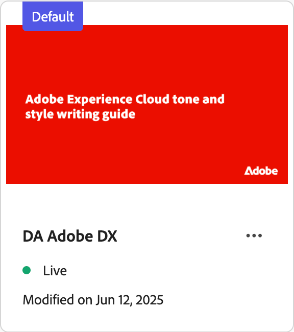
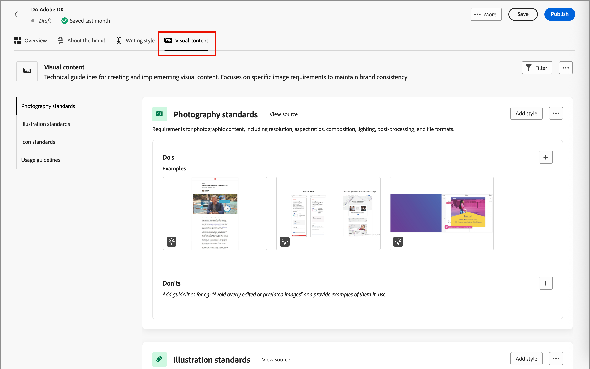

# Skapa och hantera varumärken {#brand-library}

Definiera ett varumärke för att tillhandahålla en detaljerad uppsättning regler och standarder som skapar en visuell och vertikal identitet. Dessa riktlinjer utgör en referens för att upprätthålla en enhetlig varumärkesrepresentation på alla marknadsförings- och kommunikationsplattformar. Genom att utnyttja väldefinierade riktlinjer för varumärken kan organisationer se till att alla satsningar på att skapa innehåll är anpassade till de strategiska målen och den övergripande varumärkesidentiteten. Denna enhetlighet förbättrar inte bara varumärkesigenkänningen och förtroendet, utan bidrar också till en mer sammanhängande och slagkraftig kundupplevelse över alla kontaktytor.

I Journey Optimizer B2B edition kan du definiera och ordna varumärkesdefinitioner och -resurser manuellt eller överföra varumärkesriktlinjer för automatisk information och visuell mediehämtning.

>[!AVAILABILITY]
>
>Den här funktionen är för närvarande tillgänglig som en privat betaversion, med progressiv tillgänglighet planerad för alla kunder i framtida releaser.
>
> 
>
>Ett [användaravtal](https://www.adobe.com/legal/licenses-terms/adobe-dx-gen-ai-user-guidelines.html){target="_blank"} krävs innan du kan använda AI-baserade funktioner i Adobe Journey Optimizer B2B edition. Kontakta Adobe om du vill ha mer information.
>
> 
>
>Mer information om hur produktadministratörer kan aktivera de här funktionerna finns i [varumärkesrelaterade behörigheter](./brands-overview.md#brand-related-permissions).

## Få tillgång till ert varumärkesbibliotek

Gå till den vänstra navigeringen och klicka på **[!UICONTROL Content Management]** > **[!UICONTROL Brands]** för att få tillgång till märkespaket i Adobe Journey Optimizer B2B edition. Den här åtgärden öppnar en sida där de skapade märkena visas som kort.

{width="800" zoomable="yes"}

Om inga varumärken har skapats ännu visas en bild med en knapp för att [skapa ditt första varumärke](#create-and-define-a-brand).

### varumärkeshanteringsåtgärder

För varje kort kan du klicka på ikonen _Mer meny_ (  ) och välja en åtgärd för varumärket:

* **[!UICONTROL View brand]** - Öppna varumärkessidan och visa definitionerna.
* **[!UICONTROL Mark as default brand]** (endast live) - [Markera varumärket som standard](#default-brand) för justering och generering av innehåll.
* **[!UICONTROL Edit]** - Öppna varumärkessidan och redigera varumärkesriktlinjerna, undantagen och exemplen.
* **[!UICONTROL Duplicate]** - Skapa en kopia som ett nytt varumärke för utkast.
* **[!UICONTROL Publish]** (endast utkast) - [Publicera varumärket](#publish-the-brand) för att göra det tillgängligt för användning med innehållsjustering och generering.
* **[!UICONTROL Unpublish]** (Endast live) - Avpublicera varumärket för att ta bort det från användning för justering och generering av innehåll.
* **[!UICONTROL Delete]** - Ta bort varumärket från ditt varumärkesbibliotek.

{width="440"}

### Standardmärke

Du kan ange att ett standardvarumärke ska tillämpas automatiskt när du genererar innehåll och beräknar justeringsmoment när du skapar innehåll. Endast ett publicerat varumärke (_Live_) kan vara standard.

I varumärkesbiblioteket visas standardkortet med en flagga.

{width="200"}

Du kan ange alla publicerade varumärken (_Live_) som standardvarumärken. Klicka på ikonen _Mer meny_ (  ) på märkeskortet och välj **[!UICONTROL Mark as default brand]**.

{width="350"}

## Skapa och definiera ett varumärke {#create-brand}

>[!CONTEXTUALHELP]
>id="ajo-b2b_brands_create"
>title="Skapa ert varumärke"
>abstract="Ange ditt varumärkesnamn och överför din varumärkesstödfil. Verktyget extraherar automatiskt viktiga detaljer, vilket gör det enklare att upprätthålla varumärkesidentiteten."

Om du vill skapa och definiera riktlinjer för varumärket kan du antingen ange detaljerna eller överföra dina riktlinjer för varumärken som ska användas för automatisk extrahering.

### Lägg till varumärket

1. Klicka på _[!UICONTROL Brands]_&#x200B;längst upp till höger på sidan **[!UICONTROL Create brand]**.

1. Ange en **[!UICONTROL Name]** för ditt varumärke.

1. Dra och släpp eller markera filen för att ladda upp varumärkesriktlinjerna och extrahera automatiskt relevant varumärkesinformation.

   {width="500"}

   >[!NOTE]
   >
   >Om du inte har ett dokument sparat i PDF-format kan du lägga till riktlinjerna manuellt och överföra enskilda visuella resurser när du har skapat varumärket.

1. Klicka på **[!UICONTROL Create brand]**.

   Om du inkluderar en eller flera filer för att skapa varumärket börjar informationshämtningen. Det kan ta flera minuter.

   När extraheringsprocessen är klar fylls ditt innehåll och dina visuella skapandestandarder i automatiskt.

   {width="700" zoomable="yes"}

### Förfina och uppdatera varumärkesriktlinjerna

1. Bläddra bland de olika flikarna för att anpassa och definiera mer detaljerad information efter behov.

   * [!UICONTROL Overview]

   * [[!UICONTROL About the brand]](#about-the-brand)

   * [[!UICONTROL Writing style]](#writing-style)

   * [[!UICONTROL Visual content]](#visual-content)

   Om du inkluderade ett eller flera dokument när du skapade varumärket skapade informationsextraheringsprocessen definitioner för flikarna och avsnitten. Huruvida dokumenten är fullständiga eller inte beror på vilket omfång och vilka detaljer de innehåller. När du granskar resultatet kan du ändra eller ta bort all information.

   På _Mer-menyn_ (  ) för varje flik eller kategori kan du lägga till dokument för att extrahera relevant varumärkesinformation automatiskt. Du kan även rensa det befintliga innehållet.

   {width="500" zoomable="yes"}

   Om du vill granska källan för den extraherade informationen i ett underavsnitt klickar du på länken **[!UICONTROL View source]**.

   {width="700" zoomable="yes"}

1. Granska kategorierna på varje informationsflik och förbättra varumärket genom att lägga till, ta bort och ändra dina definitioner.

   Ett underavsnitt med namnet **[!UICONTROL Do's]** visar riktlinjerna för kategorin. Använd det här området om du vill lägga till riktlinjer och exempel på riktlinjer.

   {width="500" zoomable="yes"}

   Ett underavsnitt med namnet **[!UICONTROL Don'ts]** visar undantagen. Använd det här området om du vill lägga till undantagsbeskrivningar och exempel på undantagen.

   {width="500" zoomable="yes"}

   * **Lägg till stödlinje eller undantag**.

     Klicka på ikonen _Lägg till_ (  ) till höger i det avsnitt där du vill lägga till en stödlinje. I popup-dialogrutan anger du stödlinjen och markerar kryssrutorna för de kanaler och element som stödlinjen gäller. Klicka sedan på **[!UICONTROL Add]**.

     {width="600" zoomable="yes"}

   * **Ändra stödlinje eller undantag**.

     Klicka på stödlinjewidgeten i det avsnitt där du vill ta bort en stödlinje. I popup-dialogrutan ändrar du innehållet för stödlinjen och de markerade kryssrutorna efter behov. Klicka sedan på **[!UICONTROL Update]**.

     {width="600" zoomable="yes"}

   * **Ta bort stödlinje eller undantag**.

     Klicka på stödlinjewidgeten i det avsnitt där du vill ta bort en stödlinje. I popup-dialogrutan klickar du på ikonen _Ta bort_ (  ) längst upp.

   * **Lägg till eller revidera exempel på riktlinjer och undantag**.

     Klicka på ikonen _Redigera_ (  ) för att ändra exemplet i den visade exempelrutan, eller klicka på ikonen _Ta bort_ (  ) för att ta bort den.

1. När du har definierat allt klickar du på **[!UICONTROL Save]**.

   Du kan fortsätta att göra ändringar i varumärket tills du beslutar att det är klart att publiceras.

### Publicera varumärket

När varumärket innehåller en komplett uppsättning definitioner och uppfyller dina krav klickar du på **[!UICONTROL Publish]** för att göra varumärkesriktlinjerna tillgängliga för innehållsjustering och generering.

Publicerade varumärken är tillgängliga från alternativet **[!UICONTROL Brand]** i AI-varumärkesjusteringen [&#128279;](./brand-alignment.md) och innehållsgenereringsverktygen. <!-- [Learn more about content generation](gs-generative.md) -->

{width="300"}

## Varumärkesdefinitioner

Varumärkesdefinitionerna är ordnade i tre kategorier och visas som flikar. Välj varje flik för att slutföra och uppdatera varumärkesriktlinjerna.

### Om varumärket {#about-brand}

Använd fliken **[!UICONTROL About the brand]** för att etablera varumärkets kärnidentitet. Den här informationen beskriver syfte, personlighet, tagline och andra attribut på hög nivå.

1. Lägg till basinformation för ditt varumärke i kategorin **[!UICONTROL Key details]**:

   * **[!UICONTROL Brand kit name]** - Uppdatera varumärkesnamnet.

   * **[!UICONTROL When to use]** - Ange scenarier eller kontexter där det här varumärket ska användas.

   * **[!UICONTROL Brand name]** - Ange varumärkets officiella namn.

   * **[!UICONTROL Description of this brand]** - Ge en översikt över vad det här varumärket representerar.

   * **[!UICONTROL Tagline (Default)]** - Lägg till den primära tagline som är associerad med varumärket.

   {width="600" zoomable="yes"}

1. I kategorin **[!UICONTROL Guiding principles]** klargör du varumärkets huvudriktning och filosofi:

   * **[!UICONTROL Mission]** - Specificera varumärkessyftet.

   * **[!UICONTROL Vision]** - Beskriv det långsiktiga målet eller önskat framtida tillstånd.

   * **[!UICONTROL Market positioning]** - Förklara hur varumärket är positionerat på marknaden.

   {width="600" zoomable="yes"}

   Granska de definierade varumärkesvärdena från kategorin **[!UICONTROL Core brand values]** och justera dem efter behov.

   * Om du vill definiera ett nytt kärnvärde klickar du på ikonen _Lägg till_ (  ) till höger och fyller i informationen:

     {width="500" zoomable="yes"}

      * **[!UICONTROL Value]** - Ange namnet på kärnvarumärkesvärdet.

      * **[!UICONTROL Description]** - Förklara vad det här värdet betyder för ditt varumärke.

      * **[!UICONTROL Behaviors]** - Skapa en kontur för de åtgärder eller attityder som återspeglar det här värdet i praktiken.

      * **[!UICONTROL Manifestations]** - Ge exempel på hur det här värdet uttrycks i varumärken.

   * Om du vill ändra eller ta bort ett kärnvärde klickar du på ikonen _Redigera_ (  ) för att uppdatera eller ta bort ett kärnvarumärke.

     {width="500" zoomable="yes"}

     Ändra informationen och klicka på **[!UICONTROL Update]**. Du kan också klicka på ikonen _Ta bort_ (  ) längst upp för att ta bort kärnvärdet.

1. Granska de dokument som används för att generera varumärkesriktlinjerna i kategorin **[!UICONTROL Brand guidelines documents]**.

   Klicka på menyikonen Mer och välj ett alternativ för att uppdatera varumärkesriktlinjerna med hjälp av överförda referensdokument:

   * **[!UICONTROL Re-extract guidelines]** - Välj den här åtgärden om du vill köra ett extraheringsjobb med de aktuella dokumenten.
   * **[!UICONTROL Add reference for extraction]** - Välj den här åtgärden om du vill överföra ett annat dokument och köra ett extraheringsjobb.

   {width="600" zoomable="yes"}

Du kan fortsätta att förfina [skrivstilen](#writing-style) eller [visuellt innehåll](#visual-content) riktlinjer, undantag och exempel, eller så kan du [publicera ditt varumärke](#publish-the-brand).

### Skrivstil {#writing-style}

>[!CONTEXTUALHELP]
>id="ajo_brand_writing_style"
>title="Skriva justeringsmusik"
>abstract="I avsnittet Skrivstil definieras standarder för språk, formatering och struktur för att säkerställa tydligt och enhetligt innehåll. Justeringspoängen, som har klassificerats från hög till låg, visar hur väl innehållet följer dessa riktlinjer och markerar områden som kan förbättras."

Definitionerna för _[!UICONTROL Writing style]_&#x200B;innehåller en beskrivning av standarderna för att skriva innehåll och en beskrivning av hur språk, formatering och struktur ska användas för att bibehålla klarhet, konsekvens och konsekvens i alla material.

Välj fliken **[!UICONTROL Writing Style]** och granska varje kategori.

{width="600" zoomable="yes"}

| Kategori | Underkategori | Riktlinjer, exempel | Exempel på undantag |
|----------------------------|----------------|-----------------------|-----------------------|
| [!UICONTROL Brand communication style] | [!UICONTROL Brand Personality Traits] | Lätt och lättåtkomligt. | Var inte besegrad. |
|                            | [!UICONTROL Writing Mechanics] | Håll meningarna korta och slagkraftiga. | Använd inte för mycket jargon. |
|                            | [!UICONTROL Situational Tone] | Bibehåll en professionell ton inom kriskommunikation. | Avvisa inte supportkommunikation. |
|                            | [!UICONTROL Word Choice Guidelines] | Använd ord som _innovativ_ och _smart_. | Undvik ord som _billig_ eller _hack_. |
|                            | [!UICONTROL Language Standards] | Följ amerikansk engelska konventioner. | Blanda inte engelska och amerikanska stavningar. |
| [!UICONTROL Brand messaging standards] | [!UICONTROL Brand messaging standards] | Lyft fram innovation och budskap som sätter kunden i första rummet. | Övertyga inte produktfunktionerna. |
|                            | [!UICONTROL Tagline usage] | Placera tagline under logotypen på alla digitala marknadsföringsresurser. | Ändra eller översätt inte tagline. |
|                            | [!UICONTROL Core messaging] | Viktigt om de viktigaste fördelarna, som förbättrad produktivitet. | Använd inte orelaterade värdeförslag. |
|                            | [!UICONTROL Naming standards] | Använd enkla, beskrivande namn som _ProScheduler_. | Använd inte komplexa termer eller specialtecken. |
| [!UICONTROL Legal compliance standards] | [!UICONTROL Trademark standards] | Använd alltid symbolen ™ eller ®. | Utelämna inte giltiga symboler vid behov. |
|                            | [!UICONTROL Copyright standards] | Inkludera copyrightmeddelanden i marknadsföringsmaterial. | Använd inte innehåll från tredje part utan tillstånd. |
|                            | [!UICONTROL Disclaimer standards] | Visa ansvarsfriskrivningar på ett läsligt sätt om digitala resurser. | Dölj inte ansvarsfriskrivningar i områden som inte är synliga. |

<!-- #### Preferred and avoided terms

Supplement your work choice guidelines by adding preferred and avoided terms. 

#### Primary tagline and variations

#### Brand names and variations

#### Approved and restricted statements
-->

### Visual content {#visual-content}

>[!CONTEXTUALHELP]
>id="ajo-b2b_brand_imagery"
>title="Poäng för visuell innehållsjustering"
>abstract="Visuell innehållsanpassning visar hur väl innehållet matchar de konfigurerade varumärkesriktlinjerna. Om du väljer en justering från hög till låg blir det enklare att snabbt bedöma justeringen. Utforska de olika kategorierna för att identifiera områden som kan förbättras och hitta element som inte är varumärkesskyddade."

Definitionerna för _[!UICONTROL Visual content]_&#x200B;beskriver standarderna för bilder och design och detaljerar de specifikationer som behövs för att upprätthålla en enhetlig och enhetlig varumärkeslook.

Välj fliken **[!UICONTROL Visual content]** och granska varje kategori.

{width="600" zoomable="yes"}

| Kategori | Riktlinjer, exempel | Exempel på undantag |
|------------------------|---------------------|---------------------|
| [!UICONTROL Photography standards] | Använd naturligt ljus för bilder utomhus. | Undvik överredigerade och pixelerade bilder. |
| [!UICONTROL Illustration standards] | Använd rena, minimalistiska stilar. | Undvik alltför komplex användning. |
| [!UICONTROL Icon standards] | Använd ett enhetligt rutnätssystem med 24 pixlar. | Blanda inte ikondimensioner, använd inkonsekventa linjebredder eller avvika från stödrasterreglerna. |
| [!UICONTROL Usage guidelines] | Välj livsstilsbilder som återspeglar verkliga kunder som använder produkten i professionella miljöer. | Använd inte bilder som står i strid med varumärkestonen eller som inte är i sitt sammanhang. |

<!-- #### Styles

To define the overall style for the category, click **[!UICONTROL Add style]**. In the popup dialog, enter the style type and description. 

{width="500" zoomable="yes"}

#### Specifications

-->

#### Exempelbilder

Om du vill lägga till en bild som visar korrekt eller felaktig användning väljer du **[!UICONTROL Example]** i popup-dialogrutan _[!UICONTROL Add guideline]_&#x200B;eller&#x200B;_[!UICONTROL Add exclusion]_. Klicka på **[!UICONTROL Select image]** om du vill välja en bildfil från datorn. Klicka på **[!UICONTROL Add]** för att överföra bilden och visa miniatyrbilden för området.

{width="500" zoomable="yes"}

## Redigera ett publicerat varumärke

Du kan inte ändra ett publicerat (Live) varumärke, men du kan skapa ett utkast som du vill redigera. När du publicerar utkastet med dina redigeringar ersätter den versionen den aktiva versionen.

1. Öppna varumärkessidan och klicka på **[!UICONTROL Edit brand]** överst till höger.

1. Klicka på **[!UICONTROL Edit Brand]** i bekräftelsedialogrutan.

   Den här åtgärden skapar ett utkast av varumärket.

1. Bläddra bland de olika flikarna för att uppdatera varumärkesinformationen efter behov.

   * Översikt

   * [Om varumärket](#about-the-brand)

   * [Skrivstil](#writing-style)

   * [Visual content](#visual-content)

1. Klicka på **[!UICONTROL Save]** när du arbetar med utkastsuppdateringarna och **[!UICONTROL Publish]** när du är redo att ersätta _Live_-versionen.
