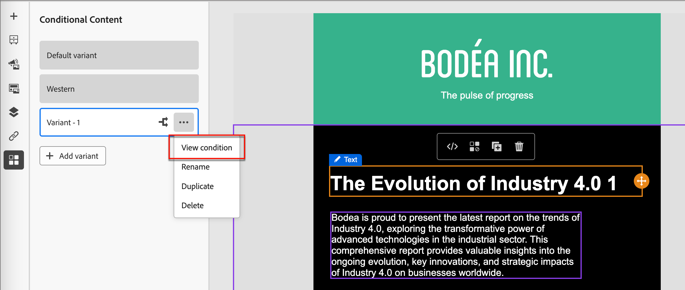
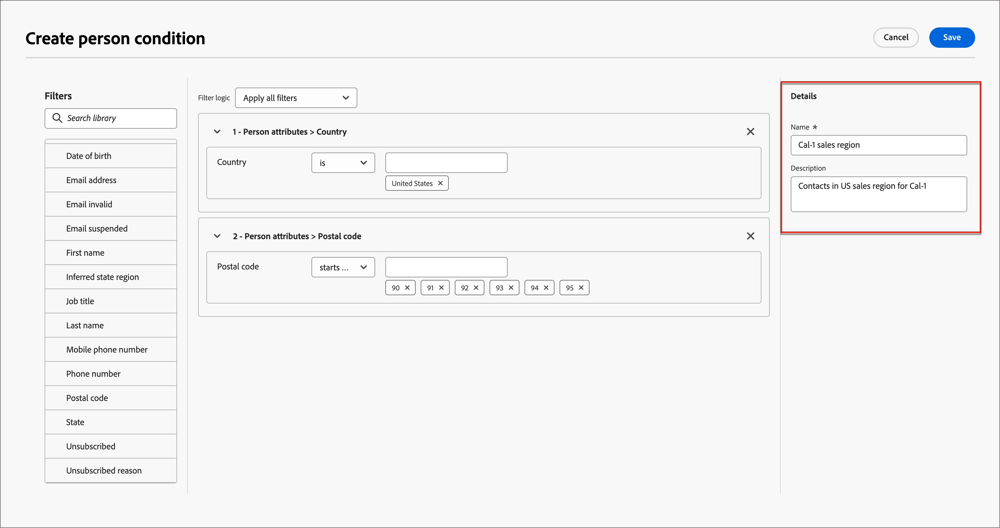

# Villkorligt innehåll

Med villkorligt innehåll kan du anpassa e-postinnehåll baserat på villkorliga regler. Dessa regler definieras med hjälp av profilattribut eller sammanhangsbaserade händelser. Du kan skapa villkorliga regler i regelbyggaren, och du kan lagra dem för återanvändning på alla dina kontoresor.

Om du vill lägga till villkorligt innehåll i e-postmeddelanden kan du använda villkorsregler som lagras i biblioteket _Villkor_ i Adobe Journey Optimizer. Använd villkorliga regler i e-postdesignområdet när du [redigerar e-postinnehåll för en kontoresa](./email-authoring.md).

## Lägg till villkorligt innehåll i e-postmeddelanden {#email-content}

>[!CONTEXTUALHELP]
>id="ajo-b2b_conditional_content"
>title="Villkorligt innehåll"
>abstract="Använd villkorsregler för att skapa flera varianter av en innehållskomponent. Om inget av villkoren uppfylls när meddelandet skickas visas innehållet från standardvarianten."

>[!CONTEXTUALHELP]
>id="ajo-b2b_conditional_rule_select"
>title="Villkorligt innehåll"
>abstract="Använd en villkorsstyrd regel som sparats i biblioteket eller skapa en ny."

När du skapar ett e-postmeddelande för din kontoresa i e-postdesignområdet kan du använda villkorsregler för att definiera flera varianter för en innehållskomponent.

1. Markera en innehållskomponent och klicka på ikonen **[!UICONTROL Enable conditional content]** i komponentverktygsfältet.

   Komponenten kontureras med orange för att ange att den aktiveras som en villkorlig komponent. Fönstret **[!UICONTROL Conditional Content]** visas till vänster med _Standardvariant_ och _Variant - 1.

   {width="700" zoomable="yes"}

   Det ursprungliga innehållet som du markerade och aktiverade är standard och gäller när inga av de villkorliga reglerna uppfylls för någon av de varianter som du definierar.

   I den här rutan kan du definiera flera varianter för den markerade innehållskomponenten med hjälp av villkorsregler.

1. Håll pekaren över den första varianten (_Variant - 1_) och klicka på ikonen _Markera villkor_ (  ).

   {width="700" zoomable="yes"}

   Dialogrutan _[!UICONTROL Select condition]_öppnas och villkorsbiblioteket visas.

   Om du vill visa information om ett villkor för att se till att det är det du vill ha klickar du på ikonen _Mer meny_ (**..**) och väljer **[!UICONTROL View Info]**.

   {width="600" zoomable="yes"}

   Om villkoret som du behöver inte finns [skapar du en villkorsregel](#create-condition) genom att klicka på **[!UICONTROL Create new]**.

1. Markera den villkorliga regeln och klicka på **[!UICONTROL Select]** för att associera den med varianten.

   Du kan granska det associerade villkoret genom att klicka på ikonen _Mer meny_ (**...**) för varianten och välja **[!UICONTROL View condition]**.

   {width="600" zoomable="yes"}

   Klicka på X längst upp till höger för att stänga popup-fönstret.

   {width="500"}

1. För bättre läsbarhet byter du namn på varianten genom att klicka på ikonen _Mer meny_ (**..**) för varianten och sedan väljer du **[!UICONTROL Rename]**.

   Ange ett beskrivande namn för varianten som hjälper dig att identifiera varianten och dess avsikt.

   {width="600" zoomable="yes"}

1. När varianten är markerad i den vänstra rutan ändrar du komponenten för att ändra hur den visas i e-postmeddelandet när villkoret är sant.

   I det här exemplet använder varianten för textkomponenten en annan beskrivning baserat på mottagarens region.

   {width="600" zoomable="yes"}

1. Om det behövs kan du definiera en annan variant genom att klicka på **[!UICONTROL Add variant]**.

   Upprepa steg 2-5 för att markera ett villkor, byt namn på varianten och ändra variantens komponent.

   Du kan lägga till så många varianter som behövs för innehållskomponenten. Du kan när som helst ändra den markerade varianten i den vänstra rutan för att kontrollera hur innehållskomponenten visas för villkoret.

   >[!IMPORTANT]
   >
   >Villkorligt innehåll utvärderas mot associerade regler i den ordning som varianterna listas. Den första varianten med ett villkor som utvärderas som true används för komponenten.
   >
   >Om inget av de definierade variantvillkoren utvärderas som true när du skickar e-postmeddelandet visas innehållskomponenten enligt **[!UICONTROL Default variant]**.

1. Om du vill ta bort en variant klickar du på ikonen _Mer meny_ (**..**) för varianten och väljer **[!UICONTROL Delete]**.

   Klicka på **[!UICONTROL Delete]** i bekräftelsedialogrutan.

## Villkorliga regler

Villkorliga regler är en uppsättning villkorsuttryck som kan utvärderas som sant eller falskt. Du kan använda dessa regler för att avgöra vilken innehållsvariant som ska visas i ett e-postmeddelande baserat på olika filter, till exempel profilattribut eller sammanhangsbaserade händelser.

Villkorliga regler lagras i villkorsbiblioteket, där de är tillgängliga för återanvändning i hela kundresans innehåll för din organisation.
<!-- 

>[!NOTE]
>
>You need the [Manage Library Items](../administration/ootb-product-profiles.md) permission to save or delete conditional rules. Saved conditions are available for use by all users within an organization. -->

### Villkorsfilter {#condition-filters}

| Villkorstyp | Filter | Beskrivning |
| -------------- | ------- | ----------- |
| **Konto** | Kontoattribut | Attribut från kontoprofilen, inklusive: <li>Årliga intäkter</li><li>Ort</li><li>Land</li><li>Medarbetarstorlek</li><li>Bransch</li><li>Namn</li><li>SIC-kod</li><li>Stat</li> |
| | [!UICONTROL Special filters] > [!UICONTROL Has Buying Group] | Kontot har eller saknar medlemmar i inköpsgrupper. Kan även utvärderas mot ett eller flera av följande kriterier: <li>Intresse av lösningar</li><li>Status för inköpsgrupp</li><li>Slutförandepoäng</li><li>Engagement Score</li> |
| **Person** | [!UICONTROL Activity history] > [!UICONTROL Email] | E-postaktiviteter som är kopplade till resan: <li>[!UICONTROL Clicked link in email]</li><li>Öppen e-post</li><li>Levererades via e-post</li><li>Har skickats e-post</li> Dessa villkor utvärderas med hjälp av ett markerat e-postmeddelande från tidigare under resan. |
|  | [!UICONTROL Person Attributes] | Attribut från personprofilen, inklusive: <li>Ort</li><li>Land</li><li>Födelsedatum</li><li>E-postadress</li><li>Ogiltig e-postadress</li><li>E-postmeddelandet har pausats</li><li>Förnamn</li><li>Ingångsregion</li><li>Befattning</li><li>Efternamn</li><li>Mobiltelefonnummer</li><li>Telefonnummer</li><li>Postnummer</li><li>Stat</li><li>Avprenumererad</li><li>Orsak till avbeställning</li> |
| | [!UICONTROL Special filters] > [!UICONTROL Member of Buying Group] | Personen är eller är inte medlem i en inköpsgrupp och utvärderas utifrån ett eller flera av följande kriterier: <li>Intresse av lösningar</li><li>Status för inköpsgrupp</li><li>Slutförandepoäng</li><li>Engagement Score</li><li>Roll</li> |

### Skapa en villkorsregel {#create-condition}

>[!CONTEXTUALHELP]
>id="ajo-b2b_conditions_rule_editor"
>title="Skapa villkor"
>abstract="Kombinera attribut och sammanhangsbaserade händelser för att skapa regler som bestämmer vilken innehållsvariant som ska visas i e-postmeddelanden."

Du kan komma åt villkorsstyrd regelbyggaren från e-postdesignområdet när du väljer ett villkor för en komponentvariant.

1. Klicka på **[!UICONTROL Create new]** i dialogrutan _[!UICONTROL Select condition]_och välj villkorstyp:

   * **[!UICONTROL Person condition]** - Välj den här typen om du vill skapa den villkorliga regeln med personattribut och sammanhangsberoende händelser.
   * **[!UICONTROL Account condition]** - Välj den här typen om du vill skapa villkorsregeln med kontoattribut.

   {width="600" zoomable="yes"}

1. Bygg den villkorliga regeln efter dina behov.

   För varje attribut eller händelse som du vill ta med i regeln drar och släpper du objektet på regelarbetsytan. Expandera filtret och slutför uttrycket.

   {width="600" zoomable="yes"}

   Om du inkluderar fler än ett filter anger du **[!UICONTROL Filter logic]**:

   * **[!UICONTROL Apply all filters]** - Regeln utvärderas som true om **all** filtren är true.
   * **[!UICONTROL Apply any filters]** - Regeln utvärderas som true om **any** av filtren är true.

1. Till höger anger du **[!UICONTROL Name]** och **[!UICONTROL Description]** (valfritt) för regeln.

   Använd ett beskrivande namn och en användbar beskrivning för att hjälpa andra i organisationen så att de kan återanvända det i stället för att skapa ett annat dubblettvillkor.

   {width="600" zoomable="yes"}

1. När den villkorliga regeln är klar klickar du på **[!UICONTROL Save]**.

   Den villkorliga regeln sparas i biblioteket och du kan välja den för den aktuella varianten. Den ingår också i biblioteket och kan användas av andra varianter av dynamiskt innehåll på kontoresor.

### Duplicera en regel

Villkorliga regler som sparats i biblioteket kan inte ändras. Du kan dock duplicera en befintlig regel och ändra den för att skapa en ny regel.

1. Klicka på ikonen _Mer meny_ (**..**) för varianten och välj **[!UICONTROL Duplicate]**.

   En dubblett av regeln öppnas i regelbyggaren. Använd dubbletten som startpunkt för regeln som du vill skapa.

   {width="600" zoomable="yes"}

1. I regelbyggaren kan du ändra, lägga till eller ta bort villkor beroende på vad du behöver.

1. Ändra namnet och beskrivningen så att de matchar syftet eller objekten i regeln.

1. När den villkorliga regeln är klar klickar du på **[!UICONTROL Save]**.
