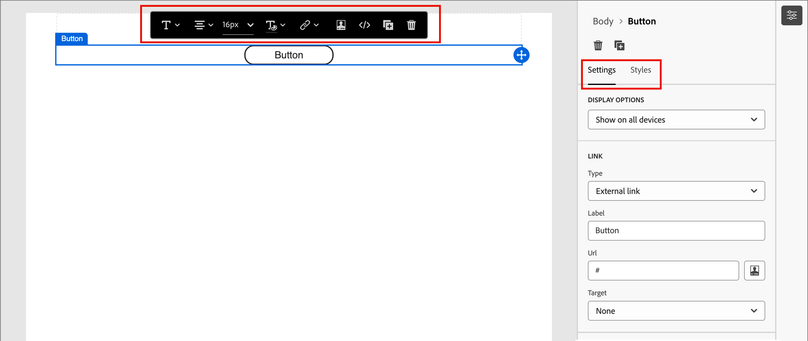

# Innehållskomponenter {#content-components}

>[!CONTEXTUALHELP]
>id="ajo-b2b_content_components_email"
>title="Om Innehållskomponenter"
>abstract="Innehållskomponenterna är tomma platshållare för innehåll som du kan använda för att utforma ett e-postmeddelande."

>[!CONTEXTUALHELP]
>id="ajo-b2b_content_components_landing_page"
>title="Om Innehållskomponenter"
>abstract="Innehållskomponenterna är tomma platshållare för innehåll som du kan använda för att utforma en landningssida."

>[!CONTEXTUALHELP]
>id="ajo-b2b_content_components_fragment"
>title="Om Innehållskomponenter"
>abstract="Innehållskomponenter är tomma platshållare för innehåll som du kan använda för att utforma ett fragment."

>[!CONTEXTUALHELP]
>id="ajo-b2b_content_components_template"
>title="Om Innehållskomponenter"
>abstract="Innehållskomponenter är tomma platshållare för innehåll som du kan använda för att utforma en mall."

När du utformar innehåll för e-post, landningssidor, mallar och visuella fragment använder du [!UICONTROL Content components] för att lägga till visuella designelement. Du kan lägga till så många innehållskomponenter du behöver inuti en eller flera strukturkomponenter, som definierar layouten.

## Innehållsbibliotek

Avsnittet **[!UICONTROL Contents]** längst ned i komponentbiblioteket visar de tillgängliga innehållskomponenterna:

| Ikon | Komponent | Beskrivning |
| --------- | ---- | ----------- |
|  | [Behållare](#container) | Lägg till den här komponenten i designen så att den innehåller en rektangulär behållare som du kan använda för att gruppera komponenter eller använda bakgrunds- eller kantformat på ett område. |
|  | [Knapp](#button) | Lägg till den här komponenten i designen om du vill inkludera ett klickbart knappelement. |
|  | [Text](#text) | Lägg till den här komponenten i designen för att inkludera en textmassa. |
|  | [Delare](#divider) | Lägg till den här komponenten i designen om du vill inkludera en vågrät linje för att skilja olika delar av innehållet åt. |
|  | [HTML](#html) | Lägg till den här komponenten i din design för att kopiera och klistra in de olika delarna av din befintliga HTML. Använd den här komponenten för att skapa ett kostnadsfritt modulärt HTML-block för att återanvända externt innehåll. |
|  | [Bild](#image) | Lägg till den här komponenten i designen för att infoga en bildfil. |
|  | [Socialt](#social) | Lägg till den här komponenten i designen för att infoga länkar till sidor för sociala medier. |
|  | [Formulär](#form) | **_Endast tillgängligt för landningssidor._** Lägg till den här komponenten i designen för att infoga ett skapat formulär. |

## Verktygsfält för innehållskomponent

Varje innehållskomponenttyp visar ett verktygsfält när du markerar den på arbetsytan. De tillgängliga verktygen, som varierar beroende på komponenttyp, är ett enkelt sätt att arbeta med komponenten direkt i det återgivna innehållet. Det innehåller formaterings- och funktionalitetsfunktioner som kan användas för komponenttypen.

{width="450"}

### Formateringsverktyg

+++Ändra textstil

<table>
    <tr>
        <th style="width: 30%;">Verktyg</th>
        <th style="width: 50%;">Användning</th>
        <th style="width: 20%;">Komponenter</th>
    </tr>
    <tr>
        <td></td>
        <td>Använd fet, kursiv, understrykning eller genomstrykning, upphöjd eller nedsänkt till den markerade textsträngen.</td>
        <td><li>Knapp <li>Text</td>
    </tr>
</table>

+++

+++Vågrät justering

<table>
    <tr>
        <th style="width: 30%;">Verktyg</th>
        <th style="width: 50%;">Användning</th>
        <th style="width: 20%;">Komponenter</th>
    </tr>
    <tr>
        <td></td>
        <td>Använd en vågrät justeringstyp på komponentinnehållet. Välj vänster, centrerad, höger eller marginaljusterad. </td>
        <td><li>Knapp <li>Text</td>
    </tr>
</table>

+++

+++Skapa lista

<table>
    <tr>
        <th style="width: 30%;">Verktyg</th>
        <th style="width: 50%;">Användning</th>
        <th style="width: 20%;">Komponenter</th>
    </tr>
    <tr>
        <td></td>
        <td>Använd formatering av en ordnad eller osorterad lista på komponenttexten.</td>
        <td><li>Text</td>
    </tr>
</table>

+++

+++Ange rubrik

<table>
    <tr>
        <th style="width: 20%;">Verktyg</th>
        <th style="width: 60%;">Användning</th>
        <th style="width: 20%;">Komponenter</th>
    </tr>
    <tr>
        <td></td>
        <td>Använd formatering på rubriknivå i stycket för markörens plats.</td>
        <td><li>Knapp <li>Text</td>
    </tr>
</table>

+++

+++Teckenstorlek

<table>
    <tr>
        <th style="width: 20%;">Verktyg</th>
        <th style="width: 60%;">Användning</th>
        <th style="width: 20%;">Komponenter</th>
    </tr>
    <tr>
        <td></td>
        <td>Använd teckenstorlek på markerad text. Klicka på verktyget och välj storlek eller ange px-värdet.</td>
        <td><li>Knapp <li>Text</td>
    </tr>
</table>

+++

+++Teckenfärg

<table>
    <tr>
        <th style="width: 40%;">Verktyg</th>
        <th style="width: 40%;">Användning</th>
        <th style="width: 20%;">Komponenter</th>
    </tr>
    <tr>
        <td></td>
        <td>Använd teckenfärg på den markerade texten. Välj en färg i väljaren och använd färgreglaget och färgfältet för att välja färgen. Du kan också ange ett känt RGB-, HSL-, HSB- eller hexadecimalt värde. </td>
        <td><li>Knapp <li>Text</td>
    </tr>
</table>

+++

+++Infoga länk

<table>
    <tr>
        <th style="width: 40%;">Verktyg</th>
        <th style="width: 40%;">Användning</th>
        <th style="width: 20%;">Komponenter</th>
    </tr>
    <tr>
        <td></td>
        <td>Skapa en klickbar länk (extern URL eller landningssida) för den markerade texten eller elementet.</td>
        <td><li>Knapp <li>Text <li>Bild </td>
    </tr>
</table>

+++

+++Ta bort länk

<table>
    <tr>
        <th style="width: 15%;">Verktyg</th>
        <th style="width: 60%;">Användning</th>
        <th style="width: 25%;">Komponenter</th>
    </tr>
    <tr>
        <td></td>
        <td> Ta bort den klickbara länken (extern URL eller landningssida) för den markerade texten eller elementet.</td>
        <td><li>Knapp <li>Text <li>Bild </td>
    </tr>
</table>

+++

### Funktionsverktyg

| Verktyg | Namn | Användning |
| ---- | ---- | ----- |
| {width="40"} | Lägg till personalisering | Använd personaliseringsredigeraren för att infoga personaliseringstoken i komponentinnehållet. [Läs mer](./email-authoring.md#personalize-content) |
| {width="40"} | Visa källkoden | Visa HTML-källkoden för komponenten i ett skrivskyddat popup-fönster.  {width="200"} |
| {width="40"} | Aktivera villkorligt innehåll | (E-post och fragment) Aktivera villkorliga varianter för komponenten. [Läs mer](./conditional-content.md) |
| {width="40"} | Duplicera | Skapa en kopia av komponenten och lägg till den direkt nedanför. |
| {width="40"} | Ta bort | Ta bort komponenten. |

## Lägga till en innehållskomponent i din design

1. Använd en befintlig mall eller lägg till de nödvändiga strukturkomponenterna på en tom arbetsyta för att definiera layouten i den visuella designrymden.

1. I biblioteket **[!UICONTROL Components]** tar du tag i _Draghandtaget_  för den innehållskomponent du vill använda och drar och släpper det sedan i strukturkomponenterna.

   Du kan lägga till flera komponenter i en enda strukturkomponent och i varje kolumn i en strukturkomponent.

   {width="600" zoomable="yes"}

1. Justera komponentvisningen med flikarna **[!UICONTROL Settings]** och **[!UICONTROL Style]** till höger, eller med kontextverktygsfältet som visas på arbetsytan.

   Du kan till exempel ändra komponentens textstil, utfyllnad eller marginal.

   {width="600" zoomable="yes"}

När du arbetar med din design kan du även [ta bort](#remove-a-content-component) eller [duplicera](#duplicate-a-content-component) en komponent.

## Inställningar och format för innehållskomponenten

När du har lagt till en komponent markeras den i den visuella designrymden och dess egenskaper visas på den högra panelen. Du kan också när som helst markera en komponent om du vill ändra inställningar och format. Många inställningar och format är specifika för komponenten, men det finns några standardinställningar och format som du kan använda för alla markerade innehållskomponenter.

### Visningsalternativ

Om du vill exkludera komponenten från skrivbordet eller mobila enheter ändrar du inställningen **[!UICONTROL Display Options]**. Standardvärdet, _[!UICONTROL Show on all devices]_, aktiverar visning på alla enheter. Välj en annan inställning för att göra komponenten exklusiv efter enhetstyp:

* _[!UICONTROL Show only on desktop devices]_- Välj den här inställningen när du vill visa komponenten på skrivbordsenheter och exkludera den för mobila enheter.
* _[!UICONTROL Show only on mobile devices]_- Välj den här inställningen när du vill visa komponenten på mobila enheter, som telefoner och surfplattor, och exkludera den för stationära enheter.

{width="400" zoomable="yes"}

### Behållare

Använd en behållare för att tillämpa en viss formatering på en grupp innehållskomponenter. Lägg till en [!UICONTROL Container]-komponent och lägg sedan till andra innehållskomponenter i den. Den här komponenten liknar hur du kan använda ett `div`-element i HTML. Du kan använda ett distinkt format för behållaren som skiljer sig från det format som används för innehållskomponenterna som den innehåller.

Lägg till exempel till en _[!UICONTROL Container]_-komponent och lägg sedan till en_[!UICONTROL Button]_-komponent i den behållaren. Du kan använda en särskild ytformatering för behållaren och formatera knappen och dess bakgrund efter behov.

{width="600" zoomable="yes"}

+++Bakgrund

{{styles-background}}

+++

+++Kant

{{styles-border}}

+++

+++Storlek

{{styles-size}}

+++

+++Marginal

{{styles-margin}}

+++

+++Utfyllnad

{{styles-padding}}

+++

### Knapp

Använd komponenten [!UICONTROL Button] för att infoga en eller flera klickbara knappar i ditt innehåll. Använd knappar för att dirigera om sidvisningsprogram eller e-postmottagare till stödinnehåll (publicerad landningssida eller en extern länk).

#### Lägga till knapptexten

När knappkomponenten visas på arbetsytan innehåller verktygsfältet alternativ för textformatering samt för anpassning och villkorliga varianter. Mer information om redigeringsverktygets alternativ finns i #.

När du anger knappetikettexten och anger formateringen ändras knappens storlek så att innehållet får plats.

{width="500" zoomable="yes"}

#### Ange länkalternativ

Använd alternativen för _[!UICONTROL Settings]_på fliken **[!UICONTROL Link]**för att definiera knapptexten, länkmålet och webbläsarbeteendet för att läsa in målsidan.

1. Ange **[!UICONTROL Type]** för länken:

   * **[!UICONTROL External link]** - Välj den här typen om du vill använda en standard-URL som länkmål.

     Ange länkens URL i **[!UICONTROL Url]**. Klicka på ikonen _Anpassa_ (  ) om du vill använda en personaliseringstoken som parameter i URL:en.

     {width="200"}

   * **Landningssida** - Välj den här typen för att välja en publicerad landningssida i <!-- Journey Optimizer B2B Edition (_Beta_) or -->den anslutna Marketo Engage-instansen.

     För alternativet **[!UICONTROL Landing Page]** väljer du den publicerade landningssidan. Klicka på ikonen _Markera sida_ (  ) och [välj den publicerade landningssidan](./landing-pages.md#link-to-a-landing-page).

     {width="200"}

1. För **[!UICONTROL Label]** anger du den text som du vill visa inuti knappen.

   Knappens storlek justeras enligt den angivna texten och formateringen.

1. För **[!UICONTROL Target**] väljer du hur det länkade målet ska omdirigeras från e-postmeddelandet eller sidan:

   * _[!UICONTROL None]_- Öppnar länken med standardwebbläsaren eller klientfunktionen (standard).
   * _[!UICONTROL Blank]_- Öppnar länken i ett nytt fönster eller på en ny flik.
   * _[!UICONTROL Self]_- Öppnar länken i samma ram.
   * _[!UICONTROL Parent]_- Öppnar länken i den överordnade ramen.
   * _[!UICONTROL Top]_- Öppnar länken i hela fönstret.

#### Ange format

Anpassa knappformatet på fliken **[!UICONTROL Styles]**.

+++Bakgrund

{{styles-background}}

+++

+++Text

{{styles-text}}

+++

+++Kant

{{styles-border}}

+++

+++Storlek

{{styles-size}}

+++

+++Justering

+++

+++Knappmarginal

+++

+++Behållarmarginal

{{styles-margin}}

+++

+++Utfyllnad

{{styles-padding}}

+++

+++Avancerat

{{styles-advanced}}

+++

### Text

Använd komponenten Text för att infoga ett textblock i innehållet. När textkomponenten är markerad på arbetsytan anger du texten och använder verktygsfältsalternativen för att lägga till textbunden formatering och alternativ, inklusive anpassningstoken och villkorsstyrda varianter. Mer information om hur du skapar text, inklusive infogad formatering och alternativ, i designområdet finns i Skapa text.

Anpassa textkomponentens format på fliken **[!UICONTROL Styles]**.

+++Bakgrund

{{styles-background}}

+++

+++Text

Dessa format används på hela textblocket. Du kan använda textbunden formatering på en markerad textsträng.

{{styles-text}}

+++

+++Kant

{{styles-border}}

+++

+++Storlek

{{styles-size}}

+++

+++Marginal

{{styles-margin}}

+++

+++Utfyllnad

{{styles-padding}}

+++

+++Avancerat

{{styles-advanced}}

+++

### Delare

Lägg till en _Divider_-komponent för att införliva en linjär delning mellan avsnitt i innehållet.

+++Bakgrund

{{styles-background}}

+++

+++Linje

+++

+++Storlek

{{styles-size}}

+++

+++Justering

{{styles-alignment-h}}

+++

+++Marginal

{{styles-margin}}

+++

+++Utfyllnad

{{styles-padding}}

+++

+++Avancerat

{{styles-advanced}}

+++

### HTML

Använd HTML-komponenten för att lägga till delar av din befintliga HTML. Den här komponenten är ett enkelt sätt att skapa modulära HTML-element som återanvänder externt innehåll.

1. Markera komponenten på arbetsytan och klicka på ikonen _Visa källkoden_ i verktygsfältet.

   [Öppna kodredigeraren och lägg till HTML](./assets/content-components-html-show-code.png){width="450"}

1. Klistra in HTML i textrutan och klicka på **[!UICONTROL Save]**.

   [Dialogrutan Redigera HTML](./assets/content-components-html-edit-dialog.png){width="600" zoomable="yes"}

   Om HTML är giltigt återges elementet på arbetsytan. Om det är ett element som mappar till en av de andra innehållskomponenterna kan du ändra inställningarna och formaten på den högra panelen enligt komponenttypen. Om så inte är fallet förblir det en HTML-komponent.

För en HTML-komponent kan du ange följande format för hela HTML-komponenten på den högra panelen:

+++Bakgrund

{{styles-background}}

+++

+++Kant

{{styles-border}}

+++

+++Storlek

{{styles-size}}

+++

+++Justering

{{styles-alignment-h-v}}

+++

+++Marginal

{{styles-margin}}

+++

+++Utfyllnad

{{styles-padding}}

+++

+++Avancerat

{{styles-advanced}}

+++

### Bild

Använd komponenten [!UICONTROL Image] för att infoga en bildresurs i ditt innehåll. När komponenten _Bild_ har valts på arbetsytan kan du lägga till eller ändra den visade bildresursfilen.

{width="400" zoomable="yes"}

#### Lägg till bildresursen

Välj [resurskälltyp](./assets-overview.md) och välj en bildfil:

* **[!UICONTROL Marketo Engage Assets]** - Välj den här typen om du vill bläddra och välja en bildresurs från Journey Optimizer B2B edition-biblioteket eller från den anslutna Market Engage-instansen.

  {width="700" zoomable="yes"}

  I dialogrutan kan du välja en bild från den valda databasen och arbetsytan. Klicka på **[!UICONTROL Select]** för att lägga till resursen.

  Det finns verktyg som hjälper dig att hitta den resurs du behöver:

   * Klicka på ikonen _Filter_ längst upp till vänster om du vill filtrera de visade objekten enligt dina kriterier.

   * Ange text i fältet _Sök_ om du vill filtrera de visade objekten så att de matchar resursnamnet.

     {width="700" zoomable="yes"}

* **[!UICONTROL Experience Manager Assets]** - Välj den här typen för att bläddra och välja en bildresurs i en [konfigurerad Experience Manager Assets-databas](../admin/configure-aem-repositories.md).

  I dialogrutan _[!UICONTROL Select Assets]_väljer du en bild med de tillgängliga verktygen för att hitta resursen som du behöver och klickar på&#x200B;**[!UICONTROL Select]**:

   * Ändra **[!UICONTROL Repository]** överst till höger.

   * Klicka på **[!UICONTROL Manage assets]** överst till höger för att öppna Assets-databasen på en annan webbläsarflik och använda AEM Assets hanteringsverktyg.

   * Klicka på _vytypsväljaren_ längst upp till höger för att ändra visningen till **[!UICONTROL List View]**, **[!UICONTROL Grid View]**, **[!UICONTROL Gallery View]** eller **[!UICONTROL Waterfall View]**.

   * Klicka på ikonen _Sorteringsordning_ om du vill ändra sorteringsordningen mellan stigande och fallande.

     {width="700" zoomable="yes"}

   * Klicka på menypilen **[!UICONTROL Sort by]** om du vill ändra sorteringsvillkoren till **[!UICONTROL Name]**, **[!UICONTROL Size]** eller **[!UICONTROL Modified]**.

   * Klicka på ikonen _Filter_ längst upp till vänster om du vill filtrera de visade objekten enligt dina kriterier.

   * Ange text i fältet _Sök_ om du vill filtrera de visade objekten så att de matchar resursnamnet.

  {width="700" zoomable="yes"}

* **[!UICONTROL Import media]** - Välj den här typen om du vill välja en fil från datorn och importera den till Journey Optimizer B2B edition resursbibliotek.

  I dialogrutan _[!UICONTROL Upload image]_drar och släpper du en fil från systemet till filrutan. Den maximala filstorleken är 100 MB.

  {width="450"}

  De markerade bildernas filnamn visas i dialogrutan. Resursfilnamn måste vara unika (i olika mappar), och om det redan finns en fil med det namnet visas ett meddelande. Namn kan innehålla högst 100 tecken och får inte innehålla specialtecken (som `;`, `:`, `\` och `|`).

  Klicka på **[!UICONTROL Import]**.

Du kan lägga till en bildtitel och alternativ text för bilden på den högra panelen.

{width="250"}

#### Ange länkalternativ

Använd alternativen för _[!UICONTROL Settings]_på fliken **[!UICONTROL Link]**för att länka bilden till ett mål och webbläsarbeteendet för att läsa in målsidan.

1. Ange **[!UICONTROL Type]** för länken:

   * **[!UICONTROL External link]** - Välj den här typen om du vill använda en standard-URL som länkmål.

     Ange länkens URL i **[!UICONTROL Url]**. Klicka på ikonen _Anpassa_ (  ) om du vill använda en personaliseringstoken som parameter i URL:en.

     {width="250"}

   * **Landningssida** - Välj den här typen för att välja en publicerad landningssida i <!-- Journey Optimizer B2B Edition (_Beta_) or -->den anslutna Marketo Engage-instansen.

     För alternativet **[!UICONTROL Landing Page]** väljer du den publicerade landningssidan. Klicka på ikonen _Markera sida_ (  ) och [välj den publicerade landningssidan](./landing-pages.md#link-to-a-landing-page).

     {width="250"}

1. För **[!UICONTROL Label]** anger du den text som du vill visa inuti knappen.

   Knappens storlek justeras enligt den angivna texten och formateringen.

1. För **[!UICONTROL Target**] väljer du hur det länkade målet ska omdirigeras från e-postmeddelandet eller sidan:

   * _[!UICONTROL None]_- Öppnar länken med standardwebbläsaren eller klientfunktionen (standard).
   * _[!UICONTROL Blank]_- Öppnar länken i ett nytt fönster eller på en ny flik.
   * _[!UICONTROL Self]_- Öppnar länken i samma ram.
   * _[!UICONTROL Parent]_- Öppnar länken i den överordnade ramen.
   * _[!UICONTROL Top]_- Öppnar länken i hela fönstret.

#### Ange format

Ange stilar för bildkomponenten på den högra panelen.

+++Bakgrund

{{styles-background}}

+++

+++Kant

{{styles-border}}

+++

+++Storlek

{{styles-size}}

+++

+++Justering

{{styles-alignment-h}}

+++

+++Marginal

{{styles-margin}}

+++

+++Utfyllnad

{{styles-padding}}

+++

+++Avancerat

{{styles-advanced}}

+++

### Social

Använd komponenten _Socialt_ för att infoga länkar till sidor för sociala medier i ditt innehåll. Den innehåller tre standardtyper av sociala medier, men du kan lägga till eller ta bort typerna efter behov.

{width="600" zoomable="yes"}

* Om du vill lägga till en typ av sociala medier klickar du på ikonen _Lägg till_ ( **+** ) och väljer en typ av sociala medier som du vill lägga till.

  {width="250"}

* Om du vill ta bort en typ av sociala medier klickar du på **X** bredvid ikonen för sociala medier.

Välj en typ av sociala medier och ange alternativ för den typen:

* **[!UICONTROL URL]** - Ange den URL för sociala medier som du vill länka till grafiken eller ikonen för sociala medier.
* **[!UICONTROL Source]** - Om du vill använda din egen bild i stället för standardbilden väljer du en bildresurs. Du kan välja en bild från den anslutna Marketo Engage-resurskatalogen, en Experience Manager Assets-databas (om den är konfigurerad) eller importera en bildfil från datorn. Mer information om hur du väljer och importerar bildresurser finns i [Information om bildkomponenter](#add-the-image-asset).
* **[!UICONTROL Alt text]** - Ange alternativ text för den visade bilden.

  {width="250"}

Ange **[!UICONTROL Size of images]** om du vill definiera en konsekvent visningsstorlek för all grafik för sociala medier.

Du kan ange följande formatalternativ för komponenten _Social_:

+++Bakgrund

{{styles-background}}

+++

+++Kant

{{styles-border}}

+++

+++Storlek

{{styles-size}}

+++

+++Justering

{{styles-alignment-h}}

+++

+++Marginal

{{styles-margin}}

+++

+++Utfyllnad

{{styles-padding}}

+++

+++Avancerat

{{styles-advanced}}

+++

### Formulär (landningssidor)

[!BADGE Beta]{type=Informative url="/help/user/content/forms.md" tooltip="Funktionen Beta"}

Använd komponenten _Formulär_ för att lägga till ett publicerat formulär till en landningssida eller en landningssidmall. Mer information om hur du skapar och publicerar formulär finns i [Forms](./forms.md).

1. Klicka på verktyget _Formulär_ i komponentverktygsfältet eller använd egenskaperna **[!UICONTROL Embed Form]** till höger för att välja det publicerade formuläret.

   {width="600"}

1. Om du vill åsidosätta standardinställningen **[!UICONTROL Follow up type]** för formuläret ändrar du inställningen enligt kraven för sidan eller mallen.

   Den här sidan kallas även _Tack-sidan_ för formuläret och den här inställningen avgör vad som händer när en besökare skickar formuläret:

   * **[!UICONTROL Stay on page]** - Välj det här alternativet om du vill att besökaren ska vara på samma sida när formuläret skickas.

   * **[!UICONTROL Landing page]** - Välj det här alternativet om du vill välja en Journey Optimizer B2B edition- eller Marketo Engage-landningssida som uppföljning.

   * **[!UICONTROL External URL]** - Välj det här alternativet om du vill ange en URL som uppföljningssida. När besökaren har skickat formuläret läser webbläsaren in den angivna URL:en.

     >[!TIP]
     >
     >Om du vill använda formuläret för att hämta en fil kan du ange en URL för den värdbaserade filen. Med den här konfigurationen fungerar skicka-knappen som en hämtningsknapp.

     {width="280"}

Om det behövs väljer du fliken **[!UICONTROL Styles]** på den högra panelen för att ange formulärmarginaler i strukturkomponenten.

{{styles-margin}}
