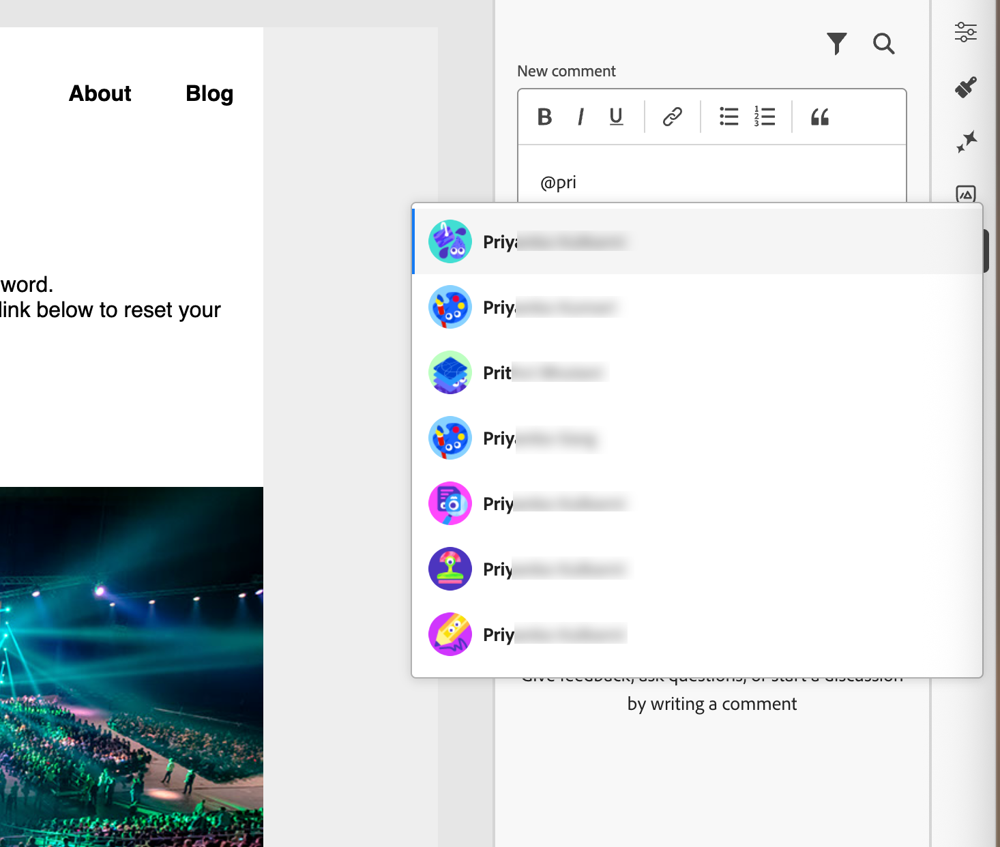
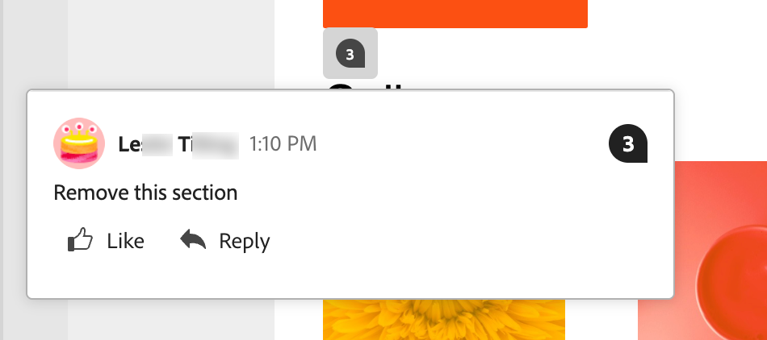

# Verktyg för e-postsamarbete

I [e-postdesignområdet](./email-authoring.md) finns samarbetsverktyg för kommentarer och lösningar, så att marknadsföringsteamen smidigt kan granska, diskutera och slutföra e-postresurser direkt i [!DNL Journey Optimizer B2B Edition]. I stället för att dela utkast över externa verktyg (som chatt, e-posttrådar eller kalkylblad) kan användare kommentera, föreslå redigeringar och åtgärda feedback inom e-postdesignområdet. Använd de här verktygen för att effektivisera arbetsflödet, minska antalet fel och se till att alla intressenter är uppdaterade innan du lanserar din e-postkampanj på en kontoresa:

* **_Centraliserad feedback_** - Samla in och spåra all feedback på ett och samma ställe.

* **_Snabbare granskningar_** - Medarbetare kan granska e-postkopian och resurserna i redigeringsmiljön.

* **_Förbättrad precision_** - Minskar risken för felkommunikation genom att behålla alla redigeringar som är kopplade till själva e-postmeddelandet.

* **_Genomskinlighet_** - Alla kommentarer och upplösningar förblir loggade, vilket tydligt visar vilka ändringar som föreslogs och implementerades.

* **_Collaboration i sitt sammanhang_** - Granska innehållskopia, bilder och call-to-action-element (CTA) i layouten.

<!-- Enable asynchronous collaboration between team members for an email asset
Allow users to attach comments to specific design elements
Provide a unified interface for viewing and managing all comments within a project
Support comment placement, editing, deleting, and navigation
Display visual indicators (badges) for elements with associated comments -->

## Aktivera e-postsamarbetsverktyg för granskare

Produktadministratörer kan aktivera åtkomst till e-postsamarbetsverktygen genom att tilldela behörigheten **[!UICONTROL Manage B2B Emails]** via användargränssnittet _Behörigheter_ i Adobe Experience Cloud.

+++ Aktivera e-postbehörigheter

1. Gå till fliken **[!UICONTROL Roles]** i appen Behörigheter och välj önskad [roll](https://experienceleague.adobe.com/sv/docs/experience-platform/access-control/abac/permissions-ui/roles){target="_blank"}.

1. Klicka på **[!UICONTROL Edit]** om du vill ändra behörigheterna.

1. Lägg till resursen **[!UICONTROL B2B Assets]** och välj sedan **[!UICONTROL Manage B2B Emails]**.

   {width="700" zoomable="yes"}

1. Klicka på **[!UICONTROL Save]** för att tillämpa ändringarna.

   Behörigheterna uppdateras automatiskt för alla användare som redan har tilldelats rollen.

1. Om du vill tilldela den här rollen till nya användare väljer du fliken **[!UICONTROL Users]** på _[!UICONTROL Roles]_-kontrollpanelen och klickar på&#x200B;**[!UICONTROL Add User]**.

   * Ange användarnamn och e-postadress eller välj en befintlig användare i listan.

     Om användaren inte har skapats än läser du [Experience Platform-dokumentationen](https://experienceleague.adobe.com/sv/docs/experience-platform/access-control/abac/permissions-ui/users){target="_blank"}.

   * Klicka på **[!UICONTROL Save]** för att tillämpa ändringarna.

+++

## Visa samarbetsverktyg och kommentarer

När du skapar, redigerar eller granskar innehåll i e-postdesignområdet kan du komma åt panelen _Collaboration_ och lägga till eller hantera kommentarer för e-postinnehållet.

Klicka på ikonen _Collaboration_ (  ) i den högra navigeringen.

{width="700" zoomable="yes"}

## Collaboration arbetsflöde

Du kan använda samarbetsverktygen för att följa ett standardarbetsflöde för innehåll:

1. [Bjud in](#invite-collaborators-and-reviewers) dina medarbetare och granskare.
1. Granskare [lägger till kommentarer](#add-comments).
1. Läs kommentarer, [lägg till svar](#reply-to-a-comment) för att diskutera feedback och göra nödvändiga ändringar.
1. Granskare eller författare [löser kommentarer](#resolve-comments).

>[!BEGINSHADEBOX]

**Bästa tillvägagångssätt för att använda samarbetsverktygen**

* Använd taggningen `@` så att feedback snabbt når rätt teammedlem.

* Gruppera relaterad feedback i en enda kommentarstråd i stället för i flera utspridda anteckningar.

* Lös alltid kommentarer så fort de är adresserade för att upprätthålla ett rent arbetsflöde.

* Spara en färdig godkänd version för regelefterlevnad/revision.

>[!ENDSHADEBOX]

### Bjud in medarbetare och granskare

1. Markera texten i e-postmeddelandet.

1. Klicka på ikonen _Collaboration_ (  ) i den högra navigeringen.

1. Överst i den högra panelen anger du din inbjudan så att användarna kan samarbeta och ge feedback.

   Använd symbolen `@` för att adressera och meddela användare. Dessa användare får e-post och pulsmeddelanden i produkten.

   När du skriver de första bokstäverna i namnet efter symbolen visas en popup-lista med matchande användarnamn. Du kan ange fler bokstäver i namnet för att förbättra resultatet.

   {width="550"}

   Välj det namn som ska läggas till för meddelande.

   Lägg till så många medarbetare eller granskare som du vill ta med i inbjudan.

   {width="700" zoomable="yes"}

1. Klicka på **[!UICONTROL Submit]**.

### Lägg till kommentarer

Som e-postmedarbetare eller granskare öppnar du e-postmeddelandet i designområdet och lägger till din feedback. Du kan ange allmän feedback på panelen _Collaboration_ eller markera komponenter på arbetsytan och lägga till en kommentar som är specifik för designelementet. Tagga teamkamrater med `@`, till exempel _@John Doe Uppdatera CTA copy_.

Varje ny kommentar startar en tråd där medarbetare kan använda _Svara_ för att fortsätta diskussionen. Varje kommentar/tråd som är kopplad till ett designelement numreras så att du enkelt kan identifiera elementet där det används.

#### Allmänna kommentarer och feedback

Använd textfältet längst upp på panelen _Collaboration_ för att ange en allmän kommentar om e-postinnehållet. Använd symbolen `@` för att adressera och meddela användare.

{width="400"}

Klicka på **[!UICONTROL Submit]** om du vill logga kommentaren och skicka meddelanden till taggade användare.

#### Komponentkommentarer

1. Markera en struktur eller innehållskomponent.

1. Klicka på verktyget _Collaboration_ i verktygsfältet.

   {width="600"}

1. Skriv din kommentar i textfältet.

1. Klicka på **[!UICONTROL Submit]**.

Medarbetarna kan klicka på den numrerade nålikonen på e-postarbetsytan för att visa kommentarer.

{width="450"}

#### Svara på en kommentar

För varje kommentar kan du använda funktionen _[!UICONTROL Reply]_&#x200B;för att fortsätta en diskussion eller besvara en fråga.

Klicka på **[!UICONTROL Reply]** längst ned i kommentaren och ange texten för ditt svar. Om du vill ta med en citat från den aktuella kommentaren i ditt svar klickar du på ikonen _Mer-menyn_ ( **..** ) och väljer **[!UICONTROL Quote reply]**.

{width="350"}

### Lös kommentarer

Som författare eller designer kan du utvärdera feedback från granskarna och avgöra vilka ändringar du vill göra. När ändringarna är klara och begäran är klar klickar du på ikonen _Mer_ ( **...** ) och väljer **[!UICONTROL Resolve]**.

{width="350"}

Klicka på **[!UICONTROL Resolve]** i bekräftelsedialogrutan.

## Hantera kommentarer

Hantera kommentarerna och trådarna för att utvärdera status för samarbetsarbetet.

### Placera en kommentar

Om en kommentar inte är associerad med ett element på e-postarbetsytan kan du _fästa_ kommentaren till ett element efter behov. Klicka på ikonen _Mer meny_ ( **..** ) och välj **[!UICONTROL Place the comment]**. Markera sedan designkomponenten på arbetsytan.

{width="350"}

### Ta bort kommentarer

Du kan rensa kommentarloggen genom att ta bort och ta bort dem. Klicka på ikonen _Mer meny_ ( **..** ) och välj **[!UICONTROL Remove Comment]** eller **[!UICONTROL Delete]**.

{width="350"}

* När du tar bort en kommentar tar åtgärden bort den från designelementet (som markerades när kommentaren skapades). Kommentaren är fortfarande en del av kommentarsposten för e-postmeddelandet.

* När du tar bort en kommentar tas den bort permanent från posten.

### Lösta kommentarer

Lösta kommentarer är som standard dolda på panelen _Collaboration_. Du kan visa lösta kommentarer när som helst genom att rensa filtret. Klicka på ikonen _Filter_ (  ) och avmarkera kryssrutan **[!UICONTROL Hide resolved comments]**.

{width="350"}

De lösta kommentarerna innehåller en _olös_-ikon (  ). Om du fastställer att en kommentar/tråd inte har lösts och ytterligare ändringar behövs, klickar du på ikonen för att ta bort beteckningen _[!UICONTROL Resolved]_.

{width="300"}
