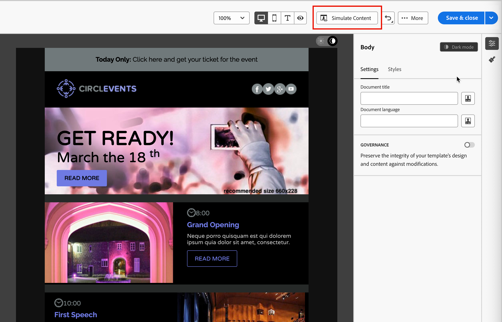

# Mörkt läge för e-postinnehåll {#dark-mode}

>[!CONTEXTUALHELP]
>id="ajo-b2b_dark_mode"
>title="Växla till mörkt läge"
>abstract="Växla till mörkt läge där du kan förhandsgranska hur det kan återges och definiera specifika anpassade inställningar.  Den slutliga återgivningen beror på mottagarens e-postklient. Observera att alla e-postklienter inte stöder anpassat mörkt läge."

>[!CONTEXTUALHELP]
>id="ajo-b2b_dark_mode_preview"
>title="Växla till mörkt läge"
>abstract="Växla till mörkt läge om du vill förhandsgranska hur det kan återges på e-postklienter som stöds.  Den slutliga återgivningen beror på mottagarens e-postklient. Observera att alla e-postklienter inte stöder mörkt läge."

_Mörkt läge_ gör att en e-postklient eller app som stöder det kan visa e-postmeddelanden med mörkare bakgrund och ljusare färger för text, knappar och andra visuella element. Den här typen av bildskärm kan minska ögonbelastningen, spara batteritid och förbättra läsbarheten i miljöer med svag belysning för en mer bekväm visningsupplevelse. Som en allt större trend för större operativsystem och appar är det nu en viktig faktor i den moderna e-postdesignen för att säkerställa att innehållet förblir läsbart och visuellt tilltalande för alla användare.

{width="50%"}

När du [skapar ditt e-postinnehåll](./email-authoring.md) i den visuella designrymden [!DNL Journey Optimizer B2B Edition] kan du växla till _**[!UICONTROL Dark mode]**_-vyn. I den här vyn kan du även definiera specifika anpassade inställningar för stöd av e-postklienter när deras mörka läge är aktiverat.

## Ta hänsyn till e-postklienter

Det finns stora skillnader i hur olika e-postklienter och appar använder mörkt läge. Därför bör du ta hänsyn till förväntningarna på återgivning i mörkt läge med försiktighet. Innan du använder mörkt läge i e-postdesignområdet bör du överväga följande användningsfall för e-postklienter:
<!--
* Check out the list of [email clients supporting dark mode](https://www.caniemail.com/search/?s=dark){target="_blank"}

* Learn more on Dark mode in this [Litmus blog post](https://www.litmus.com/blog/the-ultimate-guide-to-dark-mode-for-email-marketers){target="_blank"}
-->

+++Klienter som inte stöder mörkt läge

Vissa e-postklienter stöder inte den här funktionen alls, till exempel:

* [!DNL Yahoo! Mail]
* [!DNL AOL]

Om du definierar anpassade inställningar för mörkt läge i e-postdesignen kan dessa e-postklienter inte visa någon återgivning i mörkt läge. <!--Regardless of whether the interface is in light or dark mode, your email will render the same.-->

+++

+++Klienter som använder sitt eget mörka läge {#default-support}

Vissa e-postklienter tillämpar systematiskt sitt eget mörka standardläge på alla mottagna e-postmeddelanden. Färger, bakgrunder, bilder och andra element justeras automatiskt efter deras inställningar för mörkt läge och externa inställningar går inte att göra. Bland dessa klienter finns:

* Gmail (Desktop Webmail, iOS, Android™, Mobile Webmail)
* Outlook Windows
* Outlook Windows Mail

<!--It is important to note that less than 25% of email clients offer customization options for dark mode. Clients such as Gmail implement their own dark mode rendering, which is not subject to external modification.-->
I det här fallet åsidosätter klientens inställningar för mörkt läge de anpassade inställningarna för mörkt läge som du definierar i [!DNL Journey Optimizer B2B Edition]

+++

+++Klienter som stöder anpassat mörkt läge

Många av de populäraste e-postklienterna erbjuder alternativet att återge anpassat mörkt läge med frågan `@media (prefers-color-scheme: dark)`, som är den metod som används av e-postformaten i [!DNL Journey Optimizer B2B Edition]. Listan över klienter innehåller:

* Apple Mail macOS
* Apple Mail iOS
* Outlook macOS
* Outlook.com
* Outlook iOS
* Outlook Android™

I det här fallet återges de specifika inställningar som du har definierat i [!DNL Journey Optimizer B2B Edition]. Vissa begränsningar kan dock gälla för varje e-postklient. Vissa klienter (till exempel Apple Mail 16 (macOS 13)) genererar inte något mörkt läge om det finns bilder i e-postinnehållet.

Testa innehållet med de e-postklienter som ni riktar in er på för att få optimala resultat. Om du vill se en simulering som ligger så nära det slutliga resultatet för varje klient som möjligt använder du [LIMUS-e-postteståtergivningsintegrationen](./email-test-rendering.md) i e-postdesignområdet.

+++

## Design för mörkt läge

När du formaterar ditt e-postinnehåll för mörkt läge i [!DNL Journey Optimizer B2B Edition] innehåller den visuella designmodellen två typer av verktyg:

* Använd funktionen [preview](#preview-default-dark-mode) för att granska standardåtergivningen av mörkt läge för de flesta e-postklienter som stöds.

* Om du vill åsidosätta standardinställningarna för stöd av e-postklienter definierar du och använder anpassade mörka lägesinställningar för e-postinnehållet. [Läs mer](#define-custom-dark-mode)

### Förhandsvisa standardläget för mörk {#preview-dark-mode}

<!-- Should work with templates and themes, NOT for LP and fragments - but TBC with eng. 
>[!NOTE]
>
>Currently you may not be able to switch to dark mode if you select an [email template](use-email-templates.md) or if you apply a [theme](apply-email-themes.md).-->

1. Öppna e-postinnehållet i e-postdesignområdet.

   I det övre högra hörnet av arbetsytan finns det en ljusmörk väljare som växlar visningen av innehållet mellan ljust (standard) och mörkt läge.

   {width="700" zoomable="yes"}

1. Ändra väljaren till _mörkt läge_ (  ).

   Innehållet visas på arbetsytan med standardförhandsvisningen i mörkt läge.x

   Som standard används färgschemat `full color invert` i förhandsvisningen i mörkt läge på alla element utom bilder och ikoner. Det här färgschemat identifierar områden med ljusa och mörka element och inverterar dem. Ljusa bakgrunder blir mörk och mörk text blir ljus, eller mörka bakgrunder blir ljusa och ljusa text blir mörka.

   {width="700" zoomable="yes"}

>[!CAUTION]
>
>Den slutliga återgivningen kan variera beroende på mottagarens e-postklient. Om du vill se en simulering som ligger så nära slutresultatet som möjligt för varje e-postklient använder du [Litmus test email rendering](./email-test-rendering.md) -integreringen.

### Definiera anpassade inställningar för mörkt läge {#custom-dark-mode}

>[!CONTEXTUALHELP]
>id="ajo-b2b_dark_mode_image"
>title="Använd en viss bild för mörkt läge"
>abstract="Du kan välja en annan bild som ska visas när mörkt läge är aktiverat.  Att lägga till en viss bild för mörkt läge garanterar inte att den återges korrekt i alla e-postklienter. Observera att alla e-postklienter inte stöder anpassat mörkt läge."

När du har växlat till mörkt läge kan du välja att redigera specifika formatelement för innehållet som bara visas när mörkt läge är aktiverat i mottagarens e-postklient (förutsatt att det har stöd för den funktionen).

>[!NOTE]
>
>Den slutliga återgivningen i mörkt läge beror på varje e-postklient, så resultatet kan variera från en till en annan. Granska [e-postklientens överväganden](#email-client-considerations) om du vill ha mer information.

Det anpassade formatet för mörkt läge i e-postdesignområdet använder <!-- `@media (prefers-color-scheme: dark)` method--> `@media (prefers-color-scheme: dark)` CSS-fråga som identifierar om e-postklienten är inställd på mörkt läge och använder den design med mörka teman som definieras i e-postmeddelandet.

_Definiera anpassade mörkt läge :_

1. Flytta väljaren till _mörkt läge_ (  ) längst upp till höger på arbetsytan.

1. Redigera eventuella formatfärgattribut, till exempel text, bakgrunder eller knappar.

   {width="700" zoomable="yes"}

1. För bilder och ikoner definierar du specifika resurser endast för mörkt läge.

   Du kan inte ändra färgerna på bilder och ikoner, men du kan definiera alternativa resurser som ska användas i mörkt läge. Du kan experimentera med olika färgkombinationer för dina ikoner eller justera färg och mättnad för fotografiska bilder.

   {width="80%"}

   Markera en bild och växla till **[!UICONTROL Dark mode]** med den dedikerade växlingsknappen i rutan **[!UICONTROL Settings]**. Välj sedan en annan bildresurs.

   {width="700" zoomable="yes"}

   Mer information om hur du väljer en bildresurs finns i [Lägg till bildresurser](./email-authoring.md#add-image-assets).

1. När som helst under designändringarna väljer du **[!UICONTROL Switch to live view]** för att kontrollera hur innehållet kan återges på olika enhetsstorlekar.

   I den här vyn ändrar du väljaren till _Mörkt läge_ (  ) om du vill förhandsgranska den mörka lägesversionen av innehållet på olika enheter.

   {width="800" zoomable="yes"}

   >[!CAUTION]
   >
   >Live-vyn är en allmän förhandsvisning som är utformad för att jämföra hur återgivningen kan se ut på olika enhetsstorlekar. Den slutliga återgivningen kan variera beroende på mottagarens e-postklient.

1. När ändringarna av det mörka läget är klara klickar du på **[!UICONTROL Simulate Content]**.

   {width="700" zoomable="yes"}

   Använd verktygen för förhandsgranskning och korrektur för att testa din e-postdesign. Mer information finns i [Förhandsgranska och testa ditt e-postinnehåll](./email-simulate-content.md).

1. Om du har ett Litmus Enterprise-konto väljer du **[!UICONTROL Render email]** för att se den slutliga återgivningen i mörkt läge för olika e-postklienter i Litmus.

   Mer information finns i [Testa e-poståtergivning med Litmus](./email-test-rendering.md).

   >[!CAUTION]
   >
   >Simuleringen simulerar noga hur e-post visas i mörkt läge, men den faktiska återgivningen kan variera beroende på variationer i e-postleverantörer eller inställningar på enhetsnivå.

## Bästa praxis {#best-practices}

Efterhand som användningen av mörkt läge ökar för alla större e-postklienter är det viktigt att tänka på hur dina e-postmeddelanden återges i både ljusa och mörka miljöer, oavsett om du använder [anpassat mörkt läge](#define-custom-dark-mode) eller inte.

Mörkt läge kan ändra färger, bakgrunder och bilder - ibland åsidosätta designalternativ. Följ dessa standarder för att säkerställa visuell enhetlighet, tillgänglighet och varumärkesintegritet:

| Öva |            |
| -------- | ---------- |
| Optimera bilder och logotyper | Checklista:<ul><li>Spara logotyper och ikoner som PNG-filer med genomskinliga bakgrunder för att undvika synliga vita rutor i mörkt läge. <li>Undvik bilder med hårdkodade vita eller ljusa bakgrunder. <li>Om genomskinlighet inte är ett alternativ kan du placera bilder på en solid bakgrund i designen för att förhindra otydliga färgförändringar. |
| Se dina bakgrunder | Checklista:<ul><li>Se till att det finns tillräcklig kontrast mellan text och bakgrundsfärger för läsbarhet i både ljust och mörkt läge. <li>Undvik att använda enbart bakgrundsfärger för viktigt innehåll. Vissa klienter åsidosätter bakgrundsfärger i mörkt läge, så se till att viktig information fortfarande visas. |
| Skapa tillgängligt innehåll i mörkt läge | Checklista:<ul><li>Använd färgkombinationer som är enkla att skilja på för färgblinda. <li>Använd en mellantonspalett för att säkerställa kontrast mot både ljusa och mörka bakgrunder. <li>Använd tillgängliga färgkombinationer med hög kontrast för att förbättra läsbarheten och uppfylla [!DNL Web Content Accessibility Guidelines (WCAG)]-standarder. Använd verktyg som [!DNL WebAIM Contrast Checker] för att verifiera färgkontrast. <li>Undvik tunna teckensnitt eftersom det kan påverka läsbarheten. Om ert varumärke kräver ett tunt teckensnitt kan du fet stil i mörkt läge. <li>Hoppa över rent vitt på rent svart, vilket kan orsaka ögonproblem och kan inverteras automatiskt i vissa e-postklienter. <li>Ange hjälpmedelsanpassad grundformatering om mörkt läge inte stöds. |
| Testa dina e-postmeddelanden i mörkt läge | Checklista:<ul><li>Använd [förhandsvisningen i mörkt läge](#preview-dark-mode) i e-postdesignområdet, där inverterade färgscheman används för att upptäcka problem tidigt. <li>Använd ett Litmus Enterprise-konto med alternativet [[!UICONTROL Render email]](./email-test-rendering.md) om du vill simulera dina designer för vanliga e-postklienter (som Apple Mail, Gmail och Outlook) och se hur färger och bilder fungerar i mörkt läge. |

<!--KEEP dark mode accessibility best practices IN ONE SINGLE LOCATION - for now listed on this page.
If needed, it can be moved to the Design accessible content page:
The best practices for designing accesible content in dark mode are listed in [this section](accessible-content.md#dark-mode).-->

<!--**Inline critical styles**

Inline CSS helps maintain more control over styling, as some clients strip external styles in dark mode.-->
