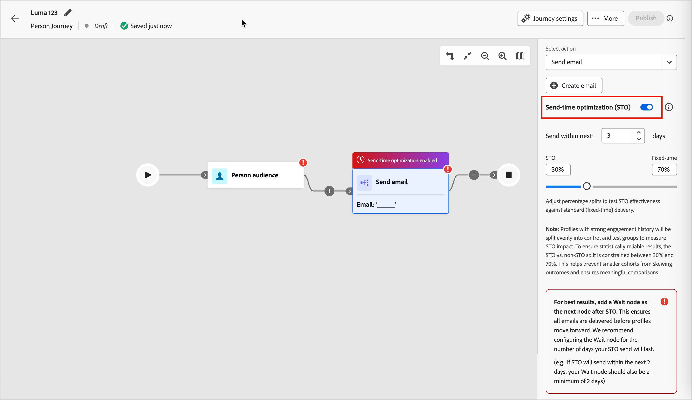

# Tidsoptimering för e-postutskick

Använd optimeringsfunktionen för sändningstid (STO) för att anpassa leveranstiden för e-post för [personresor](../journeys/journeys-overview.md) genom att förutsäga när varje profil är mest benägen att engagera. I stället för en fast sändningstid använder STO historisk e-postinteraktionssignaler för att schemalägga leverans vid den optimala tidpunkten för varje mottagare, vilket förbättrar det övergripande engagemanget.

STO analyserar varje profils historiska engagemang med hjälp av en stor språkmodell. Den förutser och rankar möjliga sändningstider och schemalägger sedan leverans i den högsta rankade tidpunkten i optimeringsfönstret.

## Aktuell tillgänglighet och omfattning

Tidsoptimering för sändning stöds för närvarande för:

* **Resetyp**: Personresor
* **Kanal**: E-post
* **Konfiguration**: _Åtgärdsnod för att skicka e-post_
* **Rapportering**: AI-assistenten via kompetensen för reseövervakning

  Prestandainsikter, som användning, interaktionshöjning och STO jämfört med andra jämförelser, finns tillgängliga via frågor om naturliga språk i AI Assistant.

>[!BEGINSHADEBOX]

Det finns många **_framtida förbättringar_** planerade för STO:

* Stöd för _kontoresor_
* Global STO-konfiguration i området _[!UICONTROL Admin]_
* STO-aktivering på resenivå
* Konfigurerbara test-/kontrolldelningar
* En dedikerad kontrollpanel för STO-rapportering

>[!ENDSHADEBOX]

## Konfiguration

Du kan konfigurera optimering för sändningstid när du [lägger till en _[!UICONTROL Take an action]_&#x200B;nod &#x200B;](../journeys/action-nodes.md) på en personresa.

1. Välj **[!UICONTROL Send email]** för _[!UICONTROL Select action]_.

1. Aktivera funktionen med hjälp av **[!UICONTROL Send-time Optimization]**-växeln.

1. Ange STO-alternativen för att ange fönster- och testdistributionen:

   * **[!UICONTROL Send within next]** - Det här värdet anger optimeringsfönstret (i dagar), som är det tidsintervall inom vilket e-postmeddelanden kan levereras. Om ett webbinarium till exempel inträffar inom fem dagar kan du ange ett fönster på fyra eller fem dagar. STO väljer den bästa förväntade sändningstiden för varje profil i det här fönstret.

   * **STO/fast fördelning** - STO skapar automatiskt en _test- och kontrolldelning_ för att dela upp kvalificerade profiler mellan optimerade och fasta sändningstider. Delningen möjliggör direkt prestandajämförelse. (Framtida förbättringar planeras för att tillåta anpassade delningsprocentsatser.)

   >[!NOTE]
   >
   >Profiler med stark engagemangshistorik delas jämnt in i kontroll- och testgrupper för att mäta STO-påverkan. För att säkerställa statistiskt tillförlitliga resultat är uppdelningen mellan STO och icke-STO begränsad till mellan 30 % och 70 %. Detta förhindrar mindre kohorter från att skevas och säkerställer meningsfulla jämförelser.

   {width="700" zoomable="no"}

1. Direkt efter _[!UICONTROL Send email]_-noden [lägger du till en_ Wait _-nod](../journeys/wait-nodes.md).

   En väntenod måste omedelbart följa en STO-aktiverad e-poståtgärd. Genom att lägga till den här noden kan du vara säker på att profiler finns kvar på resan tills det fullständiga optimeringsfönstret har rensats och alla STO-utskick är slutförda. Om du utelämnar den här noden flaggas konfigurationen som ogiltig.

1. När du är klar med resten av personresan går du vidare till [publicera](../journeys/create-publish-journey.md#publish-a-journey).

## STO-insikter

STO-insikter levereras via _AI-assistenten_ med Journey Agent [_observationsförmåga_](../agents/journey-agent.md#journey-observability-skill). Ni kan ställa frågor om användning, engagemangsmått, test-/kontrollresultat, nodprestanda och övergripande påverkan på kundresan.
