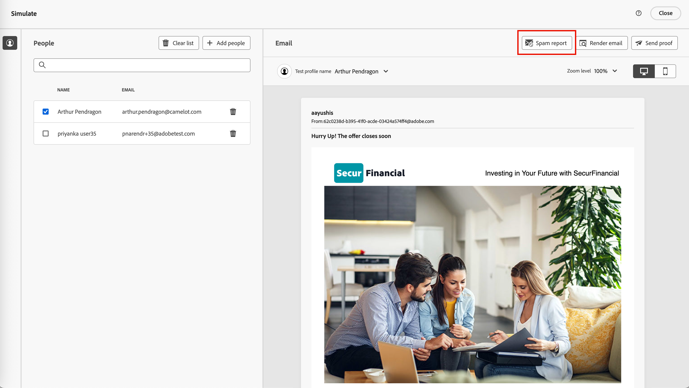

# Granska skräppostrapporten

Många e-postleverantörer och de flesta företagssystem använder en process för skräppostfiltrering. Om du skickar e-postmeddelanden som triggar dessa filter kan det påverka leveransmöjligheterna avsevärt. I Journey Optimizer B2B edition kan du kontrollera spam-poäng för e-postinnehåll genom att generera en skräppostrapport. Den här rapporten använder [[!DNL SpamAssassin]](https://spamassassin.apache.org/) för att testa e-postmeddelandet och hjälper dig att avgöra om ett meddelande kan betraktas som skräppost med antispam-verktyg. Du kan använda informationen i rapporten för att vidta åtgärder som förbättrar poängen för e-postinnehållet och leveransmöjligheterna.

När du granskar dina e-postinställningar eller redigerar innehållet öppnar du sidan _[!UICONTROL Simulate]_och skapar en_ skräppostrapport _som granskar poängsättningen och flaggade element som kan utlösa skräppostfiltrering.

1. Klicka på _[!UICONTROL Simulate]_överst till höger på sidan **[!UICONTROL Spam report]**.

   {width="700" zoomable="yes"}

   Rapporteringsprocessen skannar e-postinnehållet och genererar en poäng med en lista över de utlösta filtreringsreglerna som används för att generera poängen. Faktorer som innehållslayout, struktur, bildstorlek, skräppostutlösare och andra element. En lista över regelutvärderingstesterna för e-postelementen finns i [[!DNL SpamAssassin] testlistan](https://spamassassin.apache.org/old/tests_3_0_x.html).

1. Kontrollera poängen och beskrivningarna för varje objekt.

   >[!NOTE]
   >
   >Spam-poängen beräknas med SpamAssassin och Adobe äger inte reglerna eller bedömningslogiken. Mer information om projektet [!DNL SpamAssassin] med öppen källkod finns i [[!DNL SpamAssassin] dokumentationen](https://cwiki.apache.org/confluence/display/SPAMASSASSIN/).

   Ju lägre poäng, desto mindre sannolikhet är det att e-postmeddelandet markeras som skräppost.

   {width="600" zoomable="yes"}

   Med ett poängvärde som är större än 5 innehåller rapporten en varning om att vissa meddelanden kan blockeras eller markeras som skräppost när de tas emot. Det är bäst att se till att poängen är lägre än 2.

   {width="600" zoomable="yes"}

1. Om det finns vissa element i e-postinnehållet som kan förbättras kan du redigera innehållet och använda de nödvändiga uppdateringarna.

1. När ändringarna är klara går du tillbaka till sidan _[!UICONTROL Simulate]_och klickar på&#x200B;**[!UICONTROL Spam report]**igen för att kontrollera om resultatet har förbättrats.

