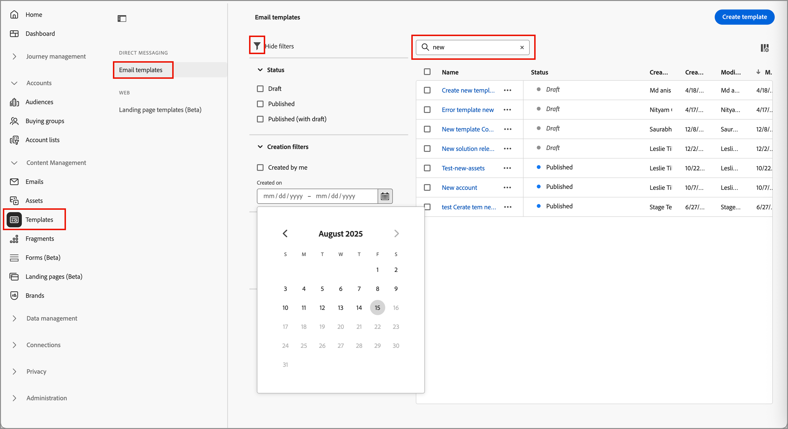
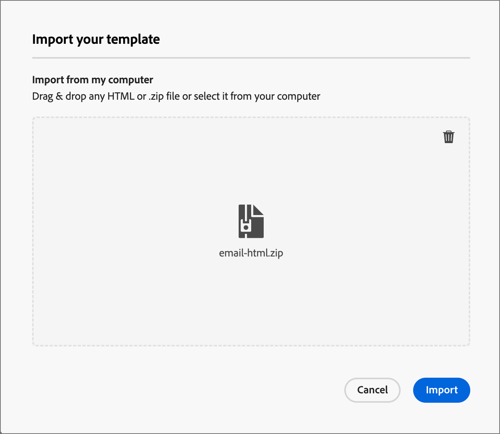

# E-postmallar

För en snabbare och förbättrad designprocess kan du skapa fristående e-postmallar för att återanvända anpassat innehåll på kontoresor för Adobe Journey Optimizer B2B edition. Med hjälp av mallar kan era innehållsorienterade teammedlemmar arbeta med e-postinnehåll utanför resor. Marknadsföringsstrateger kan sedan återanvända och anpassa de här fristående mallarna i sina kontoresor. En teammedlem ansvarar till exempel bara för innehåll, utan tillgång till kontoresor. De kan dock skapa en e-postmall som marknadsförarna kan välja som utgångspunkt för e-postkommunikation och anpassa den efter kundresan.

## Få åtkomst till och hantera e-postmallar

Om du vill komma åt e-postmallar i Adobe Journey Optimizer B2B edition går du till vänster och klickar på **[!UICONTROL Content Management]** > **[!UICONTROL Templates]**. Den här åtgärden öppnar en listsida med alla e-postmallar som har skapats i instansen i en tabell.

Tabellen sorteras som standard efter kolumnen _[!UICONTROL Modified]_, med de senast uppdaterade mallarna överst. Klicka på kolumnrubriken om du vill ändra mellan stigande och fallande.

Om du vill söka efter en mall efter namn anger du en textsträng i sökfältet. Klicka på ikonen _Filter_ längst upp till vänster om du vill filtrera listan efter datum för skapande eller ändring samt mallar som du har skapat eller ändrat.

{width="700" zoomable="yes"}

Anpassa de kolumner som du vill visa i tabellen genom att klicka på ikonen _Anpassa tabell_ (  ) längst upp till höger. Markera de kolumner som ska visas och klicka på **[!UICONTROL Apply]**.

I malllistan kan du utföra de åtgärder som beskrivs i följande avsnitt.

## Skapa en e-postmall

Du kan skapa en e-postmall från e-postmallens listsida genom att klicka på **[!UICONTROL Create template]** överst till höger.

1. Ange ett användbart **[!UICONTROL Name]** och **[!UICONTROL Description]** (valfritt) i dialogrutan.

   {width="400"}

1. Klicka på **[!UICONTROL Create]**.

Sidan _[!UICONTROL Design your template]_öppnas och innehåller flera alternativ för att skapa mallen:_[!UICONTROL Design from scratch]_, _[!UICONTROL Import HTML]_eller_[!UICONTROL Select design template]_.

{width="800" zoomable="yes"}

När du har valt den metod som du vill använda för att starta designen för e-postmallen använder du den visuella designern för att [redigera innehållet i e-postmallen](./email-template-authoring.md).

### Designa från grunden

Använd den visuella innehållsredigeraren för att definiera strukturen för e-postinnehållet. Genom att lägga till och flytta strukturella komponenter med enkla dra och släpp-åtgärder kan du designa formen på det återanvändbara e-postinnehållet på några sekunder.

>[!NOTE]
>
>De tillgängliga designverktygen motsvarar verktygen som används för att skapa [e-post](./email-authoring.md). Skillnaden är att det här innehållet sedan sparas som en mall som kan återanvändas i flera _skicka e-post_ -noder på kontoresor.

1. Välj alternativet **[!UICONTROL Design from scratch]** på startsidan för _[!UICONTROL Design your template]_.

1. [Lägg till struktur och innehåll](./email-authoring.md#add-structure-and-content) i mallen.

### Importera HTML

Med Adobe Journey Optimizer B2B edition kan du importera befintligt HTML-innehåll för att utforma e-postmallar.

{{$include /help/_includes/content-design-import.md}}

{width="500"}

>[!NOTE]
>
>Om du använder en `<table>`-tagg som det första lagret i en HTML-fil kan du förlora format, inklusive inställningar för bakgrund och bredd i den översta lagertaggen.

Du kan anpassa det importerade innehållet efter behov med den visuella designern.

### Välj en designmall

{{$include /help/_includes/content-design-select-template.md}}

## Visa information om e-postmallar

På malllistsidan klickar du på namnet på en e-postmall för att öppna informationssidan för e-postmallen. Härifrån kan du visa grundläggande egenskaper för e-postmallen och komma åt den visuella innehållsredigeraren för att göra ändringar i mallinnehållet.

{width="700" zoomable="yes"}

* Visa information om e-postmallen, till exempel namn och beskrivning. Dessa inställningar kan redigeras. Klicka utanför beskrivningsrutan om du vill spara ändringarna automatiskt.

* Visa egenskaper för e-postmallar, t.ex. skapade av, senast uppdaterade av och ändrade av.

* Klicka på **[!UICONTROL More]** överst till höger för att utföra snabba åtgärder på e-postmallen, till exempel _Duplicera_ och _Ta bort_.

* Om det finns aktiva aviseringar (fel och varningar för e-postmallen) klickar du på **[!UICONTROL Alerts]** längst upp till höger för att visa informationen.

  Dessa varningar förhindrar inte att e-postmallen används för att skapa e-postmeddelanden. Informationen ger marknadsförarna i teamet insyn i vad som kanske inte fungerar och i de uppdateringar som krävs innan den kan användas för leverans.

## Visa e-postmall som används av referenser

På informationssidan för e-postmallar klickar du på fliken **[!UICONTROL Used By]** för att visa information om var den här e-postmallen används i e-postmeddelanden mellan kontoresor.

{width="400"}

E-postmeddelanden i Journey Optimizer B2B edition är inbäddade och redigerade inom resor, så den överordnade resan för det e-postmeddelande som använder mallen visas i referenser.

* När du klickar på länken skickas du till motsvarande e-postmeddelande för resan där e-postmallen används.

* Avsluta vyn när som helst genom att klicka på bakåtpilen, som återgår till listsidan.

## Redigera e-postmallar

Den här åtgärden kan utföras från:

* Informationssidan - Klicka på **[!UICONTROL Edit email template]**.
* Listsidan - Klicka på ellipsen (**..**) bredvid en e-postmall och välj **[!UICONTROL Edit]**.

Den här åtgärden tar dig till sidan _Designa din mall_ eller den visuella innehållets redigeringssida (baserat på den senast sparade statusen för e-postmallen). Härifrån kan du redigera e-postmallens innehåll efter behov. Mer information om redigeringsalternativen finns i [Skapa e-postmallar](#create-email-templates).

## Duplicera e-postmallar

Du kan duplicera en e-postmall på något av följande sätt:

* Expandera **[!UICONTROL More]** från e-postmallsinformationen till höger och klicka på **[!UICONTROL Duplicate]**.

  {width="400"}

* Klicka på ellipsen (..) bredvid mallen på listsidan _E-postmallar_ och välj **[!UICONTROL Duplicate]**.

Ange ett användbart namn (unikt) och en beskrivning i dialogrutan. Klicka på **[!UICONTROL Duplicate]** för att slutföra åtgärden.

Den duplicerade (nya) e-postmallen visas sedan i listan _E-postmallar_ .

## Ta bort e-postmallar

Det går inte att ångra borttagningen av en e-postmall, så kontrollera innan du startar en borttagningsåtgärd. Du kan ta bort en e-postmall på något av följande sätt:

* Expandera **[!UICONTROL More]** från mallinformationen till höger och klicka på **[!UICONTROL Delete]**.
* Klicka på ellipsen (..) bredvid mallen på listsidan _E-postmallar_ och välj **[!UICONTROL Delete]**.

  {width="500"}

Åtgärden öppnar en bekräftelsedialogruta. Du kan avbryta processen genom att klicka på **[!UICONTROL Cancel]** eller klicka på **[!UICONTROL Delete]** för att bekräfta borttagningen.

## Ta massåtgärder

På listsidan för e-postmallar markerar du flera mallar åt gången genom att markera kryssrutorna till vänster. En banderoll visas längst ned när du väljer flera mallar.

{width="600"}

**[!UICONTROL Delete]** - Du kan ta bort upp till 20 mallar samtidigt. I en bekräftelsedialogruta kan du avbryta åtgärden eller bekräfta borttagningen av mallarna.

## Skapa ett e-postmeddelande från en sparad mall

Från skärmen _Skapa e-post_ kan du använda avsnittet _Välj designmall_ för att börja skapa innehåll från en mall.

Gör så här för att börja skapa innehåll med någon av e-postmallarna:

1. Öppna e-postmeddelandet för Designer från sidan _Redigera innehåll_.

   Fliken _Exempelmallar_ är markerad som standard på sidan _Skapa e-post_.

1. Om du vill använda en anpassad e-postmall väljer du fliken **[!UICONTROL Saved templates]**.

   På den här fliken visas en lista med alla e-postmallar som skapats i sandlådan. Du kan sortera dem _efter namn_, _Senast ändrat_ och _Senast skapat_.

1. Välj önskad mall i listan.

   När du har valt mallen visas en förhandsvisning av den. I förhandsgranskningsläget kan du navigera mellan alla mallar i en kategori (exempel eller sparat, beroende på vad du har valt) med höger- och vänsterpilarna.

1. Klicka på **[!UICONTROL Use this template]** överst till höger.

1. Från den visuella designern kan du redigera ditt innehåll efter behov.
