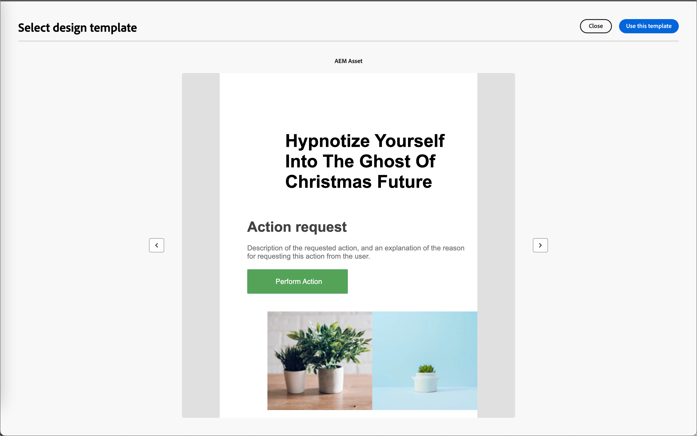

# E-postmallar

För en snabbare och förbättrad designprocess kan du skapa fristående e-postmallar för att återanvända anpassat innehåll på kontoresor för Adobe Journey Optimizer B2B Edition. Med hjälp av mallar kan era innehållsorienterade teammedlemmar arbeta med e-postinnehåll utanför resor. Marknadsföringsstrateger kan sedan återanvända och anpassa de här fristående mallarna i sina kontoresor. En teammedlem ansvarar till exempel bara för innehåll, utan tillgång till kontoresor. De kan dock skapa en e-postmall som marknadsförarna kan välja som utgångspunkt för e-postkommunikation och anpassa den efter kundresan.

## Få åtkomst till och hantera e-postmallar

Om du vill komma åt e-postmallar i Adobe Journey Optimizer B2B-utgåvan går du till vänster och klickar på **[!UICONTROL Content Management]** > **[!UICONTROL Templates]**. Den här åtgärden öppnar en listsida med alla e-postmallar som har skapats i instansen i en tabell.

Tabellen sorteras efter kolumnen _[!UICONTROL Modified]_, med de senast uppdaterade mallarna överst i listan som standard. Klicka på kolumnrubriken om du vill ändra mellan stigande och fallande.

Om du vill söka efter en mall efter namn anger du en textsträng i sökfältet. Klicka på ikonen _Filter_ längst upp till vänster om du vill filtrera listan efter datum för skapande eller ändring samt mallar som du har skapat eller ändrat.

{width="700" zoomable="yes"}

Anpassa de kolumner som du vill visa i tabellen genom att klicka på ikonen _Anpassa tabell_ längst upp till höger. Markera de kolumner som ska visas och klicka på **[!UICONTROL Apply]**.

På listsidan kan du utföra de åtgärder som beskrivs i följande avsnitt.

## Skapa e-postmallar

Du kan skapa en ny e-postmall från e-postmallens listsida genom att klicka på **[!UICONTROL Create template]** överst till höger.

1. Ange ett användbart **[!UICONTROL Name]** och **[!UICONTROL Description]** (valfritt) i dialogrutan.

   {width="400"}

1. Ange startvärdet **[!UICONTROL Image source]**.

   Om du har en prenumeration på Experience Manager Assets as a Cloud Service tillsammans med Adobe Marketo Engage Design Studio som standard kan du välja bildresurser från båda källorna. Om du vill göra det måste du välja bildkällan när du skapar en e-postmall eller ett visuellt fragment. Du kan också välja bildkällan när du redigerar innehållet.

   Mer information om bildkällor finns i [Assets](./assets-overview.md).

1. Klicka på **[!UICONTROL Create]**.

Sidan _[!UICONTROL Design your template]_öppnas och innehåller flera alternativ för att skapa mallen:_[!UICONTROL Design from scratch]_, _[!UICONTROL Import HTML]_eller_[!UICONTROL Select design template]_.

{width="800" zoomable="yes"}

### Designa från grunden

Använd e-postdesignern för att definiera strukturen för ditt e-postinnehåll. Genom att lägga till och flytta strukturella komponenter med enkla dra och släpp-åtgärder kan du designa formen på det återanvändbara e-postinnehållet på några sekunder.

1. Välj alternativet **[!UICONTROL Design from scratch]** på startsidan för _[!UICONTROL Design your template]_.

1. Börja designa ditt innehåll genom att dra och släppa komponenter på arbetsytan för att definiera den strukturella layouten för e-postmeddelandet.

   De tillgängliga designverktygen motsvarar verktygen som används för att skapa [e-post](./email-authoring.md). Skillnaden är att det här innehållet sedan sparas som en mall som kan återanvändas i flera e-postnoder som skickas via kontoresor.

### Importera HTML

Med Adobe Journey Optimizer B2B Edition kan du importera befintligt HTML-innehåll för att utforma e-postmallar. Innehållet kan vara:

* En HTML-fil med en infogad formatmall.
* En ZIP-fil som innehåller en HTML-fil, formatmallen (.css) och bilder

  >[!NOTE]
  >
  >ZIP-filstrukturen har inga begränsningar. Referenserna måste dock vara relativa och passa in i trädstrukturen i ZIP-mappen.

_Så här importerar du en fil som innehåller HTML-innehåll:_

1. Välj alternativet **[!UICONTROL Import HTML]** på startsidan för _[!UICONTROL Design your template]_.

1. Dra och släpp HTML- eller ZIP-filen med ditt HTML-innehåll och klicka på **[!UICONTROL Import]**.

   När HTML-innehållet har överförts är ditt innehåll i _kompatibilitetsläge_. I det här läget kan du bara anpassa texten, lägga till länkar eller inkludera resurser i innehållet.

1. Om du vill använda e-postdesignerns innehållskomponenter klickar du på fliken **[!UICONTROL HTML converter]** och sedan på **[!UICONTROL Convert]**.

>[!NOTE]
>
>Om du använder en `<table>`-tagg som det första lagret i en HTML-fil kan du förlora stilar, inklusive inställningar för bakgrund och bredd i den översta lagertaggen.

Du kan anpassa det importerade innehållet efter behov med de visuella redigeringsverktygen för e-post.

### Välj en designmall

Använd avsnittet Välj designmall på hemsidan _[!UICONTROL Design your template]_för att börja skapa ditt innehåll från en mall. Du kan använda en exempelmall eller en sparad e-postmall från din Journey Optimizer B2B Edition-instans.

>[!BEGINTABS]

>[!TAB Sparade mallar]

Fliken _Exempelmallar_ är markerad som standard på hemsidan _Utforma mallen_ . Om du vill använda en anpassad mall väljer du fliken **[!UICONTROL Saved templates]**.

Listan över alla e-postmallar som skapats i den aktuella sandlådan visas. Du kan sortera dem efter _[!UICONTROL Name]_,_[!UICONTROL Last modified]_ och _[!UICONTROL Last created]_.

{width="800" zoomable="yes"}

Välj den mall du vill använda i listan.

När du har valt mallen visas en förhandsvisning av den. I förhandsgranskningsläget kan du navigera mellan alla mallar i en kategori (exempel eller sparat, beroende på vad du har valt) med höger- och vänsterpilarna.

{width="800" zoomable="yes"}

När visningen matchar det du vill använda klickar du på **[!UICONTROL Use this template]** längst upp till höger i förhandsvisningsfönstret.

Den här åtgärden kopierar innehållet till designern för visuellt innehåll, där du kan redigera innehållet efter behov.

>[!TAB Exempelmall]

Adobe Journey Optimizer B2B Edition erbjuder _färdiga mallar_ som kan användas för att skapa e-postmallar och e-postmallar.

{width="800" zoomable="yes"}

>[!ENDTABS]

## Lägga till struktur och innehåll

Börja designa ditt innehåll genom att dra och släppa strukturer från menyn **[!UICONTROL Components]** till arbetsytan för att definiera layouten för e-postmeddelandet.

Lägg till så många strukturer som behövs och redigera deras inställningar i elementegenskaperna till höger.

Välj komponenten _[!UICONTROL n:n column]_för att definiera antalet kolumner som du vill använda (mellan tre och 10). Definiera bredden på varje kolumn genom att flytta pilarna längst ned.

>[!NOTE]
>
>Varje kolumnstorlek får inte vara mindre än 10 % av strukturkomponentens totala bredd. Du kan bara ta bort tomma kolumner.

Expandera avsnittet **[!UICONTROL Contents]** och lägg till så många element du behöver i en eller flera strukturkomponenter.

Varje komponent kan anpassas ytterligare med flikarna _[!UICONTROL Settings]_eller_[!UICONTROL Style]_ på den högra panelen. Du kan till exempel ändra textstil, utfyllnad eller marginal för varje komponent.

### Navigera mellan lager, inställningar och format

I följande exempel visas stegen för att justera utfyllnad och lodrät justering inuti en strukturelement som består av tre kolumner.

1. Markera strukturkomponenten direkt i e-postmeddelandet eller använd navigeringsträdet som finns på den vänstra menyn.

1. Klicka på **[!UICONTROL Select a column]** i verktygsfältet och välj den som du vill redigera.

   {width="800" zoomable="yes"}

   Du kan också välja det i strukturträdet. De redigerbara parametrarna för den kolumnen visas på fliken _[!UICONTROL Styles]_.

1. Under **[!UICONTROL Alignment]** väljer du ikonen _Överkant_, _Mitten_ eller _Nederkant_ .

1. Ange utfyllnaden för alla sidor under **[!UICONTROL Padding]**.

   Välj **[!UICONTROL Different padding for each side]** om du vill finjustera utfyllnaden. Klicka på låsikonen för att bryta synkroniseringen.

1. Justera justeringen och utfyllnaden för de andra kolumnerna om det behövs.

1. Spara ändringarna.

### Anpassa innehåll

I följande exempel beskrivs stegen för att anpassa mallinnehåll med hjälp av lead-/kontoattribut och systemtokens.

1. Markera textkomponenten och klicka på ikonen _Lägg till anpassning_ i verktygsfältet.

   {width="500"}

   Den här åtgärden öppnar dialogrutan _Redigera Personalization_.

1. Klicka på **+** eller **..** för att lägga till en token i det tomma utrymmet.

   {width="700" zoomable="yes"}

1. Klicka på **[!UICONTROL Save]**.

### Lägg till fragment

Ikonen _Fragments_ visas till vänster i den visuella innehållsredigeraren. I följande exempel beskrivs stegen för att lägga till fragment i mallinnehållet.

1. Om du vill öppna fragmentlistan klickar du på ikonen _Fragment_ .

   Du kan:

   * Sortera listan.
   * Bläddra, sök eller filtrera listan.
   * Växla mellan miniatyr- och listvy.
   * Uppdatera listan så att den återspeglar något av de nyligen skapade fragmenten.

   {width="700" zoomable="yes"}

1. Dra och släpp något av fragmenten till platshållaren för strukturkomponenten.

   Redigeraren återger fragmentet i avsnittet/elementet i e-poststrukturen.

Fragmentets innehåll uppdateras dynamiskt i strukturen för att återge hur innehållet visas i e-postmeddelandet.

Om du vill lägga till fragmentet så att det upptar hela den vågräta layouten i e-postmeddelandet lägger du till en 1:1-kolumnstruktur och drar och släpper fragmentet i den.

När e-postmeddelandet har sparats visas det på fragmentinformationssidan när du väljer fliken _[!UICONTROL Used By]_i sammanfattningen. Fragment som läggs till i en e-postmall kan inte redigeras i mallen. Innehållet definieras av källfragmentet.

### Lägga till resurser

I den visuella innehållsredigeraren väljer du ikonen _Assets_ som visas till vänster.

>[!NOTE]
>
>Om du har en prenumeration på Experience Manager Assets as a Cloud Service tillsammans med Adobe Marketo Engage Design Studio som standard kan du välja bildresurser från den källa som är vald på mallinformationssidan.

I följande exempel beskrivs stegen för att lägga till resurser i mallinnehållet:

1. Klicka på ikonen _Assets_ för att öppna resursbiblioteket.

   Från resursväljaren kan du välja resurser som lagras direkt i källbiblioteket.

1. Lägg till en ny resurs genom att dra och släppa bildresursen i en strukturkomponent.

1. Ersätt en bildresurs genom att markera den på arbetsytan och klicka på **[!UICONTROL Select an asset]** i verktygen för bildkällan.

   {width="700" zoomable="yes"}

### Förhandsgranska och redigera URL:er

1. Klicka på ikonen _[!UICONTROL Links]_till vänster för att visa alla URL:er för ditt innehåll som ska spåras.

1. Om det behövs klickar du på ikonen _Redigera_ (penna) och ändrar _spårningstypen_ eller _etiketten_ och lägger till _taggar_ för en länk.

{width="500"}

### Visningsalternativ

Utnyttja de alternativ för visning och innehållsvalidering som finns i den visuella e-postredigeraren.

* Zooma in/ut i innehållet genom förinställda zoomalternativ.

* Växla mellan att visa innehållet på datorer, mobiler eller endast text/normal text.
   * Klicka på ikonen _Ögon_ om du vill förhandsgranska innehåll på olika enheter.
   * Välj en av de färdiga enheterna eller ange anpassade dimensioner för att förhandsgranska innehållet.

### Fler alternativ

Från väljaren _Fler alternativ_ i redigeraren för visuellt innehåll kan du utföra följande åtgärder:

{width="500"}

* **Återställ mall** - Klicka på det här alternativet om du vill rensa den visuella e-postdesignerns arbetsyta till en tom plats och starta om skapandet av innehåll.
* **Spara som fragment** - Spara hela eller delar av den som ett fragment som kan återanvändas i flera e-postmallar eller e-postmallar. Du anger ett namn och en beskrivning för fragmenten och den till listan med tillgängliga fragment.
* **Ändra din design** - Återgå till sidan _Designa din mall_. Härifrån kan du vidta vilken åtgärd som helst enligt anvisningarna i avsnittet Skapa e-postmallar.
* **Exportera HTML** - Hämta innehåll på den visuella arbetsytan till ditt lokala system i HTML-format som paketerats som en zip-fil.

## Visa information om e-postmallar

På malllistsidan klickar du på namnet på en e-postmall för att öppna informationssidan för e-postmallen. Härifrån kan du visa grundläggande egenskaper för e-postmallen och komma åt den visuella innehållsredigeraren för att göra ändringar i mallinnehållet.

{width="700" zoomable="yes"}

* Visa information om e-postmallen, till exempel namn och beskrivning. Dessa inställningar kan redigeras. Klicka utanför beskrivningsrutan om du vill spara ändringarna automatiskt.

* Visa egenskaper för e-postmallar, t.ex. skapade av, senast uppdaterade av och ändrade av.

* Klicka på **[!UICONTROL More]** överst till höger för att utföra snabba åtgärder på e-postmallen, till exempel _Duplicera_ och _Ta bort_.

* Om det finns aktiva aviseringar (fel och varningar för e-postmallen) klickar du på **[!UICONTROL Alerts]** längst upp till höger för att visa informationen.

  Dessa aviseringar förhindrar inte att e-postmallen används för att skapa e-post, men den här informationen ger marknadsförarna i teamet insyn i vad som kanske inte fungerar och i de nödvändiga uppdateringarna innan den kan användas för leverans.

## Visa e-postmall som används av referenser

På informationssidan för e-postmallar klickar du på fliken **[!UICONTROL Used By]** för att visa information om var den här e-postmallen används i e-postmeddelanden mellan kontoresor.

{width="400"}

E-postmeddelanden i Journey Optimizer B2B Edition är inbäddade och redigerade inom resorna, så den överordnade resan för det e-postmeddelande som använder mallen visas i referenser.

* När du klickar på länken skickas du till motsvarande e-postmeddelande för resan där e-postmallen används.

* Avsluta vyn när som helst genom att klicka på bakåtpilen, som återgår till listsidan.

## Redigera e-postmallar

Den här åtgärden kan utföras från:

* Informationssidan - Klicka på **[!UICONTROL Edit email template]**.
* Listsidan - Klicka på ellipsen (**..**) bredvid en e-postmall och välj **[!UICONTROL Edit]**.

Den här åtgärden tar dig till sidan _Designa din mall_ eller den visuella innehållets redigeringssida baserat på den senast sparade statusen för e-postmallen. Härifrån kan du redigera e-postmallens innehåll efter behov. Mer information om redigeringsalternativen finns i [Skapa e-postmallar](#create-email-templates).

## Duplicera e-postmallar

Du kan duplicera en e-postmall på något av följande sätt:

* Expandera **[!UICONTROL More]** från e-postmallsinformationen till höger och klicka på **[!UICONTROL Duplicate]**.

  {width="400"}

* Klicka på ellipsen (..) bredvid mallen på listsidan _E-postmallar_ och välj **[!UICONTROL Duplicate]**.

Ange ett användbart namn (unikt) och en beskrivning i dialogrutan. Klicka på **[!UICONTROL Duplicate]** för att slutföra åtgärden.

Den duplicerade (nya) e-postmallen visas sedan i listan _E-postmallar_ .

## Ta bort e-postmallar

Det går inte att ångra borttagningen av en e-postmall, så kontrollera innan du startar en borttagningsåtgärd. Du kan ta bort en e-postmall på något av följande sätt:

* Expandera **[!UICONTROL More]** från mallinformationen till höger och klicka på **[!UICONTROL Delete]**.
* Klicka på ellipsen (..) bredvid mallen på listsidan _E-postmallar_ och välj **[!UICONTROL Delete]**.

  {width="500"}

Åtgärden öppnar en bekräftelsedialogruta. Du kan avbryta processen genom att klicka på **[!UICONTROL Cancel]** eller klicka på **[!UICONTROL Delete]** för att bekräfta borttagningen.

## Ta massåtgärder

På listsidan för e-postmallar markerar du flera mallar åt gången genom att markera kryssrutorna till vänster. En banderoll visas längst ned när du väljer flera mallar.

{width="600"}

**[!UICONTROL Delete]** - Du kan ta bort upp till 20 mallar samtidigt. I en bekräftelsedialogruta kan du avbryta åtgärden eller bekräfta borttagningen av mallarna.

## Skapa ett e-postmeddelande från en sparad mall

Från skärmen _Skapa e-post_ kan du använda avsnittet _Välj designmall_ för att börja skapa innehåll från en mall.

Gör så här för att börja skapa innehåll med någon av e-postmallarna:

1. Öppna e-postmeddelandet för Designer från sidan _Redigera innehåll_.

   Fliken _Exempelmallar_ är markerad som standard på sidan _Skapa e-post_.

1. Om du vill använda en anpassad e-postmall väljer du fliken **[!UICONTROL Saved templates]**.

   På den här fliken visas en lista med alla e-postmallar som skapats i sandlådan. Du kan sortera dem _efter namn_, _Senast ändrat_ och _Senast skapat_.

1. Välj önskad mall i listan.

   När du har valt mallen visas en förhandsvisning av den. I förhandsgranskningsläget kan du navigera mellan alla mallar i en kategori (exempel eller sparat, beroende på vad du har valt) med höger- och vänsterpilarna.

1. Klicka på **[!UICONTROL Use this template]** överst till höger.

1. Från den visuella designern kan du redigera ditt innehåll efter behov.
