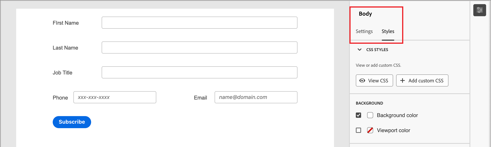
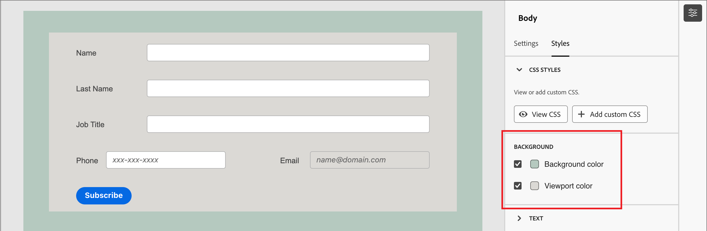

# Formulärdesign

När du har [skapat ett formulär](./landing-pages.md#create-a-landing-page) öppnas ett utkast med en grundläggande standardformulärdefinition. Klicka på **[!UICONTROL Edit form]** på panelen _[!UICONTROL Summary]_till höger och använd det visuella designområdet för att definiera formulärformateringen och fältkomponenterna.

{width="700" zoomable="yes"}

## Fält

Formulärfält används för att samla in personprofildata som kan användas för att rikta in personer och koppla dem till konton och inköpsgrupper. Alla nya formulär börjar med följande fält i en enda kolumnlayout:

* Förnamn
* Efternamn
* E-postadress

Använd fältdesignverktygen för att skapa de fält och den layout som behövs för att samla in data som behövs för kontobaserade marknadsföringsaktiviteter.

### Lägg till ett fält {#add-field}

1. Dra innehållskomponenten **[!UICONTROL Field]** på panelen _[!UICONTROL Components]_till vänster och släpp den på arbetsytan.

   {width="700" zoomable="yes"}

1. Klicka på **[!UICONTROL Select field attribute]**.

1. I dialogrutan _[!UICONTROL Select field attribute]_markerar du kryssrutan för personprofilattributet som du vill använda för fältet och klickar på&#x200B;**[!UICONTROL Select]**.

   [XDM-affärsscheman](../data/field-mapping.md#xdm-business-person-attributes) avgör vilka attribut som är tillgängliga.  Alla anpassade fält som är definierade för din Journey Optimizer B2B edition-instans är också tillgängliga. Använd söktextrutan för att filtrera listan efter namn eller klicka på filterikonen för att filtrera listan efter schema/datatyp.

   {width="700" zoomable="yes"}

   På arbetsytan fylls standardfältetiketten för det valda attributet i på arbetsytan. **[!UICONTROL Field details]** visas i panelen till höger.

1. Ändra texten **[!UICONTROL Label]** om det behövs.

   Den här texten visas bredvid fältet i formuläret. Standardtexten fylls i från fältattributet.

1. Ange **[!UICONTROL Field type]** efter fältets datatyp:

   | Fälttyp | Användning | Exempel |
   | ---------- | ----- | ------- |
   | **[!UICONTROL Checkbox]** | Använd den här typen så att besökare kan välja ett _true_- (markerat) eller _false_-värde (inte markerat). | |
   | **[!UICONTROL Checkbox Group]** | Använd den här typen så att besökare kan välja ett _true_- (markerad) eller _false_-värde (avmarkerad) för flera objekt. | |
   | **[!UICONTROL Currency]** | Använd den här typen om du vill tillåta ett flytande fält som representerar standardvalutatypen som valts för Journey Optimizer B2B edition-instansen. | |
   | **[!UICONTROL Date]** | Använd den här typen om du vill begränsa inmatningen till ett datumformat och ange en kalenderväljare i fältet. | |
   | **[!UICONTROL Double]** |  | |
   | **[!UICONTROL Email]** | Använd den här typen för att begränsa inmatning till ett e-postadressformat. | |
   | **[!UICONTROL Number]** | Använd den här typen om du vill begränsa fältet till ett numeriskt värde. | |
   | **[!UICONTROL Radio Group]** | Använd den här typen om du vill att besökarna ska kunna välja ett av en uppsättning alternativ. | |
   | **[!UICONTROL Select]** | Använd den här typen om du vill tillåta besökare att välja en av en uppsättning alternativ med hjälp av en nedrullningsbar lista. | |
   | **[!UICONTROL Slider]** | Använd den här typen om du vill att besökare ska kunna ange ett numeriskt värde med ett skjutreglage. | |
   | **[!UICONTROL Telephone]** | Använd den här typen för att ange telefonnummer. | |
   | **[!UICONTROL Text]** | Använd den här typen för ett standardtextinmatningsfält (sträng). | |
   | **[!UICONTROL Textarea]** | Använd den här typen om du vill ha stöd för längre textinmatningar. | |
   | **[!UICONTROL URL]** | Använd den här typen för att begränsa textinmatning till en URL, inklusive standard-URL-protokollet. | |

1. Beroende på den valda fälttypen anger du de andra alternativen för fältinmatning och validering:

   {width="400" zoomable="yes"}

   * **[!UICONTROL Placeholder]** - Platshållarvärdet för fältet som ger besökaren ett exempel på vad som förväntas för fältet.

   * **[!UICONTROL Instructions]** - Instruktiv text som hjälper besökaren att fylla i fältet. Ange den text som du vill visa som _hovringstext_ för fältet.

     >[!TIP]
     >
     >_Instruktioner jämfört med platshållartext_ 
     >
     >Använd de här två egenskaperna för att vägleda besökarna när de fyller i fältet. Instruktionstext visas som en funktionsbeskrivning/popup-text när pekaren förs över fältet. Platshållartext visas _nedtonad_ inuti fältet och försvinner när besökaren skickar sin text till fältet. Du kan använda båda metoderna, eller bara en.

   * **[!UICONTROL Default value]** - Använd det här alternativet om du vill ange ett standardvärde för fältet.

   * **[!UICONTROL Validation message]** - Använd det här alternativet om du vill ange ett valideringsmeddelande för fältet. Det här meddelandet visas om besökaren anger ett ogiltigt värde för fältet. Meddelandet _[!UICONTROL Standard]_är inställt som standard. Välj **[!UICONTROL Custom]**och ange ett eget meddelande.

   * **Maximal längd** - Ange det maximala antalet tecken som kan anges i fältet.

1. Ange **[!UICONTROL Field behaviors]** efter behov:

   * **Obligatoriskt** - Markera kryssrutan för att göra fältindata som krävs för att skicka formuläret.

   * **Aktivera indatamask** - Markera kryssrutan om du vill begränsa indata från besökaren med hjälp av en indatamask. Du kanske vill att besökarna ska ange telefonnummer i ett visst format. I dialogrutan anger du masken med `9` för valfri siffra, `a` för alla bokstäver och `*` för båda. Klicka på Spara för att aktivera den angivna indatamasken.

     {width="500" zoomable="yes"}

### Ändra fältformat {#field-styling}

Välj fliken **[!UICONTROL Styles]** i den högra panelen om du vill ändra det markerade fältets format.

* **[!UICONTROL Background]** - Markera kryssrutan om du vill använda en bakgrundsfärg för fältet. Vit är standardfärgen. Klicka på rutan **[!UICONTROL Background color]** för att öppna popup-färgväljaren och välj en färg för fältbakgrunden.

  {width="600" zoomable="yes"}

* **[!UICONTROL Label]** - Etikettformateringen styr visuella egenskaper för texten som visas bredvid fältet. Välj en övre etikett eller en sidetikett som visas i förhållande till fältet. Du kan ange teckenstorlek, radhöjd, textformat och textjustering. Klicka på rutan **[!UICONTROL Font color]** för att öppna popup-färgväljaren och välj en färg för etikettexten.

  {width="600" zoomable="yes"}

* **[!UICONTROL Border]** - Klicka på rutan **[!UICONTROL Border color]** för att öppna popup-färgväljaren och välja en färg för kanten. Du kan definiera en kantlinje för fältet, inklusive färg och linjebredd. Avmarkera kryssrutan för att ta bort den visade fältkanten. Du kan också ändra kantstorlek (pixelbredd), format och radieinställning för hörnen.

  {width="600" zoomable="yes"}

* **[!UICONTROL Size]** - Välj en storleksinställning för att bestämma fältets visningsbredd. Välj _[!UICONTROL Full width]_,_[!UICONTROL Half width]_ eller _[!UICONTROL Auto]_.

* **[!UICONTROL Margin]** - Ange marginaler (i pixlar) runt fältet. Du kan ange samma marginal på alla fyra sidorna eller markera kryssrutan **[!UICONTROL Different margin for each side]** om du vill ange vågräta och lodräta marginaler separat.

* **[!UICONTROL Padding]** - Ange utfyllnad (i pixlar) runt fältet. Du kan ange samma marginal på alla fyra sidorna eller markera kryssrutan **[!UICONTROL Different padding for each side]** om du vill ange vågräta och lodräta marginaler separat.

  {width="600" zoomable="yes"}

### Ordna om fält {#field-reorder}

Du kan flytta formulärfält direkt på den visuella arbetsytan. Klicka på verktyget _Flytta_ till höger om det markerade fältet och dra det till en ny plats.

Lägg till strukturella komponenter i formuläret och flytta fält till kolumner för att gruppera dem och ändra layouten. Klicka på verktyget _Flytta_ till vänster om den markerade kolumnkomponenten och dra den till en ny plats i formuläret.

{width="500"}

### Ta bort eller duplicera ett fält {#field-delete-duplicate}

Klicka på ikonen _Ta bort_ (  ) i verktygsfältet eller på den högra panelen för att ta bort ett markerat fält. Klicka på **[!UICONTROL Delete]** i bekräftelsedialogrutan.

Klicka på ikonen _Duplicera_ (  ) i verktygsfältet eller på den högra panelen för att duplicera ett markerat fält. Det nya fältet visas precis nedanför det ursprungliga fältet. Klicka på **[!UICONTROL Select field attribute]** för att ange fältets attribut. Ange fälttyp, detaljer och format efter behov.

{width="600" zoomable="yes"}

## Skicka-knapp

Skicka-knappen (sidfotsfältet) är som standard en del av formuläret och kan inte tas bort. Markera knappen/sidfoten i formuläret om du vill ändra knappens text och format.

### Redigera knappinnehåll {#button-content}

Ändra texten i fältet **[!UICONTROL Button text]** på fliken _[!UICONTROL Content]_som visas på den högra panelen. Knappens storlek justeras efter textens längd.

{width="600" zoomable="yes"}

### Formatera skicka-knappen {#button-styles}

Välj fliken **[!UICONTROL Styles]** i den högra panelen om du vill ändra formatet för den markerade knappen/sidfoten.

* **[!UICONTROL Background]** - Markera kryssrutan om du vill använda en bakgrundsfärg för knappen. Blå är standardfärgen. Klicka på rutan **[!UICONTROL Background color]** för att öppna popup-färgväljaren och välj en färg för knappens bakgrund.

  {width="600" zoomable="yes"}

* **[!UICONTROL Label]** - Etikettformatet styr de visuella egenskaperna för texten inuti knappen. Du kan ange teckenstorlek, radhöjd, textformat och textjustering. Klicka på rutan **[!UICONTROL Font color]** för att öppna popup-färgväljaren och välj en färg för etikettexten.

* **[!UICONTROL Border]** - Klicka på rutan **[!UICONTROL Border color]** för att öppna popup-färgväljaren och välja en färg för kanten. Du kan definiera knappens kantlinje, inklusive färg och linjebredd. Avmarkera kryssrutan för att ta bort den visade knappkanten. Du kan också ändra kantstorlek (pixelbredd), format och radieinställning för rundade hörn.

* **[!UICONTROL Size]** - Välj en storleksinställning för att bestämma knappens visningsbredd. Välj _[!UICONTROL Full width]_,_[!UICONTROL Half width]_ eller _[!UICONTROL Auto]_. Utfyllnaden justeras enligt inställningarna för storlek och justering.

  {width="600" zoomable="yes"}

* **[!UICONTROL Button Alignment]** - När du väljer en storlek på _Halv bredd_ eller _Auto_ för knappen anger du justeringen till vänster, höger eller i mitten. Utfyllnaden justeras enligt inställningarna för storlek och justering.

* **[!UICONTROL Margin]** - Ange marginaler (i pixlar) runt fältet. Du kan ange samma marginal på alla fyra sidorna eller markera kryssrutan **[!UICONTROL Different margin for each side]** om du vill ange vågräta och lodräta marginaler separat.

* **[!UICONTROL Padding]** - Ange utfyllnad (i pixlar) runt fältet. Du kan ange samma marginal på alla fyra sidorna eller markera kryssrutan **[!UICONTROL Different padding for each side]** om du vill ange vågräta och lodräta marginaler separat. Utfyllnaden justeras om du ändrar storlek och justeringsinställningar.

  {width="600" zoomable="yes"}

## Formulärformat {#form-styling}

Du kan ändra formaten för formulärområdet när du klickar utanför de strukturella komponenterna eller formulärkomponenterna. Formulärkomponenterna (fält och knapp) ärver de _body_-format som har definierats på den översta nivån, såvida inte andra format har definierats på fältet eller knapp-/sidnivå.

{width="600" zoomable="yes"}

### CSS

Nya formulär använder standard-CSS för formatering. Om du vill ändra formaten genom att ändra CSS-formatmallen kan du kopiera den och sedan använda den för att definiera en anpassad CSS för formuläret.

_Definiera en anpassad CSS för formuläret:_

1. Klicka på **[!UICONTROL View CSS]** i den högra panelen för att granska CSS-koden.

   {width="450" zoomable="yes"}

1. Markera CSS-koden i rullningsfönstret och kopiera den till Urklipp.

1. Klicka på **[!UICONTROL Close]**.

1. (Valfritt) Klistra in den kopierade koden i ditt CSS-favoritverktyg och redigera CSS så att den återspeglar den formatering du vill använda.

1. Klicka på **[!UICONTROL Add custom CSS]** i den högra panelen.

1. Klistra in CSS-koden i fönstret.

   {width="450" zoomable="yes"}

   Du kan redigera den inklistrade texten i det här fönstret.

1. Klicka på **[!UICONTROL Save]**.

### Manuell formatering

Ändra inställningarna på den högra panelen för att definiera visningen för hela formuläret.

* **[!UICONTROL Background color]** - Markera kryssrutan om du vill använda en bakgrundsfärg runt formulärområdet. Vit är standardfärgen. Klicka på färgrutan för att öppna popup-färgväljaren och välj en färg för formulärbakgrunden.

* **[!UICONTROL Viewport background]** - Markera kryssrutan om du vill använda en bakgrundsfärg för alla formulärkomponenter. Standardvärdet är ingen färg (ärv från den yttre bakgrunden). Klicka på färgrutan för att öppna popup-färgväljaren och välj en färg för komponenterna i formulärstrukturen.

  {width="600" zoomable="yes"}

* **[!UICONTROL Text]** - Välj en **[!UICONTROL Font family]** för formuläret, vilket påverkar etiketter, tips och platshållartext för formulärfält. Det påverkar även standardtexten för Skicka-knappen.

* **[!UICONTROL Size]** - Ändra formulärets storlek (bredd) i pixlar.

* **[!UICONTROL Margin]** - Ställ in marginaler (i pixlar) runt formulärets komponenter. Du kan ange samma marginal på alla fyra sidorna eller markera kryssrutan **[!UICONTROL Different margin for each side]** om du vill ange vågräta och lodräta marginaler separat.

  {width="600" zoomable="yes"}
