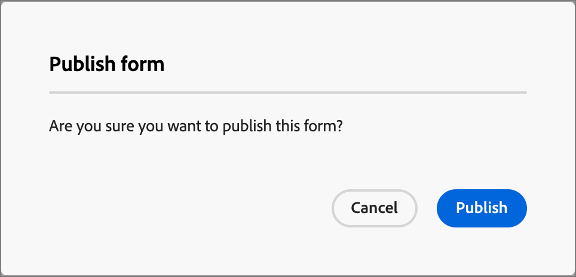

# Forms

Om du vill hämta in information från besökare på en webbsida skapar du formulär och lägger till dem på dina landningssidor. Ett formulär är en uppsättning fält som sidbesökare fyller i och skickar in för att få tillgång till något slags innehåll eller erbjudande, t.ex. en rapport, ett webbinarium på begäran eller en kostnadsfri provperiod.

Hur mycket information formuläret ska innehålla beror på värdet på innehållet eller erbjudandet. Om du erbjuder något enkelt, som en rapport, bör du bara samla in minimal information, som namn, e-postadress och företag. Om erbjudandet är något mer prisvärt, som en demo eller en kostnadsfri testversion, kan du samla in mer information. Att kräva ett skickat formulär för att tillåta visning av innehåll kallas _gated content_. Din organisation bestämmer vilket innehåll som ska grupperas och vilket som inte är (_kostnadsfritt_). Det bästa sättet är att tillåta visst innehåll utan kostnad och endast leverera ditt högklassiga eller efterfrågade innehåll.

## Få åtkomst till och hantera formulär

Om du vill få åtkomst till formulär i Journey Optimizer B2B edition går du till vänster och klickar på **[!UICONTROL Content Management]** > **[!UICONTROL Forms]**. Den här åtgärden öppnar en listsida med alla formulär som har skapats i instansen i en tabell.

{width="700" zoomable="yes"}

Tabellen sorteras efter kolumnen _[!UICONTROL Modified]_, med de senast uppdaterade formulären överst som standard. Klicka på kolumnrubriken om du vill ändra mellan stigande och fallande.

### Formulärstatus och livscykel

Formulärstatusen avgör dess tillgänglighet för användning på en landningssida eller på en landningssidmall, och vilka ändringar du kan göra i den.

| Status | Beskrivning |
| -------------------- | ----------- |
| Utkast | När du skapar ett formulär är det i utkaststatus. Den behåller den här statusen när du definierar eller redigerar fälten tills du publicerar den för användning i en landningssida eller en landningssidmall. Tillgängliga åtgärder: <ul><li>Redigera all information<li>Redigera i visuell designrymd<li>Publicera<li>Duplicera<li>Ta bort |
| Publicerad | När du publicerar ett formulär blir det tillgängligt för användning på en landningssida eller på en landningssidmall. Publicerat formulärinnehåll kan inte ändras i den visuella designrymden. Tillgängliga åtgärder: <ul><li>Redigera namn, beskrivning eller tack<li>Lägga till en landningssida eller en landningssidmall<li>Skapa utkastversion<li>Duplicera<li>Radera (om den inte används)<li>Bädda in kod |
| Publicerat med utkast | När du skapar ett utkast från ett publicerat formulär förblir den publicerade versionen tillgänglig för användning på en landningssida eller en landningssidmall, och utkastinnehållet kan ändras i den visuella designrymden. Om du publicerar utkastet ersätts den aktuella publicerade versionen och innehållet uppdateras på landningssidorna eller på landningssidmallarna där det används. Tillgängliga åtgärder: <ul><li>Redigera namn-, beskrivning- eller tack-sidor<li>Lägga till en landningssida eller en landningssidmall<li>Redigera utkast i visuell designmodell<li>Publicera utkast<li>Duplicera<li>Radera (om den inte används)<li>Bädda in kod |

{zoomable="yes"}

### Filtrera formulärlistan

Om du vill söka efter ett formulär efter namn anger du en textsträng i sökfältet för en matchning. Klicka på ikonen _Filter_ (  ) för att visa tillgängliga filteralternativ och ändra inställningarna för att filtrera de visade objekten enligt de angivna villkoren.

{width="700" zoomable="yes"}

### Anpassa kolumnvisningen

Anpassa de kolumner som du vill visa i tabellen genom att klicka på ikonen _Anpassa tabell_ (  ) längst upp till höger.

I dialogrutan markerar du de kolumner som ska visas och klickar på **[!UICONTROL Apply]**.

{width="300"}

## Skapa formulär

Det finns flera saker att tänka på innan du börjar skapa återanvändbara formulär i Journey Optimizer B2B edition:

* Bestäm vilka formulär du behöver.

  Det kan vara möjligt att endast använda fyra standardformulär. En för åtkomst till nedladdningsbart innehåll, en för åtkomst till premiumwebbsidor, en för visning av videor och en för registrering för exempelvis webbinarier. Om du någonsin behöver ändra ett fält i ett formulär är det enklare att uppdatera fyra standardformulär som används globalt i stället för att ändra flera formulär som sprids över alla era marknadsföringsprogram. <!-- Global forms also make progressive profiling much easier to implement. -->

* För varje standardformulär bestämmer du vilka fält som ska användas och hur de ska visas.

  Överväg att använda kortare formulär eftersom de är bättre för konverteringar. När du tänker igenom varje formulär, bestäm vilka fält som är rimliga och nödvändiga för ändamålet.

  Fundera på om du ska fylla i formulärfält i förväg, så att grundläggande information som namn och e-post är förifylld. Men det finns ingen annan information, som befattning och organisationens storlek. På så sätt behöver besökaren bara fylla i två fält och skicka formuläret. Du kan också använda en social formulärfyllning med data från Facebook eller Twitter.

* Planera vilken uppföljningssida som ska visas när en besökare skickar ett formulär (_tack_ -sida).

  Får alla samma sida eller är det dynamiskt och baserat på deras data? Till exempel kanske någon inom hälso- och sjukvården ser ett annat sidinnehåll än någon inom den tekniska branschen.

* Fundera på om du ska kringgå ett formulär helt om du redan har den information du behöver.

  När du tillåter att ett formulär kringgås för en känd person som besöker din landningssida kan de bara få åtkomst till innehållet direkt. Genom att kringgå formuläret får du en smidigare besökarupplevelse.

### Lägg till ett nytt formulär

Du kan skapa ett formulär i Journey Optimizer B2B edition genom att klicka på **[!UICONTROL Create form]** längst upp till höger på listsidan för _[!UICONTROL Forms]_.

1. I dialogrutan _[!UICONTROL Create form]_anger du ett användbart **[!UICONTROL Name]**(obligatoriskt) och **[!UICONTROL Description]**(valfritt).

   Formulärkrav:

   * Namn - Max 100 tecken, måste vara unikt, skiftlägeskänsligt

   * Beskrivning - högst 300 tecken

   * Alpha, numeriska tecken och specialtecken tillåts

   * Reserverade tecken är **_inte tillåtna_**: `\ / : * ? " < > |`

   {width="400"}

1. Klicka på **[!UICONTROL Create]**.

   Sidan med formulärinformation öppnas med en grundläggande standardformulärdefinition.

   {width="700" zoomable="yes"}

### Ändra standardformulärdesignen

Använd de visuella designverktygen för att ändra formulärets innehåll efter behov:

* [Lägg till fält](./form-design.md#add-a-field)
* [Ändra fältformat](./form-design.md#change-field-styling)
* [Ordna om fält](./form-design.md#reorder-fields)
* [Ändra Skicka-knapptext och -format](./form-design.md#edit-and-style-the-submit-button)
* [Ändra formulärformatet](./form-design.md#change-form-styling)

Klicka på **[!UICONTROL Save & close]** om du vill spara ändringarna i formulärinnehållsdesignen och gå till formulärinformationen.

### Ange tacksidan

I panelen _[!UICONTROL Summary]_till höger bläddrar du till avsnittet **[!UICONTROL Thank you page]**och använder inställningen **[!UICONTROL Follow up with]**för att definiera vad som händer när en besökare skickar formuläret:

* **[!UICONTROL Stay on page]** - Välj det här alternativet om du vill att besökaren ska vara på samma sida när formuläret skickas.

* **[!UICONTROL Landing page]** - Välj det här alternativet om du vill välja en Journey Optimizer B2B edition- eller Marketo Engage-landningssida som uppföljning.

* **[!UICONTROL External URL]** - Välj det här alternativet om du vill ange en URL som uppföljningssida. När besökaren har skickat formuläret läser webbläsaren in den angivna URL:en.

  >[!TIP]
  >
  >Om du vill använda formuläret för att hämta en fil kan du ange en URL för den värdbaserade filen. Med den här konfigurationen fungerar skicka-knappen som en hämtningsknapp.

### Publicera formulärutkastet

När du är redo att göra formuläret tillgängligt för användning på en landningssida eller en landningssidmall klickar du på **[!UICONTROL Publish]**.

{width="400"}

Åtgärden öppnar en bekräftelsedialogruta. Du kan avbryta publiceringsprocessen genom att klicka på **[!UICONTROL Cancel]** eller klicka på **[!UICONTROL Publish]** för att bekräfta.

## Visa formulärinformation

Klicka på namnet på ett formulär på listsidan för att öppna sidan med fragmentinformation. Du kan välja att redigera formuläret, byta namn på formuläret eller uppdatera formulärbeskrivningen. Gör uppdateringar och klicka utanför namn- eller beskrivningsfältet för att spara ändringarna automatiskt.

>[!NOTE]
>
>Om ett publicerat formulär används av en landningssida eller en landningssidmall kan du inte redigera innehållet eller ändra tacksidan. Du kan skapa ett utkast om du vill göra ändringar i formuläret.s

{width="600" zoomable="yes"}

Klicka på **[!UICONTROL Edit form]** för att öppna fragmentet i den visuella designrymden.

Avsluta vyn när som helst genom att klicka på pilen _Bakåt_ längst upp till vänster, som återgår till listsidan för _[!UICONTROL Forms]_.

## Visa formulär som används av referenser

Klicka på fliken _[!UICONTROL Summary]_på panelen **[!UICONTROL Used By]**till höger för att visa information om var formuläret används för närvarande i Journey Optimizer B2B edition, över landningssidor och mallar för landningssidor.

>[!IMPORTANT]
>
>Alla formulär som för närvarande används av en landningssida eller en landningssidmall kan inte tas bort.

{width="600" zoomable="yes"}

Referenser visas enligt kategori: _Landningssida_ eller _Landningssidmall_. Klicka på länken för att öppna motsvarande sida eller mall där formuläret används.

## Ta bort formulär

Alla formulär som för närvarande används av en landningssida eller en landningssidmall kan inte tas bort. Du kan kontrollera _använda-av_-referenserna innan du påbörjar en formulärborttagning. En borttagning kan inte ångras, så kontrollera innan du startar en borttagningsåtgärd.

Du kan ta bort ett formulär på något av följande sätt:

* Klicka på **[!UICONTROL ... More]** överst till höger och välj **[!UICONTROL Delete]**.
* Klicka på ellipsen bredvid formulärnamnet på listsidan _[!UICONTROL Forms]_och välj **[!UICONTROL Delete]**.

Åtgärden öppnar en bekräftelsedialogruta. Du kan avbryta processen genom att klicka på **[!UICONTROL Cancel]** eller klicka på **[!UICONTROL Delete]** för att bekräfta borttagningen.

{width="400"}

Om formuläret används för närvarande öppnas en informationsdialogruta där du får en varning om att det inte kan tas bort. Klicka på **[!UICONTROL OK]**, som avbryter borttagningsåtgärden.

{width="400"}

## Duplicera formulär

Duplicera ett formulär som ett snabbt och enkelt sätt att skapa ett nytt från att använda ett befintligt formulär som utgångspunkt för formulärdesignen.

Du kan duplicera ett formulär på något av följande sätt:

* Klicka på **[!UICONTROL ... More]** längst upp till höger på sidan med formulärinformation och välj **[!UICONTROL Duplicate]**.
* Klicka på ellipsen bredvid formulärnamnet på listsidan _[!UICONTROL Forms]_och välj **[!UICONTROL Duplicate]**.

{width="450"}

Ange ett användbart namn (unikt) och en beskrivning i dialogrutan. Klicka på **[!UICONTROL Duplicate]** för att slutföra åtgärden.

{width="400"}

Redigera det duplicerade formuläret om du vill ändra namnet efter behov och ändra formuläret för dess avsedda användning.

## Redigera formulär

Ändringar i ett formulär beror på dess aktuella status:

* När ett formulär har statusen _Utkast_ kan du redigera information och innehåll (fält, knapp och format).
* När ett formulär har statusen _Publicerad_ kan du redigera formulärnamnet eller beskrivningen. Du kan inte redigera innehållet.
* När ett formulär är i _Publicerat med utkaststatus_ kan du redigera formulärnamnet eller beskrivningen. I utkastversionen kan du även redigera innehållet och tack-sidan.

>[!BEGINTABS]

>[!TAB Utkast]

1. Klicka på formulärnamnet på listsidan _[!UICONTROL Forms]_för att öppna det.

   En förhandsgranskning av formulärinnehållet visas, med formulärinformationen till höger.

1. Ändra alla detaljer, till exempel namn och beskrivning.

   {width="600" zoomable="yes"}

1. Klicka på **[!UICONTROL Edit form]** om du vill ändra formuläret i den visuella designrymden.

   Använd de visuella designverktygen efter behov:

   * [Lägg till fält](./form-design.md#add-a-field)
   * [Ändra fältformat](./form-design.md#change-field-styling)
   * [Ordna om fält](./form-design.md#reorder-fields)
   * [Ändra Skicka-knapptext och -format](./form-design.md#submit-button)
   * [Ändra formulärformatet](./form-design.md#change-form-styling)

   Klicka på **[!UICONTROL Save & close]** om du vill återgå till formulärinformationen.

1. När formuläret uppfyller dina kriterier och du vill göra det tillgängligt för användning i en landningssida eller en landningssidmall klickar du på **[!UICONTROL Publish]**.

>[!TAB Publicerad]

1. Klicka på formulärnamnet på listsidan _[!UICONTROL Forms]_för att öppna det.

   En förhandsgranskning av formulärinnehållet visas, med formulärinformationen till höger.

1. Om du vill skapa ett utkast för redigering av formuläret klickar du på **[!UICONTROL Edit form]** på panelen _[!UICONTROL Summary]_till höger.

1. Klicka på **[!UICONTROL Create draft version]** i dialogrutan för att öppna utkastet i den visuella designrymden.

   {width="400"}

1. Använd de visuella designverktygen efter behov för att uppdatera formulärinnehållet:

   * [Lägg till fält](./form-design.md#add-a-field)
   * [Ändra fältformat](./form-design.md#change-field-styling)
   * [Ordna om fält](./form-design.md#reorder-fields)
   * [Ändra Skicka-knapptext och -format](./form-design.md#submit-button)
   * [Ändra formulärformatet](./form-design.md#change-form-styling)

   Klicka på **[!UICONTROL Save & close]** om du vill återgå till formulärinformationen.

1. När utkastet till formulär uppfyller dina kriterier och du vill göra ändringarna tillgängliga för användning i en landningssida eller en landningssidmall klickar du på **[!UICONTROL Publish]**.

   När du publicerar utkastet ersätts den aktuella publicerade versionen och formulärinnehållet uppdateras på landningssidorna eller på landningssidmallarna där det redan används.

>[!TAB Publicerat med utkast]

1. Klicka på formulärnamnet för att öppna det.

1. Välj fliken **[!UICONTROL Draft]**.

   En förhandsgranskning av formulärinnehållet i utkastversionen visas, med formulärinformationen till höger.

   {width="700" zoomable="yes"}

1. Klicka på **[!UICONTROL Edit form]** i rutan _[!UICONTROL Summary]_till höger och använd de visuella designverktygen efter behov:

   * [Lägg till fält](./form-design.md#add-a-field)
   * [Ändra fältformat](./form-design.md#change-field-styling)
   * [Ordna om fält](./form-design.md#reorder-fields)
   * [Ändra Skicka-knapptext och -format](./form-design.md#submit-button)
   * [Ändra formulärformatet](./form-design.md#change-form-styling)

   Klicka på **[!UICONTROL Save & close]** om du vill återgå till formulärinformationen.

1. När utkastet till formulär uppfyller dina kriterier och du vill göra ändringarna tillgängliga för användning i landningssidor och mallar för landningssidor klickar du på **[!UICONTROL Publish]**.

   När du publicerar utkastet ersätts den aktuella publicerade versionen och formuläret uppdateras på landningssidorna och mallarna där det redan används.

>[!ENDTABS]

## Lägga till formulär på en landningssida eller mall

Forms är utformade för återanvändning och kan infogas när du utformar en [landningssidmall](./landing-page-design.md) eller [landningssidmall](./landing-page-templates.md).

{{$include /help/_includes/content-design-add-forms.md}}

## Formuläråtgärder för att skapa sidor och mallar

När ett formulär ingår i en landningssida eller en landningssidmall går det inte att ändra formulärets innehåll på sidan eller mallen. Du kan dock använda följande åtgärder:

* **[!UICONTROL Delete]** - Den här åtgärden tar bort formuläret från den aktuella sidan eller mallinnehållet (fragmentkällan påverkas inte).
* **[!UICONTROL Duplicate]** - Den här åtgärden duplicerar formuläret inom samma sida eller mall i redigeraren, med samma dimensioner och lägger till precis nedanför.
* **[!UICONTROL View HTML]** - Den här åtgärden öppnar ett popup-fönster med HTML för formuläret. Du kan redigera HTML-filen eller kopiera den för användning i annat webbinnehåll.
* **[!UICONTROL Edit Form]** - Den här åtgärden öppnar en ny webbläsarflik med formulärredigeringssidan och information.

När du markerar formuläret på designområdet för landningssidan är dessa åtgärder tillgängliga från kontextverktygsfältet och egenskapspanelen till höger.

{width="600" zoomable="yes"}
