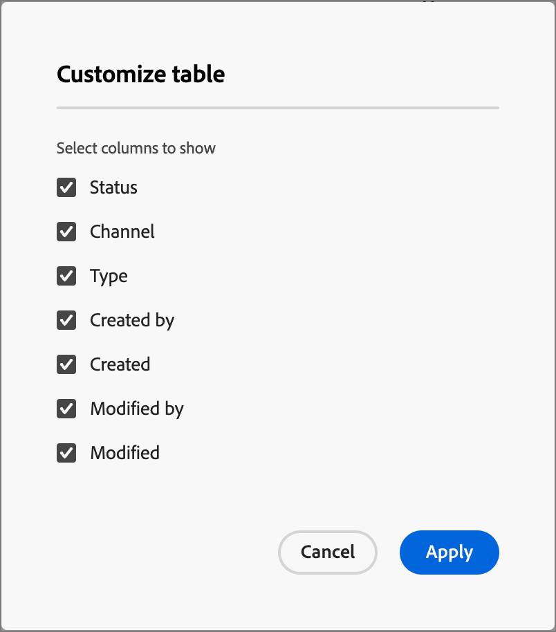

# Fragment

Ett fragment är en återanvändbar komponent som kan refereras i ett eller flera e-postmallar i Adobe Journey Optimizer B2B edition. Det är vanligtvis ett innehållsblock (text, bild eller båda) som kan skapas i förväg och snabbt infogas i en e-postmall eller en e-postmall. Med den här funktionen kan ni skapa flera anpassade innehållsblock som kan användas av era marknadsföringsteam för att sammanställa e-postinnehåll i en förbättrad designprocess. Vanliga användningsområden är innehållsblock för sidhuvud/sidfot för e-post, banners för inbjudningar till evenemang och säsongsvarningar.

>[!BEGINSHADEBOX]

**Visuella fragment**

Visuella fragment är fördefinierade visuella block som byggts med hjälp av designern för visuellt innehåll och som du kan återanvända i flera e-postmallar eller e-postmallar. Den aktuella omfattningen av Journey Optimizer B2B edition och den här dokumentationen gäller endast för visuella fragment. Uttrycksbaserade fragment stöds ännu inte i Journey Optimizer B2B edition.

>[!ENDSHADEBOX]

Så här använder du fragment på bästa sätt i dina arbetsflöden:

* _Skapa egna fragment_ - Skapa visuella fragment, antingen från grunden eller genom att spara innehåll som ett fragment från den visuella innehållsredigeraren.
* _Återanvänd fragment_ - Använd dem så många gånger som behövs i ditt innehåll.

## Få åtkomst till och hantera fragment

Om du vill komma åt visuella fragment i Adobe Journey Optimizer B2B edition går du till vänster navigering och klickar på **[!UICONTROL Content Management]** > **[!UICONTROL Fragments]**. Den här åtgärden öppnar en listsida med alla fragment som har skapats i instansen i en tabell.

{width="700" zoomable="yes"}

Tabellen sorteras efter kolumnen _[!UICONTROL Modified]_, med de senast uppdaterade fragmenten överst som standard. Klicka på kolumnrubriken om du vill ändra mellan stigande och fallande.

### Fragmentstatus och livscykel

Fragmentstatusen avgör om den är tillgänglig för användning i en e-post- eller e-postmall och vilka ändringar du kan göra i den.

| Status | Beskrivning |
| -------------------- | ----------- |
| Utkast | När du skapar ett fragment är det i utkaststatus. Den behåller den här statusen när du definierar eller redigerar det visuella innehållet tills du publicerar det för användning i en e-postmall eller e-postmall. Tillgängliga åtgärder: <ul><li>Redigera all information<li>Redigera i visuell designer<li>Publicera<li>Duplicera<li>Ta bort |
| Publicerad | När du publicerar ett fragment blir det tillgängligt för användning i en e-postmall eller e-postmall. Publicerat fragmentinnehåll kan inte ändras i den visuella designern. Tillgängliga åtgärder: <ul><li>Redigera beskrivning<li>Lägg till i ett e-postmeddelande eller en mall<li>Skapa utkastversion<li>Duplicera<li>Radera (om den inte används) |
| Publicerat med utkast | När du skapar ett utkast från ett publicerat fragment förblir den publicerade versionen tillgänglig för användning i en e-postmall eller e-postmall, och utkastinnehållet kan ändras i den visuella designern. Om du publicerar utkastet ersätter det den aktuella publicerade versionen och innehållet uppdateras i e-postmallarna och i e-postmallarna där det används. Tillgängliga åtgärder: <ul><li>Redigera beskrivning<li>Lägg till i ett e-postmeddelande eller en mall<li>Redigera utkast i visuell designer<li>Publicera utkast<li>Duplicera<li>Radera (om den inte används) |

{zoomable="yes"}

>[!IMPORTANT]
>
>Fragmentstatus introducerades i Journey Optimizer B2B edition August-versionen. Alla fragment som skapats före den här versionen har statusen _Utkast_, även om de används i ett e-postmeddelande eller en mall. Om du ändrar något i dessa fragment måste du publicera fragmentet för att sprida ändringarna.

### Filtrera fragmentlistan

Om du vill söka efter ett fragment efter namn anger du en textsträng i sökfältet för en matchning. Klicka på ikonen _Filter_ (  ) för att visa tillgängliga filteralternativ och ändra inställningarna för att filtrera de visade objekten enligt de angivna villkoren.

{width="700" zoomable="yes"}

### Anpassa kolumnvisningen

Anpassa de kolumner som du vill visa i tabellen genom att klicka på ikonen _Anpassa tabell_ (  ) längst upp till höger.

I dialogrutan markerar du de kolumner som ska visas och klickar på **[!UICONTROL Apply]**.

{width="300"}

## Skapa fragment

Du kan skapa nya visuella fragment i Journey Optimizer B2B edition genom att klicka på **[!UICONTROL Create fragment]** överst till höger.

1. Ange ett användbart **[!UICONTROL Name]** och **[!UICONTROL Description]** (valfritt) i dialogrutan _[!UICONTROL Create fragment]_.

   Fragmentkrav:

   * Namn - Max 100 tecken, måste vara unikt, skiftlägeskänsligt

   * Beskrivning - högst 300 tecken

   * Alpha, numeriska tecken och specialtecken tillåts

   * Reserverade tecken är **_inte tillåtna_**: `\ / : * ? " < > |`

   {width="400"}

1. Klicka på **[!UICONTROL Create]**.

   Den visuella designern öppnas med en tom arbetsyta.

1. Använd verktygen för innehållsdesign för att skapa det visuella fragmentinnehållet:

   * [Lägga till struktur och innehåll](./fragment-authoring.md#add-structure-and-content)
   * [Lägg till Assets](./fragment-authoring.md#add-assets)
   * [Navigera mellan lager, inställningar och format](./fragment-authoring.md#navigate-the-layers-settings-and-styles)
   * [Anpassa innehåll](./fragment-authoring.md#personalize-content)
   * [Aktivera anpassade fält](./fragment-authoring.md#enable-custom-fields)
   * [Redigera länkad URL-spårning](./fragment-authoring.md#edit-linked-url-tracking)

1. Klicka på **[!UICONTROL Save]** när du vill spara utkastet.

1. När du är redo att göra fragmentet tillgängligt för användning i en e-post- eller e-postmall klickar du på **[!UICONTROL Publish]**.

## Visa fragmentinformation

Klicka på namnet på ett fragment på listsidan för att öppna fragmentinformationssidan. Du kan välja att redigera fragmentet, byta namn på fragmentet eller uppdatera fragmentbeskrivningen. Gör uppdateringar och klicka utanför namn- eller beskrivningsfältet för att spara ändringarna automatiskt.

>[!NOTE]
>
>Om ett publicerat fragment används av en e-post- eller e-postmall kan du inte ändra namnet eller redigera innehållet. Du kan skapa ett utkast om du vill göra ändringar i fragmentet.

{width="600" zoomable="yes"}

Klicka på **[!UICONTROL Edit fragment]** för att öppna fragmentet i den visuella innehållsredigeraren.

Avsluta vyn när som helst genom att klicka på pilen _Bakåt_ längst upp till vänster, som återgår till listsidan _Fragment_ .

## Visa fragment som används av referenser

Klicka på fliken **[!UICONTROL Used By]** på sidan med fragmentinformation för att visa information om var fragmentet för närvarande används i Journey Optimizer B2B edition, för e-postmeddelanden, e-postmallar och fragment.

>[!IMPORTANT]
>
>Det går inte att ta bort fragment som används av e-post eller e-postmallar.

Referenser visas enligt kategori: _E-post_ eller _E-postmall_. E-postmeddelanden i Journey Optimizer B2B edition är inbäddade och redigerade inom kontoresor, så den överordnade resan för det e-postmeddelande som använder fragmentet visas i referenser.

{width="600" zoomable="yes"}

Klicka på länken för att öppna motsvarande e-post- eller e-postmall där fragmentet används.

## Ta bort fragment

Det går inte att ta bort fragment som för närvarande används av e-post- eller e-postmallar. Kontrollera därför _som används av_-referenserna innan du påbörjar en fragmentborttagning. En borttagning kan inte ångras, så kontrollera innan du startar en borttagningsåtgärd.

Du kan ta bort ett fragment på något av följande sätt:

* Klicka på **[!UICONTROL Delete]** från fragmentinformationen till höger.
* Klicka på ellipsen bredvid fragmentet på listsidan _[!UICONTROL Fragments]_och välj **[!UICONTROL Delete]**.

Åtgärden öppnar en bekräftelsedialogruta. Du kan avbryta processen genom att klicka på **[!UICONTROL Cancel]** eller klicka på **[!UICONTROL Delete]** för att bekräfta borttagningen.

{width="400"}

Om fragmentet används för närvarande öppnas en informationsdialogruta där du får en varning om att det inte kan tas bort. Klicka på **[!UICONTROL OK]**, som avbryter borttagningsåtgärden.

{width="400"}

## Redigera fragment

Ändringar i ett fragment beror på dess aktuella status:

* När ett fragment har statusen _Utkast_ kan du redigera alla dess detaljer och det visuella innehållet.
* När ett fragment har statusen _Publicerad_ kan du redigera fragmentbeskrivningen, men inte namnet. Du kan inte redigera det visuella innehållet.
* När ett fragment har statusen _Publicerat med utkast_ begränsas redigeringen till beskrivningen. Du kan också redigera det visuella innehållet för utkastversionen.

>[!BEGINTABS]

>[!TAB Utkast]

1. Klicka på fragmentnamnet på listsidan _[!UICONTROL Fragments]_för att öppna det.

   En förhandsgranskning av det visuella innehållet visas, med fragmentinformationen till höger.

1. Ändra alla detaljer, till exempel namn och beskrivning.

   {width="600" zoomable="yes"}

1. Om du vill ändra innehållet i den visuella designern klickar du på **[!UICONTROL Edit fragment]**.

   Använd de visuella designverktygen efter behov:

   * [Lägga till struktur och innehåll](./fragment-authoring.md#add-structure-and-content)
   * [Lägg till Assets](./fragment-authoring.md#add-assets)
   * [Navigera mellan lager, inställningar och format](./fragment-authoring.md#navigate-the-layers-settings-and-styles)
   * [Anpassa innehåll](./fragment-authoring.md#personalize-content)
   * [Aktivera anpassade fält](./fragment-authoring.md#enable-custom-fields)
   * [Redigera länkad URL-spårning](./fragment-authoring.md#edit-linked-url-tracking)

   Klicka på **[!UICONTROL Save]** eller **[!UICONTROL Save & close]** för att återgå till fragmentinformationen.

1. När fragmentet uppfyller dina villkor och du vill göra det tillgängligt för användning i en e-postmall eller e-postmall klickar du på **[!UICONTROL Publish]**.

>[!TAB Publicerad]

1. Klicka på fragmentnamnet på listsidan _[!UICONTROL Fragments]_för att öppna det.

   En förhandsgranskning av det visuella innehållet visas, med fragmentinformationen till höger.

1. Ändra beskrivningen om det behövs.

   För ett publicerat fragment går det inte att ändra all annan information.

1. Om du vill uppdatera innehållet klickar du på **[!UICONTROL Create draft version]** längst upp till höger.

   Klicka på **[!UICONTROL OK]** i dialogrutan för att öppna utkastet i den visuella designern.

   {width="300"}

   Använd de visuella designverktygen efter behov:

   * [Lägga till struktur och innehåll](./fragment-authoring.md#add-structure-and-content)
   * [Lägg till Assets](./fragment-authoring.md#add-assets)
   * [Navigera mellan lager, inställningar och format](./fragment-authoring.md#navigate-the-layers-settings-and-styles)
   * [Anpassa innehåll](./fragment-authoring.md#personalize-content)
   * [Aktivera anpassade fält](./fragment-authoring.md#enable-custom-fields)
   * [Redigera länkad URL-spårning](./fragment-authoring.md#edit-linked-url-tracking)

   Klicka på **[!UICONTROL Save]** eller **[!UICONTROL Save & close]** för att återgå till fragmentinformationen.

1. När utkastet uppfyller dina villkor och du vill göra ändringarna tillgängliga för användning i en e-postmall eller e-postmall klickar du på **[!UICONTROL Publish]**.

   När du publicerar utkastet ersätts den aktuella publicerade versionen och innehållet uppdateras i e-postmallarna och i e-postmallarna där det redan används.

>[!TAB Publicerat med utkast]

Det finns två sätt att öppna utkastet för redigering från listsidan _[!UICONTROL Fragments]_:

* Klicka på ikonen _Mer_ (**..**) bredvid fragmentnamnet och välj **[!UICONTROL Open draft version]**.

  {width="300"}

* Klicka på fragmentnamnet för att öppna det. Klicka sedan på **[!UICONTROL Open draft version]** överst till höger.

  En förhandsgranskning av det visuella innehållet för utkastversionen visas, med fragmentinformationen till höger.

Så här uppdaterar du innehållet:

1. Klicka på **[!UICONTROL Edit fragment]** överst till höger. Använd de visuella designverktygen efter behov:

   * [Lägga till struktur och innehåll](./fragment-authoring.md#add-structure-and-content)
   * [Lägg till Assets](./fragment-authoring.md#add-assets)
   * [Navigera mellan lager, inställningar och format](./fragment-authoring.md#navigate-the-layers-settings-and-styles)
   * [Anpassa innehåll](./fragment-authoring.md#personalize-content)
   * [Aktivera anpassade fält](./fragment-authoring.md#enable-custom-fields)
   * [Redigera länkad URL-spårning](./fragment-authoring.md#edit-linked-url-tracking)

   Klicka på **[!UICONTROL Save]** eller **[!UICONTROL Save & close]** för att återgå till fragmentinformationen.

1. När utkastet uppfyller dina villkor och du vill göra ändringarna tillgängliga för användning i en e-postmall eller e-postmall klickar du på **[!UICONTROL Publish]**.

   När du publicerar utkastet ersätts den aktuella publicerade versionen och innehållet uppdateras i e-postmallarna och i e-postmallarna där det redan används.

>[!ENDTABS]

## Duplicera fragment

Du kan duplicera ett fragment på något av följande sätt:

* Klicka på ikonen _Mer_ (**..**) bredvid fragmentnamnet på listsidan _[!UICONTROL Fragments]_och välj **[!UICONTROL Duplicate]**.
* Klicka på **[!UICONTROL ... More]** längst upp till höger på sidan med fragmentinformation och välj **[!UICONTROL Duplicate]**.

{width="600" zoomable="yes"}

Ange ett användbart namn (unikt) och en beskrivning i dialogrutan. Klicka på **[!UICONTROL Duplicate]** för att slutföra åtgärden.

{width="400"}

Det duplicerade (nya) fragmentet visas sedan i listan _Fragments_.

## Spara ett nytt fragment från e-post eller mallinnehåll

När du skapar/redigerar en e-post- eller e-postmall i den visuella innehållredigeraren kan du välja att spara hela eller delar av innehållet som ett fragment så att det är tillgängligt för återanvändning.

1. När du har innehåll som ska sparas som ett fragment klickar du på **[!UICONTROL More]** och väljer **[!UICONTROL Save as Fragment]**.

1. Markera de olika element som ska inkluderas i fragmentet.

   Markera flera strukturer genom att hålla ned Skift eller Ctrl.

   Du kan bara markera strukturer som ligger intill varandra och gränssnittet tillåter inte att du markerar element som inte ligger intill varandra.

1. Markera innehållet och klicka på **[!UICONTROL Create]** överst till höger.

1. Ange ett användbart namn och en beskrivning för fragmentet i dialogrutan. Klicka sedan på **[!UICONTROL Create]**.

   Det nya fragmentet visas sedan på listsidan _Fragment_ och kan även användas i e-postmeddelanden och e-postmallar.

## Lägga till visuella fragment i e-post- eller mallinnehåll

Fragment är utformade för återanvändning och kan infogas för att skapa e-post- och e-postmallar. Du kan lägga till upp till 30 fragment i ett e-postmeddelande eller en mall. Fragment kan bara kapslas upp till en nivå.

>[!BEGINTABS]

>[!TAB Lägg till fragment i ett e-postmeddelande]

1. Navigera till **[!UICONTROL Account Journeys]** och öppna en befintlig resa eller skapa en ny.

1. Skapa en [_[!UICONTROL Send Email]_-nod ](./email-authoring.md#add-an-email-action-in-an-account-journey).

1. Skapa eller redigera [e-postinnehåll för noden](./email-authoring.md#create-the-email-content).

1. Dra och släpp ett objekt från menyn **[!UICONTROL Components]** för att ange en _struktur_ för fragmentet.

1. Klicka på ikonen _Fragment_ om du vill öppna en lista med publicerade fragment.

   Du kan:
   * Sortera listan.
   * Bläddra, sök och filtrera listan.
   * Växla mellan kort (miniatyrbild) och listvyer.
   * Uppdatera listan så att den återspeglar något av de nyligen skapade fragmenten.

   {width="600"}

1. Dra och släpp något av fragmenten till platshållaren för strukturkomponenten.

   Redigeraren återger fragmentet i avsnittet/elementet i e-poststrukturen.

Fragmentets innehåll uppdateras dynamiskt i strukturen för att återge hur innehållet visas i e-postmeddelandet.

>[!TIP]
>
>Om du vill att fragmentet ska uppta hela den vågräta layouten i e-postmeddelandet lägger du till en [!UICONTROL 1:1 column]-struktur och drar och släpper fragmentet i den.

När e-postmeddelandet har sparats visas det på fragmentinformationssidan när fliken _[!UICONTROL Used By]_har valts. Fragment som läggs till i ett e-postmeddelande kan inte redigeras i e-postmeddelandet eller mallen - det publicerade källfragmentet definierar innehållet.

>[!TAB Lägg till fragment i en e-postmall]

1. Klicka på **[!UICONTROL Content Management]** > **[!UICONTROL Templates]** i den vänstra navigeringen.

1. Skapa en ny mall eller öppna en befintlig e-postmall och klicka på **[!UICONTROL Edit Email Template]**.

1. Dra och släpp ett objekt från menyn **[!UICONTROL Components]** för att ange en _struktur_ för fragmentet.

1. Om du vill öppna fragmentlistan klickar du på ikonen _Fragment_ .

   Du kan:
   * Sortera listan.
   * Bläddra, sök och filtrera listan.
   * Växla mellan kort (miniatyrbild) och listvyer.
   * Uppdatera listan så att den återspeglar något av de nyligen skapade fragmenten.

   {width="600"}

1. Dra och släpp något av fragmenten till platshållaren för strukturkomponenten.

   Redigeraren återger fragmentet i avsnittet/elementet i e-postmallstrukturen.

1. Dra och släpp något av fragmenten till platshållaren för strukturkomponenten.

   Redigeraren återger fragmentet i avsnittet/elementet i e-postmallstrukturen.

>[!TIP]
>
>Om du vill att fragmentet ska uppta hela den vågräta layouten i e-postmallen lägger du till en _[!UICONTROL 1:1 column]_-struktur och drar och släpper fragmentet i den.

När e-postmallen har sparats visas den på fragmentinformationssidan när fliken _[!UICONTROL Used By]_har valts. Fragment som läggs till i en e-postmall kan inte redigeras i mallen - det publicerade källfragmentet definierar innehållet.

>[!ENDTABS]

## Fragmentåtgärder vid e-post- och mallutveckling

När ett fragment läggs till i en e-post- eller e-postmall kan fragmentinnehållet inte redigeras i e-postmeddelandet eller mallen. Du kan dock använda följande åtgärder:

* **[!UICONTROL Delete]** - Den här åtgärden tar bort fragmentet från det aktuella e-postmallinnehållet eller e-postmallinnehållet (fragmentkällan påverkas inte).
* **[!UICONTROL Refresh]** - Den här åtgärden uppdaterar innehållet i fragmentet i den aktuella e-post- eller e-postmallen. Det är praktiskt att uppdatera när du vill spegla de senaste ändringarna i fragmentet efter att ha lagt till e-post- eller e-postmallen.
* **[!UICONTROL Duplicate]** - Den här åtgärden duplicerar fragmentet inom samma e-post- eller e-postmall i redigeraren, med samma dimensioner och lägger till precis nedanför det.
* **[!UICONTROL Open Fragment]** - Den här åtgärden öppnar en ny webbläsarflik med fragmentredigeringssidan och information.
* **[!UICONTROL Break inheritance]** - Den här åtgärden bryter arvet av fragmentet (och dess ändringar) från källan. Använd den här åtgärden om du vill göra fragmentinnehållet tillgängligt som oberoende och redigerbart innehåll i e-post- eller e-postmallen. Den här åtgärden tar också bort e-post- eller e-postmallen från referensen _Används av_ för det ursprungliga fragmentet.

När du markerar fragmentet på redigeringssidan är de här åtgärderna tillgängliga från kontextverktygsfältet och egenskapspanelen till höger.

{width="600" zoomable="yes"}
