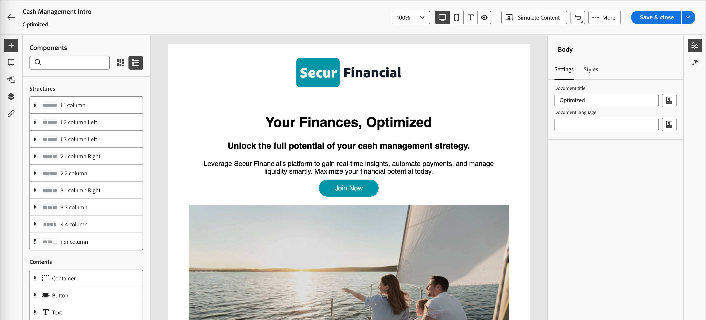

# Skapa e-postinnehåll med GenStudio for Performance Marketing {#genstudio-workflow}

>[!CONTEXTUALHELP]
>id="ajo-b2b_genstudio_button"
>title="Använda en mall som byggts med GenStudio"
>abstract="Använd integreringen med Adobe GenStudio for Performance Marketing för att importera en GenStudio-mall som har förbättrats med Adobe AI-teknik."

>[!AVAILABILITY]
>
>GenStudio-integreringen i [!DNL Adobe Journey Optimizer B2B Edition] är för närvarande inte tillgänglig för användning med tilläggserbjudandena **Hälsovårdssköld** eller **Sekretess och säkerhetssköld**.
>
>Den här integreringen är endast tillgänglig för e-postkanalen.

För att effektivisera arbetsflödet och upprätthålla en enhetlig varumärkesprofil kan ni kombinera GenStudio for Performance Marketing-upplevelser med e-postsamordning från Adobe Journey Optimizer B2B edition. Det utökade arbetsflödet gör att du kan använda verktygen för att skapa AI-material i GenStudio för att utöka och maximera e-postkommunikationen via kontoresor.

En teknisk marknadsförare som använder Journey Optimizer B2B edition för att utveckla och automatisera e-postkommunikation för viktiga konton kan till exempel samarbeta med en resultatmarknadsförare som skapar innehåll med GenStudio. Med det här arbetsflödet kan båda fungera tillsammans för att kombinera varumärkesinnehåll från GenStudio till kontobaserad marknadsföringsautomatisering för Journey Optimizer B2B edition och leverera engagerande e-postmeddelanden som riktar sig till specifika inköpsgrupper och ökar försäljningen.

>[!BEGINSHADEBOX]

## Funktioner för generering av GenStudio-innehåll

[Adobe GenStudio for Performance Marketing](https://business.adobe.com/products/genstudio-for-performance-marketing.html){target="_blank"} är en generativ AI-tillämpning som ger marknadsföringsteamen möjlighet att skapa slagkraftiga, personaliserade annonser och e-postmeddelanden som följer varumärkesstandarder och följer deras företagspolicyer. Genom att utnyttja Adobe AI-teknik får du en omfattande verktygslåda som förenklar komplexa funktioner för att skapa och hantera innehåll så att kreatörerna kan fokusera på innovation.

{width="30"} [Skapa e-postmeddelanden för marknadsföring på varumärke](https://experienceleague.adobe.com/en/docs/genstudio-for-performance-marketing-learn/tutorials/creating-experiences/creating-on-brand-emails){target="_blank"}

Läs mer om GenStudio for Performance Marketing-funktionerna i [dokumentationen](https://experienceleague.adobe.com/en/docs/genstudio-for-performance-marketing/user-guide/home){target="_blank"}

>[!ENDSHADEBOX]

## Exportera HTML från Journey Optimizer B2B edition

I Journey Optimizer B2B edition exporterar du HTML från ett e-postmeddelande som innehåller varumärkesriktlinjerna.

1. I Journey Optimizer B2B edition får du tillgång till innehållet i e-postmeddelandet i den visuella designrymden.

1. Välj _[!UICONTROL More ...]_&#x200B;på menyn **[!UICONTROL Export HTML]**&#x200B;överst i e-postdesignområdet.

   {width="600"}

   Den här åtgärden genererar en nedladdad ZIP-fil som innehåller HTML- och bildfilerna.

## Använda den exporterade HTML-filen i GenStudio for Performance Marketing

GenStudio for Performance Marketing känner igen vissa element i det importerade e-postmeddelandet från HTML när de identifieras med ett igenkänt fältnamn. Lägg till fältnamn i den exporterade HTML-filen med syntaxen Handlebars där du behöver GenStudio for Performance Marketing för att generera en viss typ av innehåll.

| Fält | Innehållstyp |
| ----------------- | ------------------------- |
| `{{pre_header}}` | Förrubrik |
| `{{headline}}` | Headline |
| `{{sub_headline}}` | Underrubrik |
| `{{body}}` | Brödtext |
| `{{cta}}` | Call to action (button) |
| `{{image}}` | Bild |
| `{{link}}` | Call to action på bild |

### Skapa mallen

Använd HTML-filen för att skapa en mall i GenStudio for Performance Marketing.

Mer information om hur du överför en HTML-mall till GenStudio i Adobe GenStudio for Performance Marketing finns i [Lägga till en mall](https://experienceleague.adobe.com/en/docs/genstudio-for-performance-marketing/user-guide/content/templates/use-templates#add-a-template) i GenStudio for Performance Marketing-dokumentationen.

När du överför den exporterade HTML-filen som en mall söker GenStudio for Performance Marketing igenom HTML-filen efter identifierade fält. Använd förhandsgranskningen för att granska mallelementen och bekräfta att du har identifierat dem korrekt med de identifierade fältnamnen.

### Generera e-postupplevelser

I GenStudio for Performance Marketing använder du mallen för att skapa flera varianter av e-postupplevelser och spara dem.

Mer information om hur du genererar varumärkesanpassade e-postupplevelser finns i [Skapa en e-postupplevelse](https://experienceleague.adobe.com/en/docs/genstudio-for-performance-marketing/user-guide/create/create-email-experience) i GenStudio for Performance Marketing-dokumentationen.

## Lägg till genererade e-postupplevelser i Journey Optimizer B2B edition

>[!NOTE]
>
>Integreringen med GenStudio for Performance Marketing är endast tillgänglig för att skapa e-postmeddelanden och är inte tillgänglig för att skapa en e-postmall.

Så här använder du e-postvarianter från GenStudio som skapats från den exporterade Journey Optimizer B2B edition HTML-filen:

1. I Journey Optimizer B2B edition [lägger du till ett e-postmeddelande](./add-email.md) till en kontoresa med en _[!UICONTROL Take an action]_-nod.

   * Välj _[!UICONTROL Action on]_&#x200B;för målet **[!UICONTROL People]**.

   * Välj _[!UICONTROL Action on people]_&#x200B;för **[!UICONTROL Send email]**.

     {width="700" zoomable="yes"}

   * För _[!UICONTROL Email source]_&#x200B;väljer du **[!UICONTROL Create new email]**&#x200B;om du vill skapa e-postmeddelandet i Journey Optimizer B2B edition.

1. Välj _på sidan_ Skapa din e-post **[!UICONTROL Import HTML]**.

1. Klicka på _[!UICONTROL Import your email]_&#x200B;i dialogrutan **[!UICONTROL Adobe GenStudio for Performance Marketing]**.

   {width="500" zoomable="yes"}

1. Bläddra bland de publicerade upplevelserna.

   Du kan filtrera upplevelserna utifrån flera kriterier, till exempel _Mall_ och _Skapad av_.

   {width="600" zoomable="yes"}

1. Välj en upplevelse och klicka på **[!UICONTROL Use]** för att börja skapa ditt e-postinnehåll.

   >[!NOTE]
   >
   >GenStudio-upplevelser som skapats i en Journey Optimizer B2B edition- eller Marketo Engage-mall importeras direkt till e-postdesignområdet. Upplevelser som skapas utan en Journey Optimizer B2B edition-mall importeras till kompatibilitetsläge.

1. Använd [verktygen för e-postinnehåll och personalisering](./email-authoring.md) för att redigera e-postmeddelandet efter behov och spara det.

   {width="800" zoomable="yes"}
