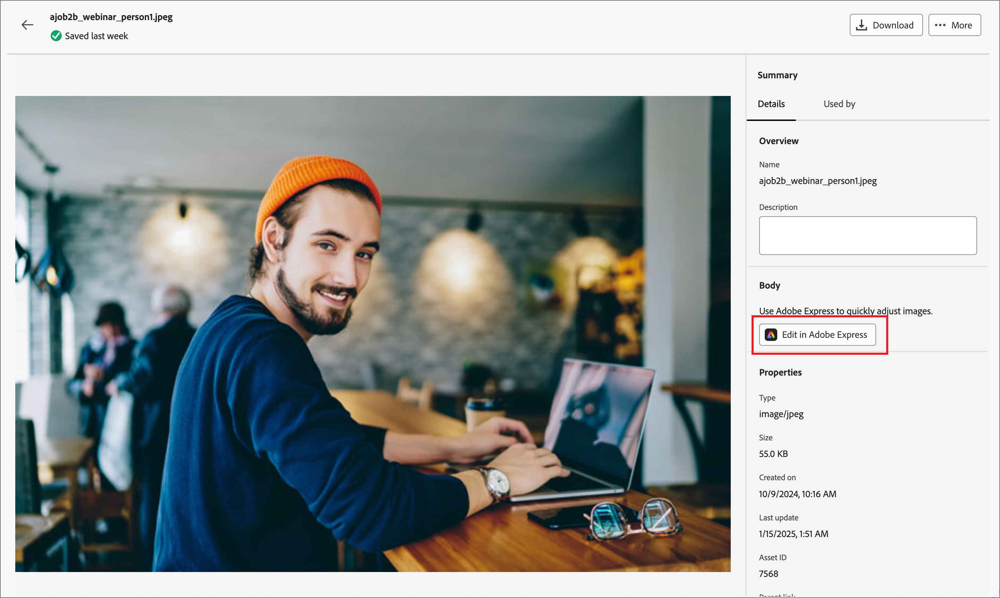

# Redigera bilder med Adobe Express {#edit-images-adobe-express}

>[!CONTEXTUALHELP]
>id="ajo-b2b_assets_edit_adobe_express"
>title="Redigera bilder i Adobe Express"
>abstract="De enkla och intuitiva bildredigeringsverktygen från Adobe Express finns tillgängliga direkt i Adobe Journey Optimizer B2B edition för att öka innehållets hastighet."

Adobe Journey Optimizer B2B edition kan integreras med Adobe Express och ger tillgång till en uppsättning bildredigeringsverktyg från Adobe Express. Du kan använda de här verktygen för att ändra de bilder som lagras på arbetsytan i Journey Optimizer B2B edition för den anslutna Marketo Engage-resurskatalogen. Integreringen ger följande viktiga fördelar:

* Större återanvändning av innehåll genom att redigera och spara nya bildresurser i Journey Optimizer B2B edition.

* Minskad tid och arbete med att uppdatera bildresurser eller skapa nya versioner av befintliga bildresurser.

>[!NOTE]
>
>Tillstånd till Adobe Express redigeringsfunktioner ingår i alla prenumerationer på Journey Optimizer B2B edition.

Adobe Express-funktionerna stöder bildfilformaten PNG och JPEG.

_Så här ändrar du en bild:_

1. Gå till den vänstra navigeringen och klicka på **[!UICONTROL Content Management]** > **[!UICONTROL Assets]**.

Den här åtgärden öppnar en listsida med alla resurser listade. Arbetsytan _[!UICONTROL Journey Optimizer B2B Edition]_&#x200B;är markerad som standard.

1. Leta reda på bilden som du vill ändra eller använda som ett original för att skapa en ny resurs.

   * Om du vill visa resurserna efter arbetsyta och mapp öppnar du strukturen genom att klicka på ikonen _Visa mappar_ längst upp till vänster.

   * Om du vill sortera tabellen efter någon av kolumnerna klickar du på kolumnrubriken. Pilen i rubrikraden anger den aktuella sorteringskolumnen och -ordningen.

   * Om du vill söka efter en bildresurs på den valda arbetsytan eller mappen anger du en textsträng i sökfältet.

   {width="800" zoomable="yes"}

1. Klicka på bildresursens namn för att öppna den och visa information om den.

   >[!TIP]
   >
   >Det är en god vana att välja [fliken _[!UICONTROL Used By]_](./marketo-engage-design-studio.md#view-asset-used-by-references) i bildinformationen och granska innehållet där bilden används innan du fortsätter att redigera bildfilen.

1. Klicka på **[!UICONTROL Edit with Adobe Express]** i bilden _[!UICONTROL Details]_&#x200B;till höger.

   {width="600" zoomable="yes"}

   Om bilden används visas en varningsdialogruta som informerar dig om att eventuella ändringar som du gör påverkar innehållet. Klicka på **[!UICONTROL Continue]** för att fortsätta till Adobe Express Editor.

   {width="300"}

## Adobe Express Enterprise-licens

Om du har en Enterprise-licens för Adobe Express kan du komma åt och använda Express-redigeraren. Bland dessa redigeringsfunktioner finns åtgärder för bildjusteringar, som färg, intensitet, skärpa, kontraster och beskärning. De innehåller även _AI-åtgärder för magi_, som att ta bort bakgrunder, infoga och ta bort objekt samt radera delar av bilden.

>[!NOTE]
>
>Din Adobe Express Enterprise-licens måste köpas under samma IMS-organisation för att du ska få tillgång till dessa fullständiga redigeringsfunktioner för Journey Optimizer B2B edition. Som enskild medlem i IMS-organisationen behöver du en tilldelad licens i Adobe Express-instansen. I annat fall är din Adobe Express-åtkomst begränsad till [snabbåtgärderna på Adobe Express](#quick-actions-in-adobe-express) från Journey Optimizer B2B edition.

{width="600" zoomable="yes"}

[Adobe Express användarhandbok](https://helpx.adobe.com/express/user-guide.html){target="_blank"} innehåller detaljerad information om tillgängliga redigeringsfunktioner.

## Snabbåtgärder i Adobe Express

Om du inte har någon Adobe Express Enterprise-licens har du tillgång till Adobe Express snabbredigerare.

1. I snabbredigeraren för Adobe Express väljer du någon av bildändringsfunktionerna för att ändra bilden.

   * [**[!UICONTROL Resize image]**](#resize-image)
   * [**[!UICONTROL Remove background]**](#remove-background)
   * [**[!UICONTROL Crop image]**](#crop-image)
   * [**[!UICONTROL Convert to PNG]**](#convert-file-format) (när en JPEG-bild läses in)
   * [**[!UICONTROL Convert to JPEG]**](#convert-file-format) (när en PNG-bild läses in)

   {width="600" zoomable="yes"}

1. När du återgår till huvudredigeraren för snabbåtgärder i Adobe Express klickar du på **[!UICONTROL Save]** för att spara den ändrade bildfilen i Journey Optimizer B2B edition-resursytan med samma filnamn.

## Ändra bildstorlek

1. Använd storleksinställningarna för att förminska eller förstora bilden:

   * Välj ett **[!UICONTROL Aspect ratio]**-alternativ. Använd en standardstorlek för digitalt innehåll eller välj **[!UICONTROL Custom]** om du vill ange värden för **[!UICONTROL Width]** och **[!UICONTROL Height]** efter dina behov.

   * Visade _[!UICONTROL Original size]_&#x200B;och&#x200B;_[!UICONTROL Compressed size]_ visar de storleksändringar som blir resultatet om du tillämpar ändringarna. Med verktyget **[!UICONTROL Zoom and Crop]** kan du inspektera delar av den visade bilden närmare.

   * Om du vill återställa bilden till det ursprungliga läget klickar du på **[!UICONTROL Reset]**.

   {width="600" zoomable="yes"}

1. När du är nöjd med resultatet klickar du på **[!UICONTROL Apply]**.

## Ta bort bakgrund

{width="600" zoomable="yes"}

Adobe Express utför en automatisk borttagning av bakgrunden för att isolera det primära objektet i bilden. Om du är nöjd med resultatet klickar du på **[!UICONTROL Apply]**.

## Beskär bild

1. Dra i handtagen på hörnen av bilden för att ta bort de yttre områden som du inte vill ta med i bildresursen.

   {width="600" zoomable="yes"}

1. När du är nöjd med resultatet klickar du på **[!UICONTROL Apply]**.

## Konvertera filformat

* **[!UICONTROL Convert to JPEG]** - För en PNG-bild kan du konvertera bilden till en JPEG-bildfil och spara den som en ny resurs på arbetsytan.
* **[!UICONTROL Convert to PNG]** - För en JPEG-bild kan du konvertera bilden till en PNG-bildfil och spara den som en ny resurs på arbetsytan.

{width="600" zoomable="yes"}

1. Klicka på **[!UICONTROL Apply]**.
