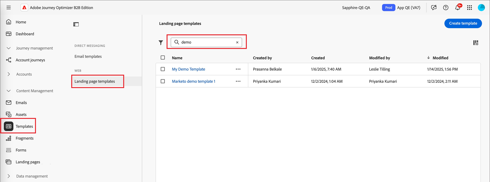

# Mallar för landningssidor

För en snabbare och förbättrad designprocess kan du skapa fristående mallar för landningssidor för att standardisera siddesign och innehåll. Marknadsföringsstrateger kan återanvända sidorna och anpassa dem så att de passar i kampanjer och resor.

## Få åtkomst till och hantera mallar för landningssidor

Gå till **[!UICONTROL Content Management]** > **[!UICONTROL Templates]** om du vill komma åt landningssidmallar i Adobe Journey Optimizer B2B edition. Välj **[!UICONTROL Landing page templates]** under _[!UICONTROL WEB]_&#x200B;i navigeringspanelen.

Den listsida som visas innehåller alla landningssidmallar som skapats i den instans som anges i tabellformat. Tabellen sorteras som standard efter kolumnen _[!UICONTROL Modified]_, med de senast uppdaterade mallarna överst. Klicka på kolumnrubriken om du vill ändra mellan stigande och fallande.

Om du vill söka efter en mall efter namn anger du en textsträng i sökfältet.

{width="700" zoomable="yes"}

Klicka på ikonen _Filter_ (  ) längst upp till vänster om du vill filtrera listan efter datum för när den skapades eller ändrades samt mallar som du har skapat eller ändrat.

Anpassa de kolumner som du vill visa i tabellen genom att klicka på ikonen _Anpassa tabell_ (  ) längst upp till höger. Markera de kolumner som ska visas och klicka på **[!UICONTROL Apply]**.

I malllistan kan du utföra de åtgärder som beskrivs i följande avsnitt.

## Skapa en mall för landningssidor

Du kan skapa en landningssidmall från landningssidans mallsida genom att klicka på **[!UICONTROL Create template]** överst till höger.

1. Ange en unik **[!UICONTROL Name]** (obligatoriskt) och en användbar **[!UICONTROL Description]** (valfritt) i dialogrutan.

   {width="400"}

1. Klicka på **[!UICONTROL Create]**.

Sidan _[!UICONTROL Create your primary landing page]_&#x200B;öppnas och innehåller alternativ för att skapa mallen:_[!UICONTROL Design from scratch]_, _[!UICONTROL Import HTML]_&#x200B;eller välj något av&#x200B;_[!UICONTROL Saved templates]_.

{width="800" zoomable="yes"}

När du har valt den metod som du vill använda för att starta malldesignen använder du den visuella designrymden för att [utforma innehållet i landningssidans mall](./landing-page-design.md).

### Designa från grunden

Använd det visuella designutrymmet för att definiera strukturen för innehållet på landningssidan. Genom att lägga till och flytta strukturella komponenter med enkla dra och släpp-åtgärder kan du designa formen på det återanvändbara sidinnehållet på några sekunder.

>[!NOTE]
>
>De tillgängliga designverktygen motsvarar de verktyg som används för att utforma landningssidor. Skillnaden är att det här innehållet sparas som en mall som kan återanvändas på flera landningssidor.

1. Välj alternativet **[!UICONTROL Design from scratch]** på startsidan för _[!UICONTROL Design your template]_.

1. [Lägg till struktur och innehåll](./landing-page-design.md#add-structure-and-content) i mallen.

### Importera HTML

Med Adobe Journey Optimizer B2B edition kan du importera befintligt HTML-innehåll för att utforma landningssidmallar.

{{$include /help/_includes/content-design-import.md}}

{width="500"}

>[!NOTE]
>
>Om du använder en `<table>`-tagg som det första lagret i en HTML-fil kan du förlora format, inklusive inställningar för bakgrund och bredd i den översta lagertaggen.

Du kan anpassa det importerade innehållet efter behov med den visuella designrymden.

### Välj en designmall

{{$include /help/_includes/content-design-select-template.md}}

## Visa information om sidmallar

Klicka på namnet på en landningssidmall på listsidan _Landningssidmallar_ för att öppna informationssidan. Härifrån kan du visa grundläggande egenskaper för landningssidmallen och komma åt den visuella designrymden för att göra ändringar i mallinnehållet.

{width="700" zoomable="yes"}

* Visa mallinformation, till exempel namn och beskrivning. Dessa inställningar kan redigeras. Klicka utanför beskrivningsrutan om du vill spara ändringarna automatiskt.

* Visa mallegenskaper som t.ex. skapad av, skapad den, senast uppdaterad den och ändrad av.

* Klicka på **[!UICONTROL More]** överst till höger för att utföra snabba åtgärder på landningssidmallen, till exempel _Duplicera_ och _Ta bort_.

* Om det finns aktiva aviseringar (fel och varningar för landningssidmallen) klickar du på **[!UICONTROL Alerts]** längst upp till höger för att visa informationen.

  Dessa varningar förhindrar inte att landningssidmallen används för att skapa landningssidor. Informationen ger marknadsförarna i teamet insyn i vad som kanske inte fungerar och i de uppdateringar som krävs innan den kan användas för leverans.

## Visa mall som används av referenser

Klicka på fliken **[!UICONTROL Used By]** på sidan Mallinformation för att visa information om var den här mallen används på en landningssida.

{width="400"}

* När du klickar på länken kommer du till motsvarande landningssida där mallen används.

* Avsluta vyn när som helst genom att klicka på bakåtpilen, som återgår till listsidan.

## Redigera mallar för landningssidor

Den här åtgärden kan utföras från:

* Informationssidan - Klicka på **[!UICONTROL Edit landing page template]**.
* Listsidan - Klicka på ellipsen (**..**) bredvid en mall och välj **[!UICONTROL Edit]**.

Den här åtgärden tar dig till sidan _Designa mallen_ eller sidan för redigering av visuellt innehåll (baserat på den senast sparade statusen för landningssidmallen). Härifrån kan du redigera innehållet i landningssidans mall efter behov. Mer information om redigeringsalternativen finns i [Skapa en mall för landningssidor](#create-a-landing-page-template).

## Duplicera mallar för landningssidor

Du kan duplicera en landningssidmall på något av följande sätt:

* Expandera **[!UICONTROL More]** från mallinformationen till höger och klicka på **[!UICONTROL Duplicate]**.

  {width="400"}

* Klicka på ellipsen (..) bredvid mallen på listsidan för _[!UICONTROL Landing page templates]_&#x200B;och välj **[!UICONTROL Duplicate]**.

Ange ett användbart namn (unikt) och en beskrivning i dialogrutan. Klicka på **[!UICONTROL Duplicate]** för att slutföra åtgärden.

Den duplicerade (nya) landningssidmallen visas sedan i listan _Landningssidmallar_ .

## Ta bort mallar för landningssidor

Det går inte att ångra borttagning av en landningssidmall, så kontrollera innan du startar en borttagningsåtgärd. Du kan ta bort en landningssidmall på något av följande sätt:

* Expandera **[!UICONTROL More]** från mallinformationen till höger och klicka på **[!UICONTROL Delete]**.
* Klicka på ellipsen (..) bredvid mallen på listsidan _Landing page templates_ och välj **[!UICONTROL Delete]**.

  {width="500"}

Åtgärden öppnar en bekräftelsedialogruta. Du kan avbryta processen genom att klicka på **[!UICONTROL Cancel]** eller klicka på **[!UICONTROL Delete]** för att bekräfta borttagningen.

## Ta massåtgärder

På listsidan för landningssidmallar väljer du flera mallar åt gången genom att markera kryssrutorna till vänster. En banderoll visas längst ned när du väljer flera mallar.

{width="600"}

**[!UICONTROL Delete]** - Du kan ta bort upp till 20 mallar samtidigt. I en bekräftelsedialogruta kan du avbryta åtgärden eller bekräfta borttagningen av mallarna.

## Skapa en landningssida från en sparad mall

Från sidan _Skapa din landningssida_ kan du använda avsnittet _Välj designmall_ för att börja skapa innehåll från en mall.

Gör så här för att börja bygga innehåll med en av startsidmallarna:

1. Få åtkomst till det visuella designområdet från sidan _Redigera innehåll_.

   Fliken _Exempelmallar_ är markerad som standard på sidan _Skapa din landningssida_ .

1. Om du vill använda en anpassad landningssidmall väljer du fliken **[!UICONTROL Saved templates]**.

   På den här fliken visas en lista med alla landningssidmallar som skapats i sandlådan. Du kan sortera dem _efter namn_, _Senast ändrat_ och _Senast skapat_.

1. Välj önskad mall i listan.

   När du har valt mallen visas en förhandsvisning av den. I förhandsgranskningsläget kan du navigera mellan alla mallar i en kategori (exempel eller sparat, beroende på vad du har valt) med höger- och vänsterpilarna.

1. Klicka på **[!UICONTROL Use this template]** överst till höger.

1. Från den visuella designern kan du redigera ditt innehåll efter behov.
