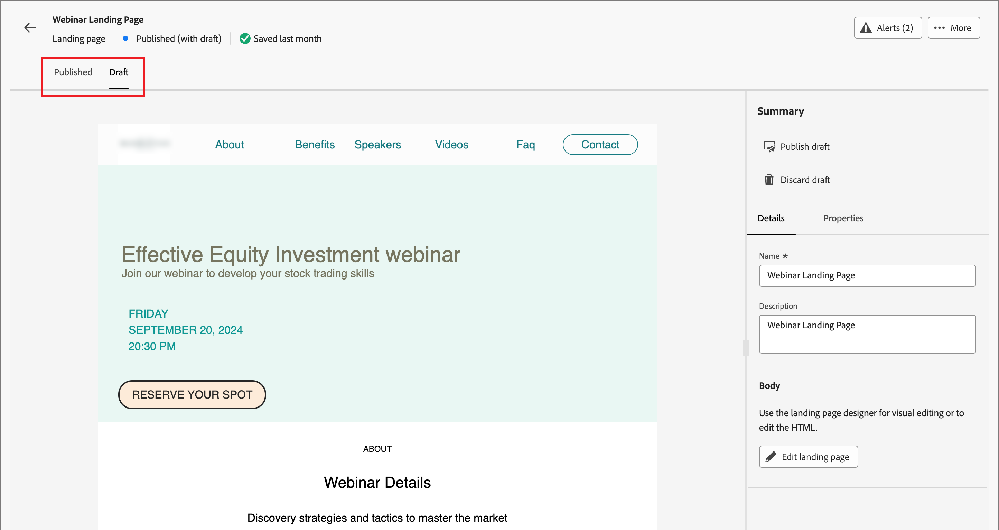
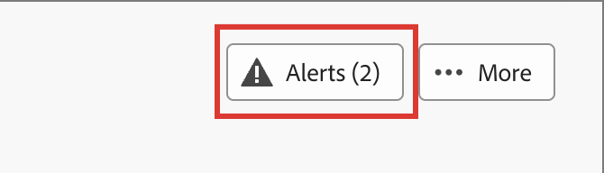

# Landningssidor

En landningssida är en fristående webbsida där du kan dirigera kontakter och kunder efter att de har klickat på ett länkat objekt i ett e-postmeddelande, SMS-meddelande eller någon annan digital plats. Du kan lägga in dessa sidor i dina kontoresor så att dina presumtiva kunder och kunder kan se dina meddelanden på webben och hur kontoresan fortskrider. Du kan skapa, anpassa och förhandsgranska landningssidor i den visuella designrymden för landningssidan.

Om du vill dirigera kunderna till en definierad webbsida när de klickar på en viss länk skapar du en landningssida i Journey Optimizer B2B edition.

* Skapa sidan
* Utforma landningssidan och författarinnehållet
* Testa sidan
* Publicera sidan
* Länka till sidan från ditt reseinnehåll

Du kan till exempel skapa och utforma landningssidor som dirigerar användarna till onlineinformation. Sidan kan innehålla ett formulär där de kan välja att inte ta emot dina meddelanden eller avanmäla sig. Eller så kan det vara en möjlighet att prenumerera på återkommande meddelanden, som nyhetsbrev.

Du kan skapa, anpassa och förhandsgranska landningssidor i den visuella designrymden.
<!-- 
For the Beta phase, you can only design landing pages from scratch and publish your landing pages. The landing pages will be served on adobe hosted domain for the Beta phase. The capability to define your branded domains for hosting will be delivered in a future release. -->

## Få åtkomst till och hantera landningssidor

Om du vill komma åt landningssidor i Adobe Journey Optimizer B2B edition går du till vänster och klickar på **[!UICONTROL Content Management]** > **[!UICONTROL Landing pages]**. Den här åtgärden öppnar en listsida med alla landningssidor som skapats i instansen som listas i en tabell.

{width="800" zoomable="yes"}

Tabellen sorteras efter kolumnen _[!UICONTROL Modified]_, med de senast uppdaterade objekten överst som standard. Klicka på kolumnrubriken om du vill ändra mellan stigande och fallande.

### Filtrera listan med landningssidor

Om du vill söka efter en landningssida efter namn anger du en textsträng i sökfältet för en matchning. Klicka på ikonen _Filter_ (  ) för att visa tillgängliga filteralternativ och ändra inställningarna för att filtrera de visade objekten enligt de angivna villkoren.

{width="700" zoomable="yes"}

### Anpassa kolumnvisningen

Anpassa de kolumner som du vill visa i tabellen genom att klicka på ikonen _Anpassa tabell_ (  ) längst upp till höger.

I dialogrutan markerar du de kolumner som ska visas och klickar på **[!UICONTROL Apply]**.

{width="300"}

### Landningssidans status och livscykel

Landningssidans status avgör om den är tillgänglig för länkning i e-post- och SMS-innehåll och vilka ändringar du kan göra i den.

| Status | Beskrivning |
| -------------------- | ----------- |
| Utkast | När du skapar en landningssida är den i utkaststatus. Den behåller den här statusen när du definierar eller redigerar det visuella innehållet och tills du publicerar det som en värdsida. Tillgängliga åtgärder: <ul><li>Redigera namn eller beskrivning<li>Redigera länk-URL<li>Redigera i visuell designrymd<li>Publicera<li>Duplicera<li>Ta bort |
| Publicerad | När du publicerar en landningssida ligger den på Journey Optimizer B2B edition-instansen och blir tillgänglig för länkning i ett e-postmeddelande eller SMS-meddelandeinnehåll. Tillgängliga åtgärder: <ul><li>Redigera namn eller beskrivning<li>Redigera länk-URL<li>Lägg till länk i e-post- eller SMS-meddelandeinnehåll<li>Skapa utkastversion<li>Duplicera<li>Ta bort |
| Publicerat med utkast | När du skapar ett utkast från en publicerad landningssida behålls den publicerade versionen och utkastinnehållet kan ändras i den visuella designrymden. Om du publicerar utkastet ersätts den aktuella publicerade versionen och innehållet uppdateras på den värdbaserade sidan. Tillgängliga åtgärder: <ul><li>Redigera namn eller beskrivning<li>Redigera länk-URL<li>Lägg till länk i e-post- eller SMS-meddelandeinnehåll<li>Redigera utkast i visuell designmodell<li>Publicera utkast<li>Duplicera<li>Ta bort (tar bort båda versionerna)<li>Ignorera utkast (återgår till publicerad status) |

{zoomable="yes"}

## Skapa en landningssida

Du kan lägga till en ny landningssida i Journey Optimizer B2B edition genom att klicka på **[!UICONTROL Create landing page]** överst till höger.

1. Ange ett användbart **[!UICONTROL Name]** och **[!UICONTROL Description]** (valfritt) i dialogrutan _[!UICONTROL Create landing page]_.

   Krav för landningssida:

   * Namn - Max 100 tecken, måste vara unikt, skiftlägeskänsligt

   * Beskrivning - högst 300 tecken

   * Alpha, numeriska tecken och specialtecken tillåts

   * Reserverade tecken är **_inte tillåtna_**: `\ / : * ? " < > |`

   {width="400"}

1. Om det behövs och om det finns flera konfigurerade underdomäner ändrar du **[!UICONTROL Subdomain]** så att den används för landningssidan.

1. Klicka på **[!UICONTROL Create]**.

   Hemsidan _[!UICONTROL Create your primary landing page]_&#x200B;öppnas och innehåller flera alternativ för att skapa sidan:_[!UICONTROL Design from scratch]_, _[!UICONTROL Import HTML]_&#x200B;eller använda en sparad mall.

   {width="800" zoomable="yes"}

   När du har valt den metod som du vill använda för att starta designen för en landningssida använder du det visuella designutrymmet för att [utforma sidan](./landing-page-design.md).

### Designa från grunden

Använd den visuella innehållsredigeraren för att definiera strukturen för innehållet på landningssidan. Genom att lägga till och flytta strukturella komponenter med enkla dra och släpp-åtgärder kan du designa formen på sidinnehållet på några sekunder.

1. Välj alternativet **[!UICONTROL Design from scratch]** på startsidan för _[!UICONTROL Create your primary landing page]_.

1. [Lägg till struktur och innehåll](./landing-page-design.md#add-structure-and-content) på sidan.

### Importera HTML

Med Adobe Journey Optimizer B2B edition kan du importera befintligt HTML-innehåll för att utforma landningssidor.

{{$include /help/_includes/content-design-import.md}}

{width="500"}

>[!NOTE]
>
>Om du använder en `<table>`-tagg som det första lagret i en HTML-fil kan du förlora format, inklusive inställningar för bakgrund och bredd i den översta lagertaggen.

Du kan anpassa det importerade innehållet efter behov med den visuella designrymden.

### Välj en sparad mall

Du kan välja mellan:

* **Exempelmallar**. Journey Optimizer-gränssnittet innehåller en samling färdiga sidmallar som du kan välja bland.

* **Sparade mallar**. Använd en sparad anpassad mall som har skapats av en medlem i organisationen med hjälp av _[!UICONTROL Templates]_-menyn <!-- or the _[!UICONTROL Save as content template]_ option when designing a landing page. -->

Använd avsnittet _[!UICONTROL Select design template]_&#x200B;för att börja skapa innehåll från en mall. Du kan använda en exempelmall eller en sparad anpassad landningssidmall från din Journey Optimizer B2B edition-instans.

>[!BEGINTABS]

>[!TAB Sparade mallar]

Fliken _Exempelmallar_ är markerad som standard på _Skapa din primära startsida_ . Om du vill använda en anpassad mall väljer du fliken **[!UICONTROL Saved templates]**.

Listan över alla sparade mallar för landningssidor visas. Du kan sortera dem efter _[!UICONTROL Name]_,_[!UICONTROL Last modified]_ och _[!UICONTROL Last created]_.

{width="700" zoomable="yes"}

Välj den mall du vill använda i listan.

När du har valt mallen visas en förhandsvisning av den. I förhandsgranskningsläget kan du navigera mellan alla mallar i en kategori (exempel eller sparat, beroende på vad du har valt) med höger- och vänsterpilarna.

{width="800" zoomable="yes"}

När visningen matchar det du vill använda klickar du på **[!UICONTROL Use this template]** längst upp till höger i förhandsvisningsfönstret.

Den här åtgärden kopierar innehållet till den visuella designrymden, där du kan redigera innehållet efter behov.

>[!TAB Exempelmallar]

Adobe Journey Optimizer B2B edition har ett urval av _färdiga_-landningssidmallar som kan användas för att skapa egna landningssidor och landningssidmallar.

<!-- {width="800" zoomable="yes"} -->

>[!ENDTABS]

<!-- 
>[!NOTE]
>
> Saved templates may have governance (content locking) settings applied to one or more components. The visual designer provides guidelines about locked components when you [author an email from a governed template](./email-authoring-governance.md). -->

## Redigera en landningssida

Ändringar av en landningssida beror på dess aktuella status:

* När en landningssida har statusen **_Utkast_** kan du redigera alla detaljer, URL-adressen och det visuella innehållet.
* När en landningssida har statusen **_Publicerad_** kan du redigera beskrivningen, men inte namnet. Om du vill ändra det visuella innehållet måste du skapa ett utkast av sidan.
* När en landningssida är i **_Publicerad med utkaststatus_** begränsas redigeringen av informationen till beskrivningen. Du kan också redigera det visuella innehållet för utkastversionen.

>[!BEGINTABS]

>[!TAB Utkast]

1. Klicka på landningssidans namn på listsidan _[!UICONTROL Landing pages]_&#x200B;för att öppna den.

   En förhandsgranskning av det visuella innehållet visas, med information om landningssidan till höger.

1. Ändra alla detaljer, till exempel namn och beskrivning.

   {width="700" zoomable="yes"}

1. Om du vill ändra innehållet i den visuella designrymden klickar du på **[!UICONTROL Edit landing page]**.

   Använd de visuella designverktygen efter behov:

   * [Lägga till struktur och innehåll](./landing-page-design.md#add-structure-and-content)
   * [Lägg till Assets](./landing-page-design.md#add-assets)
   * [Navigera mellan lager, inställningar och format](./landing-page-design.md#navigate-the-layers-settings-and-styles)
   * [Anpassa innehåll](./landing-page-design.md#personalize-content)
   * [Redigera länkad URL-spårning](./landing-page-design.md#edit-linked-url-tracking)

1. Klicka på **[!UICONTROL Save]** eller **[!UICONTROL Save & close]** för att återgå till information om landningssidan.

1. När sidan uppfyller dina villkor och du vill göra den tillgänglig för visning klickar du på **[!UICONTROL Publish]**.

>[!TAB Publicerad]

1. Klicka på sidnamnet på listsidan _[!UICONTROL Landing page]_&#x200B;för att öppna den.

   En förhandsgranskning av det visuella innehållet visas, med information om landningssidan till höger.

1. Ändra beskrivningen om det behövs.

   För en publicerad landningssida går det inte att ändra alla andra detaljer.

1. Om du vill uppdatera innehållet klickar du på **[!UICONTROL Edit landing page]** till höger.

   Klicka på **[!UICONTROL Create draft version]** i dialogrutan för att öppna utkastet i den visuella designrymden.

   {width="300"}

   Använd de visuella designverktygen efter behov:

   * [Lägga till struktur och innehåll](./landing-page-design.md#add-structure-and-content)
   * [Lägg till Assets](./landing-page-design.md#add-assets)
   * [Navigera mellan lager, inställningar och format](./landing-page-design.md#navigate-the-layers-settings-and-styles)
   * [Anpassa innehåll](./landing-page-design.md#personalize-content)
   * [Redigera länkad URL-spårning](./landing-page-design.md#edit-linked-url-tracking)

1. Klicka på **[!UICONTROL Save]** eller **[!UICONTROL Save & close]** för att återgå till information om landningssidan.

1. När utkastet till landningssida uppfyller dina villkor och du vill göra ändringarna tillgängliga på den publicerade sidan klickar du på **[!UICONTROL Publish]**.

   När du publicerar utkastet ersätts den aktuella publicerade versionen och innehållet uppdateras för sidans URL.

>[!TAB Publicerat med utkast]

När du öppnar landningssidan visas utkastet som standard. Med flikarna högst upp i förhandsvisningsområdet kan du växla visningen mellan publicerade versioner och utkastversioner. Utkaståtgärder och information visas till höger.

{width="700" zoomable="yes"}

Så här uppdaterar du innehållet:

1. Klicka på **[!UICONTROL Edit landing page]** överst till höger. Använd de visuella designverktygen efter behov:

   * [Lägga till struktur och innehåll](./landing-page-design.md#add-structure-and-content)
   * [Lägg till Assets](./landing-page-design.md#add-assets)
   * [Navigera mellan lager, inställningar och format](./landing-page-design.md#navigate-the-layers-settings-and-styles)
   * [Anpassa innehåll](./landing-page-design.md#personalize-content)
   * [Redigera länkad URL-spårning](./landing-page-design.md#edit-linked-url-tracking)

1. Klicka på **[!UICONTROL Save]** eller **[!UICONTROL Save & close]** för att återgå till information om landningssidan.

1. Klicka på **[!UICONTROL Publish]** när utkastsidan uppfyller dina villkor och du vill göra ändringarna tillgängliga.

   När du publicerar utkastet ersätts den aktuella publicerade versionen och innehållet uppdateras på den värdbaserade sidan.

>[!ENDTABS]

### Kontrollera aviseringar

När du utformar innehållet på landningssidan visas varningar i gränssnittet (längst upp till höger) när nyckelinställningarna saknas.

{width="250"}

Om knappen inte visas finns det inga identifierade problem.

Det finns två typer av varningar:

* **_Varningar_** som hänvisar till rekommendationer och bästa praxis, som:

   * `Placeholder links are present in the landing page body`: Glöm inte att ersätta platshållarna med giltiga länkar.

   * `Text version of HTML is empty`: Glöm inte att definiera en textversion av sidans brödtext, som används när HTML-innehåll inte kan visas.

   * `Empty link is present in page body`: Kontrollera att alla länkar på sidan är korrekta.

* **_Fel_** som hindrar dig från att testa eller aktivera resan/kampanjen så länge de inte är lösta, till exempel:

   * `The landing page content is empty`: Sidinnehåll är obligatoriskt.

## Duplicera en landningssida

Du kan duplicera en landningssida på något av följande sätt:

* Klicka på ikonen _Mer_ (**..**) bredvid landningssidans namn på listsidan _[!UICONTROL Landing page]_&#x200B;och välj **[!UICONTROL Duplicate]**.
* Klicka på **[!UICONTROL ... More]** längst upp till höger på informationssidan för landningssidan och välj **[!UICONTROL Duplicate]**.

{width="600" zoomable="yes"}

Ange ett användbart namn (unikt) och en beskrivning (valfritt) i dialogrutan. Klicka på **[!UICONTROL Duplicate]** för att slutföra åtgärden.

{width="350"}

Den duplicerade (nya) sidan visas sedan i listan _Landningssidor_.

## Ta bort en landningssida

Du kan ta bort en landningssida på något av följande sätt:

* Klicka på ikonen _Mer_ (**..**) bredvid landningssidans namn på listsidan _[!UICONTROL Landing page]_&#x200B;och välj **[!UICONTROL Delete]**.
* Klicka på **[!UICONTROL ... More]** längst upp till höger på informationssidan för landningssidan och välj **[!UICONTROL Delete]**.

Åtgärden öppnar en bekräftelsedialogruta. Du kan avbryta processen genom att klicka på **[!UICONTROL Cancel]** eller klicka på **[!UICONTROL Delete]** för att bekräfta borttagningen.

{width="400"}

## Länka till en landningssida

Som marknadsförare eller Designer som skapar e-post-, fragment- och sidinnehåll kan du bädda in länkar till publicerade (live) landningssidor som skapas i din Journey Optimizer B2B edition-instans.

1. När du arbetar i den visuella designrymden för ett fragment, e-post, en landningssida eller en mall markerar du ett utdrag av text, en knappkomponent eller en bildkomponent för länken.

   Alternativen för **[!UICONTROL Link]** visas på den högra panelen.

1. Välj **[!UICONTROL Landing page]** för alternativet **[!UICONTROL Type]**.

   {width="700" zoomable="yes"}

1. För alternativet **[!UICONTROL Landing page]** klickar du på ikonen _Markera sida_ (  ).

1. I dialogrutan Välj landningssida anger du **[!UICONTROL Landing page source]** som **[!UICONTROL Journey Optimizer B2B Edition]**, markerar kryssrutan för landningssidan i listan över publicerade sidor och klickar på **[!UICONTROL Select]**.

   {width="600" zoomable="yes"}

1. Välj länkmålsbeteendet för alternativet **[!UICONTROL Target]**:

   * **[!UICONTROL None]** - öppnar länken med webbläsarens standardbeteende.
   * **[!UICONTROL Blank]** - öppnar länken i ett nytt fönster eller på en ny flik.
   * **[!UICONTROL Self]** - öppnar länken i samma ram.
   * **[!UICONTROL Parent]** - öppnar länken i den överordnade ramen.
   * **[!UICONTROL Top]** - öppnar länken i hela fönstret.

1. (Endast textlänk) Markera kryssrutan **[!UICONTROL Underline link]** om du vill stryka under den länkade texten.

   Du kan ange ytterligare format för länktexten, inklusive länkfärgen, genom att välja fliken **[!UICONTROL Styles]** i den högra panelen.
