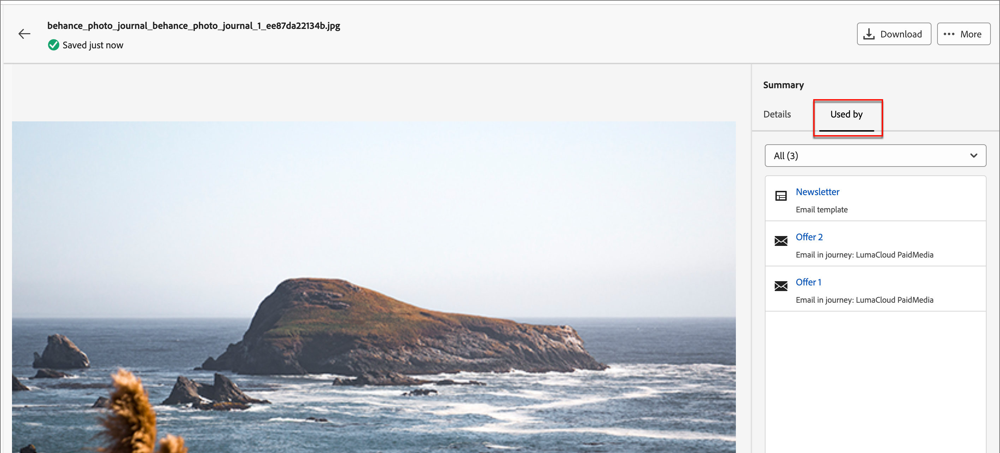

# Arbeta med Marketo Engage resurser

Marketo Engage Design Studio är standardresurskällan för Journey Optimizer B2B edition, och du kan enkelt hantera och använda de tillgängliga resurserna för att utforma innehåll som stöder dina kontoresor.

I Marketo Engage använder marknadsföringsorganisationer arbetsytor för att ordna sitt innehållsmaterial och hjälpa team att få tillgång till rätt material. Väldefinierade arbetsytor är särskilt användbara för stora företag som har en stor produktportfölj eller arbetar globalt med olika krav för marknadsföring i olika regioner.

## Central resurshantering

Som standard finns det en **_[!UICONTROL Journey Optimizer B2B Edition]_**-arbetsyta som du kan använda specifikt för ditt innehåll på din kontoresa. Resurserna som du lägger till på den här arbetsytan är inte synliga eller tillgängliga för användning i Marketo Engage. För resurser på den här arbetsytan har du alla funktioner för resurshantering i Journey Optimizer B2B edition. Bland dessa funktioner finns:

* [Ersätt](#replace-assets)
* [Ta bort](#delete-assets)
* [Flytta](#create-a-folder)
* [Redigera med Adobe Express](./image-edit-adobe-express.md)

Assets som finns på Marketo Engage arbetsytor är begränsade till skrivskyddad åtkomst för användning i e-post, e-postmallar och fragment. Du kan lägga till nya resurser på dessa arbetsytor och hämta en kopia av en resurs.

## Bläddra bland och få tillgång till resurser

Om du vill komma åt Adobe Marketo Engage-resurser från Journey Optimizer B2B edition går du till vänster och klickar på **[!UICONTROL Content Management]** > **[!UICONTROL Assets]**. Den här åtgärden öppnar en listsida med alla resurser listade.

{width="800" zoomable="yes"}

Arbetsytan i Journey Optimizer B2B edition är markerad som standard. Övriga arbetsytor visas nedan.

* Om du vill visa resurserna efter arbetsyta och mapp öppnar du strukturen genom att klicka på ikonen _Visa mappar_ längst upp till vänster.

* Om du vill sortera tabellen efter någon av kolumnerna klickar du på kolumnrubriken. Pilen i rubrikraden anger den aktuella sorteringskolumnen och -ordningen.

* Om du vill söka efter en bildresurs på den valda arbetsytan eller mappen anger du en textsträng i sökfältet.

* Om du vill anpassa kolumnerna som visas i tabellen klickar du på ikonen _Anpassa tabell_ (  ) längst upp till höger.

  Markera de kolumner som du vill visa i listan och klicka på **[!UICONTROL Apply]**.

## Visa tillgångsinformation

Klicka på namnet på en resurs för att öppna sidan med resursinformation.

{width="700" zoomable="yes"}

## Visa tillgångar som används som referenser

Klicka på fliken **[!UICONTROL Used By]** på sidan med resursinformation för att visa information om var resursen används i Journey Optimizer B2B edition, för e-post, e-postmallar och fragment.

>[!IMPORTANT]
>
>Alla resurser som för närvarande är _IN USE_ i något av e-postmeddelandena, e-postmallarna eller fragmenten **kan inte** tas bort.

Panelen visar referenser efter kategori: _E-post_, _E-postmall_ eller _fragment_. E-postmeddelanden i Journey Optimizer B2B edition är inbäddade och redigerade inom resor, så den överordnade resan för det e-postmeddelande som använder resursen visas i referenser.

När du klickar på länken dirigeras du till motsvarande e-post, e-postmall eller fragment där resursen används.

{width="700" zoomable="yes"}

## Lägga till resurser

På listsidan _Assets_ kan du lägga till bildresurser på arbetsytan i Journey Optimizer B2B edition eller på en Marketo Engage-arbetsyta.

1. Klicka på **[!UICONTROL Add Assets]** överst till höger.

1. I dialogrutan _[!UICONTROL Add assets]_drar och släpper du en eller flera filer från systemet till filrutan.

   {width="500"}

   Du kan också klicka på länken _[!UICONTROL Select a file from your computer]_om du vill använda ditt lokala filsystem för att söka efter och välja filer.

   Du kan överföra resurser från ditt lokala system på upp till 10 filer i taget. Den maximala filstorleken är 100 MB.

   De markerade bildernas filnamn visas i dialogrutan. Resursfilnamn måste vara unika (i olika mappar), och om det redan finns en fil med det namnet visas ett meddelande. Namn kan innehålla högst 100 tecken och får inte innehålla specialtecken (som `;`, `:`, `\` och `|`).

1. Välj målarbetsytan eller målmappen där resurserna ska lagras.

   >[!NOTE]
   >
   >Om du väljer en plats på arbetsytan _[!UICONTROL Journey Optimizer B2B Edition]_kan du hantera resursen i appen. Om du lägger till resursen på en Marketo Engage-arbetsyta är resurshanteringsfunktionerna bara tillgängliga från Marketo Engage Design Studio.

1. Om du vill skriva över (ersätta) filer när du överför en eller flera filer med ett befintligt filnamn markerar du kryssrutan **[!UICONTROL Overwrite existing files]**.

1. Klicka på **[!UICONTROL Add]**.

## Ta bort resurser

Det går inte att ta bort resurser som används i e-postmeddelanden, e-postmallar eller fragment. Kontrollera de använda referenserna innan du påbörjar en resursborttagning. En borttagningsåtgärd kan inte ångras, så kontrollera innan du startar en borttagningsåtgärd.

Använd någon av följande metoder för att ta bort en resurs som finns på arbetsytan _[!UICONTROL Journey Optimizer B2B Edition]_:

* Gå till resursinformationen, klicka på **[!UICONTROL ... More]** längst upp till höger och välj **[!UICONTROL Delete]** bland alternativen.

  {width="600" zoomable="yes"}

* Klicka på ikonen _[!UICONTROL Assets]_Mer_ (_) bredvid resursobjektet på listsidan **[!UICONTROL ...]**och välj **[!UICONTROL Delete]**bland alternativen.

  {width="600" zoomable="yes"}

  >[!NOTE]
  >
  >Endast resurser som finns på arbetsytan _[!UICONTROL Journey Optimizer B2B Edition]_har funktioner för resurshantering tillgängliga på menyn_ Mer _.

Åtgärden öppnar en bekräftelsedialogruta. Du kan avbryta processen genom att klicka på **[!UICONTROL Cancel]** eller klicka på **[!UICONTROL Delete]** för att bekräfta borttagningen.

Om resursen används för närvarande öppnas en informationsdialogruta där du får en varning om att den inte kan tas bort. Klicka på **[!UICONTROL OK]**, som avbryter borttagningen.

## Ersätt resurser

Använd någon av följande metoder för att ersätta en resurs som finns på arbetsytan _[!UICONTROL Journey Optimizer B2B Edition]_:

* Gå till resursinformationen, klicka på **[!UICONTROL ... More]** längst upp till höger och välj **[!UICONTROL Replace]** bland alternativen.

* Klicka på ikonen _[!UICONTROL Assets]_Mer_ (_) bredvid resursobjektet på listsidan **[!UICONTROL ...]**och välj **[!UICONTROL Replace]**bland alternativen.

I dialogrutan _[!UICONTROL Replace asset]_drar och släpper du ersättningsfilen från systemet till filrutan. Du kan också klicka på länken_[!UICONTROL Select a file from your computer]_ om du vill använda det lokala filsystemet för att välja en fil. (Om du markerar flera filer i det lokala systemet används den första filen som är markerad för att ersätta dem.)

{width="500"}

Klicka på **[!UICONTROL Replace]** om du vill fortsätta. Du kan avbryta processen genom att klicka på **[!UICONTROL Cancel]**.

Om filen som ska ersättas används visas en dialogruta som meddelar dig om att den nya bildfilen ersätter bilden där den används (e-post, e-postmallar och fragment).

## Hämta resurser

Du kan hämta en resurs på något av följande sätt:

* Gå till resursinformationen och klicka på **[!UICONTROL Download]** längst upp till höger.

* Klicka på _[!UICONTROL Assets]_Ellipsen_ (_) bredvid resursobjektet på listsidan **[!UICONTROL ...]**och välj **[!UICONTROL Download]**bland alternativen.

I bekräftelsedialogrutan klickar du på **[!UICONTROL Download]** för att påbörja hämtningen av resursen till ditt lokala system. Du kan avbryta processen genom att klicka på **[!UICONTROL Cancel]**.

## Använda massåtgärder på valda resurser

På listsidan (_[!UICONTROL Content Management]_>_[!UICONTROL Assets]_) markerar du flera resurser åt gången genom att markera varje kryssruta till vänster. En meddelandebanderoll visas längst ned när du väljer flera resurser.

{width="700" zoomable="yes"}

Du kan utföra följande gruppåtgärder för markerade resurser på arbetsytan _[!UICONTROL Journey Optimizer B2B Edition]_:

+++Flytta resurser

1. Klicka på **[!UICONTROL Move]** på markeringsbanderollen.

   Den här åtgärden öppnar dialogrutan _[!UICONTROL Move Assets]_, där namnen på de markerade resurserna visas och där kan du välja den_ målmapp _där du vill flytta resurserna.

1. Välj en mapp.

   Sökvägen bredvid _[!UICONTROL Selected assets will move to:]_reflekterar ändringen.

1. Klicka på **[!UICONTROL Move]**.

+++

+++Ta bort resurser

>[!NOTE]
>
>Du kan använda massborttagning för högst 20 markerade resurser.

1. Klicka på **[!UICONTROL Delete]** på markeringsbanderollen.

1. Klicka på **[!UICONTROL Delete]** i bekräftelsedialogrutan.

   Om någon av de markerade resurserna används för närvarande avbryts borttagningen av resursen och ett varningsmeddelande visas.

+++

## Skapa en mapp

1. Klicka på _[!UICONTROL Assets]_överst till höger på listsidan **[!UICONTROL Create Folder]**.

1. Ange mappnamnet i dialogrutan och välj målmappen (överordnad) för den nya mappen.

   Mappnamn måste vara unika, med högst 100 tecken, och får inte innehålla specialtecken som `;`, `:`, `\`, `|`.

   {width="500"}

1. Klicka på **[!UICONTROL Add]**.

## Använda åtgärder på mappnivå

I arbetsytan _[!UICONTROL Journey Optimizer B2B Edition]_kan du tillämpa åtgärder på en mapp eller resurser i mappen. Klicka på ikonen_ Mer _(**..**) bredvid mappen för att visa de åtgärder som du kan tillämpa på den.

{width="700" zoomable="yes"}

Du kan utföra följande åtgärder på mappnivå:

+++Lägga till resurser

1. Välj **[!UICONTROL Add assets]** om du vill överföra bildfiler till mappen.

1. Dra och släpp filerna från datorn i dialogrutan _[!UICONTROL Add assets]_. Du kan också klicka på länken om du vill använda filsystemet för att markera filerna.

   Du kan lägga till resurser från ditt lokala system på upp till 10 filer i taget. Du kan skriva över filer när du överför en eller flera filer med ett befintligt filnamn.

   De markerade bildernas filnamn visas i dialogrutan. Resursfilnamn måste vara unika (i olika mappar), och om det redan finns en fil med det namnet visas ett felmeddelande. Namn kan innehålla högst 100 tecken och får inte innehålla specialtecken (som `;`, `:`, `\` och `|`).

1. Klicka på **[!UICONTROL Add]**.

+++

+++Skapa en undermapp

1. Välj **[!UICONTROL Create folder]**.

1. Ange mappnamnet i dialogrutan.

   Mappnamn måste vara unika, med högst 100 tecken, och får inte innehålla specialtecken som `;`, `:`, `\`, `|`.

1. Klicka på **[!UICONTROL Add]**.

+++

+++Byt namn på mappen

1. Välj **[!UICONTROL Rename]**.

1. Ange det nya mappnamnet i dialogrutan.

   Mappnamn måste vara unika, med högst 100 tecken, och får inte innehålla specialtecken som `;`, `:`, `\`, `|`.

1. Klicka på **[!UICONTROL Save]**.

+++

+++Flytta mappen

1. Om du vill flytta mappen till en annan överordnad mapp väljer du **[!UICONTROL Move]**.

1. I dialogrutan väljer du målmappen som ny överordnad för undermappen.

1. Klicka på **[!UICONTROL Move]**.

   Om du försöker flytta en mapp till en av dess egna undermappar (inom strukturen för den valda mappen) visas ett felmeddelande och flyttningen avbryts.

+++

+++Ta bort mappen

1. Välj **[!UICONTROL Delete]**.

1. Klicka på **[!UICONTROL Delete]** i bekräftelsedialogrutan.

Om något av resurserna i mappen används för närvarande, öppnas en varningsdialogruta som informerar dig om att det inte går att ta bort. Klicka på **[!UICONTROL OK]**, som avbryter borttagningen.

+++

+++Konvertera till en arkivmapp

Om du arkiverar en mapp blir filerna i den inte sökbara. Använd arkivfunktionen för resursfiler som du inte vill att teammedlemmen ska kunna använda framgent, till exempel ett gammalt kampanjmärke eller säsongsinnehåll. Du kan senare avarkivera en mapp om du vill att innehållet ska vara tillgängligt igen.

* Välj **[!UICONTROL Convert to archive folder]**. En bekräftelsebanderoll visas som bekräftar att mappens status har ändrats till arkiverad.

* Välj **[!UICONTROL Unarchive folder]**. En bekräftelsebanderoll visas som bekräftar att mappens status har ändrats till Oarkiverad.

+++

## Använd resurser i ditt innehåll

Assets kan användas i teamets e-post, e-postmall eller visuella fragmentredigering från den visuella innehållsredigeraren.

Välj ikonen _Marketo Engage Assets_ (  ) på vänster sidofält i den visuella designrymden.

Den här åtgärden ändrar verktygspanelen som visar en strukturerad lista över tillgängliga resurser på den valda arbetsytan. Välj den arbetsyta som du vill visa för att välja en resurs.

{width="700" zoomable="yes"}

Det finns flera metoder för att lägga till en bildresurs på den visuella arbetsytan:

* Dra och släpp en miniatyrbild från den vänstra navigeringen.

* Lägg till en bildkomponent på arbetsytan och klicka på **[!UICONTROL Marketo Engage Assets]** i komponenten för att öppna dialogrutan _[!UICONTROL Select Asset from Adobe Marketo Engage]_.

  {width="700" zoomable="yes"}

  I dialogrutan kan du välja en bild från den valda databasen. Klicka på **[!UICONTROL Select]** för att lägga till resursen.

  Det finns verktyg som hjälper dig att hitta den resurs du behöver:

   * Klicka på ikonen _Filter_ längst upp till vänster om du vill filtrera de visade objekten enligt dina kriterier.

   * Ange text i fältet _Sök_ om du vill filtrera de visade objekten så att de matchar resursnamnet.

  {width="700" zoomable="yes"}
