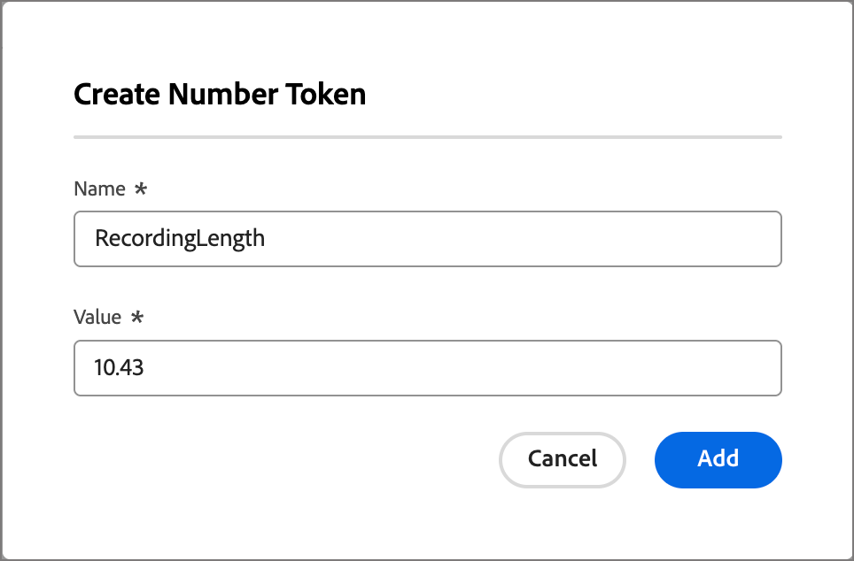
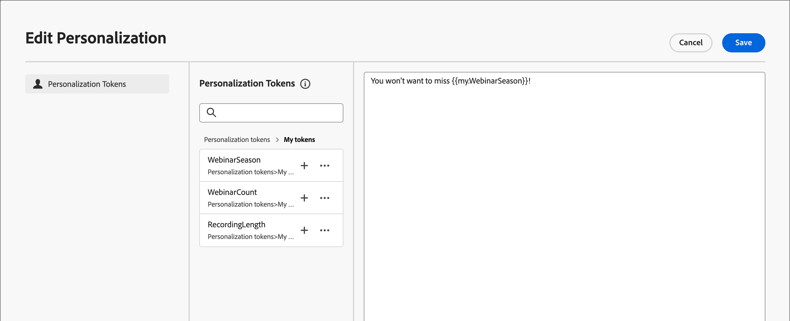

# Anpassade variabler för e-postpersonalisering

Innehållspersonalisering använder variabler som platshållare eller variabler som fylls i när innehållets artefakt genereras. Standardvariabler för personalisering finns tillgängliga för e-post, landningssidor, fragment och mallar. Du kan också definiera en uppsättning anpassade tokens med värden som är specifika för kontoresan. Den här uppsättningen anpassade tokens kallas _Mina token_ och någon av dessa anpassade tokens är till för personalisering när [e-postmeddelanden för redigeringsresan](./email-authoring.md#content-authoring---personalization) skapas.

Förutom _Mina token_, som är specifika för kontoresan, kan du använda vilken som helst av standardtokenerna (inbyggda) för e-postpersonalisering.

## Hantera mina token {#my-tokens}

_Mina token_ är anpassade variabler som du skapar eller ändrar för en kontoresa med statusen Utkast. Den här anpassade tokenuppsättningen har för närvarande stöd för text- och nummertokendefinitioner.

När du lägger till en anpassad token i ett e-postmeddelande visas den som `{{my.TokenName}}`. Du kan till exempel ha skapat `{{my.EventDate}}` eller `{{my.WebinarSpeaker}}` token för att hantera e-postinnehåll som är relaterat till kommande webbinarier.

_Så här kommer du åt anpassade tokens för en kontoresa:_

1. Öppna utkastet till kontoresa.

1. Klicka på menyn **[!UICONTROL More...]** längst upp till höger och välj **[!UICONTROL My Tokens]**.

   {width="450"}

   Sidan _Mina token_ visar alla anpassade token som har definierats för resan.

   {width="700" zoomable="yes"}

### Skapa en token

1. Klicka på **[!UICONTROL Create]** på sidan _[!UICONTROL My Tokens]_&#x200B;och välj den tokentyp som du vill definiera:

   * **[!UICONTROL Text]** - Använd den här typen för att definiera en token med ett grundläggande textsträngsvärde.

   * **[!UICONTROL Number]** - Använd den här typen för att definiera en token med ett numeriskt värde.

1. Ange **[!UICONTROL Name]** och **[!UICONTROL Value]** för token i dialogrutan.

   {width="400"}

   Du kan inte använda blanksteg eller specialtecken i tokennamnet. Du kan använda _kamelskiftläge_, till exempel `EventType`, om du vill använda ett namn med flera ord som är lätt att identifiera.

   Om du definierar en _Number_-token kan värdet bara innehålla numeriska tecken. Du kan använda ett decimalvärde.

   {width="400"}

1. Klicka på **[!UICONTROL Add]**.

### Redigera en token

Medan kontoresan är i utkaststatus kan du redigera alla definierade Mina token.

1. På sidan _[!UICONTROL My Tokens]_&#x200B;klickar du på ikonen_ Fler åtgärder _(**...**) bredvid tokennamnet och väljer **[!UICONTROL Edit]**.

   {width="430"}

1. I dialogrutan ändrar du **[!UICONTROL Name]** och **[!UICONTROL Value]** efter behov för resan.

   {width="400"}

1. Klicka på **[!UICONTROL Edit]**.

### Ta bort en token

Du kan ta bort en anpassad token från listan _Mina token_, men du bör se till att den inte används för närvarande i ditt e-postinnehåll för resan.

1. På sidan _[!UICONTROL My Tokens]_&#x200B;klickar du på ikonen_ Fler åtgärder _(**...**) bredvid tokennamnet och väljer **[!UICONTROL Delete]**.

1. Klicka på **[!UICONTROL Delete]** i bekräftelsedialogrutan.

## Använd anpassade variabler i ditt innehåll

När du skapar e-postinnehåll för din kontoresa kan du använda någon av tokenerna i listan _Mina token_ när du använder personaliseringsverktygen i den visuella designområdet.

1. Markera textkomponenten och klicka på ikonen _Lägg till anpassning_ (  ) i verktygsfältet.

   {width="600"}

   Den här åtgärden öppnar dialogrutan _Redigera Personalization_. Dialogrutan innehåller en _[!UICONTROL My tokens]_-mapp i&#x200B;_[!UICONTROL Personalization Tokens]_-biblioteket om det finns anpassade tokens definierade för kontoresan.

1. Expandera mappen **[!UICONTROL My tokens]** och klicka sedan på **+** eller **...** för att lägga till en av dina anpassade tokens i det tomma utrymmet.

   Du kan lägga till ytterligare statisk text efter behov.

   {width="700" zoomable="yes"}

1. Klicka på **[!UICONTROL Save]**.
