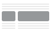
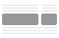
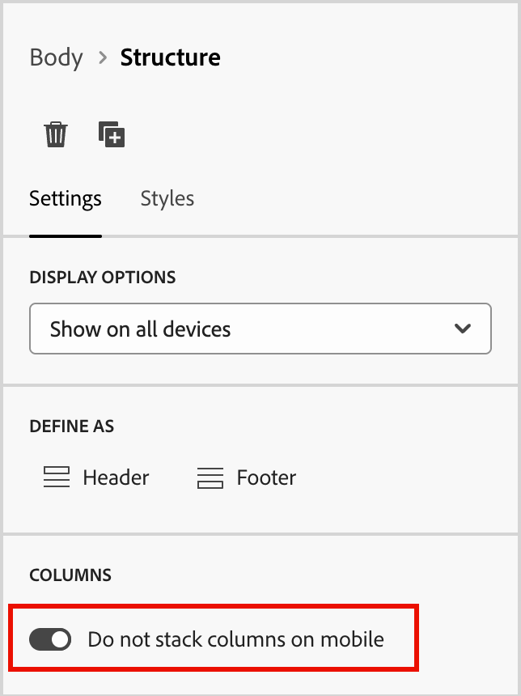
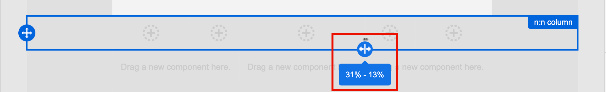
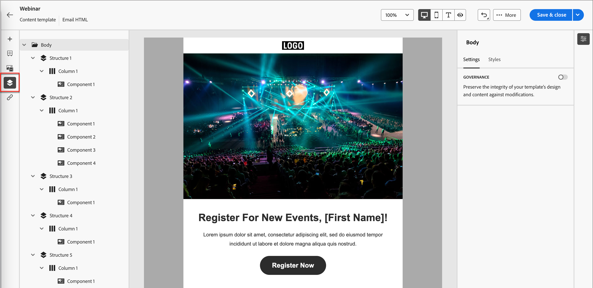

# Strukturkomponenter {#structure-components}

>[!CONTEXTUALHELP]
>id="ajo-b2b_structure_components_email"
>title="Om Strukturkomponenter"
>abstract="Strukturkomponenter är layoutelement som du kan använda för att utforma strukturen i ett e-postmeddelande."

>[!CONTEXTUALHELP]
>id="ajo-b2b_structure_components_landing_page"
>title="Om Strukturkomponenter"
>abstract="Strukturkomponenter är layoutelement som du kan använda för att utforma strukturen på en sida."

>[!CONTEXTUALHELP]
>id="ajo-b2b_structure_components_fragment"
>title="Om Strukturkomponenter"
>abstract="CStruktskomponenter är layoutelement som du kan använda för att utforma strukturen i ett fragment."

>[!CONTEXTUALHELP]
>id="ajo-b2b_structure_components_template"
>title="Om Strukturkomponenter"
>abstract="Strukturkomponenter är layoutelement som du kan använda för att utforma mallstrukturen."

Använd _strukturkomponenterna_ i det visuella designområdet för att definiera innehållsstrukturen. Genom att lägga till och flytta strukturella element med enkla dra och släpp-åtgärder kan du snabbt definiera formen på innehållslayouten. Varje strukturelement sträcker sig över det vågräta utrymmet och du kan stapla dem för att skapa layouten lodrätt. Dela upp varje komponent i kolumner för att skapa varje innehållsblock som du behöver.

## Strukturbibliotek

Överst i biblioteket _[!UICONTROL Components]_&#x200B;visas de tillgängliga strukturkomponenterna i avsnittet **[!UICONTROL Structures]**:

| Ikon | Komponent. | Beskrivning |
| ----- | ----------- | ----------- |
|  | [!UICONTROL 1:1 kolumn &#x200B;] | En behållare med en kolumn som fyller bredden på utrymmet. |
|  | [!UICONTROL 1:2 kolumn vänster] | En behållare med två kolumner som använder ett förhållande på 1:2 för att fylla bredden på utrymmet. Den första (vänster) kolumnen upptar en tredjedel av bredden och den andra (höger) upptar de återstående två tredjedelarna. |
|  | [!UICONTROL 1:3 kolumn vänster] | En behållare med två kolumner som använder ett förhållande på 1:3 för att fylla bredden på utrymmet. Den första kolumnen (vänster) upptar en fjärdedel av bredden och den andra (höger) upptar de återstående tre fjärdedelarna. |
|  | [!UICONTROL 2:1 kolumn höger] | En behållare med två kolumner som använder förhållandet 2:1 för att fylla bredden på utrymmet. Den första (vänstra) kolumnen upptar två tredjedelar av bredden och den andra (höger) upptar den återstående en tredjedel. |
|  | [!UICONTROL 2:2 kolumn &#x200B;] | En behållare med två kolumner som använder förhållandet 2:2 för att fylla bredden på utrymmet. De vänstra och högra kolumnerna har samma bredd. |
|  | [!UICONTROL 3:1 kolumn höger] | En behållare med två kolumner som använder ett förhållande på 3:1 för att fylla bredden på utrymmet. Den första (vänster) kolumnen upptar en trefjärdedel (75 %) av bredden och den andra (höger) upptar den återstående en fjärdedelen (25 %). |
|  | [!UICONTROL 3:3 kolumn &#x200B;] | En behållare med tre kolumner som använder ett förhållande på 3:3 för att fylla bredden på utrymmet. Alla tre kolumnerna har samma bredd. |
|  | [!UICONTROL 4:4 kolumn &#x200B;] | En behållare med fyra kolumner som använder ett förhållande på 4:4 för att fylla bredden på utrymmet. Alla fyra kolumnerna har samma bredd. |
|  | [!UICONTROL n:n kolumn &#x200B;] | En anpassningsbar kolumnstruktur som fyller utrymmet enligt de kolumner som du definierar. Du anger antalet kolumner (mellan två och tio) och anger bredden på varje kolumn individuellt. [Läs mer](#change-nn-columns) |

## Lägga till strukturkomponenter

När du utformar innehållet för e-post, landningssida eller fragment lägger du till varje strukturelement för att skapa layouten. Dra ett objekt från avsnittet **[!UICONTROL Structures]** till vänster och släpp det på arbetsytan. Du kan använda verktygsfältet för att markera en kolumn och använda flikarna _Inställningar_ och _Format_ på den högra panelen för att definiera parametrar för den markerade komponenten eller kolumnen.

{width="800" zoomable="yes"}

### Komponentverktygsfältet

Verktygsfältet visas på arbetsytan när du markerar det på arbetsytan. De tillgängliga verktygen är ett enkelt sätt att markera en kolumn och använda komponentfunktioner.

{width="150"}

| Verktyg | Namn | Användning |
| ---- | ---- | ----- |
| {width="40"} | Aktivera villkorligt innehåll | Aktivera villkorsstyrda varianter för komponenten. [Läs mer](./conditional-content.md) |
| {width="100"} | Markera en kolumn | Markera en kolumn efter nummer. När kolumnen är markerad kan du använda kolumninställningar och -format. |
| {width="40"} | Duplicera | Skapa en kopia av komponenten och lägg till den direkt nedanför. |
| {width="40"} | Ta bort | Ta bort komponenten. |

### Komponentinställningar

När du har lagt till en komponent markeras den i den visuella designrymden och dess egenskaper visas på den högra panelen. Fliken _[!UICONTROL Settings]_&#x200B;visas som standard. Du kan också när som helst markera en strukturkomponent om du vill ändra inställningarna.

#### Visningsalternativ

Om du vill exkludera komponenten från skrivbordet eller mobila enheter ändrar du inställningen **[!UICONTROL Display Options]**. Standardvärdet, _[!UICONTROL Show on all devices]_, aktiverar visning på alla enheter.

{width="400" zoomable="yes"}

Välj en annan inställning för att göra komponenten exklusiv efter enhetstyp:

* _[!UICONTROL Show only on desktop devices]_- Välj den här inställningen när du vill visa komponenten på skrivbordsenheter och exkludera den för mobila enheter.
* _[!UICONTROL Show only on mobile devices]_- Välj den här inställningen när du vill visa komponenten på mobila enheter, som telefoner och surfplattor, och exkludera den för stationära enheter.

#### Sidhuvud och sidfot

Du kan ange att en strukturkomponent ska vara HTML sidhuvud eller sidfot i e-postmeddelandet eller på landningssidan. Markera strukturkomponenten på arbetsytan och klicka på alternativet **[!UICONTROL Header]** eller **[!UICONTROL Footer]**. Det kan bara finnas ett sidhuvud eller en sidfot, och alternativet är inte tillgängligt om en annan komponent har tilldelats.

{width="600" zoomable="yes"}

Du kan ta bort sidhuvuds- och sidfotsindelningen genom att markera komponenten och klicka på alternativet för att ta bort den.

### Staplade kolumner

För mindre skärmar eller visningsfönster visas kolumnerna i strukturkomponenten som staplade, såvida du inte ändrar standardinställningen. När strukturkomponenten med flera kolumner är markerad ändrar du inställningen för **[!UICONTROL Do not stack columns on mobile]** genom att flytta reglaget till höger.

{width="250"}

## Komponentformat

När du har lagt till en komponent markeras den i den visuella designrymden och dess egenskaper visas på den högra panelen. Du kan också när som helst markera en komponent om du vill ändra inställningar och format.

### Bakgrund

Med fliken _[!UICONTROL Styles]_&#x200B;markerad på den högra panelen använder du avsnittet **[!UICONTROL Background]**&#x200B;för att definiera färgen och den valfria bilden som ska användas som bakgrund för strukturkomponenten.

#### [!UICONTROL Background color]

Markera kryssrutan och klicka på färgrutan för att välja en färg i väljaren. Du kan välja en färg genom att ange ett känt RGB-, NML-, NMI- eller hexadecimalt värde. Du kan också använda färgreglaget och färgfältet för att välja färgen.

{width="300"}

#### [!UICONTROL Background image]

Flytta väljaren för att aktivera bakgrundsbildens inställningar.

{width="250"}

Välj [resurskälltyp](./assets-overview.md) och välj bildfilen:

+++[!UICONTROL Marketo Engage Assets]

{{me-dam}}

+++

+++[!UICONTROL Experience Manager Assets]

{{aem-assets-dam}}

+++

+++[!UICONTROL Import media]

{{image-upload}}

+++

Använd alternativet **[!UICONTROL Image placement]** för att välja hur bilden ska fylla strukturkomponenten. Placeringsinställningarna följer standardattributen för fyllning och justering av bakgrundsbilder i [HTML](https://www.w3schools.com/html/html_images_background.asp){target="_blank"}.

{width="250"}

### Andra format

Du kan använda andra strukturkomponentformat för att justera visningen av dem i e-postmeddelandet eller på landningssidan.

+++Kant

{{styles-border}}

+++

+++Marginal

{{styles-margin}}

+++

+++Avancerat

{{styles-advanced}}

+++

## Kolumner

Använd _Markera en kolumn_ i komponentverktygsfältet för att markera en kolumn. Du kan sedan använda kolumnverktygsfältet för att ändra kolumnmarkeringen, ta bort kolumnen eller använda villkorsstyrda innehållsvariationer för kolumnen. Parametrarna för kolumnen visas på flikarna _[!UICONTROL Settings]_&#x200B;och&#x200B;_[!UICONTROL Styles]_ till höger.

{width="500"}

| Verktyg | Namn | Användning |
| ---- | ---- | ----- |
| {width="40"} | Rensa kolumn | Radera innehållet i kolumnen. |
| {width="40"} | Aktivera villkorligt innehåll | Aktivera villkorsstyrda varianter för kolumnen. [Läs mer](./conditional-content.md) |
| {width="100"} | Markera en kolumn | Markera en kolumn efter nummer. När kolumnen är markerad kan du använda inställningar och format. |

### Ändra n:n kolumner

Kolumnbredderna är statiska för de flesta strukturkomponenterna. När du lägger till komponenten _[!UICONTROL n:ncolumn]_ kan du ändra antalet kolumner och kolumnstorleken. Kolumnkomponenten n:n börjar med fem kolumner med samma bredd (20 %).

>[!NOTE]
>
>Varje kolumnstorlek får inte vara mindre än 10 % av strukturkomponentens totala bredd. Endast tomma kolumner kan tas bort.

När komponenten är markerad på arbetsytan använder du alternativet **[!UICONTROL Columns number]** på den högra panelen för att ändra antalet kolumner. Klicka på upp- och nedpilsikonerna för att öka eller minska antalet kolumner eller ange numret i fältet.

{width="650" zoomable="yes"}

Flytta ikonen för storleksändring av kolumner på arbetsytan för att justera bredden på den markerade kolumnen. När du ökar eller minskar bredden justeras även den intilliggande kolumnen så att alla kolumner upptar 100 % av komponentbredden.

{width="500" zoomable="yes"}

### Kolumnformat

När kolumnen är markerad på arbetsytan kan du ange format som ska användas på den kolumnen.

+++Bakgrund

* **[!UICONTROL Background color]** - Markera kryssrutan och klicka på färgrutan för att välja en färg i väljaren. Du kan välja en färg genom att ange ett känt RGB-, NML-, NMI- eller hexadecimalt värde. Du kan också använda färgreglaget och färgfältet för att välja färgen.

  {width="300"}

* **[!UICONTROL Background image]** - Aktivera bakgrundsbildens inställningar genom att flytta växlingsväljaren.

  {width="250"}

  Välj resurskälltyp och [välj en bildfil](#background-image).

+++

+++Kant

{{styles-border}}

+++

+++Justering

{{styles-alignment-v}}

+++

+++Marginal

{{styles-margin}}

+++

+++Avancerat

{{styles-advanced}}

+++

## Navigeringsträd

I den visuella designrymden kan du komma åt de strukturella komponenterna, inklusive kolumner och innehåll, med hjälp av navigeringsträdet. Klicka på ikonen _[!UICONTROL Navigation tree]_(  ) till vänster för att visa trädet.

{width="800" zoomable="yes"}

Elementet _[!UICONTROL Body]_&#x200B;är roten i trädstrukturen. Klicka på någon av komponenterna eller de underordnade elementen i kolumnen i trädet för att markera den på arbetsytan. Flikarna&#x200B;_[!UICONTROL Settings]_ och _[!UICONTROL Styles]_&#x200B;till höger visar parametrarna för den komponenten eller kolumnen.

{width="800" zoomable="yes"}
