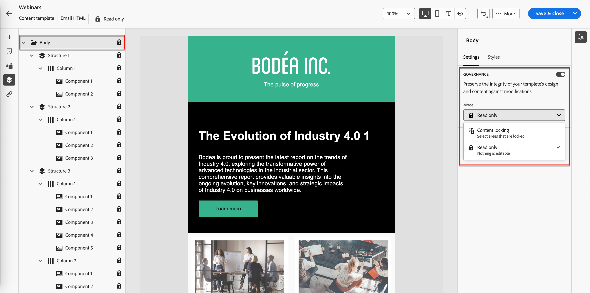

# Mallinnehållshantering

Inom många marknadsföringsorganisationer finns det kreatörer som utformar e-postkampanjer. En viss design kan användas som grund för kundresor i hela organisationen. Om du vill vara säker på att du följer godkända innehållsdesigner kan du använda funktioner för innehållsstyrning för att låsa mallkomponenter. När innehållslåsning är aktiverat i e-postmallen kan marknadsförarna bara ändra de tillåtna elementen för att den ska vara anpassad till innehållsstrategin.

Du kan till exempel låsa sidhuvudet och sidfoten som är utformad för kontinuitet i varumärkeskommunikationen. Du kan också låsa kolumnen som innehåller huvudavsnittet, men tillåta författare att ändra texten så att den passar deras syfte i utformningen av kontoresan.

## Aktivera innehållsstyrning för mallen

När du har använt det visuella designområdet för att [redigera struktur- och innehållskomponenterna](./email-template-authoring.md) för din e-postmall aktiverar du styrning och tillämpar specifikt innehåll som låses efter behov.

1. I det visuella designområdet kan du komma åt lager/behållare och element med hjälp av _navigeringsträdet_.

   Klicka på ikonen _Navigeringsträd_ (  ) till vänster om arbetsytan för att visa trädet.

1. Markera rotkomponenten **[!UICONTROL Body]** i trädet.

   Egenskapspanelen till höger om arbetsytan visar fliken _[!UICONTROL Settings]_&#x200B;som standard.

1. Aktivera alternativet **[!UICONTROL Governance]**.

   {width="800" zoomable="yes"}

   När det här alternativet är aktiverat är standardvärdet _[!UICONTROL Mode]_&#x200B;**[!UICONTROL Read only]**. När det här läget är inställt på rotnivån är alla element i mallen låsta. Trädstrukturen till vänster visar ikonen_ Skrivskyddad _(  ) bredvid roten och alla underordnade element.

1. Om du vill aktivera specifikt innehåll som låses i mallen ändrar du **[!UICONTROL Mode]** till **[!UICONTROL Content locking]**.

   När det här läget är inställt på rotnivån är alla element i mallen upplåsta. Trädstrukturen till vänster visar ikonen _Lås innehåll_ (  ) bredvid rotelementet. Använd innehållslås för innehållskomponenter (strukturella) och enskilda innehållskomponenter efter behov.

   Aktivera **[!UICONTROL Enable content addition]** om du vill tillåta e-postförfattare för resan att lägga till strukturelement eller innehållselement. Välj vilken typ av tillägg du vill tillåta:

   * **[!UICONTROL Allow structure & content addition]** - Välj det här alternativet om du vill tillåta författare att lägga till både strukturelement och innehållselement.

   * **[!UICONTROL Allow content addition only]** - Välj det här alternativet om du vill tillåta författare att endast lägga till innehållselement.

   {width="600" zoomable="yes"}

   När det här läget är inställt på rotnivån är alla element i mallen låsta. Trädstrukturen till vänster visar ikonen _Skrivskyddad_ (  ) bredvid roten och alla underordnade element.
<!-- 

   
- 
- 
- 
- 
-  -->

## Tillämpa låsning på en struktur

Med hjälp av den strukturella arvsmodellen kan du planera layouten och strukturen för din e-postmall enligt den styrning som du vill använda. Använd de strukturella komponenterna som behållare för att gruppera objekt på ett sätt som gör dem enkla att ange som låsta eller redigerbara. När e-postmallens design är på plats granskar du strukturen och använder låsningsfunktioner enligt din plan.

Om du använder en låstyp på strukturnivån får du en standardinställning för dess underordnade komponenter. Du kan sedan tillämpa en specifik låsinställning på kolumn- eller innehållselementnivå efter behov.

1. Klicka på ikonen _Navigeringsträd_ (  ) till vänster om arbetsytan för att visa trädet.

1. Markera strukturen i trädet.

   Egenskapspanelen till höger om arbetsytan visar fliken _[!UICONTROL Settings]_&#x200B;som standard.

1. Ange **[!UICONTROL Lock type]**:

   * **[!UICONTROL Locked]** - Med den här inställningen är alla underordnade komponenter låsta som standard. Trädstrukturen till vänster visar ikonen _Skrivskyddad_ (  ) bredvid alla underordnade komponenter.

   * **[!UICONTROL Editable]** - Med den här inställningen är alla underordnade komponenter redigerbara som standard. Trädstrukturen till vänster visar inte ikoner bredvid de underordnade komponenterna.

   {width="800" zoomable="yes"}

## Ange låsning för en underordnad komponent

1. Markera komponenten i trädet.

   Egenskapspanelen till höger om arbetsytan visar fliken _[!UICONTROL Settings]_&#x200B;som standard.

1. Aktivera alternativet **[!UICONTROL Use specific locking]**.

1. Välj vilken typ av styrning som ska användas:

   * **[!UICONTROL Editable]** - Tillåter fullständig redigeringskontroll av komponenten under e-postredigering.
   * **[!UICONTROL Editable content only]** - Gör att e-postförfattare kan ändra innehållet, men inte själva komponenten.
   * **[!UICONTROL Locked]** - Förhindrar ändringar i komponenten vid e-postredigering.

     För en låst komponent kan du tillåta att komponenten tas bort under e-postredigering genom att aktivera alternativet **[!UICONTROL Allow delete]**.

   {width="800" zoomable="yes"}
