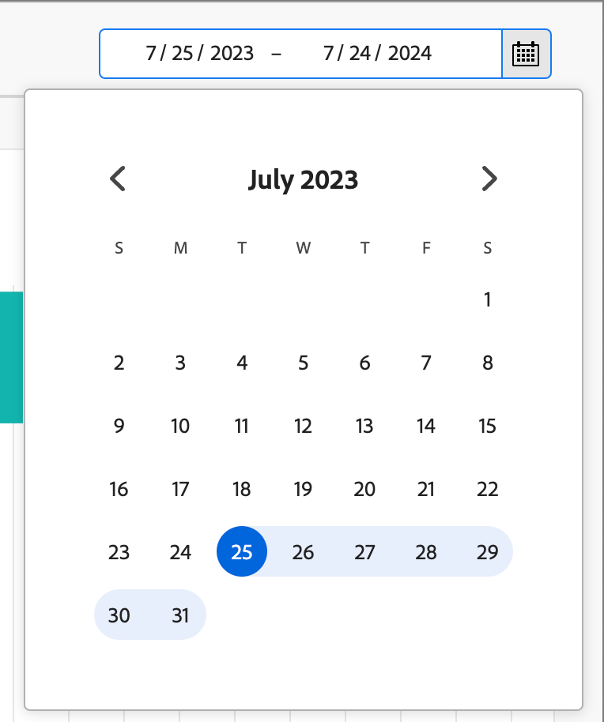

# Instrumentpanel för översikt över inköpsgrupper

Kontrollpanelen för överblick över inköpsgrupp är utformad för B2B-försäljningsprocessen. Marknadsföringsteamet kan dela _klara_ inköpsgrupper och deras medlemmar tillsammans med viktiga data till säljteamet för utförande. Denna process säkerställer en smidig övergång från marknadsföring till försäljning.

Försäljningen omfattar följande:

* **Data Handoff**: Marknadsföring identifierar _ready_ -måldata och gör den tillgänglig för Försäljning i CSV-format. 
* **Försäljningsgodkännande**: Försäljningen granskar manuellt och inkluderar _klara_ mål i sin pipeline.

## Status för inköpsgrupp

Få insikter om hur inköpsgrupperna utvecklas i vyn Köpgruppsstatus. Den här visualiseringen visar distributionen av dina inköpsgrupper, kategoriserade efter deras senaste statusuppdatering inom en angiven tidsram.

{width="800" zoomable="yes"}

**[!UICONTROL Status]** (y-axel): Spåra resan för inköpsgrupper genom olika faser.
**[!UICONTROL Number of Buying Groups]** (x-axel): Kvantifiera antalet inköpsgrupper vid varje status, vilket ger en tydlig uppskattning av din trattes hälsa och aktivitet.
<!-- To generate a shareable PDF of your current view, click **[!UICONTROL Export]** at the top-right corner of the page. -->

### Datafiltrering

* **Datafilter** - Använd _[!UICONTROL Date filter]_, som visar ändringsdatumet för senaste status för inköpsgruppen. Startdatumet kan justeras. Slutdatumet är som standard den aktuella dagen.

  {width="400"}

* **Attributfilter** - Klicka på ikonen _Filter_ längst upp till vänster om du vill filtrera datavisningen med något av dessa attribut:

   * Intresse av lösningar
   * Status
   * Status för inköpsgrupp
   * Kontoregion
   * Kontobransch
  <!-- * Account's Industry -->

  {width="500"}

## Engagera med data

Använd åtgärdsmenyn i det övre högra hörnet när du vill interagera med data.

{width="400"}

### [!UICONTROL Drill through]

Välj **[!UICONTROL Drill through]** om du vill ha en ingående analys av enskilda gruppstatusar.

{width="600" zoomable="yes"}

De globala filter som används på kontrollpanelen överförs och kan inte ändras från den här sidan.

Klicka på ikonen för åtgärdsmenyn längst upp till höger och välj **[!UICONTROL View more]** för att [visa utökade data och insikter](#view-more).

### [!UICONTROL View more]

Välj **[!UICONTROL View more]** om du vill ha utökade data och insikter. Popup-fönstret som visas innehåller ett diagram och en tabell som visar hur inköpsgruppens status är fördelad:

* [!UICONTROL Account ID ]
* [!UICONTROL Account Name]
* [!UICONTROL Account Region]
* [!UICONTROL Account Industry]
* [!UICONTROL Buying Group Name]
* [!UICONTROL Solution Interest]
* [!UICONTROL Status]
* [!UICONTROL Engagement Score]
* [!UICONTROL Completeness Score]
* [!UICONTROL Member Role]
* [!UICONTROL Member Enrolled / Created Date]
* [!UICONTROL Person ID]
* [!UICONTROL Name]
* [!UICONTROL Email]
* [!UICONTROL Title]
* [!UICONTROL Number of Inbound Engagement Activities]
* [!UICONTROL Last engagement date]

{width="600" zoomable="yes"}

Om du vill hämta data klickar du på **[!UICONTROL Download CSV]** i det övre högra hörnet.
